# 【开源平台】teprunner测试平台定时任务这次终于稳了


teprunner测试平台已经有一个多月没有更新了，主要原因是定时任务不够稳定，经过反复试错，找到了解决办法，这次终于稳定了。

## 本文开发内容

作为测试平台而言，定时任务算是必备要素了，只有跑起来的自动化，才能算是真正的自动化。本文将给测试计划添加定时任务功能，具体如下：

- 前端添加测试计划的定时任务开关
- 采用crontab表达式设置计划时间
- 后端集成django-apschedule，在数据库中记录任务明细和执行详情。
- 定时清理执行记录。

前端效果图：


## 前端开发内容

编辑src/views/teprunner/plan/PlanEditor.vue文件：

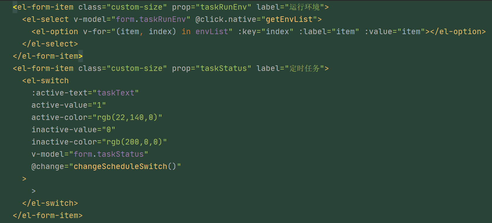

运行环境用`el-select`实现了下拉框，用`el-switch`实现了开关按钮。

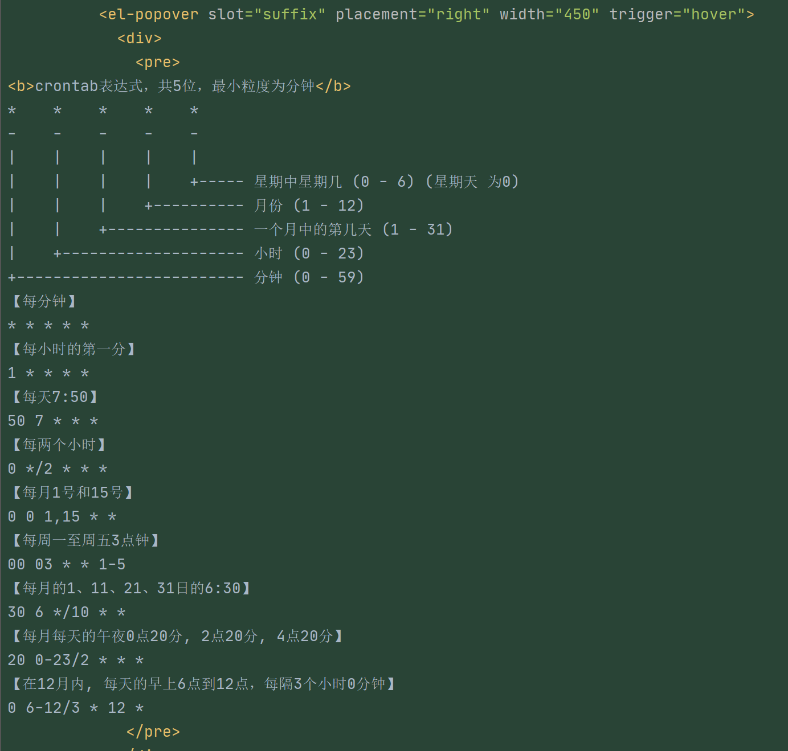

`el-pophover`实现了帮助描述，可以参考编写crontab表达式。

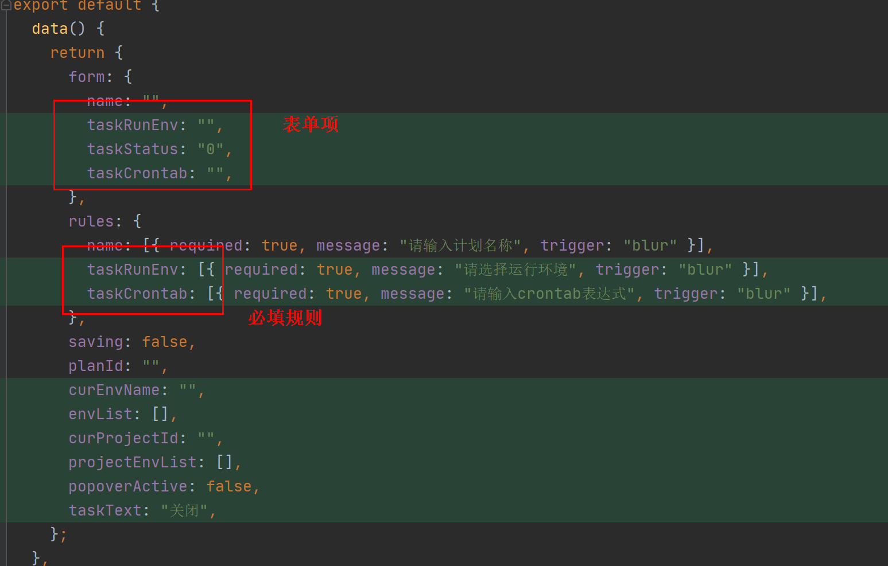

在data中添加了表单项taskRunEnv、taskStatus、taskCrontab，必填规则，以及其他变量。


页面创建时读取localStorage中的计划信息。

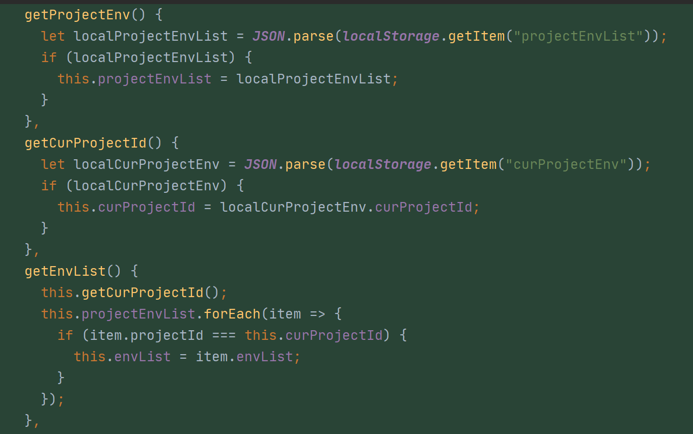

并获取运行环境下拉框选项。

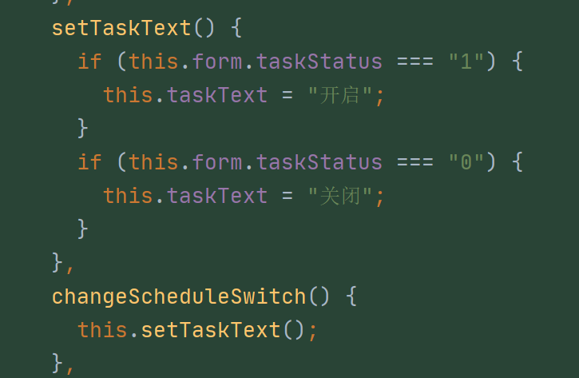

开关按钮的文字是根taskStatus进行设置的。

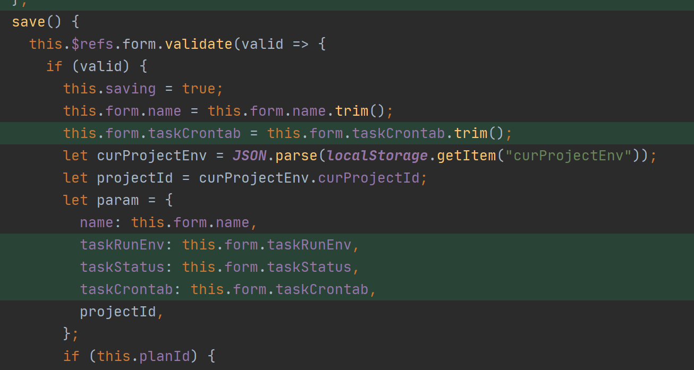

在保存时，给请求添加上新的这3个参数。

## 后端开发内容

第一步是安装django-apscheduler，要么直接安装：

```python
pip install django-apscheduler
```

要么更新项目代码后通过requirements.txt安装：

```python
pip install -r requirements.txt
```

然后编辑teprunnerbackend/settings.py文件：

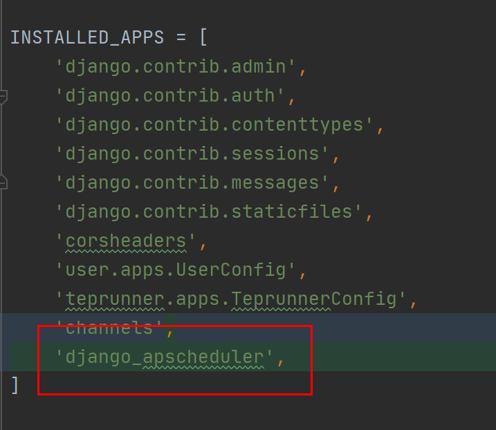

在INSTALLED_APPS中添加django_apscheduler。

**接着迁移数据库，创建两张任务表，一张任务明细表，一张任务执行情况表**：

```python
python manage.py migrate
```


编辑teprunner/models.py文件：


给Plan模型添加3个字段。

编辑teprunner/serializers.py文件：

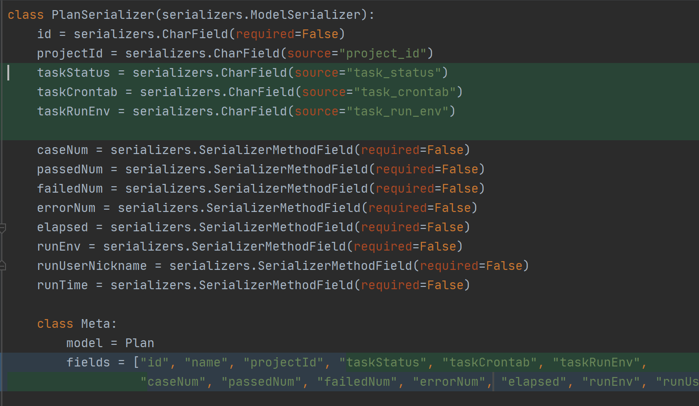

同样的，给PlanSerializer添加3个字段。

新建teprunner/views/task.py文件：


创建BackgroundScheduler的对象实例，Background指的是在后台运行。并添加DjangoJobStore，把任务通过Django保存到数据库中。


添加一个定时删除执行记录的任务，max_age是最大保存时间，这里设置为7天。scheduler.add_job()用来添加定时任务，trigger是触发器，也就是计划时间，这里设置为每周一0点。id是任务的标识符。max_instances指同时最多只有一个实例。replace_existing设置为True，每次都更新已存在的任务，防止重启服务导致scheduler.add_job()报错。

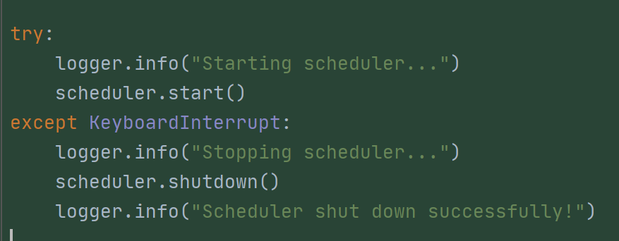

启动任务。

编辑teprunner/views/run.py文件：


为了手动执行测试计划和定时任务执行测试计划共用，这里把执行代码抽取了部分作为run_plan_engine()函数。

编辑teprunner/views/plan.py文件：

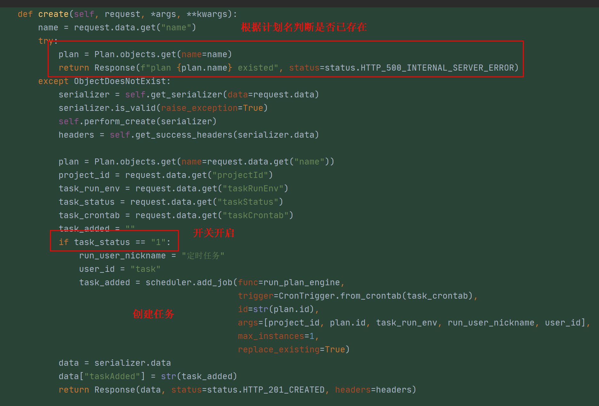

重写create方法，先根据测试计划的名字判断是否已存在，如果存在就直接返回500。接着判断开关如果开启，那么就通过scheduler.add_job()添加任务。跟刚才添加任务的有点区别是，通过args参数指定了func函数的参数。最后把任务添加日志写到响应中返回。


重写update方法，先判断测试计划是否已经存在，判断规则是根据名字去查找已存在记录，如果找到同名计划，且id不是自己，那么就认为已存在同名计划，直接返回500。

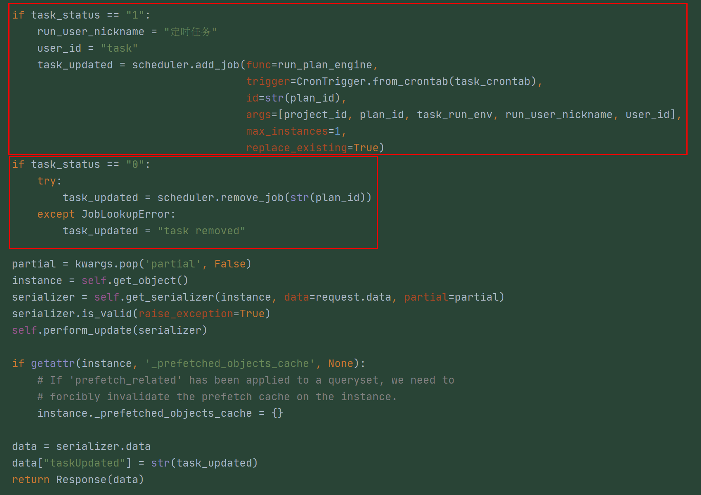

然后判断如果开关打开，就新增任务；如果开关关闭，就删除任务，删除任务使用scheduler.remove_job()。

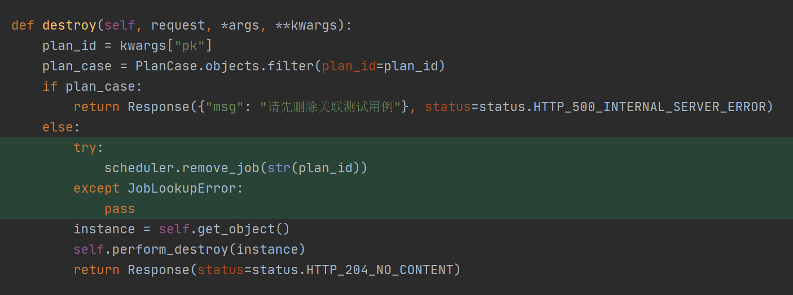

最后重写destroy方法，在删除测试计划时，一并删除定时任务。

## 猴子补丁解决pymysql连接问题

为什么定时任务会不稳定？因为我用的pymysql库，它不会进行数据库连接断开后重试。Django和MySQL建立建立后，何时断开连接通过CONNECT_MAX_AGE来设置，默认是0，表示使用完马上断开连接。Django只会对Web请求采取这个策略，使用signals.request_started.connect(close_old_connections)和signals.request_finished.connect(close_old_connections)来关闭旧连接。**但定时任务不是Web请求，而是直接连接数据库，Django并不会去主动断开这个连接。**而MySQL默认8小时会把连接断掉，于是当Django拿着已经被MySQL断开的连接对象去请求MySQL，就报错了。

> 当我在本地安装了MySQL后，重启MySQL就能复现这个问题。

解决办法一是把旧连接复活，进行断线重连，但是会导致连接占用可能越来越多，耗费资源。解决办法二是像Django处理Web请求一样，每次用完就断开，下次使用再重新连接，占用资源少。

猴子补丁是指不修改第三方库的基础上，对库的功能进行扩展。我给django-apscheduler写了个猴子补丁，实现第二个解决办法，用完就断开连接：

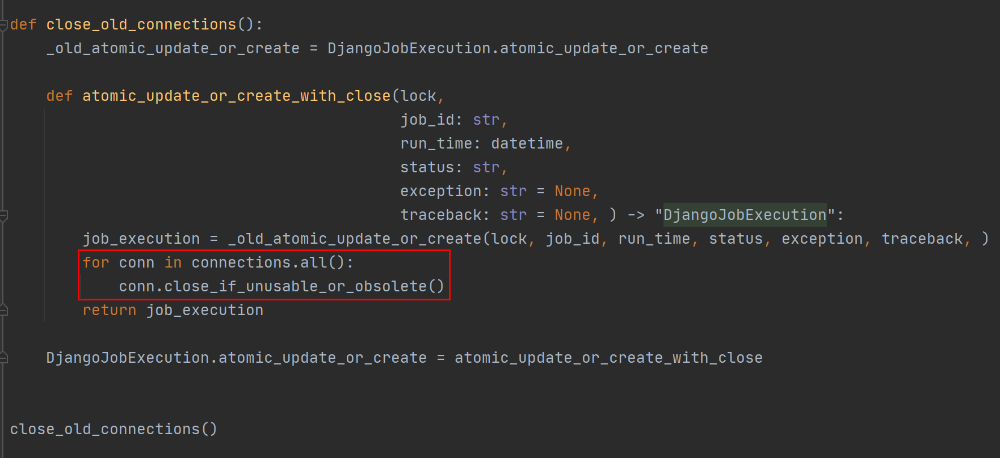

并且通过issue方式，告诉了它的作者：

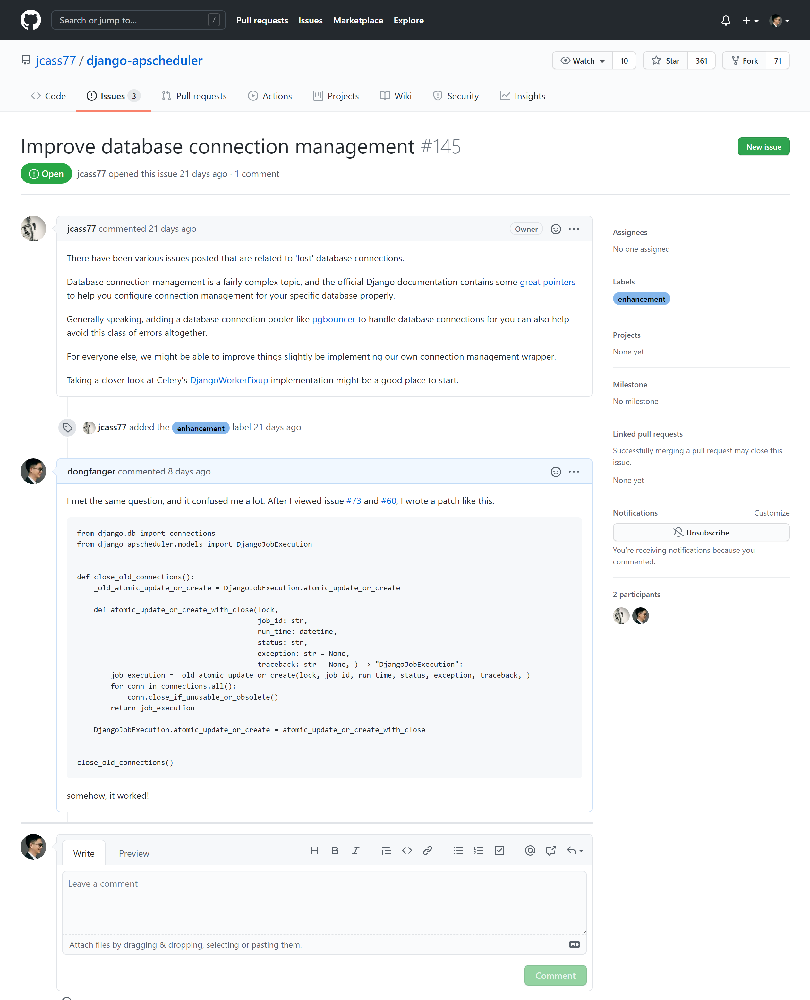

这开启了我在GitHub上英文交流技术的大门。

> 比如我又给loguru提了个bug，此时已经和loguru的作者英文交流了5个回合。

## 小结

本文给测试计划添加了定时任务功能，为teprunner测试平台补上了一块重要拼图。从此它不但能批量执行用例了，还能按照计划时间，定时执行，实现了真正的自动化。