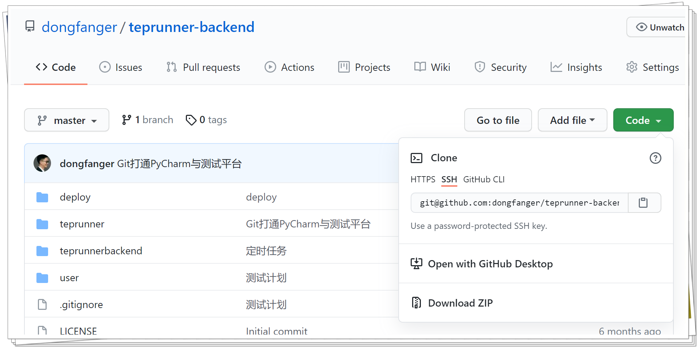

# 【开源平台】teprunner测试平台入门级部署手册发布啦


很多朋友是因为teprunner，也就是这个小众的pytest内核测试平台关注的公众号。为了让大家更好的上手teprunner，我更新了它的README，希望能让小伙伴们根据这些文档内容，一步一步的在自己本地电脑上把项目跑起来。项目跑起来之后，就可以参考前面一系列的学习教程，自己动手做一遍，在做的过程中和teprunner进行对比，不懂的点逐一突破，由点到面，完整实现。**这种学习方式能更快速的掌握测试平台开发技能哦。**

## 前端项目teprunner-frontend

源码地址：https://github.com/dongfanger/teprunner-frontend

### 下载源码

方式①：

```
git clone git@github.com:dongfanger/teprunner-frontend.git
```

方式②：下载zip压缩包后解压。


### 安装依赖包

在项目目录打开cmd，执行命令：

```
npm install
```

### 启动服务

等待依赖包安装完成后，启动前端服务：

```
npm run serve
```

### 访问系统

打开浏览器，输入`localhost:8080`：


用户名`admin`，密码`qa123456`。此时还无法登陆，需要部署[后端服务](https://github.com/dongfanger/teprunner-backend)。

## 后端项目teprunner-backend

源码地址：https://github.com/dongfanger/teprunner-backend

### 下载源码

方式①：

```
git clone git@github.com:dongfanger/teprunner-backend.git
```

方式②：下载zip压缩包后解压。



### 准备数据库连接

以下两者任选其一即可。

**SQLite**

SQLite数据库是Django自带的，不需要另外安装。由于会用到`models.JSONField`，SQLite默认不兼容，所以需要下载`sqlite3.dll`文件替换下：https://www.sqlite.org/download.html

根据Python版本选择相应文件，比如我的windows安装的Python38-32，下载了`sqlite-dll-win32-x86-3340100.zip`这个软件包，解压后将`D:\Program Files (x86)\Python38-32\DLLs\sqlite3.dll`替换。

**MySQL**

也可以使用MySQL数据库，前提是已经安装并创建好了数据库。修改mysite/settings.py中的数据库配置：

```python
DATABASES = {
    'default': {
        'ENGINE': 'django.db.backends.mysql',
        'HOST': '主机',
        'PORT': 端口,
        'NAME': '数据库名',
        'USER': '用户名',
        'PASSWORD': '密码'
    }
}
```

Django默认通过底层调用mysqlclient这个库和MySQL交互。但是mysqlclient非常不好安装，我们改用 pymysql。先安装pymysql：

```shell
pip install pymysql
```

然后在与mysite/settings.py文件同级的`__init__`文件中添加代码：

```python
import pymysql

pymysql.version_info = (1, 4, 0, "final", 0)
pymysql.install_as_MySQLdb()
```

### 迁移数据库

数据库准备好以后，就可以执行以下命令，创建表结构：

```shell
python manage.py makemigrations
python manage.py migrate
```

然后执行以下命令，初始化用户数据：

```shell
python manage.py loaddata user
```

### 启动服务

数据准备好了，执行以下命令，启动后端服务：

```
python manage.py runserver
```

启动成功后，确保前端服务也已解决启动成功后，就可以打开`localhost:8080`，输入用户名`admin`，密码`qa123456`登录测试平台体验啦。