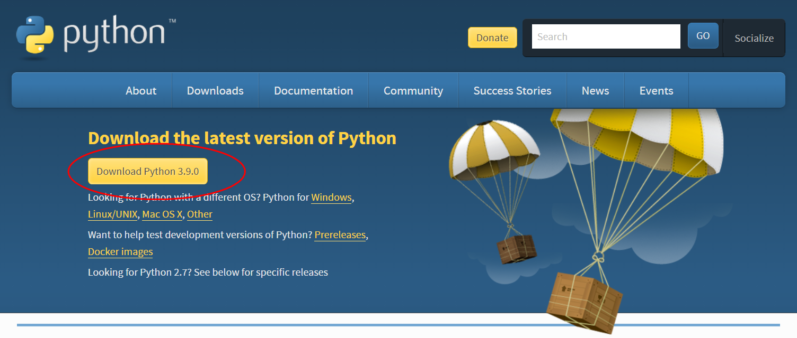
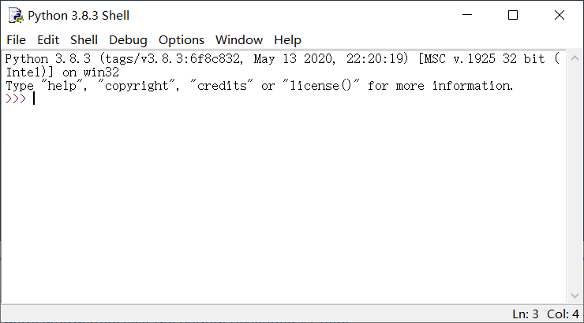
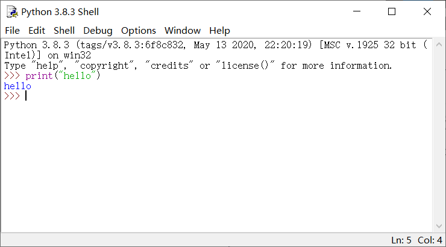

# 【Python】如何让文科生5分钟写上Python


## 序言

这篇文章是转型后发表的第一篇文章，有必要先聊一下我的写文计划。

**串行文章和并行文章**

我会按照发文顺序分为串行文章和并行文章。Python 语言本身的内容，我会按照入门、进阶、原理的顺序依次展开。由于我的水平有限，为了保证质量不乱讲，我选择站在巨人的肩膀上进行二次创作。入门篇主要参考菜鸟教程的基础教程部分。进阶篇主要参考《流畅的Python》这本书，我是买了实体书的，计划后面会送出来，虽然有些破旧，还望不要嫌弃（当时买的时候书页就坏了，京东还赔了我 1000 京豆）。原理篇主要参考官方文档以及外网资料，有一说一，国外资料确实更多更专业，只不过都是英文的，还好现在已经适应了。Django、算法、pytest、tep、测试成长小说等系列专题会并行发表，也包括其他单篇文章。这两天了解到 Python 之父 Guido van Rossum 从 Google 退休后，又加入微软继续搞 Python 了。有点意思。

**有啥不一样？**

Python 文章和视频都非常多，我就在想我写的东西对读者而言价值到底在哪？我不是搞培训的，也不是做教程，内容会更偏向于学习笔记和实用经验。看我的文章，说不定能把以前遗漏或遗忘的知识点再次补上。同时我已经有一段时间的写作经验了，我也尽量深入浅出的把知识讲清楚讲透彻，首先写的文章我要自己都理解透，这样别人看的时候才会觉得一目了然。另外就是认真的态度，见过一些为了流量写的教程，不做评价。只是觉得既然写了，既要对得起自己，也要对得起别人。

**标题**

既为了提高打开率，也是为了新颖，我不会按照比如《Python入门1》、《Python入门2》这种常规的命名，这样的文章实在是太多了。而是会在写完文章后，根据文章内容，选择其中的亮点，作为标题。这个过程也挺有趣，有种点睛之笔的意味。同时我也希望随便摘一篇文章拿出去，也是够看的。

（突然想起来上学写 2000 多条错题笔记的时候，简单又充实）

## 开篇

为了把这个开篇写好，我专门在 B 站上面找了最火的 Python 教程，全站排行榜最高第1名的《花了2万多买的Python教程全套》，质量很高，也推荐大家看看。不过我不搞培训，也不需要宣扬 Python 的好处促进就业，就不写那么多背景介绍了。身边学财会的朋友之前让我教教 Python，干脆我就以这个为契机，作为开篇，保证 5 分钟内，即便是文科生，也能用 Python 编起程序来！

## 电脑

Python 并不神秘，它其实就和 QQ 一样，只是一个运行在电脑上的普普通通的软件。只要有一台电脑，就可以写 Python。

## 安装

打开这个下载网址：

https://www.python.org/downloads/



点击 Download Python 进行下载（Mac 土豪请注意选择版本）。下载后傻瓜式一路点击下一步安装就好。

## 使用

一般的软件我们都是双击图标打开。Python 在安装以后桌面上不会出现图标。不过可以从开始菜单找到：


点击后就打开了：



Python 毕竟是一门编程语言，它也有它自己的尊严，所以它的界面看起来也有专业的一面，比如那一串密密麻麻的英文。

输入一句话试试：

```
print("hello")
```

敲击回车。它马上就会回应一句，hello：



没错，是的，你已经在用 Python 编程了！

## 小结

本文以极其简单的例子，介绍了如何动手用 Python 编程。我试了下，如果网速快的话，5 分钟内完成是妥妥的。哈哈哈。之所以选择这个简单例子，也是想说明 Python 本来就是很简单的，不用听到编程就被吓到了。先动手，一点一点学习就好。不过言归正传，我们工作中并不是这么写 Python 的，而是用一款叫做 PyCharm 的软件。PyCharm 分为社区免费版和专业旗舰版。日常使用社区版就可以了，个人推荐旗舰版。提示一下，破解的时候注意搜索带上 PyCharm 的版本，比如 2020.2.3，成功率会更高。

