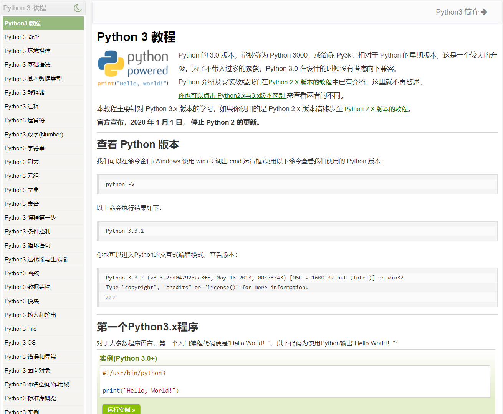
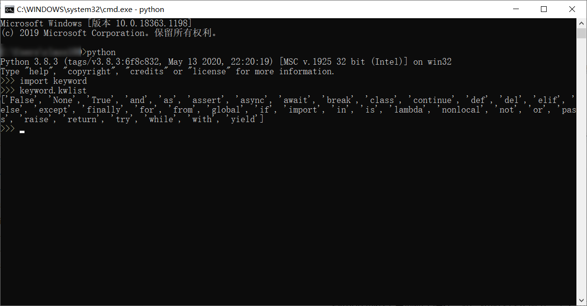

# 【Python】真香，理解记忆法学习Python基础语法


这篇文章很难写！我最开始学 Python，和大多数人一样，是看的菜鸟教程：



在写完这篇文章的第一遍后，我发现并没有写出新意，很可能读者看到后，会和我当初一样，很快就忘了。我现在已经不是读者而是作者了，我想我可以做出一些改变，降低阅读门槛，加强理解记忆。

## 版本选择

Python 有 2 个不兼容的版本，Python2 和 Python3。Python2 已经逐渐被淘汰，现在只需要学 Python3 即可。

## 语法是什么

先直观感受一下，用不同编程语言在界面上打印出 HelloWorld 字样：

**C 语言**

```c
#include <stdio.h>
int main(void)
{
    printf("Hello World!");
    return 0;
}
```

**Python**

```python
print("HelloWorld!")
```

看到了么，结果一样，但是编程语言的写法不一样，就像中文和英文，同一个意思，却是用不同字符表达出来的。语法就是用来告诉你该怎么表达的一套规则。学 Python 只有懂 Python 语法，才能知道怎么写代码。

## 从一个例子讲起

假设我们要用 Python 实现这样一个功能，键盘输入"大河向东流"后，屏幕上会显示“天上的星星参北斗”。用 Python 实现的代码为：

```python
# 获取键盘输入
pre_sentence = input()
# 判断如果输入的句子是大河向东流
if pre_sentence == "大河向东流":
    # 在屏幕上打印天上的星星参北斗
    print("天上的星星参北斗")

```

这个例子涉及到这些名词术语：编码、标识符、语句、缩进、代码块、引号、注释、空行、函数。

## 编码

编码，是指把人类语言编成计算机能懂的二进制（010101 这种）。不同国家的字符是不一样的，用来编码的字符集也就不一样。美国的字符集包括英文字母、标点符号字符、阿拉伯数字，叫做 ASCII。欧洲的字符集，加入了带重音的字符、希腊字母等叫做，Latin-1。中国！加入了汉字！叫做 GB2312。后来加入了生僻字、繁体字及日韩汉字等，叫做 GBK。天下大乱，乱码无法交流，ISO 国际标准化组织决定一统江湖，Unicode 诞生。再优化优化，UTF-8。

默认情况下，Python3 源码文件都是以 UTF-8 编码，字符串都是 unicode 字符串，让全球不同国家无障碍编程。代码中既可以写英文也可以写中文，但是中文只能用来显示和注释，不决定程序运行。

## 标识符

标识符是编程时使用的名字，比如例子中的 `pre_sentence`。在 Python 中，名字由字母、数字、下划线组成，不能以数字开头，并且区分大小写。比如以下是合法的：

```
a_12_b_
_a1
_A1
```

以下是非法的：

```
1abc
$ddd
```

我们在写代码的时候，经常需要取名字，取名最好具有业务意义。有些名字包含多个英文单词，写在一起不好阅读，名字又不能包含空格，要么首字母大写，要么用下划线来分隔。现有的 Python 代码库中，这两种方式都存在，因为 Python 是由开源社区发展来的，五花八门，百花齐放。为了越来越规范，Google 制定了 PEP8 规范（Python Enhancement Proposal 8），建议大家用下划线来分隔。

下划线除了用来分隔多个单词，在 Python 中还有更多的作用。单个下划线开头 `_foo` 代表私有的，只能“自己”用。单个下划线结尾 `class_` 可以用来解决和 Python 已有名字冲突。双下划线 `__main__` 在 Python 中有极其特殊的作用。

Python 已经把有些名字用了，你不能再用，否则会冲突报错。可以在 cmd 中输入 `python` 进入 Python 后，输入以下代码查看哪些名字已经被用了：

```python
>>> import keyword
>>> keyword.kwlist
['False', 'None', 'True', 'and', 'as', 'assert', 'break', 'class', 'continue', 'def', 'del', 'elif', 'else', 'except', 'finally', 'for', 'from', 'global', 'if', 'import', 'in', 'is', 'lambda', 'nonlocal', 'not', 'or', 'pass', 'raise', 'return', 'try', 'while', 'with', 'yield']
```



## 语句

交流不可能是按单词来交流，而是按语句。Python 中一行代码就是一条语句，这是一般规定。也有少数例外，比如可以使用反斜杠(\\)，把一条语句写成多行：

```python
total = item_one + \
        item_two + \
        item_three
```

如果在 [], {}, 或 () 中，不用反斜杠(\\)也可以写成多行：

```python
total = ['item_one', 'item_two', 'item_three',
         'item_four', 'item_five']
```

反之亦然，Python 中多条语句也是能写成一行的（不推荐）：

```python
import sys; x = 'runoob'; sys.stdout.write(x + '\n')
```

## 缩进

有些话不是一句就能说完的，比如我现在说的这句，哈哈。为了代码有层次，阅读更方便，编程语言会使用缩进来断句。Python 的缩进有点异类，不是用花括号 `{}`，而是用 4 个空格，而且必须要缩进一致，否则就会报错。比如：

```python
if True:
    print ("Answer")
    print ("True")
else:
    print ("Answer")
    # 没有严格缩进，在执行时会报错
  print ("False")
```

报错：

```python
IndentationError: unindent does not match any outer indentation level
```

如果用 PyCharm，那么就完全不用担心这个问题了，因为它有智能提示，在编写的时候就能纠正过来。我已经完全适应了敲空格，为什么空格键设计的那么大？就是用来敲的！

## 代码块

“多条缩进相同的语句就叫做代码块”，这是教程给的定义，我们平时说的代码块，更多指的是相关联的多行代码。比如，如果 xxx，那么 xxx，否则 xxx：

```python
if expression : 
   suite
else : 
   suite
```

## 引号

引号常用来框住字符串，Python 同时支持单引号、双引号、三引号，只要保证引号的开始和结束一致就行：

```python
word = 'word'
sentence = "这是一个句子。"
paragraph = """这是一个段落。
包含了多个语句"""
```

单行用单引号或双引号，多行用三引号。我一般会优先用双引号，看着规范（毫无依据，哈哈哈）。

## 注释

Python 的单行注释用 #：

```python
# 第一个注释
print ("Hello, Python!")  # 第二个注释
```

Python 的多行注释用三个单引号或三个双引号：

```python
'''
这是多行注释，使用单引号。
这是多行注释，使用单引号。
这是多行注释，使用单引号。
'''

"""
这是多行注释，使用双引号。
这是多行注释，使用双引号。
这是多行注释，使用双引号。
"""
```

## 空行

空行也是 Python 代码的一部分，既能分隔不同业务代码，也能提高阅读体验。不过不需要刻意记哪些地方需要多少空行，在 PyCharm 中 CTRL + ALT + SHIFT + L 组合键可以快速格式化为符合 PEP8 规范的代码，标准化的空行一目了然：


## 函数

例子中 `input()`、`print()` 这种 `名字 + ()` 形式的叫做函数，写 Python 经常会用到函数，也需要我们自己写函数。函数是一块代码片段，有输入，有输出，可以重复使用，有特定功能，比如 `input()` 用来键盘输入，`print()` 用来打印到屏幕显示。我们写 Python 代码都是在 .py 文件中来写的，每个 .py 文件在 Python 中叫做模块。模块多了以后，我们需要把它们按照业务意义分别放到不同的目录进行管理，有些目录中包含 `__init__.py` 文件，这种目录叫做包。

## import 与 from...import

模块与模块之间是分离的，除了 Python 已经为我们提供的基础语法，如果想用其他模块的代码，就需要使用 `import` 或 `from..import` 来导入。视使用需要不同，导入格式也不同：

将整个模块（ somemodule ）导入，格式为： `import somemodule`

从某个模块中导入某个函数，格式为： `from somemodule import somefunction`

从某个模块中导入多个函数，格式为： `from somemodule import firstfunc, secondfunc, thirdfunc`

将某个模块中的全部函数导入，格式为： `from somemodule import *`

## 动态语言

Python 是动态语言，不需要指定数据类型。比如：

```python
a = 1
b = "string"
```

## 强类型语言

Python 是强类型语言，经常会有人搞错。比如：

```
a = 1
b = "string"
c = a + b
```

是会报错的：

```
TypeError: unsupported operand type(s) for +: 'int' and 'str'
```

不是相同的类型不能直接相加。

JavaScript 才是弱类型语言，不同数据类型可以直接相加。

## 小结

本文虽然参考了菜鸟教程，但是重新组织了写作手法。先介绍了版本选择和语法的概念，接着从一个例子讲起，把相关的概念挨个讲解了一遍，然后简单提到了模块和包，引出了 import 的原因，最后说明了 Python 是动态、强类型语言。

参考资料：

https://www.runoob.com/python3/python3-basic-syntax.html