# 【Python】用PyCharm打个专业的招呼


## PyCharm 是什么

PyCharm（读作“拍恰姆”）是 JetBrains 全家桶中的一员，专门用来写 Python 的：


官方网址是：

https://www.jetbrains.com/pycharm/

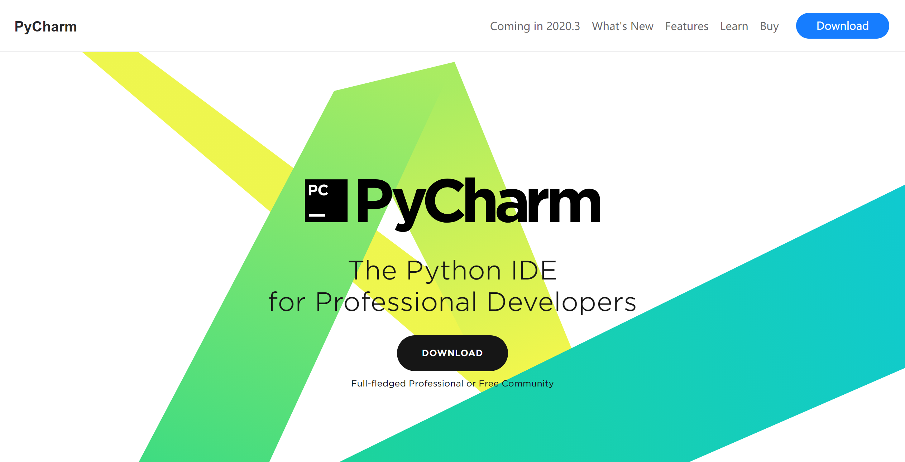

`for Professional Developers`，顾名思义，它是为专业开发者而生的。

## 版本选择

PyCharm 有 2 个版本：

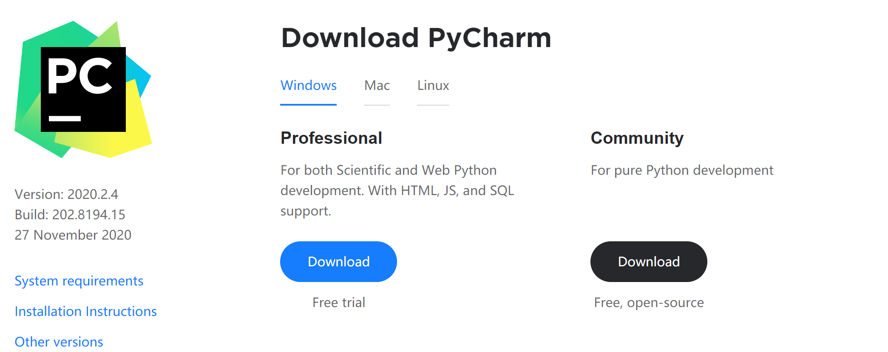

左边的 Professional 是专业版，需要付（ po ）费（ jie ）。右边的 Community 是社区版，永久免费。一般社区版够用了。我用的是专业版，看着齐全。

## 打开 PyCharm

安装完成后，打开：

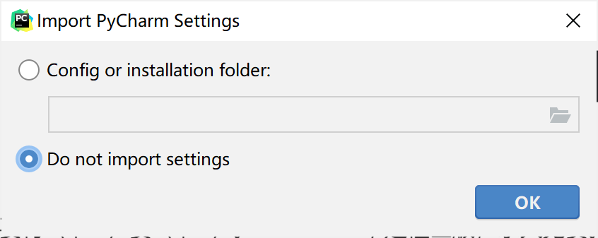

不需要导入配置，点击 OK 按钮：

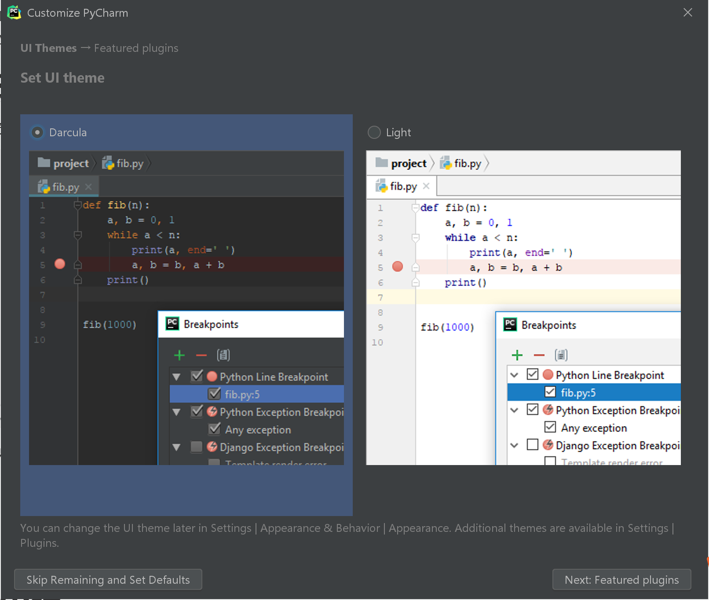

有 2 个主题，个人偏好左边这种，酷酷的。点击左下角 `Skip Remaining and Set Defaults` 跳过插件安装，进入主界面（专业版破解后才能看到这个界面，具体破解方法网上贼多）：

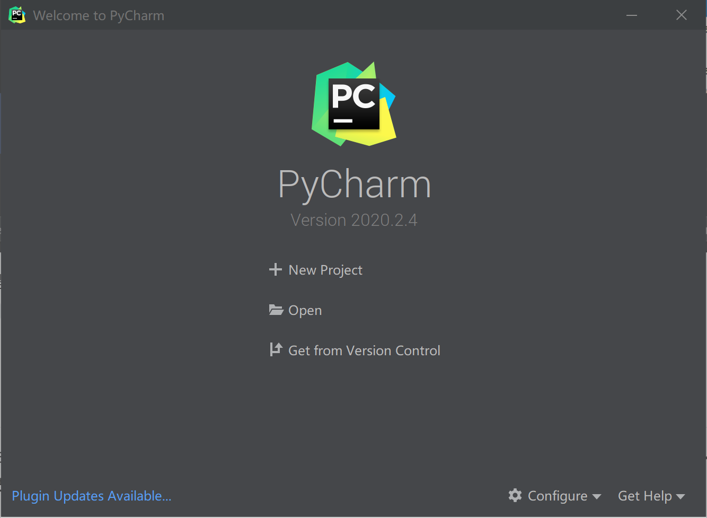

首次打开，还没有创建项目，会出现引导页。选择 `New Project`：

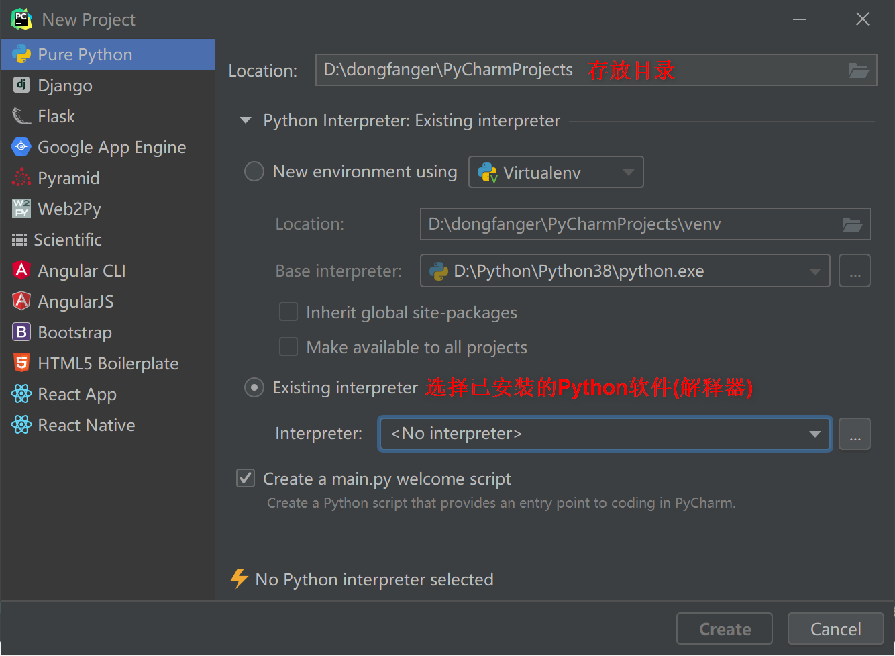

这是专业版的界面，社区版会简略一点。选择好存放目录后，还需要配置解释器。点击解释器右边的 `...` ，切换到 `System Interpreter`，选择已经安装好的 Python：

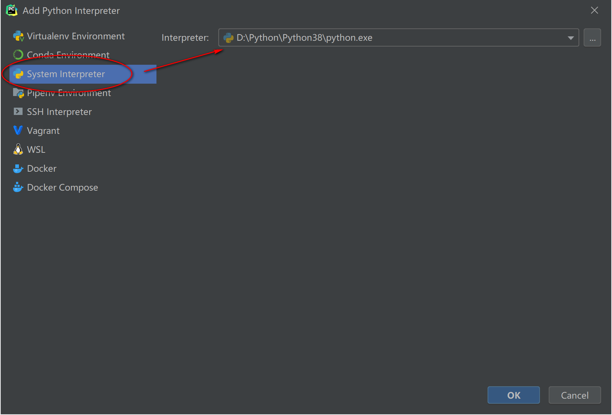

OK 后再点击 Create，来了：

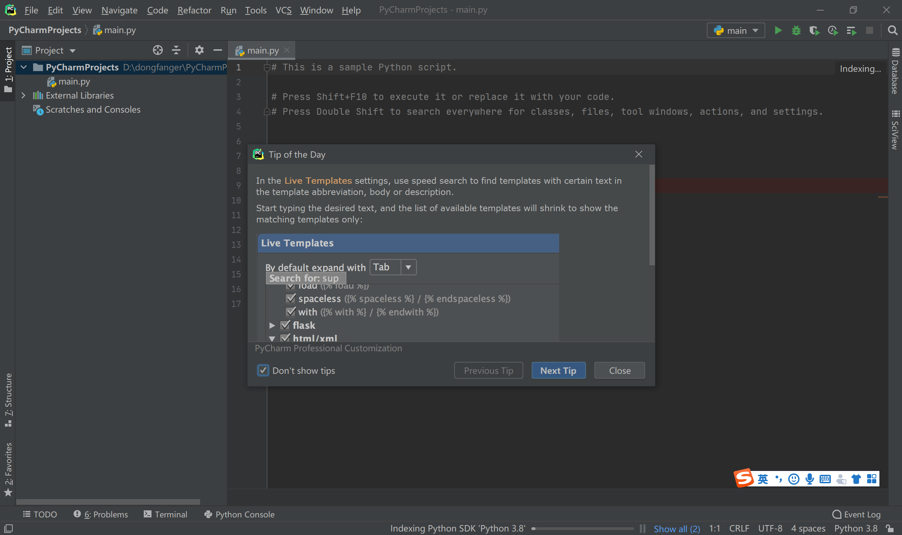

老手可以勾选 `Tip of the Day` 左小角 `Don't show tips`。

## 界面说明一张图


## 运行结果

右上角的按钮区可以点击运行，代码编辑区域的行号那如果出现了绿色小箭头，也可以点击运行，甚至是代码编辑区里面右键，文件名右键，都可以运行！看看 PyCharm 想的多周到，生怕你不会运行。运行后结果会从下方弹出来：

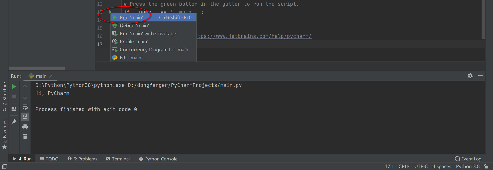

## 防止中文乱码两张图

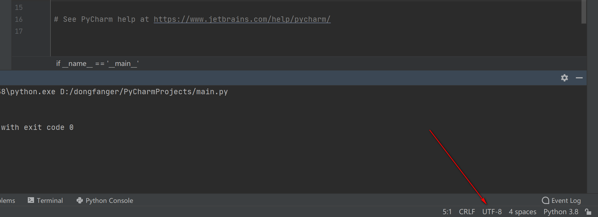

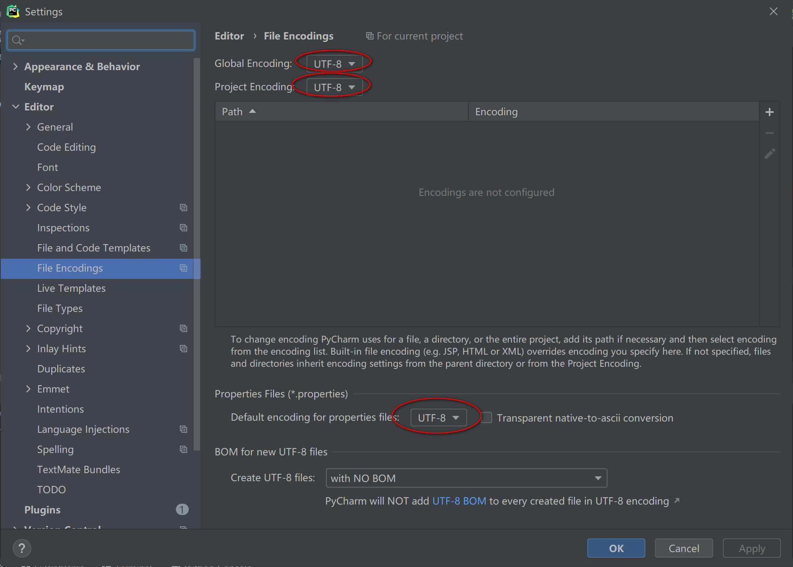

## hello

开篇我们用的是 Python 自带的 IDLE，现在试试在 PyCharm 中 say hello。先在项目目录中右键创建 .py 文件：


输入代码：

```
print("hello")
```

在代码编辑器任意位置右键 Run：


Python 同样会回应一句 hello：

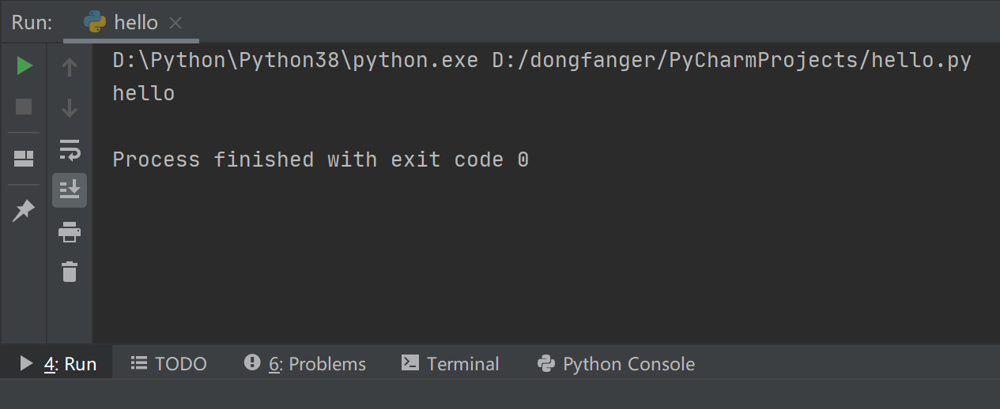

没错，是的，你已经会用 PyCharm 写 Python 了！

## 小结

本文介绍了 PyCharm 的基本使用，更多技巧请阅读知乎问答 [你有哪些想要分享的 PyCharm 使用技巧？](https://www.zhihu.com/question/37787004/answer/186042335?utm_division=ge13_3)，比我写的好太多了。如果使用过程中遇到问题，百度一般能搜出来答案。不行的话就找 Google，安装浏览器插件 ghelper 即可访问，谷歌浏览器和火狐浏览器都支持。还解决不了，有一个办法，就是加入我们的高质量核心交流“Python互助讨论群”，技术面前无大佬，无惧提问，我们都是一群相互取暖的小白，交流经验，共同进步，每周六分享PyCharm使用技巧等知识点，每周日一起刷LeetCode编程题。公众号后台回复”加群“即可。

