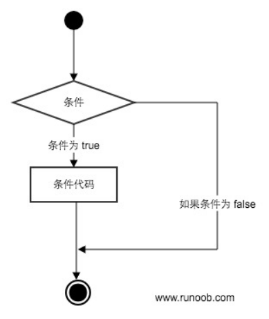
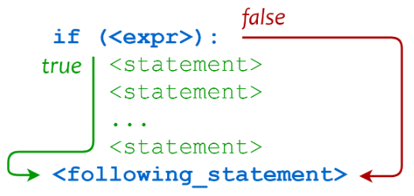
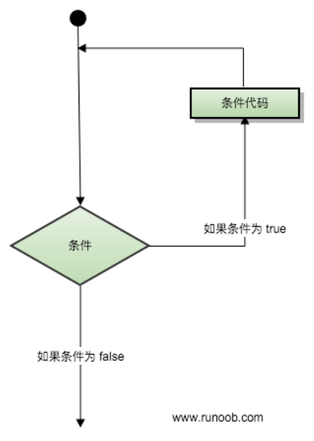
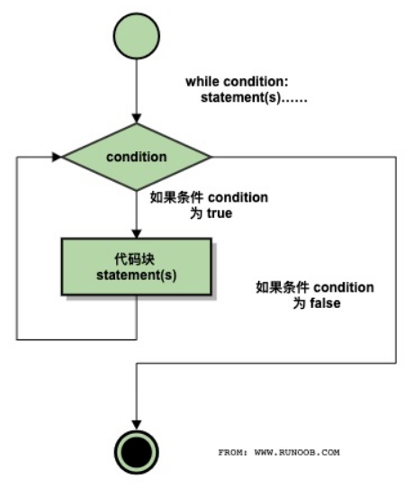
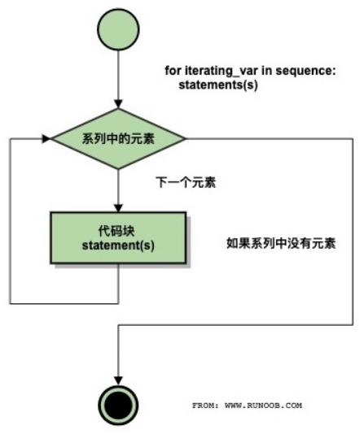
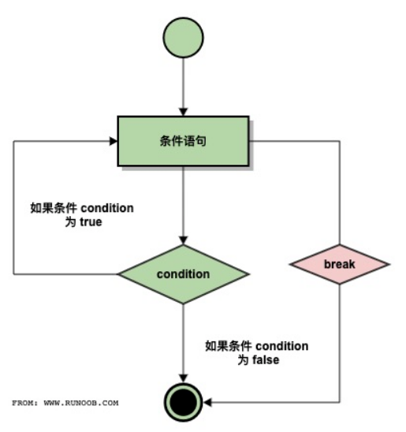
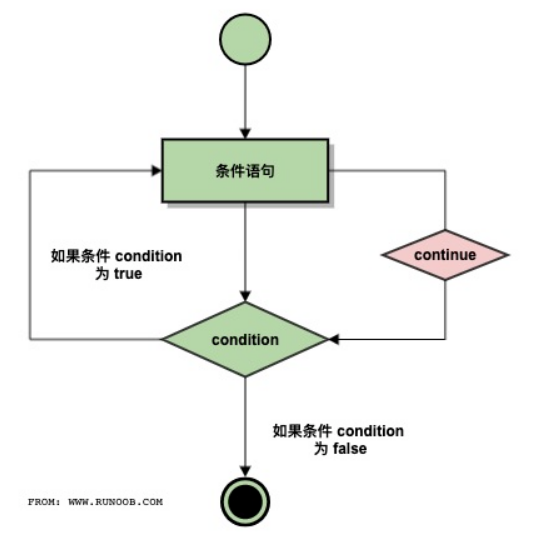
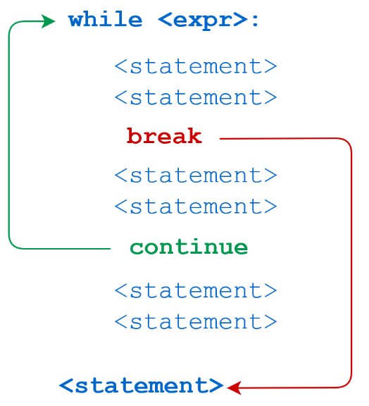
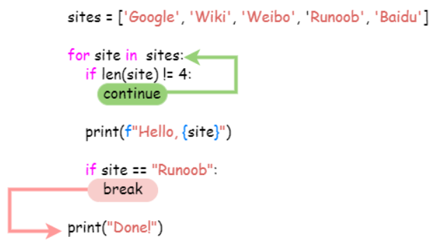

# 【Python】条件循环语句组成了Python代码的骨架


## 条件控制

我们都知道流程图是有多个分支的，程序中也是如此，在Python中是用if语句来判断程序该走哪个分支的。它的执行过程如下：



代码执行过程如下



### if

`if`语句的一般形式如下：

```python
if condition_1:
    statement_block_1
```

- 如果condition_1为True，执行statement_block_1。

condition_1是条件表达式，由各种运算符和数据类型组成，条件表达式的结果可以是True/False的布尔值，也可以是非布尔值。Python中的0、None、空列表、空字典等都会被认为是False，反之都会被认为是True。

### else

`else`语句在条件为False时执行：

```python
if condition_1:
    statement_block_1
else:
    statement_block_2
```

- 如果condition_1为True，执行statement_block_1。
- 如果condition_1为False，执行statement_block_2。

### elif

if...else实现了“如果满足条件，那么xxx，否则xxx”，除此之外，还可以用`elif`实现多个连续判断，分别执行不同的语句：

```python
if condition_1:
    statement_block_1
elif condition_2:
    statement_block_2
else:
    statement_block_3
```

- 如果condition_1为True，执行statement_block_1。
- 如果condition_1为False，再判断，如果condition_2为True，执行statement_block_2。
- 否则，执行statement_block_3。

`elif`可以写多个。这种写法的执行顺序是从上往下，只要满足了某个`if`或`elif`的条件，就会在当前分支执行后跳出去，不再执行后面的判断，如果每个`if`或`elif`的条件都是False，最后就会执行`else`。

### if嵌套

假如想满足`if`或`elif`的条件后，继续做判断，那么就需要进行`if`语句嵌套，让statement_block_1等代码块也包含`if`语句：

```python
if 表达式1:
    语句
    if 表达式2:
        语句
    elif 表达式3:
        语句
    else:
        语句
elif 表达式4:
    语句
else:
    语句
```

示例：

```python
num=int(input("输入一个数字："))
if num%2==0:
    if num%3==0:
        print("你输入的数字可以整除 2 和 3")
    else:
        print("你输入的数字可以整除 2，但不能整除 3")
else:
    if num%3==0:
        print("你输入的数字可以整除 3，但不能整除 2")
    else:
        print  ("你输入的数字不能整除 2 和 3")
```

## 循环语句

条件语句是从上往下流水式单次执行，循环语句和条件语句的不同点在于，循环是可以回到起始点，反复执行多次的，它的执行过程如下：



### while

循环语句的一种形式是while语句：

```
while 判断条件(condition)：
    执行语句(statements)……
```

它的执行流程图如下：



示例：

```python
n = 100
 
sum = 0
counter = 1
while counter <= n:
    sum = sum + counter
    counter += 1
 
print("1 到 %d 之和为: %d" % (n,sum))  # 5050
```

### for

循环语句的另一种形式是for语句：

```python
for <variable> in <sequence>:
    <statements>
else:
    <statements>
```

它的执行流程图如下：



示例：

```python
languages = ["C", "C++", "Perl", "Python"]
for x in languages:
    print(x)
```

### break

break用来跳出整个循环，它的执行流程图如下：



示例：

```python
for letter in 'Runoob':     # 第一个实例
   if letter == 'b':
      break
   print ('当前字母为 :', letter)
  
var = 10                    # 第二个实例
while var > 0:              
   print ('当期变量值为 :', var)
   var = var -1
   if var == 5:
      break
 
print ("Good bye!")
```

### continue

break用来跳出整个循环，continue则是用来跳过当前循环，回到起点，继续下一次循环。它的执行流程图如下：



示例：

```python
for letter in 'Runoob':     # 第一个实例
   if letter == 'o':        # 字母为 o 时跳过输出
      continue
   print ('当前字母 :', letter)
 
var = 10                    # 第二个实例
while var > 0:              
   var = var -1
   if var == 5:             # 变量为 5 时跳过输出
      continue
   print ('当前变量值 :', var)
print ("Good bye!")
```

break和continue在while循环和for循环中的代码执行过程如下：



<br/>



### 循环else

循环后面可以加else语句，`while...else`，`for...else`。咋看一下else好像并没有什么用，因为while循环条件为False或for循环结束后，一定会执行接下来的语句。但是如果循环中出现了break，当循环从break跳出来后，是不会执行else语句的。例如：

```python
for n in range(2, 10):
    for x in range(2, n):
        if n % x == 0:
            print(n, '等于', x, '*', n//x)
            break
    else:
        # 循环中没有找到元素
        print(n, ' 是质数')
```

> range()函数可以生成数字序列。

### 无限循环

通过设置while循环条件始终为True，可以让循环一直进行下去，例如：

```python
while True:
    pass
```

> pass是占位语句，不执行任何操作。

无限循环是很有用的，比如定时任务，每隔5分钟收1次邮件：

```python
import time

while True:
    receive_email()
    time.sleep(300)
    
```

还有比如客户端和服务器保持连接的心跳机制等。

## 小结

本文介绍了条件控制和循环语句，也就是写Python常用的`if`、`while`、`for`语句，同时也讲解了附带语句`elif`、`else`、`break`、`continue`、`pass`的使用。同时也包括了if嵌套、循环else、无限循环的知识点。这一部分的知识非常重要，是代码的骨架，除了看文章，学代码最好的方式是实际敲代码。我们建了一个“Python互助讨论群”，每周日会有算法刷题打卡活动（照着答案敲一遍也ok），公众号后台回复“加群”即可加入，有兴趣的同学可以一起来相互学习交流呀。

> 参考资料：
>
> https://www.runoob.com/python3/python3-conditional-statements.html
>
> https://www.runoob.com/python3/python3-loop.html