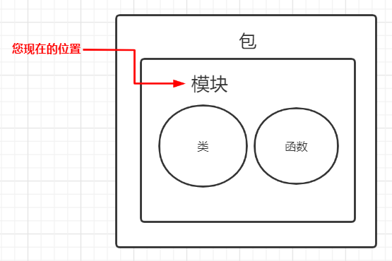
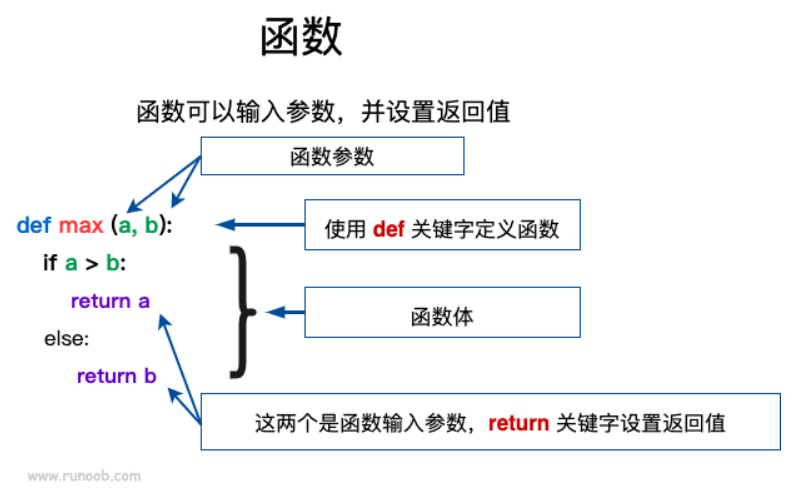
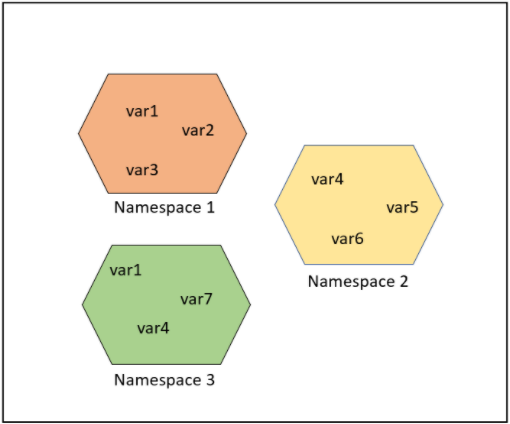
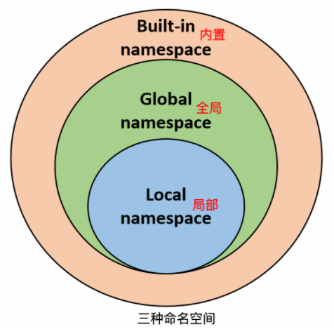
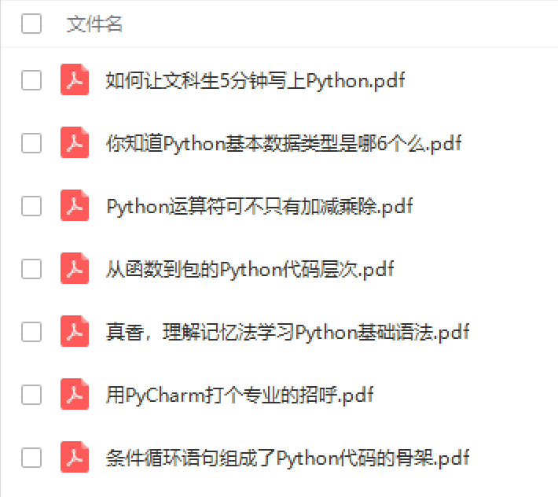

# 【Python】从函数到包的Python代码层次


## 代码层次

Python是一门脚本语言，新建一个`.py`文件，写点代码，就可以跑起来了，无论放哪都可以。比如`where.py`文件：

```python
print("Where am I?")
```

那么问题来了，这是写在哪里的呢？为了一目了然，我们用“导游图”的视角来看看代码层次：



红色箭头指出了，是写在模块中的，原来一个`.py`文件就是一个模块。模块中可以写函数和类，模块可以放在包中。

## 函数

Python中最出名的函数一定是`print()`了，毕竟全世界都在用它say Hello World。Python函数其实和数学中的函数很像，比如`y = f(x)`。有函数名字、输入和输出。Python的函数结构如下：



函数通过`def`关键字来定义：

```
def 函数名（参数列表）:
    函数体
```

参数列表有就有，无则无，多个参数用逗号分隔。例如：

```python
def hello() :
    print("Hello World!")

hello()  # 调用函数
```

```python
def max(a, b):
    if a > b:
        return a
    else:
        return b
 
a = 4
b = 5
print(max(a, b))
```

调用函数，不需要再加`def`，直接`函数名（参数列表）`即可。参数既可以是变量，也可以是其他函数，只要能一一对应。`return`关键字用来返回值。return不是必需的，如果没有，那么函数会把内部代码全部都执行完再退出，如果有，函数会在return语句立刻退出，同时返回return语句的值，例如：

```python
# 可写函数说明
def sum( arg1, arg2 ):
   # 返回2个参数的和."
   total = arg1 + arg2
   print ("函数内 : ", total)
   return total
   print("这里不会执行！")
 
# 调用sum函数
total = sum( 10, 20 )
print ("函数外 : ", total)
```

## 类

为什么还要写类，函数它不香么？这个问题有点大，我只能简单解释一下，那就是因为，类是包括了函数的，如果有一天你发现函数不够用了，那么可以用类试试，哈哈哈。

> 类是面向对象编程中的概念，把对象中共性的东西抽离出来而成。

类中的函数叫做方法，除了方法还有属性（也就是变量），我写个不严谨的公式：类 = 属性 + 方法，例如：

```python
class People:
    #定义属性
    name = ''
    age = 0
    #定义方法
    def speak(self):
        print("%s 说: 我 %d 岁。" %(self.name, self.age))
```

类的使用跟函数一样，需要调用，例如：

```python
dongfanger = People()  # 这叫做实例化对象
dongfanger.speak()  # 调用方法
```

> 类的一大好处是，可以通过继承来进一步复用代码。

## 模块

模块中可以包含模块级代码、函数和类。模块与模块之间是不能直接调用的，必须使用`import`关键字来导入。导入时，模块级代码一定会被执行，如果我们不想让某些代码执行，那么可以添加一句`if __name__ == '__main__':`，例如

```python
if __name__ == '__main__':
   print('这里的代码，仅在该模块自身运行时执行')
else:
   print('模块被导入时执行')
```

> 函数和类需要调用才会运行，所以不存在这个问题。

## 包

包是一个目录，特殊的地方在于需要包含一个`__init__.py`文件（内容可以为空），这是为什么呢？设想一下`import hello`这条语句，Python从哪去找`hello`这个包，C盘D盘E盘，成千上万个文件，范围太大了。所以需要把有Python模块的目录标出来，只查找这些目录就可以了。示例：

```python
sound/                          顶层包
      __init__.py               初始化 sound 包
      formats/                  文件格式转换子包
              __init__.py
              wavread.py
              wavwrite.py
              aiffread.py
              aiffwrite.py
              auread.py
              auwrite.py
              ...
      effects/                  声音效果子包
              __init__.py
              echo.py
              surround.py
              reverse.py
              ...
      filters/                  filters 子包
              __init__.py
              equalizer.py
              vocoder.py
              karaoke.py
              ...
```

## 命名空间

命名冲突是个头疼的问题，Python提供了命名空间这个方法，把代码块划分为不同的命名空间，同一个命名空间不能重名，不同命名空间可以重名，如图所示：



命名空间一般有三种：



- 内置：Python内置的名字。
- 全局：模块中定义的名字，包括模块的函数、类、其他导入的模块、模块级的变量和常量。
- 局部：函数中定义的名字，包括函数的参数和局部定义的变量。（类中定义的也是）

> 包里面是文件，文件名重复与否由操作系统判断。

## 作用域

命名空间决定了变量的作用域，小的作用域只在内部才有作用，比如函数内的变量，模块是不能用的：

```python
def func():
    a = 1
print(a)  # 报错NameError: name 'a' is not defined
```

反之，大的作用域能作用到小的作用域：

```python
a = 1

def func():
    print(a)

func()  # a = 1
```

如果不同作用域有相同名字的变量，Python的匹配顺序为：局部 -> 全局 -> 内置，例如：

```python
a = 1

def func():
    a = 2  # 不会作用到模块的a
    
func()  # 调用函数修改a的值
print(a)  # a的值仍为1
```

函数内部的a并不能影响到模块级别的a，因为Python在找a时，函数内部已经找到了，就不会再找了。

可以使用`global`关键字，把局部变量定义为全局变量，这样模块级别的变量也可以在函数内修改了：

```python
a = 1

def func():
    global a  # global声明为全局
    a = 2

func()  # 调用函数修改a的值
print(a)  # a的值变为2
```

另外，Python中只有模块、类和函数，才会产生作用域。其他代码块如`if`、`while`、`for`等是不会产生作用域的，也就是说这些语句内定义的变量，外部也可以访问，例如：

```python
if True:
    a = 1
print(a)
```

## 小结

本文是Python入门系列这道前菜的最后一篇了，正餐Python进阶系列计划在2021年1月开始推送，具体计划我会写在元旦的一篇文章中。Python入门系列并不算完整的教程，它的定位是进阶篇的铺垫，做一些知识储备，降低阅读门槛。如果想学习完整教程，可以找菜鸟教程，也可以上B站看视频（个人更推荐）。最后，为了知识共享和传递，我把入门的7篇文章都导出成pdf上传了，可以在公众号后台回复“入门”下载哦。



> 参考资料：
>
> https://www.runoob.com/python3/python3-function.html
>
> https://www.runoob.com/python3/python3-class.html
>
> https://www.runoob.com/python3/python3-module.html
>
> https://www.runoob.com/python3/python3-namespace-scope.html
