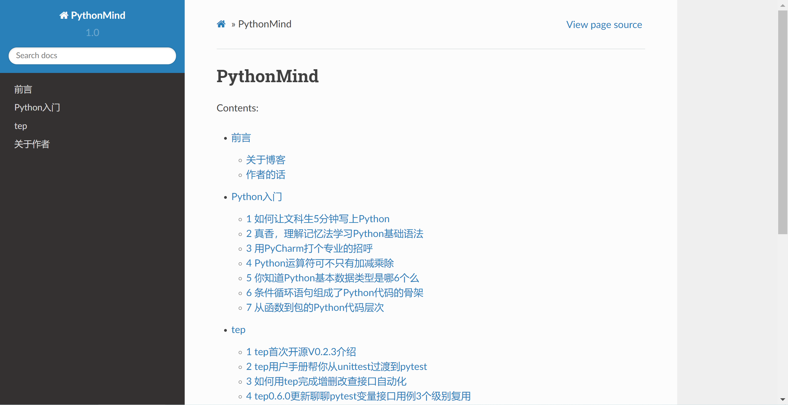

# 【Python】魔法方法推开Python进阶学习大门


## 热爱Python

Python是Guido van Rossum设计出来的让使用者觉得如沐春风的一门编程语言。2020年11月12日，64岁的Python之父宣布由于退休生活太无聊，自己决定加入Microsoft的DevDiv Team，致力于“确保更好地使用Python”。尽管在国内有些声音在Diss着Python，认为它太简单，只是个脚本语言，但是它的发明者对Python的热情，仍然激励着我们坚持对Python的热爱。

> 龟叔是所有编程语言发明者当中头发最多的这位。


## 奇迹时刻

`collection.len()`是面向对象语言的写法，`len(collection)`是Python语言的写法，这种风格叫做`Pythonic`。从前者到后者，就像变魔术一样，一瞬间让人眼前一亮。这个魔术就是Python魔法方法，或者叫双下方法，它是用双下划线开头和双下划线结尾的特殊方法，比如`obj[key]`，Python解释器实际上会转换成`obj.__getitem__(key)`来运行，但是使用者并无感知。

## `__getitem__`和`__len__`

`__getitem__`用来获取数据，`__len__`用来返回长度，这2个魔法方法是Python基础，我们通过一副扑克牌来了解：

```python
import collections

# 定义一副牌
Card = collections.namedtuple('Card', ['rank', 'suit'])

class FrenchDeck:
    # 大小
    ranks = [str(n) for n in range(2, 11)] + list('JQKA')
    # 花色
    suits = 'spades diamonds clubs hearts'.split()

    def __init__(self):
        # 生成一副牌
        self._cards = [Card(rank, suit) for suit in self.suits
                                        for rank in self.ranks]

    def __len__(self):
        return len(self._cards)

    def __getitem__(self, position):
        return self._cards[position]
```

本来我们对这副牌什么都不能做，但是由于实现了`__len__`，可以使用`len()`函数查看有多少张牌：

```python
>>> len(deck)
52
```

由于实现了`__getitem__`，可以使用中括号索引取值：

```python
>>> deck[0]
Card(rank='2', suit='spades')
```

能进行切片：

```python
>>> deck[:3]
[Card(rank='2', suit='spades'), Card(rank='3', suit='spades'), Card(rank='4', suit='spades')]
>>> deck[12::13]
[Card(rank='A', suit='spades'), Card(rank='A', suit='diamonds'), Card(rank='A', suit='clubs'), Card(rank='A', suit='hearts')]
```

能迭代：

```python
>>> for card in deck:  # doctest: +ELLIPSIS
...   print(card)
Card(rank='2', suit='spades')
Card(rank='3', suit='spades')
Card(rank='4', suit='spades')
...
```

发现没有，魔法方法是可以用来装B的！别人写个类只能`get`、`set`，你写个类还能花式炫技，666。

> Python魔法方法是给Python解释器使用的，一般不需要直接调用，Python会自己去调，比如把`len(my_object)`写成`my_object.__len__()`，就弄巧成拙了。

## 魔法方法实现运算符

前面例子实现了取值和长度，接着再看一个例子，使用`__repr__`、`__abs__`、`__bool__`、`__add__`、`__mul__`，实现运算符：

```python
from math import hypot

# 二维向量
class Vector:

    def __init__(self, x=0, y=0):
        self.x = x
        self.y = y

    # 表达式
    def __repr__(self):
        return 'Vector(%r, %r)' % (self.x, self.y)

    # 绝对值
    def __abs__(self):
        return hypot(self.x, self.y)

    # 布尔值
    def __bool__(self):
        return bool(abs(self))

    # 加法
    def __add__(self, other):
        x = self.x + other.x
        y = self.y + other.y
        return Vector(x, y)

    #乘法
    def __mul__(self, scalar):
        return Vector(self.x * scalar, self.y * scalar)
```

`__add__`实现了加法：

```python
>>> v1 = Vector(2, 4)
>>> v2 = Vector(2, 1)
>>> v1 + v2
Vector(4, 5)
```

`__abs__`实现了绝对值：

```python
>>> v = Vector(3, 4)
>>> abs(v)
5.0
```

`__mul__`实现了乘法：

```python
>>> v * 3
Vector(9, 12)
```

`__repr__`实现了对象的字符串表示：

```python
Vector(4, 5)
```

> 否则得到的字符串可能是`<Vector object at 0x10e100070>`。
>

`__bool__`实现了布尔值：

```python
if Vector(4, 5):
    return True
```

## 其他魔法方法


一篇文章是讲不完魔法方法的，我们会在后续文章中，继续探讨如何使用和实现它们。

## Tips

本小节内容是我看《流畅的Python》第一遍时记录的知识点：

1. `collections.namedtuple`可以用来创建只有少数属性但没有方法的对象，比如

   ```python
   beer_card = Card('7', 'diamonds')
   ```

2. `random.choice`和`random.sample`不一样的地方在于，sample是返回序列，choice是返回元素，当使用sample(list, 1)[0]的时候，不如直接使用choice(list)。

3. 特殊方法的存在是为了被Python解释器调用的。

4. PyVarObject是表示内存中长度可变的内置对象的C语言结构体。`list`或`str`或`bytearray`的\_\_len\_\_实际上返回的PyVarObject.ob_size属性，这个比调用一个方法要快的多。

5. len之所以不是一个普通方法，是为了让python自带的数据结构可以走后门，abs也是同理。

6. 很多时候调用\_\_init\_\_方法的目的是，在你自己的子类的\_\_init\_\_方法中调用超类的构造器。

7. abs，如果输入是整数或者浮点数，它返回的是输入值的绝对值；如果输入是复数，那么返回这个复数的模。

8. \_\_repr\_\_和\_\_str\_\_二选一的话，\_\_repr\_\_更好，因为如果一个对象没有\_\_str\_\_函数，解释器会用\_\_repr\_\_作为替代。

9. python对象的一个基本要求就是它得有合理的字符串表示形式，这就是数据模型中存在特殊方法\_\_repr\_\_和\_\_str\_\_的原因。

10. 为了判定一个值x为真还是为假，python会调用bool(x)，它的背后是调用x.\_\_bool\_\_()。如果不存在，就会调用x.\_\_len\_\_()，返回0为Flase，非0为True。

11. python通过运算符重载这一模式提供了丰富的数值类型，除了内置那些，还有`decimal.Decimal`和`fractions.Fraction`。

## 小结

本文是Python进阶系列开篇，参考《流畅的Python》序章改写而成。原书内容有深度有广度，我选择了其中的魔法方法知识点，作为切入，循序渐进学习。其实书中这一章节的副标题是“数据模型”，它是个什么概念呢？

> 系列文章会不定期同步到在线电子书中，欢迎访问查看：
>
> https://dongfanger.gitee.io/blog/



> 参考资料：
>
> 《流畅的Python》
>
> https://docs.python.org/3/reference/datamodel.html

