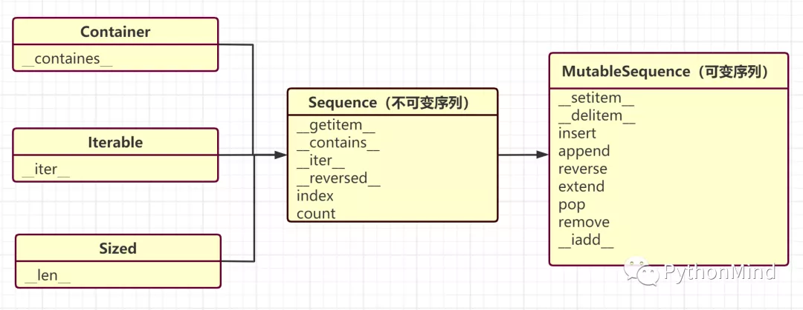

# 【Python】Python骚操作从列表推导和生成器表达式开始


## 序列

序列是指一组数据，按存放类型分为容器序列与扁平序列，按能否被修改分为不可变序列与可变序列。

**容器序列与扁平序列**

容器序列存放的是对象的引用，包括`list`、`tuple`、`collections.deque`。

扁平序列存放的是对象的值，包括`str`、`bytes`、`bytearray`、`memoryview`和`array.array`。

> 扁平序列的值是字符、字节和数值这种基础类型。

**不可变序列与可变序列**

不可变序列，包括`tuple`、`str`、`bytes`。

可变序列，包括`list`、`bytearray`、`array.array`、`collection.deque`、`memoryview`。

下图左边是父类，右边是子类，可以看出可变序列是从不可变序列继承来的，扩展了可变方法：



## 列表推导

Python语言魅力在于简洁，这能从最常见的创建列表体现出来，比如我们想把字符串`"abc"`转换成新列表`["a", "b", "c"]`，常规写法：

```
symbols = "abc"
codes = []
for symbol in symbols:
    codes.append(symbol)
print(codes)  # ["a", "b", "c"]
```

用到了for循环和列表append方法。实际上可以不用append方法，直接：

```
symbols = "abc"
codes = [symbol for symbol in symbols]
```

这叫做列表推导，是更加Pythonic的写法。

无论是编写效率还是可阅读性，列表推导都更胜一筹，可以说是构建列表的快捷方式。但是不能滥用，通用原则是，如果列表推导的代码超过了两行，就要考虑用append了。这不是规定，完全可以凭借自我喜好来选择。

笛卡尔积是指多个序列中元素所有组合，我们用列表推导来实现笛卡尔积：

```
colors = ["black", "white"]
sizes = ["S", "M", "L"]
tshirts = [(color, size) for color in colors for size in sizes]
```

一行代码搞定！Life is short，use Python，list comprehension is wonderful，amazing。

注意这行代码有两个for循环，等价于：

```
for color in colors:
    for size in sizes:
```

运行结果是：

```
[('black', 'S'), ('black', 'M'), ('black', 'L'), ('white', 'S'), ('white', 'M'), ('white', 'L')]
```

如果换一下顺序：

```
[(color, size) for color in colors for size in sizes]
```

等价于：

```
for size in sizes:
    for color in colors:
```

运行结果是不同的，观察第2个元素：

```
[('black', 'S'), ('white', 'S'), ('black', 'M'), ('white', 'M'), ('black', 'L'), ('white', 'L')]
```

## 生成器表达式

一般接触到生成器时，都要讲`yield`关键字，看似有点复杂，然而却很简单，生成器就像列表推导一样，只不过是用来生成其他类型序列的，比如元组：

```
symbols = "abc"
codes = (symbol for symbol in symbols)
```

它的语法非常简单，把列表推导的中括号`[]`换成小括号`()`，就可以了。

语法相似，本质上却有很大区别，我们试着用生成器表达式来实现笛卡尔积，看看会有什么变化：

```
colors = ["black", "white"]
sizes = ["S", "M", "L"]
tshirts = ((color, size) for color in colors for size in sizes)
```

运行结果是：

```
<generator object <genexpr> at 0x000001FD57D2DB30>
```

`generator object`，结果是一个生成器对象。因为生成器表达式在每次迭代时才会逐个产出元素，所以这里的结果并不是已经创建好的元组。列表推导才会一次性产生新列表所有元素。

通过迭代把生成器表达式结果输出：

```
for tshirt in tshirts:
    print(tshirt)
('black', 'S')
('white', 'S')
('black', 'M')
('white', 'M')
('black', 'L')
('white', 'L')
```

生成器表达式可以提升程序性能，比如要计算两个各有1000个元素的列表的笛卡尔积，生成器表达式可以帮忙省掉运行for循环的开销，即一个包含100万个元素的列表。

> yield作用和return差不多，后面会讲到。

## Tips

本小节内容是我看《流畅的Python》第一遍时记录的知识点：

1. Python标准库用C实现了丰富的序列类型。
2. 列表推导，就是指`a = [x for x in something]`这种写法。
3. 生成器表达式用于生成列表外的其他类型的序列，它跟列表推导的区别仅仅在于方括号换成圆括号，如`b = tuple(x for x in something)` 。
4. `array.array('I', x for x in something) `，array构造方法的第一个参数指定了数组中数字的存储方式。
5. `for tshirt in [c, s for c in colors for s in sizes]`，列表推导会一次性生成这个列表，存储在内存中，占用资源。`for tshirt in ('%s %s' for c in colors for s in sizes)`，生成器表达式只在循环时逐个产出元素，避免额外的内存占用，省掉了运行for循环的开销。

## 小结

本文首先介绍了序列的概念，然后演示了Python常规骚操作——列表推导，最后引出了生成器表达式这个看似复杂实则简单的语法。列表是可变的，它有个不可变的孪生兄弟，元组。

> 参考资料：
>
> 《流畅的Python》