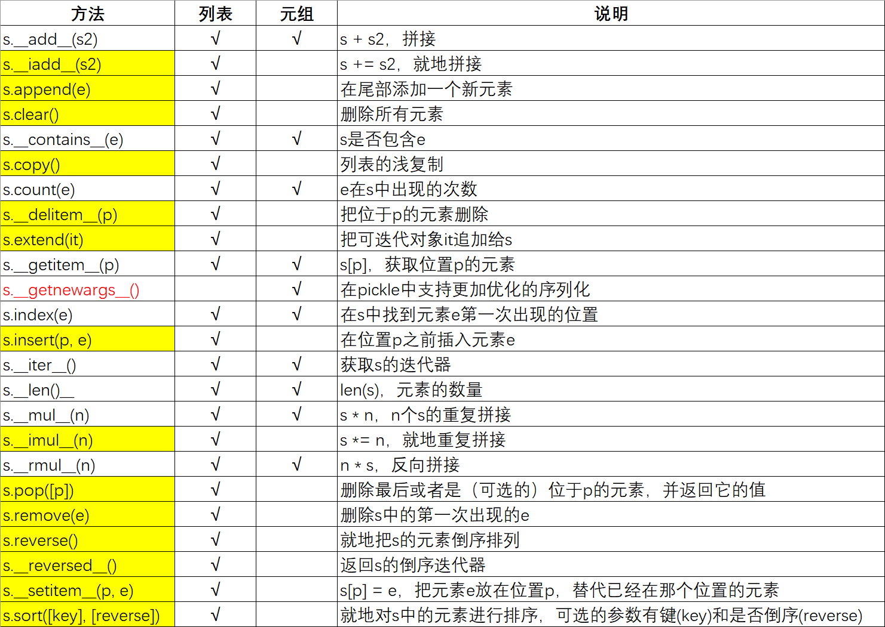

# 【Python】Python元组拆包捡到8倍镜快准狠


## 元组拆包

元组是不可变列表，列表是通过索引取值的，元组也是：

```python
tuple_test = (1, 2, 3)
a = tuple_test[0]
b = tuple_test[1]
c = tuple_test[2]
```

但Python是出了名的一行代码解决问题，元组拆包就是精髓技术之一：

```python
a, b, c = tuple_test
```

```python
print("%s %s %s" % tuple_test)
```

把元组一一对应拆出来，就叫做元组拆包。拆包有个要求，元组中的元素数量必须跟接受这些元素的空挡数一致，否则会报错：

```python
tuple_test = (1, 2, 3)
a, b = tuple_test  # ValueError: too many values to unpack (expected 2)
```

**`_`占位符**

使用`_`占位符可以解决这个问题：

```python
tuple_test = (1, 2, 3)
a, b, _ = tuple_test
```

这样就只获取到部分数据了，这在取函数返回值时特别有用，比如：

```python
import os

_, filename = os.path.split("/home/dongfanger/.ssh/idrsa.pub")
print(filename)  # "idrsa.pub"
```

**`*`前缀**

当返回值特别多时，`_`占位符写起来麻烦，可以用`*`来处理剩下的元素：

```python
>>> a, b, *rest = range(5)
>>> a, b, *rest
(0, 1, [2, 3, 4])
```

注意`rest`是个列表，如果没有足够元素，会返回空列表：

```python
>>> a, b, *rest = range(2)
>>> a, b, *rest
(0, 1, [])
```

`*`前缀变量能放在任意位置，比如，放在中间：

```python
>>> a, *body, c, d = range(5)
>>> a, body, c, d
(0, [1, 2], 3, 4)
```

放在前面：
```python
>>> *head, b, c, d = range(5)
>>> head, b, c, d
([0, 1], 2, 3, 4)
```

实在是妙啊。

`*`还有一个作用，把元组拆开作为函数参数：

```python
>>> divmod(20, 8)
(2, 4)
>>> t = (20, 8)
>>> divmod(*t)
(2, 4)
```

> 经典写法`*args`就是这个道理。

## 嵌套元组拆包

嵌套元组是指元组中有元组，比如`(1, 2, 3, (4, 5))`，对于嵌套元组，你可能会想要拆两遍：

```python
tuple_nest_test = (1, 2, 3, (4, 5))
a, b, c, d = tuple_nest_test
x, y = d
print(a, b, c, x, y)
```

实际上能一步到位：

```python
tuple_nest_test = (1, 2, 3, (4, 5))
a, b, c, (x, y) = tuple_nest_test
print(a, b, c, x, y)
```

## 交换两个变量的值

元组拆包提供了语法糖，对于交换两个变量的值的常规写法：

```python
temp = a
a = b
b = temp
```

可以切换为优雅写法：

```python
b, a = a, b
```

## 具名元组

元组很像数据库表记录，除了没有表名和字段名，`collections.namedtuple`具名元组补偿了这个缺憾，它是一个工厂函数，可以用来构建一个带字段名的元组和一个有名字的类，比如：

```python
import collections

# 定义
Card = collections.namedtuple("Card", ["rank", "suit"])
# 初始化
card_test = Card("J", "hearts")
# 使用
print(card_test.rank)  # J
print(card_test[1])  # hearts
```

> Card是表名，有两个表字段rank和suit。

定义具名元组需要2个参数，第1个参数是类名，第2个参数是字段名，既可以是可迭代对象（如列表和元组），也可以是空格间隔的字符串：

```python
Card = collections.namedtuple("Card", ("rank", "suit"))
Card = collections.namedtuple("Card", "rank suit")
```

初始化时以一串参数形式传入构造函数：

```python
card_test = Card("J", "hearts")
```

既可以通过`.`运算符，也可以用索引来取值：

```python
print(card_test.rank)
print(card_test[1])
```

这个带名字的元组，对调试程序有很大帮助。

## 列表与元组

元组是不可变列表，它们就像双胞胎，长相类似，内在性格却有不同：



黄色列表独有，红色元组特有，元组竟然还多了个`s.__getnewargs__()`方法！从表中可以清楚地看到，除了跟增减元素相关的方法之外，元组支持列表的其他所有方法。

## 列表也能拆

既然列表和元组是孪生兄弟，那必然也有共同技能：

```python
list_test = [1, 2, 3]
a, b, c = list_test
```

```python
>>> divmod(20, 8)
(2, 4)
>>> t = [20, 8]  # 换成列表
>>> divmod(*t)
(2, 4)
```

列表拆包，也是ok的。

## 小结

本文介绍了Python神奇操作元组拆包，借助`_`占位符和`*`前缀可以进行更加灵活的取值，具名元组实际用的还比较少，不过看一些源码是有的。文章最后比较了列表和元组的差异，列表也能拆包。列表（list）、元组（tuple），以及字符串（str），都有一个共同操作：切片。

> 参考资料：
>
> 《流畅的Python》

