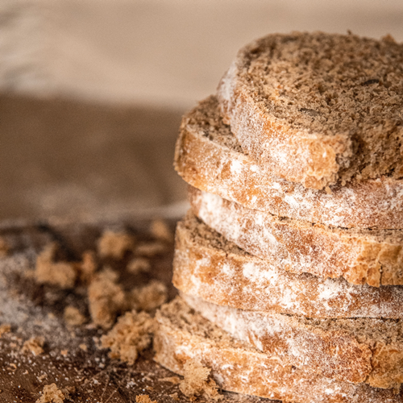

# 【Python】能取值亦能赋值的Python切片


切片，就像面包，给几刀，切成一片一片，可以做成吐司，也可以做成三明治，口味更佳：



列表（list）、元组（tuple）、字符串（str）都能进行切片，得到子片段，实际上切片操作比想象的要强大很多，能取值，亦能赋值。

## 忽略最后一个元素

切片是用下标和冒号来描述的，比如`s[2:13]`。对于`2, 3, ..., 12`这个序列，表达为`[2, 13)`，左闭右开，比`[2, 12]`和`(1, 13)`都更合理，理由如下：

1. 上限减去下限等于元素个数，比如`13 - 2 = 11`，刚好就有11个元素。
2. 连续的范围没有重叠，比如`[2, 13)` 和 `[13, 25)` 是两个连续的范围，13只会包含在后一个里。

## 下标从0开始

对于10个元素，写成`[0, 10)`比`[1, 11)`更合理，理由如下：

1. N个元素，`[0, N)`比`[1, N+1)`写法更简洁，不需要`+1`。

2. 某个元素的下标等于排在它前面元素的个数，方便使用，比如：

   ```
   0 1 2 3 4 5 6 7 8 9
           ^ 
      前面有4个元素
   ```

## 好用的切片

以上两个数学理论给切片使用带来了很多好处：

- 当只有最后一个位置信息时，可以快速看出有几个元素，比如`my_list[:3]`返回3个元素。

- 当起止位置信息都可见时，可以快速计算出长度，用`stop - start`就可以了，比如`my_list[1:3]`长度为2。

- 利用任意一个下标把序列切割成不重叠的两部分，只要写成`my_list[:x]`和`my_list[x:]`就可以了，比如

  ```python
  >>> my_list = [10, 20, 30, 40, 50, 60]
  >>> my_list[:3]
  [10, 20, 30]
  >>> my_list[3:]
  [40, 50, 60]
  ```

> Python里的范围（range）也是忽略最后一个元素，下标从0开始的。

## 切片间隔

切片除了`s[a:b]`，还有第三个下标`s[a:b:c]`，意思是对s在a和b之间以c为间隔取值，c还可以为负，负值意味着反向取值。比如：

  ```python
  >>> s = "bicycle"
  >>> s[::3]
  "bye"
  >>> s[::-1]
  "elcycib"
  >>> s[::-2]
  "eccb"
  ```

  > `a:b:c`更严谨的描述是`start:stop:step`。

语法如此简洁，用脚想也知道是Python魔法方法干的好事！在对`s[a:b:c]`进行求值的时候，Python实际上会调用`s.__getitem__(slice(a, b, c))`，熟悉的配方，熟悉的味道。`slice(a, b, c)`是`a:b:c`用在`[]`中返回的切片对象，`slice()`是Python内置函数，示例：

  ```python
  invoice = "Mini Kit $34.95 1 $ 34.95"
  SKU = slice(0, 8)
  print(invoice[SKU])
  ```

## 切片赋值

切片有一个强大功能是给切片赋值，如果把切片放在赋值语句的左边，或把它作为del操作的对象，我们就可以对序列进行嫁接、切除或就地修改操作。示例：

```python
>>> l = list(range(10))
>>> l
[0, 1, 2, 3, 4, 5, 6, 7, 8, 9]
>>> del l[5:7]
>>> l
[0, 1, 2, 3, 4, 7, 8, 9]
>>> l[3:2] = [11, 22]
>>> l
[0, 1, 2, 11, 22, 3, 4, 7, 8, 9]
>>> l[2:5] = [100]
>>> l
[0, 1, 100, 3, 4, 7, 8, 9]
```

注意，如果赋值的对象是一个切片，那么赋值语句的右侧必须是个可迭代对象，即使只有单独一个值，否则会报错：

```python
>>> l[2:5] = 100
Traceback (most recent call last):
  File "<input>", line 1, in <module>
TypeError: can only assign an iterable
```

## 多维切片

除了一维切片，Python还支持多维切片，这在多维数组中能体现出来。NumPy是Python第三方库，提供了高阶数组，使得Python成为科学计算应用的主流语言。示例：

```python
>>> import numpy
>>> a = numpy.arange(12)
>>> a
array([ 0,  1,  2,  3,  4,  5,  6,  7,  8,  9, 10, 11])
>>> a.shape
(12,)
>>> a.shape = 3, 4
>>> a
array([[ 0,  1,  2,  3],
       [ 4,  5,  6,  7],
       [ 8,  9, 10, 11]])
>>> a[:, 1]
array([1, 5, 9])
>>> a[1:2, 2:3]
array([[6]])
>>> a[1:3, 2:4]
array([[ 6,  7],
       [10, 11]])
```

在NumPy中，省略号`...`用作多维数组切片的快捷方式，如果x是四维数组，那么`x[i, ...]`就是`x[i, :, :, :]`的缩写，比如：

```python
>>> a.shape = 2, 2, 3
>>> a
array([[[ 0,  1,  2],
        [ 3,  4,  5]],
       [[ 6,  7,  8],
        [ 9, 10, 11]]])
>>> a[:, :, 1]
array([[ 1,  4],
       [ 7, 10]])
>>> a[..., 1]
array([[ 1,  4],
       [ 7, 10]])
```

## 小结

本文介绍了Python强大的切片操作，因为忽略最后一个元素和下标从0开始，所以切片用起来特别顺手，除了开始和结尾，还能设置切片间隔，间隔为负可以反向取值。切片赋值是切片另一个强大功能，需要注意的是赋值语句的右侧必须是个可迭代对象。

> 参考资料：
>
> 《流畅的Python》
>
> https://blog.wz52.cn/archives/174.html