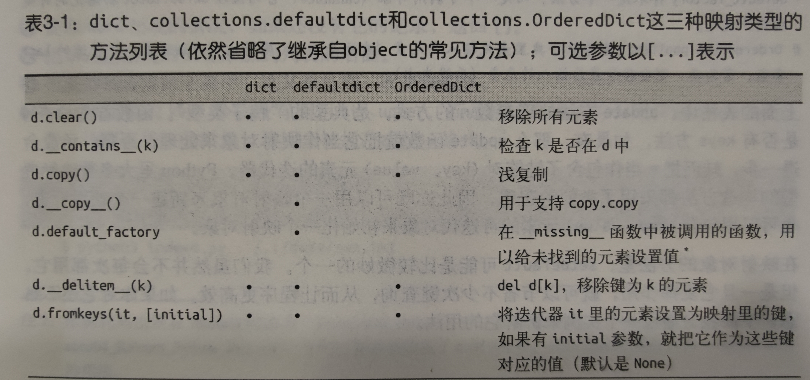
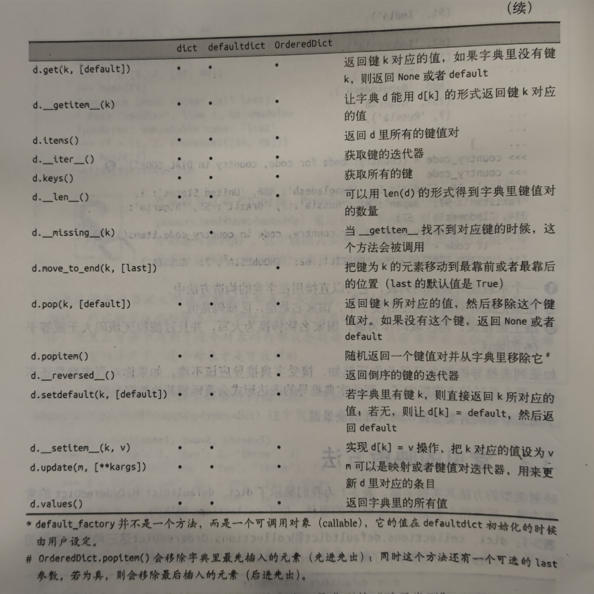

# 【Python】深度剖析Python字典和集合（上）


“字典这个数据结构活跃在所有Python程序的背后，即便你的源码里并没有直接用到它”，摘抄自《代码之美》第18章Python的字典类：如何打造全能战士。字典是Python语言的基石！在函数的关键字参数、实例的属性和模块的命名空间都能够看到它的身影，我们自己写代码时也经常会用到。

“集合”这个概念在Python中算是比较年轻的，使用率也比较低，我只在元素去重和求差集并集时使用过。

字典和集合有个共同点，它们都是基于同一种数据结构实现的：散列表，又叫做哈希表，Hash Table。要理解集合和字典，得先理解散列表。要理解散列表，得先理解可散列的数据类型。

## 可散列的数据类型

在Python词汇表中，关于可散列类型的定义有这样一段话：

“如果一个对象是可散列的，那么在这个对象的生命周期中，它的散列值是不变的，而且这个对象需要实现`__hash__（）`方法。另外可散列对象还要有`__eq__()`方法，这样才能跟其他键做比较。如果两个可散列对象是相等的，那么它们的散列值一定是一样的。”

重点是散列值不变！

> 字典的键必须是可散列的，否则变来变去就找不到映射了。

于是可以得知原子不可变数据类型（str、bytes、和数值类型）都是可散列类型，frozenset冻结不可变集合，也是可散列的。元组有两种情况，一、如果所有元素都是可散列的数据类型，那么元组是可散列的，二、如果元组里面的元素是其他可变类型的引用，那么元组是不可散列的，示例：

```python
>>> tt = (1, 2, (30, 40))
>>> hash(tt)
-3907003130834322577

>>> tl = (1, 2, [30, 40])
>>> hash(tl)
Traceback (most recent call last):
  File "<input>", line 1, in <module>
TypeError: unhashable type: 'list'

>>> tf = (1, 2, frozenset([30, 40]))
>>> hash(tf)
5149391500123939311
```

其中`tl`元组包含了列表（可变），`hash()`函数报错了。

## 散列表简介

假设你们班级100个同学每个人的学号是由院系-年级-班级-编号组成，例如学号为01100168表示是01系-10级-01班-68号。为了快速查找到68号的成绩信息，可以建立一张表，但是不能用学号作为下标，学号的数值实在太大。因此将学号除以1100100取余，即得到编号作为该表的下标。要查找学号为01100168的成绩的时候，只要直接访问表下标为68的数据即可。

散列表就是一张表，它通过计算一个关于键值的函数，将所需查询的数据映射到表中一个位置来访问记录，这加快了查询速度。这个映射函数称作散列函数，存放记录的表称作散列表。再举个例子，比如下面这几个人物，按数组存储：


这样我要找到沈嘉文的电话号码，需要顺序查找对比整个数组，第一个余罪，不是，第二个傅老大，不是，直到第三个才找到沈嘉文。换成散列表：


左边是姓名首字母的Key，右边是电话号码的Value，当我们要查找沈嘉文的时候，通过计算，在s位置，1次查找就找到了。

> 为了不让本文显得生硬，接下来先介绍字典和集合，最后再看看散列表是如何实现它们的。

## 字典

### Mapping和MutableMapping

Mapping和MutableMapping是collections.abc模块中的两个抽象基类，它们的作用是作为形式化的文档，定义了构建一个映射类型所需要的最基本的接口。比如判断是否是映射类型：

```python
>>> from collections import abc
>>> my_dict = {}
>>> isinstance(my_dict, abc.Mapping)
True
```

非抽象映射类型一般不会直接继承这两个抽象基类，而是会直接对dict或collections.UserDict进行扩展。正是如此，Python标准库里的所有映射类型都是利用dict来实现的。

### dict构造方法

dict构造方法如下：

```python
>>> a = dict(one=1, two=2, three=3)
>>> b = {"one": 1, "two": 2, "three": 3}
>>> c = dict(zip(["one", "two", "three"], [1, 2, 3]))
>>> d = dict([("two", 2), ("one", 1), ("three", 3)])
>>> e = dict({"three": 3, "one": 1, "two": 2})

>>> a == b == c == d == e
True
```

一共竟然有五种！还有第六种：字典推导，跟列表推导和生成器表达式类似：

```python
>>> my_list = [("two", 2), ("one", 1), ("three", 3)]
>>> my_dict = {en: num for en, num in my_list}
>>> my_dict
{'two': 2, 'one': 1, 'three': 3}
```

### 常见映射方法

除了dict，还有两个dict的变种：defaultdict和OrderedDict，它们对常见映射方法的支持区别如下：





### 鸭子类型

鸭子类型是动态语言的说法，指一个对象只要“看起来像鸭子，走起路来像鸭子”，那它就可以被看做是鸭子。比如：

```python
class Animal(object):
    
    def run(self):
        print("The animal is running...")

class Dog(Animal):

    def run(self):
        print('The dog is running...')

class Cat(Animal):

    def run(self):
        print('The cat is running...')

def make_run(animal):
    animal.run()

dog = Dog()
cat = Cat()
make_run(dog)
make_run(cat)
```

对于 `make_run()` 函数来说，传入的参数并不一定需要是 `Animal` 类型的，只需要保证传入的对象有一个 `run()` 方法即可。

> 在静态语言中，如果需要传入 `Animal` 类型，则传入的对象就必须是 `Animal` 类型或者它的子类，否则，将无法调用 `run()` 方法。

### update

update方法用来更新字典里对应的条目，它处理参数m的方式，是典型的“鸭子类型”。函数首先检查m是否有keys方法，如果有，那么update函数就把它当作映射对象来处理，不关心是不是真的映射类型。如果没有，函数会把m当作包含了键值对(key, value)元素的迭代器。

> Python里大多数映射类型的构造方法都采用了类似的逻辑。

### setdefault

当字典d[k]不能找到正确的键的时候，Python会抛出异常。也许每个Python使用者都知道可以用d.get(k, default)来代替d[k]，给找不到的键一个默认的返回值。但是要更新字典时，该怎么办呢？比如要在my_dict中添加键为b，值为列表[1, 2, 3, 4, 5, 6]的键值对：

```python
my_dict = {"a": 1}
key = "b"
my_list = range(2, 7)

## {"a": 1, "b": [2, 3, 4, 5, 6]}
```

> 不能用`mylist[key] = my_list`，必须用for循环动态append。

方法1，先添加空列表，再append：

```python
my_dict[key] = []
for i in my_list:
    my_dict[key].append(i)
```

方法2，第一次没有键，先用get查询返回空列表，再append，再赋值：

```python
for i in my_list:
    temp = my_dict.get(key, [])
    temp.append(i)
    my_dict[key] = temp
```

方法3，先用if判断，再append：

```python
for i in my_list:
    if key not in my_dict:
        my_dict[key] = []
    my_dict[key].append(i)
```

方法4，一行代码：

```python
for i in my_list:
    # 除了for循环，一行代码
    my_dict.setdefault(key, []).append(i)
```

Python骚操作总是这么多！setdefault你学会了么？

> setdefault只需要进行一次键查询就可以完成操作，节省键查询，程序更高效。

### defaultdict字典变种

有没有办法直接执行`my_dict[key].append(i)`呢？答案是有的，借助defaultdict可以实现：

```python
import collections

my_dict = collections.defaultdict(list)
my_dict["a"] = 1
key = "b"
my_list = range(2, 7)

for i in my_list:
    my_dict[key].append(i)

```

my_dict[key]会按以下步骤执行：

1. 调用list()来建立一个新列表。
2. 把这个新列表作为值，key作为它的键，放到my_dict中。
3. 返回这个列表的引用。

通过列表引用继续执行append()函数。

defaultdict的`__init__(self, default_factory=None, **kwargs)`有个参数default_factory用来生成默认值，必须是可调用对象。比如：

```python
def init_list():
    return [0]

my_dict = collections.defaultdict(init_list)
```

注意了！此时my_dict的值是{}空字典，default_factory只会在`__getitem__`里被调用，也就是说`my_dict[key]`时才会用这个默认值：

```python
print(my_dict)  # defaultdict(<function init_list at 0x014E84F0>, {})
print(my_dict["b"]) # defaultdict(<function init_list at 0x014E84F0>, {'b': [0]})
```

> my_dict.get("b")不会调用`__getitem__`，不会使用default_factory，返回值为None。
>
> 为什么get不会调用`__getitem__`?`__getitem__`是为[]提供的语法糖，get()已经是取值方法了，不需要这个语法糖。

default_factory默认为None，如果不指定，查询不存在的键会触发KeyError，这个道理和[]取值是一样的。

所有这一切背后的功臣其实是魔法方法`__missing__`。所有的映射类型在处理找不到的键的时候，都会牵扯到`__missing__`方法。基类dict并没有定义这个方法，但是dict是能知道它的，如果一个类继承了dict，然后实现了`__missing__`方法，Python就会自动调用它，而不是抛出一个KeyError异常。

> `__missing__`只会被`__getitem__`调用，这就是default_factory只对`__getitem__`有作用的原因！

示例如下，当用非字符串键查询时，转换为字符串键查询：

```python
class StrKeyDict0(dict):  # <1>

    def __missing__(self, key):
        if isinstance(key, str):  # <2> 不加这个判断，如果str(key)不存在，就会第3处再次调用__missing__无限递归
            raise KeyError(key)
        return self[str(key)]  # <3>

    def get(self, key, default=None):
        try:
            return self[key]  # <4>
        except KeyError:
            return default  # <5>

    # k in my_dict 会导致__contains__递归调用，所以这里用了self.keys()    
    def __contains__(self, key):
        return key in self.keys() or str(key) in self.keys()  # <6>
```

> 像`k in my_dict.keys()`这种操作在Python3中是很快的，而且即便映射类型对象很庞大也没关系，这是因为dict.keys()的返回值是一个“视图”。

### OrderdDict及其他字典变种

**collections.OrderedDict**

在Django REST framework中的分页就用到了OrderedDict，返回分页数据必须是有序的，否则会提示UnOrdered。OrderedDict的popitem方法默认删除并返回字典里的最后一个元素（栈），如果加了参数OrderedDict(last=False)，那么它会删除并返回第一个被添加进度的元素（队列）。

**collections.ChainMap**

示例：

```python
import builtins
pylookup = ChainMap(locals(), globals(), vars(builtins))
```

该类型可以容纳多个不同的映射对象，在按键查找时，这些对象会被当作一个整体被逐一查找。

**collections.Counter**

示例：

```python
>>> import collections
>>> ct = collections.Counter("abracadabra")
>>> ct
Counter({'a': 5, 'b': 2, 'r': 2, 'c': 1, 'd': 1})
>>> ct.update("aaaaazzz")
>>> ct
Counter({'a': 10, 'z': 3, 'b': 2, 'r': 2, 'c': 1, 'd': 1})
>>> ct.most_common()
[('a', 10), ('z', 3), ('b', 2), ('r', 2), ('c', 1), ('d', 1)]
>>> ct.most_common(2)
[('a', 10), ('z', 3)]
```

Counter是用来给可散列表对象计数的。

**collections.UserDict**

让用户继承写子类。

> 它比dict更适合继承的原因是，后者有时会在某些方法的实现上走一些捷径，导致我们不得不在它的子类中重写这些方法，而UserDict就不需要。

### 不可变映射类型

借助MappingProxyType，可以实现不可变字典。它返回的是一个只读的视图，会跟随源字典动态展示，但是无法对源字典做出改动。示例：

```python
>>> from types import MappingProxyType
>>> d = {1: "A"}
>>> d_proxy = MappingProxyType(d)
>>> d_proxy
mappingproxy({1: 'A'})
>>> d_proxy[1]
'A'
>>> d_proxy[2] = "x"
Traceback (most recent call last):
  File "<input>", line 1, in <module>
TypeError: 'mappingproxy' object does not support item assignment
>>> d[2] = "B"
>>> d_proxy
mappingproxy({1: 'A', 2: 'B'})

```

## 小结

本文为上篇，主要介绍了散列表和字典，包含了一些Python骚操作，也用示例解释了什么是鸭子类型。下篇将介绍集合，以及散列表是如何实现dict和set的。

> 参考资料：
>
> 《流畅的Python》
>
> https://zhuanlan.zhihu.com/p/64853220
>
> https://www.jianshu.com/p/101c263cd93e
>
> http://www.woshipm.com/pmd/805326.html
>
> https://zhuanlan.zhihu.com/p/149463934?from_voters_page=true
>
> https://www.jianshu.com/p/e97044a8169a
>
> https://github.com/fluentpython/example-code/blob/master/03-dict-set/strkeydict0.py

