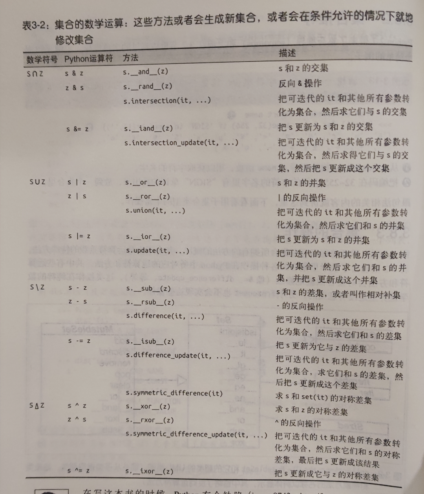
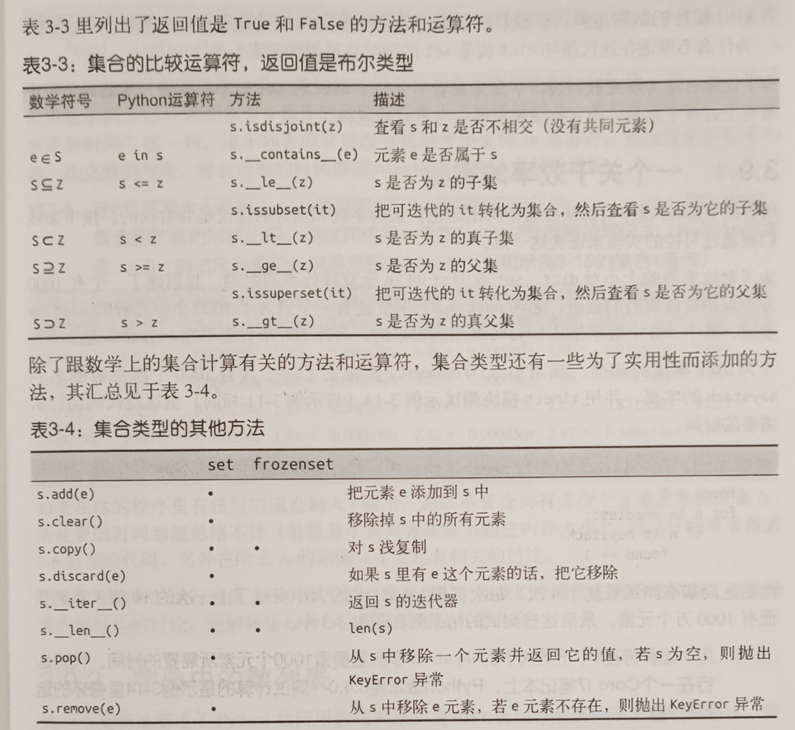
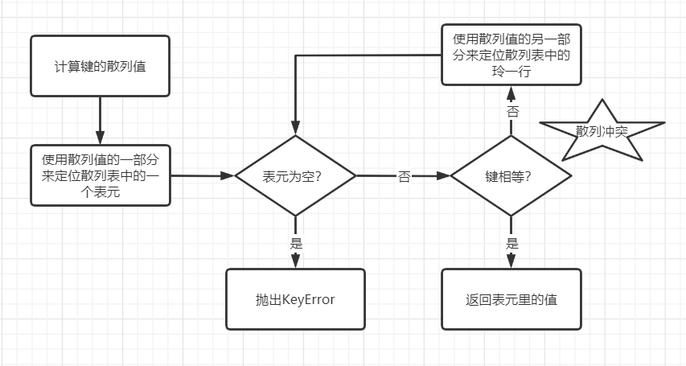

# 【Python】深度剖析Python字典和集合（下）


## 集合

集合的字面量是{1}、{1, 2}，和字典有点像，不同的是集合只有值没有键。

### set构造方法

set构造方法如下：

```python
my_set = {1, 2, 3}
my_set = set([1, 2, 3])
```

前者比后者更快更易读，因为对于前者，Python会利用一个专门的叫做BUILD_SET的字节码来创建集合。而对于后者，Python必须先从set这个名字来查询构造方法，然后新建一个列表，最后再把这个列表传入到构造方法里。

> `{}`是空字典，空集合必须用`set()`。

集合也有集合推导：

```python
>>> my_set = {x for x in range(1, 4)}
>>> my_set
{1, 2, 3}
>>> type(my_set)
<class 'set'>
```

集合还有个不可变类型叫做frozenset，如同元组之于列表，它的构造函数如下：

```python
>>> frozenset(range(10))
frozenset({0, 1, 2, 3, 4, 5, 6, 7, 8, 9})
```

> 只有这一种方法，没有字面量。

### 集合的操作

集合的本质是许多唯一对象的聚集，它最常见的操作是用来去重：

```python
>>> my_list = [1, 2, 2, 3]
>>> set(my_list)
{1, 2, 3}
>>> list(set(my_list))
[1, 2, 3]
```

除此之外，集合还能进行数学运算，比如求交集、并集、差集等。示例，求needles的元素在haystack里出现的次数，暴力解法：

```python
found = 0
for n in needles:
    if n in haystack:
        found += 1
```

集合解法：

```python
found = len(needles & haystack)
```

即使不是set也能先转换为set：

```python
found = len(set(needles) & set(haystack))

## 另一种写法
found = len(set(needles).intersection(haystack))
```

集合支持的操作如下：





## 散列表揭秘

这一部分的内容略微有点硬，请注意提前喝点水！

从上篇的简介可以知道，散列表就是一张表，它通过计算一个关于键值的函数，将所需查询的数据映射到表中一个位置来访问记录。散列表其实是一个稀疏数组（总是有空白元素的数组称为稀疏数组），散列表里的单元叫作表元，在dict的散列表中，每个键值对占用一个表元，每个表元有两个部分，一个是对键的引用，另一个是对值的引用，因为所有表元的大小一致，所以可以通过偏移量来读取某个表元。

为什么要用稀疏数组？举个例子，身份证号411697199702076425，如果把它作为键存储到数组中，虽然能用O(1)时间就找到，但是需要开辟一个999999999999999999大的空间。假如只有1的空间，就只能把最后一位作为键存储到数组中，多个身份证号的键就容易冲突，得多看n位才能找到，要用O(n)时间。空间既不能太大，也不能太小，需要结合时间，在两者之间产生一个平衡，即空间和时间的平衡，所以要用稀疏数组！

Python会设法保证大概还有三分之一的表元是空的，用空间换时间，提高散列表查询效率。如果剩余空间不足，原有的散列表会被复制到一个更大的空间里面。

散列表的键值，又称为散列值，Python中可以用hash()方法来计算所有内置类型对象的散列值。

> 自定义类型实际上调用的是自定义的`__hash__`。

如果两个对象在比较的时候是相等的，那么它们的散列值必须相等，否则散列表就不能正常运行了：

```python
>>> a = 1
>>> b = 1
>>> a == b
True
>>> hash(a)
1
>>> hash(b)
1
>>> a = "x"
>>> b = "x"
>>> a == b
True
>>> hash(a)
706802421
>>> hash(b)
706802421
```

越是相似但不相等的对象，它们的散列值的差别越大：

```python
>>> a = 1.0001
>>> b = 1.0002
>>> hash(a)
783616733
>>> hash(b)
1567233465
```

这是因为散列值是散列表索引，它们必须在索引空间尽量分散开来。

> 我的理解是，散列值是要被尽量打散的，1.0001和1.0002相差0.0001，这个0.0001被打散后的值导致它们的散列值相差很大。

了解了基本概念后，该看下散列表算法了（不用害怕，只有思路，没有代码）：



为了获取my_dict[search_key]背后的值：

1. 调用hash(search_key)计算search_key的散列值。
2. 把最低几位数字当做偏移量，在散列表里查找表元。
3. 如果表元为空，返回KeyError。
4. 如果表元有值，表元里会有一对`found_key:found_value`。
5. 检验search_key == found_key，相等就返回found_key。
6. 不相等的情况称为散列冲突！为了解决冲突，算法会在散列值中另外再取几位，处理一下，把新得到的数字当做索引来寻找表元。

> 实际上散列冲突发生概率非常小，散列表查询效率非常高！

添加新元素和更新现有键值的操作几乎一样，区别在于添加新元素时发现空表元，会放入一个新元素；更新现有键值时，会把原表里的值替换成新值。

> 另外，添加新元素时，Python会根据剩余空间大小决定是否要重新分配内容为它扩容。

## 散列表与dict

dict的键必须是可散列的：

1. 支持hash()函数，通过`__hash__()`得到的散列值是不变的。
2. 支持通过`__eq__()`来判断是否相等。
3. 若a == b为真，则hash(a) == hash(b)也为真。

> 所有由用户自定义的对象默认都是可散列的，因为它们的散列值由id()来获取（符合第1条），而且它们都是不相等的（符合第2条和第3条）。

dict的实现是典型的空间换时间：键查询很快，在内存上的开销巨大！

dict键的次序取决于添加顺序，当往dict添加新键时，如果发生了散列冲突，新键可能会被放到另一个位置，键的位置不一样，次序也就不一样了。比如：

```python
my_list = [("a", 1), ("b", 2)]

my_dict1 = dict(my_list)
my_dict2 = dict(reversed(my_list))

print(my_dict1)  # {'a': 1, 'b': 2}
print(my_dict2)  # {'b': 2, 'a': 1}
print((my_dict1 == my_dict2))  # True
```

但是它们是相等的，因为它们所包含的数据是一样的。

值得注意的是，往字典里添加新键可能会改变已有键的顺序！当空间不足，Python会为字典扩容，新建一个更大的散列表，并把字典已有的元素添加进去，这个过程中可能会发生散列冲突，导致新散列表中键的次序变化。

由此可知，不要对字典同时进行迭代和修改，循环很可能会跳过一些键，甚至是跳过那些字典中已经有的键。最好分成两步来做，首先对字典进行迭代，得出需要添加的内容，把这些内容放在一个新字典里；在迭代结束后再对原有字典进行更新。

## 散列表与set

集合的散列表里存放的只有元素的引用（就像在字典里只存放键而没有相应的值）。上一节讨论的散列表与dict的内容，对集合来说几乎都是适用的。

> 在set加入Python以前，原书作者他们是把字典加上无意义的值当作集合来用的。

## 小结

本文为下篇，介绍了集合，重点揭秘了散列表的原理，正是由于散列表的支撑，dict和set的查询效率非常高，代价是空间换时间，内容占用也比较大，当数据量很大时，不适合用dict和set，而应该考虑用元组或由具名元组构成的列表。散列表也给dict和set带来了限制，比如dict键的次序取决于添加顺序，往字典里添加新键可能会改变已有键的顺序等。

> 参考资料：
>
> 《流畅的Python》
>
> https://www.jianshu.com/p/4e64fce04a38

