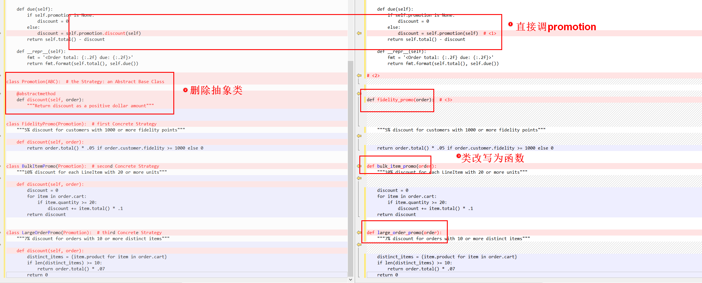
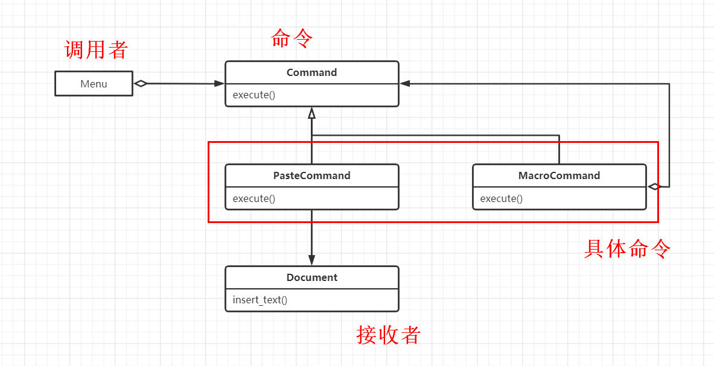

# 【Python】Python设计模式知多少


## 设计模式

设计模式是前辈们经过相当长的一段时间的试验和错误总结出来的最佳实践。我找到的资料列举了以下这些设计模式：工厂模式、抽象工厂模式、单例模式、建造者模式、原型模式、适配器模式、桥接模式、过滤器模式、组合模式、装饰器模式、外观模式、享元模式、代理模式、责任链模式、命令模式、解释器模式、迭代器模式、中介者模式、备忘录模式、观察者模式、状态模式、空对象模式、策略模式、模板模式、访问者模式、MVC模式、业务代表模式、组合实体模式、数据访问对象模式、前端控制器模式、拦截过滤器模式、服务定位器模式、传输对象模式，**共33种**。

这些设计模式在纯面向对象编程语言中使用最多。**Python拥有一等函数，既不需要使用某些设计模式，也减少了某些设计模式样板代码。**本文将使用一等函数实现策略模式和命令模式，研究Python代码是如何简化的。

## 策略模式

策略模式概述：“定义一系列算法，把它们一一封装起来，并且使它们可以相互替换。本模式使得算法可以独立于使用它的客户而变化。”

### 经典实现

示例，根据客户的属性或订单中的商品计算折扣，规则如下：

- 有1000或以上积分的客户，每个订单享5%折扣。
- 同一订单中，单个商品的数量达到20个或以上，享10%折扣。
- 订单中的不同商品达到10个或以上，享7%折扣。

这很适合用策略模式来做，UML类图设计如下：


- 上下文，集成算法的类，图中Order会根据不同的算法计算折扣。
- 策略，实现不同算法的组件的共同接口，图中Promotion是个抽象类。
- 具体策略，策略的具体子类，图中FidelityPromo、BulkItemPromo、LargeOrderPromo分别对应上面3条计算折扣规则。

代码实现如下：

```python
from abc import ABC, abstractmethod
from collections import namedtuple

Customer = namedtuple('Customer', 'name fidelity')


class LineItem:

    def __init__(self, product, quantity, price):
        self.product = product
        self.quantity = quantity
        self.price = price

    def total(self):
        return self.price * self.quantity


class Order:  # the Context

    def __init__(self, customer, cart, promotion=None):
        self.customer = customer
        self.cart = list(cart)
        self.promotion = promotion

    def total(self):
        if not hasattr(self, '__total'):
            self.__total = sum(item.total() for item in self.cart)
        return self.__total

    def due(self):
        if self.promotion is None:
            discount = 0
        else:
            discount = self.promotion.discount(self)
        return self.total() - discount

    def __repr__(self):
        fmt = '<Order total: {:.2f} due: {:.2f}>'
        return fmt.format(self.total(), self.due())


class Promotion(ABC):  # the Strategy: an Abstract Base Class

    @abstractmethod
    def discount(self, order):
        """Return discount as a positive dollar amount"""


class FidelityPromo(Promotion):  # first Concrete Strategy
    """5% discount for customers with 1000 or more fidelity points"""

    def discount(self, order):
        return order.total() * .05 if order.customer.fidelity >= 1000 else 0


class BulkItemPromo(Promotion):  # second Concrete Strategy
    """10% discount for each LineItem with 20 or more units"""

    def discount(self, order):
        discount = 0
        for item in order.cart:
            if item.quantity >= 20:
                discount += item.total() * .1
        return discount


class LargeOrderPromo(Promotion):  # third Concrete Strategy
    """7% discount for orders with 10 or more distinct items"""

    def discount(self, order):
        distinct_items = {item.product for item in order.cart}
        if len(distinct_items) >= 10:
            return order.total() * .07
        return 0
```

**实现策略模式的关键代码是Promotion类，它是一个抽象基类，通过继承abc.ABC来定义。**

测试下这段代码：

```python
>>> joe = Customer('John Doe', 0)  # 顾客joe积分0
>>> ann = Customer('Ann Smith', 1100)  # 顾客ann积分1100

## 测试第一条折扣规则
>>> cart = [LineItem('banana', 4, .5),  # 3类商品
...         LineItem('apple', 10, 1.5),
...         LineItem('watermellon', 5, 5.0)]
>>> Order(joe, cart, FidelityPromo())
<Order total: 42.00 due: 42.00>
>>> Order(ann, cart, FidelityPromo())  # 积分折扣
<Order total: 42.00 due: 39.90>

## 测试第二条折扣规则
>>> banana_cart = [LineItem('banana', 30, .5),  # 商品数量超过20
...                LineItem('apple', 10, 1.5)]
>>> Order(joe, banana_cart, BulkItemPromo())  # 数量折扣
<Order total: 30.00 due: 28.50>

## 测试第三条折扣规则
>>> long_order = [LineItem(str(item_code), 1, 1.0) # 10类不同商品
...               for item_code in range(10)]
>>> Order(joe, long_order, LargeOrderPromo())  # 种类折扣
<Order total: 10.00 due: 9.30>
>>> Order(joe, cart, LargeOrderPromo())
<Order total: 42.00 due: 42.00>
```

### 函数实现

现在开始使用Python函数改写代码。观察上文代码可以发现每个具体策略是一个类，类里面只有一个方法：discount()，并且没有属性。**看起来就像是普通的函数。**改造如下：



最关键的是，**删除了抽象类。**测试一下，函数拿来即用的美妙体验：

```python
>>> joe = Customer('John Doe', 0)
>>> ann = Customer('Ann Smith', 1100)

>>> cart = [LineItem('banana', 4, .5),
...         LineItem('apple', 10, 1.5),
...         LineItem('watermellon', 5, 5.0)]
>>> Order(joe, cart, fidelity_promo)  # 直接传函数名
<Order total: 42.00 due: 42.00>
>>> Order(ann, cart, fidelity_promo)
<Order total: 42.00 due: 39.90>

>>> banana_cart = [LineItem('banana', 30, .5),
...                LineItem('apple', 10, 1.5)]
>>> Order(joe, banana_cart, bulk_item_promo)  # 直接传函数名
<Order total: 30.00 due: 28.50>

>>> long_order = [LineItem(str(item_code), 1, 1.0)
...               for item_code in range(10)]
>>> Order(joe, long_order, large_order_promo)  # 直接传函数名
<Order total: 10.00 due: 9.30>
>>> Order(joe, cart, large_order_promo)
<Order total: 42.00 due: 42.00>
```

**函数的意义体现在：**


可以得出结论：**普通函数比只有一个方法的类使用起来更简单**。

### 选择最佳策略

继续看另外一个问题，从具体策略中选择最佳策略，本文示例就是要选择优惠最多的折扣，代码实现如下：

```python
promos = [fidelity_promo, bulk_item_promo, large_order_promo]

def best_promo(order):
    """Select best discount available
    """
    return max(promo(order) for promo in promos)

```

promos列表包含了三个具体策略。best_promo()函数先使用生成器表达式计算每个策略的折扣，再使用max()函数返回最大折扣。

测试一下：

```python
>>> Order(joe, long_order, best_promo)
<Order total: 10.00 due: 9.30>
>>> Order(joe, banana_cart, best_promo)
<Order total: 30.00 due: 28.50>
>>> Order(ann, cart, best_promo)
<Order total: 42.00 due: 39.90>
```

没有问题。但是存在一个**隐藏缺陷**：如果想要添加新的促销策略，那么要定义相应函数并添加到promos列表中。

### 添加新策略

接下来针对这个缺陷进行优化。

**方法一**

借助globals()函数自动找到其他可用的`*_promo`函数：

```python
promos = [globals()[name] for name in globals()
            if name.endswith('_promo')
            and name != 'best_promo']

def best_promo(order):
    """Select best discount available
    """
    return max(promo(order) for promo in promos)
```

> globals()返回一个字典，表示当前的全局符号表。这个符号表始终针对当前模块。对函数或方法来说，是指定义它们的模块，而不是调用它们的模块。
>

**方法二**

通过函数内省自动查找promotions模块中的所有函数作为策略函数（要求promotions模块中只能包含策略函数，不能包含其他函数）：

```python
promos = [func for name, func in
                inspect.getmembers(promotions, inspect.isfunction)]

def best_promo(order):
    """Select best discount available
    """
    return max(promo(order) for promo in promos)
```

inspect.getmembers()的第一个参数是目标模块（promotions模块），第二个参数是判断条件（只查找模块中的函数）。

**方法三**

装饰器，这个方法更优雅，在下篇文章讲到装饰器时，再给出代码实现。

## 命令模式

命令模式的目的是解耦调用操作的对象（调用者）和提供实现的对象（接收者）。

示例，菜单驱动文本编辑器，调用者是菜单，接收者是被编辑的文档。

UML类图设计如下：



命令模式的做法是在调用者和接收者之间放一个Command对象，让它实现只有一个execute()方法的接口，调用接收者中的方法执行具体命令。**这样调用者Menu不需要了解接收者Document的接口。**并且可以添加Command子类扩展多个不同的接收者。

使用一等函数对命令模式的优化思路：不为调用者提供一个Command对象，而是给它一个函数，调用者不用调command.execute()，直接调command()即可。这和策略模式是类似的，**把实现单方法接口的类的实例替换成可调用对象**。

注意，图中的MacroCommand是宏命令，可能保存一系列命令，它的execute()方法会在各个命令上调用相同的方法，在使用一等函数函数时，可以实现成定义了`__call__`方法的类：

```python
class MacroCommand:
    "一个执行一组命令的命令"
    
    def __init__(self, commands):
        self.commands = list(commands)
        
    def __call__(self):
        for command in self.commands:
            command()
```

毕竟，`__call__`使得每个Python可调用对象都实现了单方法接口。

## 小结

本文简单列举了33种设计模式，从两个经典的设计模式，策略模式和命令模式入手，介绍设计模式在Python中是如何实现的，借助函数是一等对象的这一特性，大大简化了代码。在此基础上，还能更Pythonic一点，那就是用函数装饰器和闭包。

> 参考资料：
>
> 《流畅的Python》
>
> https://www.runoob.com/design-pattern/design-pattern-tutorial.html
>
> https://blog.csdn.net/xldmx/article/details/112337759
>
> https://github.com/fluentpython/example-code/tree/master/06-dp-1class-func