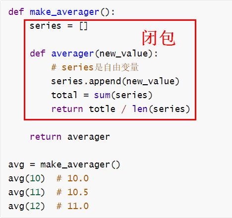

# 【Python】关于Python闭包的一切


任何把函数当做一等对象的语言，它的设计者都要面对一个问题：作为一等对象的函数在某个作用域中定义，但是可能会在其他作用域中调用，如何处理自由变量？

> 自由变量（free variable），未在局部作用域中绑定的变量。

为了解决这个问题，Python之父Guido Van Rossum设计了闭包，有如神来之笔，代码美学尽显。在讨论闭包之前，有必要先了解Python中的变量作用域。

## 变量作用域

先看一个**全局变量和自由变量**的示例：

```python
>>> b = 6
>>> def f1(a):
...     print(a)
...     print(b)
...     
>>> f1(3)
3
6

```

函数体外的b为全局变量，函数体内的b为自由变量。因为自由变量b**绑定**到了全局变量，所以在函数f1()中能正确print。

如果稍微改一下，那么函数体内的b就会从自由变量变成**局部变量**：

```python
>>> b = 6
def f1(a):
...     print(a)
...     print(b)
...     b = 9
...     
>>> f1(3)
3
Traceback (most recent call last):
  File "<input>", line 1, in <module>
  File "<input>", line 3, in f1
UnboundLocalError: local variable 'b' referenced before assignment

```

在函数f1()后面加上`b = 9`报错：局部变量b在赋值前进行了引用。

这不是缺陷，而是Python设计：**Python不要求声明变量，而是假定在函数定义体中赋值的变量是局部变量**。

如果想让解释器把b当做全局变量，那么需要使用global声明：

```python
>>> b = 6
>>> def f1(a):
...     global b
...     print(a)
...     print(b)
...     b = 9
...     
>>> f1(3)
3
6

```

## 闭包

回到文章开头的自由变量问题，假如有个叫做avg的函数，它的作用是计算系列值的均值，用类实现：

```python
class Averager():
    
    def __init__(self):
        self.series = []
        
    def __call__(self, new_value):
        self.series.append(new_value)
        total = sum(self.series)
        return totle / len(self.series)

avg = Averager()
avg(10)  # 10.0
avg(11)  # 10.5
avg(12)  # 11.0
```

**类实现不存在自由变量问题**，因为self.series是类属性。但是函数实现，进行函数嵌套时，问题就出现了：

```python
def make_averager():
    series = []
    
    def averager(new_value):
        # series是自由变量
        series.append(new_value)
        total = sum(series)
        return totle / len(series)
    
    return averager

avg = make_averager()
avg(10)  # 10.0
avg(11)  # 10.5
avg(12)  # 11.0
```

函数make_averager()在局部作用域中定义了series变量，它的内部函数averager()的自由变量series绑定了这个值。但是在调用avg(10)时，make_averager()函数已经return返回了，它的局部作用域也消失了。没有闭包的话，自由变量series一定会报错找不到定义。

那么闭包是怎么做的呢？**闭包是一种函数，它会保留定义时存在的自由变量的绑定，这样调用函数时，虽然定义作用域不可用了，但是仍然能使用那些绑定。**

如下图所示：



闭包会保留自由变量series的绑定，在调用avg(10)时继续使用这个绑定，即使make_averager()函数的局部作用域已经消失。

## nonlocal

把上面示例的需求稍微优化下，只存储目前的总值和元素个数：

```python
def make_averager():
    count = 0
    total = 0
    
    def averager(new_value):
        count += 1
        total += new_value
        return total / count
        
    return averager
```

运行后会报错：局部变量count在赋值前进行了引用。因为count +=1等同于count = count + 1，存在赋值，count就变成局部变量了。total也是如此。

这里如果把count和total通过global关键字声明为全局变量，显然是不合适的，它们作用域最多只扩展到make_averager()函数内。为了解决这个问题，Python3引入了nonlocal关键字声明：

```python
def make_averager():
    count = 0
    total = 0
    
    def averager(new_value):
        nonlocal count, total
        count += 1
        total += new_value
        return total / count
        
    return averager
```

**nonlocal的作用是把变量标记为自由变量，即使在函数中为变量赋值了，也仍然是自由变量。**

注意，对于列表、字典等可变类型来说，添加元素不是赋值，不会隐式创建局部变量。对于数字、字符串、元组等不可变类型以及**None**来说，赋值会隐式创建局部变量。示例：

```python
def make_averager():
    # 可变类型
    count = {}

    def averager(new_value):
        print(count)  # 成功
        count[new_value] = new_value
        return count

    return averager
```

**可变对象添加元素不是赋值，不会隐式创建局部变量。**

```python
def make_averager():
    # 不可变类型
    count = 1

    def averager(new_value):
        print(count)  # 报错
        count = new_value
        return count

    return averager
```

count是不可变类型，赋值会隐式创建局部变量，报错：局部变量count在赋值前进行了引用。

```python
def make_averager():
    # None
    count = None

    def averager(new_value):
        print(count)  # 报错
        count = new_value
        return count

    return averager
```

count是None，赋值会隐式创建局部变量，报错：局部变量count在赋值前进行了引用。

## 小结

本文先介绍了全局变量、自由变量、局部变量的概念，这是理解闭包的前提。闭包就是用来解决函数嵌套时，自由变量如何处理的问题，它会保留自由变量的绑定，即使局部作用域已经消失。对于不可变类型和None来说，赋值会隐式创建局部变量，把自由变量转换为局部变量，这可能会导致程序报错：局部变量在赋值前进行了引用。除了使用global声明为全局变量外，还可以使用nonlocal声明把局部变量强制变为自由变量，实现闭包。

> 参考资料：
>
> 《流畅的Python》 