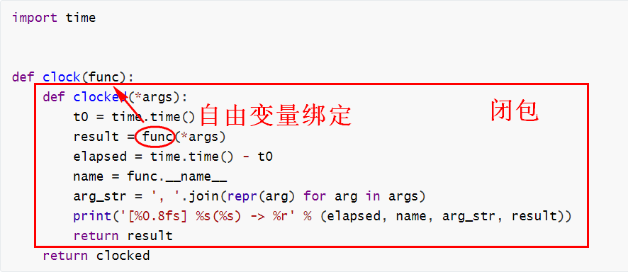
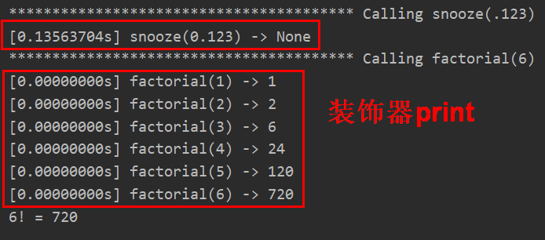

# 【Python】Python函数装饰器高级用法


在了解了Python函数装饰器基础知识和闭包之后，开始正式学习函数装饰器。

## 典型的函数装饰器

以下示例定义了一个装饰器，输出函数的运行时间：



函数装饰器和闭包紧密结合，入参func代表被装饰函数，通过自由变量绑定后，调用函数并返回结果。

使用clock装饰器：

```python
import time
from clockdeco import clock

@clock
def snooze(seconds):
    time.sleep(seconds)

@clock
def factorial(n):
    return 1 if n < 2 else n*factorial(n-1)

if __name__=='__main__':
    print('*' * 40, 'Calling snooze(.123)')
    snooze(.123)
    print('*' * 40, 'Calling factorial(6)')
    print('6! =', factorial(6))  # 6!指6的阶乘
```

输出结果：



**这是装饰器的典型行为：把被装饰的函数换成新函数，二者接受相同的参数，而且返回被装饰的函数本该返回的值，同时还会做些额外操作。**

值得注意的是factorial()是个递归函数，从结果来看，每次递归都用到了装饰器，打印了运行时间，这是因为如下代码：

```python
@clock
def factorial(n):
    return 1 if n < 2 else n*factorial(n-1)
```

等价于：

```python
def factorial(n):
    return 1 if n < 2 else n*factorial(n-1)
    
factorial = clock(factorial)
```

factorial引用的是clock(factorial)函数的返回值，也就是装饰器内部函数clocked，每次调用factorial(n)，执行的都是clocked(n)。

## 叠放装饰器

```python
@d1
@d2
def f():
    print("f")
```

等价于：

```python
def f():
    print("f")

f = d1(d2(f))
```

## 参数化装饰器

怎么让装饰器接受参数呢？答案是：创建一个装饰器工厂函数，把参数传给它，返回一个装饰器，然后再把它应用到要装饰的函数上。

示例如下：

```python

registry = set()

def register(active=True):
    def decorate(func):
        print('running register(active=%s)->decorate(%s)'
              % (active, func))
        if active:
            registry.add(func)
        else:
            registry.discard(func)

        return func
    return decorate

@register(active=False)
def f1():
    print('running f1()')

## 注意这里的调用
@register()
def f2():
    print('running f2()')

def f3():
    print('running f3()')
```

register是一个装饰器工厂函数，接受可选参数active默认为True，内部定义了一个装饰器decorate并返回。需要注意的是**装饰器工厂函数，即使不传参数，也要加上小括号调用**，比如`@register()`。

再看一个示例：

```python
import time

DEFAULT_FMT = '[{elapsed:0.8f}s] {name}({args}) -> {result}'

## 装饰器工厂函数
def clock(fmt=DEFAULT_FMT):
    # 真正的装饰器
    def decorate(func): 
        # 包装被装饰的函数
        def clocked(*_args):
            t0 = time.time()
            # _result是被装饰函数返回的真正结果
            _result = func(*_args)  
            elapsed = time.time() - t0
            name = func.__name__
            args = ', '.join(repr(arg) for arg in _args) 
            result = repr(_result) 
            # **locals()返回clocked的局部变量
            print(fmt.format(**locals()))  
            return _result 
        return clocked  
    return decorate 

if __name__ == '__main__':

    @clock()  
    def snooze(seconds):
        time.sleep(seconds)

    for i in range(3):
        snooze(.123)
```

这是给典型的函数装饰器添加了参数fmt，**装饰器工厂函数增加了一层嵌套，示例中一共有3个def**。

## 标准库中的装饰器

Python内置了三个用于装饰方法的函数：property、classmethod和staticmethod，这会在将来的文章中讲到。本文介绍functools中的三个装饰器：functools.wraps、functools.lru_cache和functools.singledispatch。

### functools.wraps

Python函数装饰器在实现的时候，被装饰后的函数其实已经是另外一个函数了（函数名等函数属性会发生改变），为了不影响，Python的functools包中提供了一个叫wraps的装饰器来消除这样的副作用（它能保留原有函数的名称和函数属性）。

示例，不加wraps：

```python
def my_decorator(func):
    def wrapper(*args, **kwargs):
        '''decorator'''
        print('Calling decorated function...')
        return func(*args, **kwargs)
    return wrapper

@my_decorator
def example():
    """Docstring"""
    print('Called example function')

print(example.__name__, example.__doc__)
## 输出wrapper decorator
```

加wraps：

```python
import functools


def my_decorator(func):
    @functools.wraps(func)
    def wrapper(*args, **kwargs):
        '''decorator'''
        print('Calling decorated function...')
        return func(*args, **kwargs)
    return wrapper

@my_decorator
def example():
    """Docstring"""
    print('Called example function')

print(example.__name__, example.__doc__)
## 输出example Docstring
```

### functools.lru_cache

lru是Least Recently Used的缩写，它是一项优化技术，把耗时的函数的结果保存起来，避免传入相同的参数时重复计算。

示例：

```python
import functools

from clockdeco import clock

@functools.lru_cache()
@clock
def fibonacci(n):
    if n < 2:
        return n
    return fibonacci(n-2) + fibonacci(n-1)

if __name__=='__main__':
    print(fibonacci(6))
```

优化了**递归**算法，执行时间会减半。

注意，lru_cache可以使用两个可选的参数来配置，它的签名如下：

```python
functools.lru_cache(maxsize=128, typed=False)
```

- maxsize：最大存储数量，缓存满了以后，旧的结果会被扔掉。
- typed：如果设为True，那么会把不同参数类型得到的结果分开保存，即把通常认为相等的浮点数和整型参数（如1和1.0）区分开。

### functools.singledispatch

Python3.4的新增语法，可以用来优化函数中的大量`if/elif/elif`。使用`@singledispatch`装饰的普通函数会变成泛函数：根据**第一个参数的类型**，以不同方式执行相同操作的一组函数。所以它叫做single dispatch，单分派。

> 根据多个参数进行分派，就是多分派了。

示例，生成HTML，显示不同类型的Python对象：

```python
import html


def htmlize(obj):
    content = html.escape(repr(obj))
    return '<pre>{}</pre>'.format(content)
```

因为Python不支持重载方法或函数，所以就不能使用不同的签名定义htmlize的变体，只能把htmlize变成一个分派函数，使用`if/elif/elif`，调用专门的函数，比如htmlize_str、htmlize_int等。时间一长htmlize会变得很大，跟各个专门函数之间的耦合也很紧密，不便于模块扩展。

`@singledispatch`经过深思熟虑后加入到了标准库，来解决这类问题：

```python
from functools import singledispatch
from collections import abc
import numbers
import html

@singledispatch
def htmlize(obj):
    # 基函数 这里不用写if/elif/elif来分派了
    content = html.escape(repr(obj))
    return '<pre>{}</pre>'.format(content)

@htmlize.register(str)
def _(text):
    # 专门函数
    content = html.escape(text).replace('\n', '<br>\n')
    return '<p>{0}</p>'.format(content)

@htmlize.register(numbers.Integral) 
def _(n):
    # 专门函数
    return '<pre>{0} (0x{0:x})</pre>'.format(n)

@htmlize.register(tuple)
@htmlize.register(abc.MutableSequence)
def _(seq):
    # 专门函数
    inner = '</li>\n<li>'.join(htmlize(item) for item in seq)
    return '<ul>\n<li>' + inner + '</li>\n</ul>'
```

`@singledispatch`装饰了基函数。专门函数使用`@<<base_function>>.register(<<type>>)`装饰，它的名字不重要，命名为`_`，简单明了。

这样编写代码后，Python会根据第一个参数的类型，调用相应的专门函数。

## 小结

本文首先介绍了典型的函数装饰器：把被装饰的函数换成新函数，二者接受相同的参数，而且返回被装饰的函数本该返回的值，同时还会做些额外操作。接着介绍了装饰器的两个高级用法：叠放装饰器和参数化装饰器，它们都会增加函数的嵌套层级。最后介绍了3个标准库中的装饰器：保留原有函数属性的functools.wraps、缓存耗时的函数结果的functools.lru_cache和优化`if/elif/elif`代码的functools.singledispatch。

> 参考资料：
>
> 《流畅的Python》
>
> https://github.com/fluentpython/example-code/tree/master/07-closure-deco
>
> https://blog.csdn.net/liuzonghao88/article/details/103586634