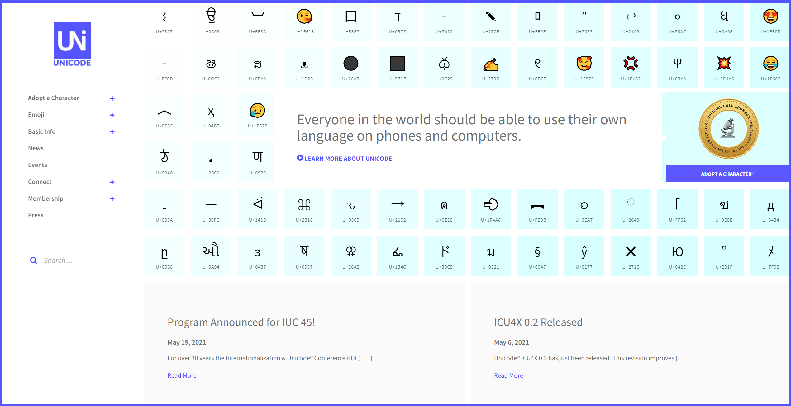
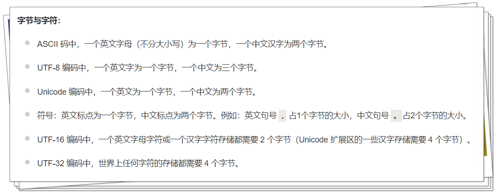

# 【Python】Python字符与字节新编


## 字符

字符是一个信息单位，简单来讲就是一个字母、数字、标点符号、汉字等。

字符的最佳定义是Unicode字符：



它是一个全球化的标准，能表示世界上所有语言的字符。Unicode字符的标识（码位）是以4~6个十六进制数字表示的，并且加前缀`U+`。

## 字节

字节是计算机信息计量单位，一个字节代表八个比特，存储的数值范围为0~255。

> 字节跳动（ByteDance）互联网公司的字节就是这个字节。
>

**字节是机器的，字符是人类的。**

把人类字符转换为机器字节时使用的算法叫做编码，反之叫做解码。

算法不同，字节与字符的关系也不同：



## bytes和bytearray

字节实际上是个二进制序列。不可变bytes类型和可变bytearray类型是用来存储二进制序列的，它们的示例如下：

```python
>>> cafe = bytes("café", encoding="utf_8")
>>> cafe
b'caf\xc3\xa9'
>>> cafe[0]
99
>>> cafe[:1]
b'c'
>>> cafe_arr = bytearray(cafe)
>>> cafe_arr
bytearray(b'caf\xc3\xa9')
>>> cafe_arr[-1:]
bytearray(b'\xa9')
```

特别的是cafe[0]返回了整数，cafe[:1]返回了二进制序列，这是因为**s[0] == s[:1]只对str类型成立**，而对于其他类型来说，s[i]返回一个元素，s[i:i+1]返回一个相同类型的序列。

二进制序列实际上是整数序列。它们的字面量表示法包含ASCII字符（ASCII只能表示英文体系的字符），比如cafe的`b'caf\xc3\xa9'`，具体规则是：

- 从空格到`~`的字符直接使用ASCII字符
- 制表符`\t`、换行符`\n`、回车符`\r`、转义符`\\`
- 其他字符用十六进制转义序列，比如`\x00`空字节

构建bytes和bytearray对象的方式有以下几种：

1. 一个str对象和一个encoding关键字参数
2. 一个可迭代对象，数值在0~255
3. 一个实现了缓冲协议的对象，如bytes、bytearray、memoryview、array.array

## memoryview和struct

memoryview允许在二进制数据结构之间共享内存，struct能从序列中提取结构化信息。

示例如下，提取一个GIF图像的宽度和高度：

```python
import struct

with open("filter.gif", "rb") as fp:
    img = memoryview(fp.read())

## 这里不会复制字节序列，因为用的memoryview
header = img[:10]
print(bytes(header))  # b'GIF89a+\x02\xe6\x00'

## <是小字节序，3s3s是两个3字节序列，HH是两个16位二进制整数
## 类型、版本、宽度、高度
struct.unpack("<3s3sHH", header)  # (b'GIF', b'89a', 555, 230)

## 删除引用，释放memoryview实例所占的内存
del header
del img
```

## 小结

本文介绍了字符和字节的概念以及它们之间的关系，一个字符对应一个或多个字节。字符是人类的，字节是机器的，编码就是人类字符转换为机器字节，反之叫做解码。然后分别介绍了二进制序列的类型bytes和bytearray，和二进制序列的工具memoryview和struct。

> 参考资料：
>
> 《流畅的Python》
>
> http://www.ruanyifeng.com/blog/2007/10/ascii_unicode_and_utf-8.html
>
> https://zh.wikipedia.org/wiki/%E5%AD%97%E7%AC%A6_(%E8%AE%A1%E7%AE%97%E6%9C%BA%E7%A7%91%E5%AD%A6)
>
> https://home.unicode.org/
>
> https://zh.wikipedia.org/wiki/%E5%AD%97%E8%8A%82
>
> https://www.runoob.com/w3cnote/byte-character.html