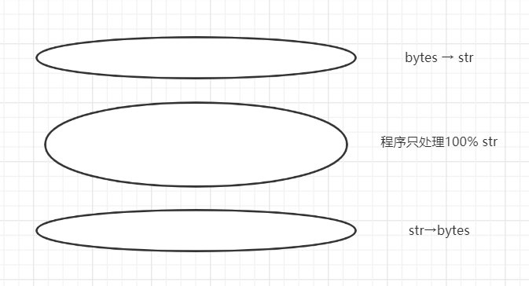

# 【Python】Python编解码问题与文本文件处理


## 编解码器

在字符与字节之间的转换过程称为编解码，Python自带了超过100种编解码器，比如：

- ascii（英文体系）
- gb2312（中文体系）
- utf-8（全球通用）
- latin1
- utf-16

> 编解码器一般有多个别名，比如`utf8`、`utf-8`、`U8`。

这些编解码器可以传给open()、str.encode()、bytes.decode()等函数的encoding参数。

## UnicodeEncodeError

多数非UTF编解码器（比如cp437）只能处理Unicode字符的一小部分子集。把字符转换成字节时，如果目标编码中没有定义这个字符，那么就会抛出UnicodeEncodeError异常。

处理方式一：使用utf8编码。

处理方式二：添加errors参数：

```python
## 忽略 如b'So Paulo'
city.encode("cp437", errors="ignore")
## 替换为? 如b'S?o Paulo'
city.encode("cp437", errors="replace")
## 替换为XML实体 如b'S&#227;o Paulo'
city.encode("cp437", errors="xmlcharrefreplace")
```

## UnicodeDecodeError

把字节转换为字符时，遇到无法转换的字节时会抛出UnicodeDecodeError异常。这是因为不是每个字节都包含有效的ASCII字符，也不是每个字符都是有效的UTF-8。

处理方式也有两种，跟上面一样。

## SyntaxError

Python3默认使用UTF-8编码源码。如果加载的.py模块中包含UTF-8之外的数据，而且没有声明编码，就会抛出SyntaxError异常。

处理方式是在文件顶部添加coding注释：

```python
## coding: cp1252
```

但是这个办法并不好，最好还是找到这些报错字符，把它们转换为UTF-8。

> 从网上直接复制代码到IDE中执行经常会报这个错。

## 处理文本文件

Unicode三明治：



在程序中尽量少接触二进制，把字节解码为字符，只处理字符串对象。比如在Django中，view应该输出Unicode字符串，Django会负责把响应数据编码成字节序列，而且默认使用UTF-8编码。

Python内置的open函数就是采用了这个原则，在读取文件时会做必要的解码，以文本模式写入文件时会做必要的编码。

## 文件乱码

Windows更容易遇到这个问题，因为Windows并不是统一的UTF-8编码，比如在Windows10中：

```python
>>> open("cafe.txt", "w", encoding="utf8").write("café")
4
>>> open("cafe.txt").read()
'caf茅'
```

写入文件时指定了utf8，但是读取文件没有指定，Python就会使用系统默认编码：

```python
>>> import locale
## 打开文件用这个
## 如果没有设置PYTHONENCODING环境变量，sys.stdout/stdin/stderr也用这个
>>> locale.getpreferredencoding()
'cp936'
```

`cp936`把最后一个字节解码成了`茅`而不是`é`。

>
> ```python
> >>> import sys
> # 二进制数据和字符串之间转换用这个
> >>> sys.getdefaultencoding()
> 'utf-8'
> ```
>
> ```python
> >>> import sys
> # 文件名（不是文件内容）用这个
> >>> sys.getfilesystemencoding()
> 'utf-8'
> ```
>

GNU/Linux或Mac OS X不会遇到这个问题，因为多年来它们的默认编码都是UTF-8。

解决办法是一定不能依赖系统默认编码，**打开文件时始终应该明确传入encoding=参数**，因为不同的设备使用的默认编码可能不同，有时隔一天也会发生变化。

## 小结

本文介绍了Python的编解码器，以及可能出现的UnicodeEncodeError、UnicodeDecodeError、SyntaxError问题，然后给出了Python的open函数处理文本文件的原则，最后对Windows容易出现的文件乱码问题进行了说明。

> 参考资料：
>
> 《流畅的Python》

