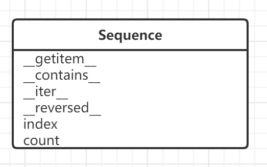
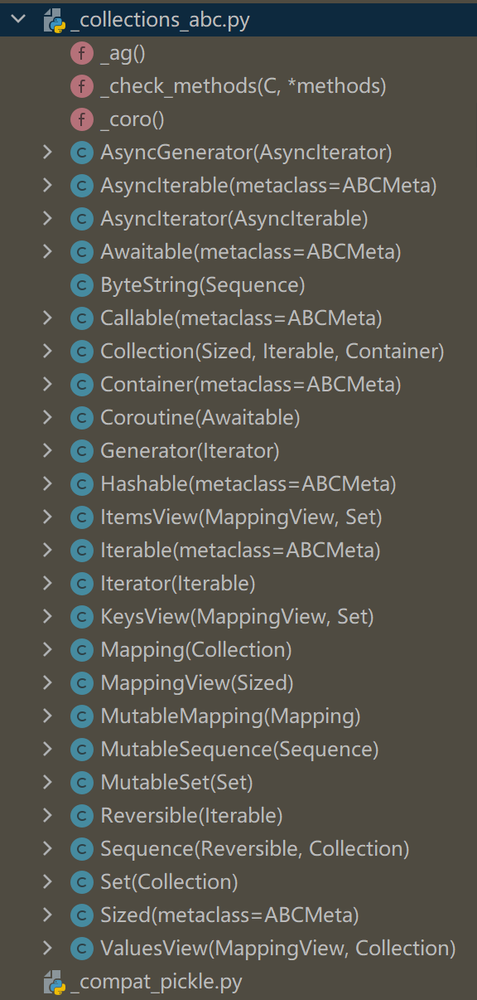

# 【Python】Python中的接口协议和抽象基类


## Python接口与协议

**Python语言是没有interface关键字的**，这也是动态类型语言的特点之一。Python的接口指的是类实现或继承的公开属性，包括数据或方法。比如Sequence的正式接口如下图所示：



这些都叫做Python接口。事实上，Python每个类都有接口，**除了抽象基类**。

**接口是正式的**，它定义了类具有哪些属性，**协议是非正式的接口**，只由文档和约定定义。比如只要类实现了`__getitem__`方法，按照序列协议的约定，Python就会支持这个类完成访问元素、迭代和使用in运算符等一系列操作。

## 猴子补丁

我们可以通过猴子补丁来进一步认识，Python中协议的约定是怎么回事。猴子补丁是这样一种技术：**在运行时修改类或模块，而不改动源码**。还是以序列协议来举例，比如：

```python
>>> from random import shuffle
>>> from frenchdeck import FrenchDeck
>>> deck = FrenchDeck()
>>> shuffle(deck)
```

假设运行报错了：`TypeError: 'FrenchDeck' object does not support item assignment`，因为FrenchDeck类只有`__getitem__`方法，只实现了**不可变的序列协议**。为了解决这个报错，需要通过`__setitem__`方法实现**可变的序列协议**。

代码如下：

```python
def set_card(deck, position, card):
    deck._cards[position] = card

FrenchDeck.__setitem__ = set_card
shuffle(deck)
```

这就是一段猴子补丁技术的实现代码，没有修改FrenchDeck类的源码，而是在运行时动态修改。

## 抽象基类

Python的抽象基类是指**必须让继承它的子类去实现它所要求的方法**的类。Python的collections.abc模块中就定义了很多抽象基类：



虽然我们在实际编程中并不会自己编写抽象基类（一般也不建议这样做，因为可能会导致意想不到的问题），但是了解抽象基类，可以帮助我们更好理解Python面向对象的继承等概念。

**抛开枯燥的理论知识，我在书中找到了一处具有实践价值的片段：**

**「在一连串if/elif/elif中使用isinstance做检查，然后根据对象的类型执行不同的操作，通常是不好的做法；此时应该使用多态，即采用一定的方式定义类，让解释器把调用分派给正确的方法，而不使用if/elif/elif块硬编码分派逻辑。」**

交流群和公司都有人问过我这个问题，写了太多的ifelse有没有更好的实现方式，我想这里已经给出了答案。

## 鸭子类型和白鹅类型

Python鸭子类型是指对象的类型无关紧要，只要实现了特定的协议即可。它的好处是避免过多的isinstance，如果遵守既定协议，能增加利用现有的标准库和第三方代码的可能性。示例：

```python
class Animal(object):
    
    def run(self):
        print("The animal is running...")

class Dog(Animal):

    def run(self):
        print('The dog is running...')

class Cat(Animal):

    def run(self):
        print('The cat is running...')

def make_run(animal):
    animal.run()

dog = Dog()
cat = Cat()
make_run(dog)
make_run(cat)
```

对于 `make_run()` 函数来说，传入的参数并不一定需要是 `Animal` 类型的，只需要保证传入的对象有一个 `run()` 方法即可。

白鹅类型是指只要cls是抽象基类（即cls的元类是abc.ABCMeta），就可以使用isinstance(obj, cls)。它的基本特性是，即便不继承，也有办法把一个类注册为抽象基类的虚拟子类。Python不会检查虚拟子类是否实现了抽象基类要求实现的方法，而是由我们自己保证，并捕获异常。具体会在下篇文章《Python抽象基类的定义与使用》进行介绍。

> 参考资料：
>
> 《流畅的Python》第11章 接口：从协议到抽象基类