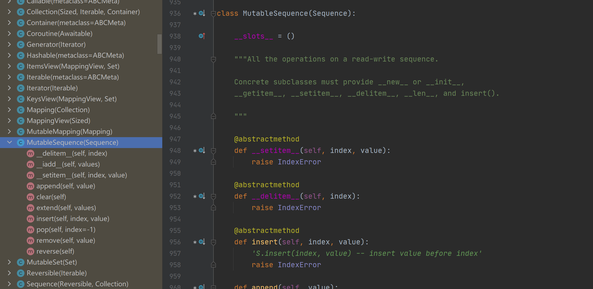
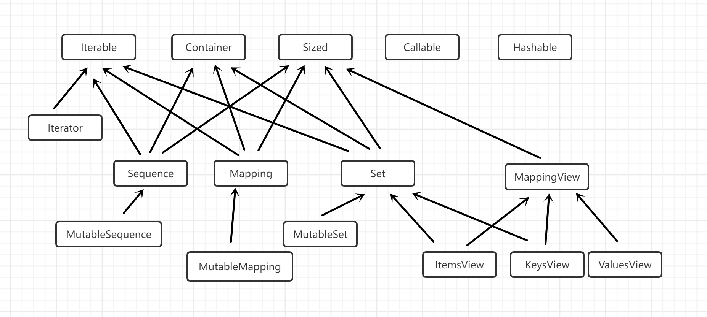

# 【Python】Python抽象基类的定义与使用


**我们写Python基本不需要自己创建抽象基类，而是通过鸭子类型来解决大部分问题。**《流畅的Python》作者使用了15年Python，但只在项目中创建过一个抽象基类。我们更多时候是创建现有抽象基类的子类，或者使用现有的抽象基类注册。**本文的意义在于**，了解抽象基类的定义与使用，可以帮助我们理解抽象基类是如何实现的，为我们以后学习后端语言（比如Java、Golang）打下基础。**毕竟抽象基类是编程语言通用设计。**

## 定义抽象基类的子类

先回顾下什么是抽象基类：Python的抽象基类是指必须让继承它的子类去实现它所要求的抽象方法的类。如下代码定义了抽象基类collections.MutableSequence的子类：

```python
import collections

Card = collections.namedtuple('Card', ['rank', 'suit'])

class FrenchDeck2(collections.MutableSequence):
    ranks = [str(n) for n in range(2, 11)] + list('JQKA')
    suits = 'spades diamonds clubs hearts'.split()

    def __init__(self):
        self._cards = [Card(rank, suit) for suit in self.suits
                                        for rank in self.ranks]

    def __len__(self):
        return len(self._cards)

    def __getitem__(self, position):
        return self._cards[position]

    def __setitem__(self, position, value):  # <1>
        self._cards[position] = value

    def __delitem__(self, position):  # <2>
        del self._cards[position]

    def insert(self, position, value):  # <3>
        self._cards.insert(position, value)
```

通过抽象基类collections.MutableSequence源码：



可以发现，它有三个抽象方法`__setitem__`、`__delitem__`、`insert`，所以FrenchDeck2类必须实现它们。而对于其他非抽象方法比如`append`、`extend`、`pop`等，则可以直接继承无需实现。

> 注意，Python只会在运行时实例化FrenchDeck2类时真正检查抽象方法的实现，如果未实现会抛出TypeError异常，提示Can't instantiate abstract class之类的。

## 标准库中的抽象基类

为了知道哪些抽象基类可以使用，我们可以看看标准库。

### collections.abc

collections.abc的抽象基类如下图所示：

### 

**Iterable、Container、Sized**

这三个抽象基类是最基础的类，各个集合都继承了这三个抽象基类。

- Itearble通过`__iter__`方法支持迭代
- Container通过`__contains__`方法支持in运算符
- Sized通过`__len__`方法支持len()函数

**Sequence、Mapping、Set**

不可变集合类型，各自都有可变的子类。

**MappingView**

`.items()`、`.keys()`、`.values()`返回的对象分别是ItemsView、KeysView和ValuesView的实例。

**Callable、Hashable**

为内置函数isinstance提供支持，判断对象能不能调用或散列。

**Iterator**

迭代器。

### numbers

numbers的抽象基类有以下几种：

- Number
- Complex
- Real
- Rational
- Integral

这叫做**数字塔**，顶部是超类，底部是子类。比如使用`isinstance(x, numbers.Integral)`检查一个数是不是整数，这样代码就能接受int、bool（int的子类），再比如使用`isinstance(x, numbers.Real)`检查浮点数，这样代码就能接受bool、int、float、fractions.Fraction。

## 定义抽象基类

**本小结可以跳过。**不过了解抽象基类的定义有助于阅读标准库和其他包中的抽象基类源码。

抽象基类的示例代码如下：

```python
## BEGIN TOMBOLA_ABC

import abc

class Tombola(abc.ABC):  # <1>

    @abc.abstractmethod
    def load(self, iterable):  # <2>
        """Add items from an iterable."""

    @abc.abstractmethod
    def pick(self):  # <3>
        """Remove item at random, returning it.
        This method should raise `LookupError` when the instance is empty.
        """

    def loaded(self):  # <4>
        """Return `True` if there's at least 1 item, `False` otherwise."""
        return bool(self.inspect())  # <5>


    def inspect(self):
        """Return a sorted tuple with the items currently inside."""
        items = []
        while True:  # <6>
            try:
                items.append(self.pick())
            except LookupError:
                break
        self.load(items)  # <7>
        return tuple(sorted(items))


## END TOMBOLA_ABC
```

要点：

1. 继承abc.ABC
2. 使用`@abc.abstractmethod`装饰器标记抽象方法
3. 抽象基类也可以包含普通方法
4. 抽象基类的子类必须覆盖**抽象方法**（普通方法可以不覆盖），可以使用super()函数调用抽象方法，为它添加功能，而不是从头开始实现

## 再看白鹅类型

白鹅类型的定义有一点难以理解，如果理解了虚拟子类，就能加快理解白鹅类型。虚拟子类并不是抽象基类的真正子类，而是注册到抽象基类上的子类，这样Python就不会做强制检查了。

注册的方式有两种：

**register方法**

Python3.3以前只能使用register方法，比如collections.abc模块的源码中，把内置类型tuple、str、range和memoryview注册为Sequence的虚拟子类：

```
Sequence.register(tuple)
Sequence.register(str)
Sequence.register(range)
Sequence.register(memoryview)
```

**register装饰器**

把TomboList注册为Tombola的虚拟子类：

```
@Tombola.register
class TomboList(list):
    ...
```

**白鹅类型和鸭子类型是Python的动态特性，它们的共同点是，只要长的像，Python就不会做强制检查，鸭子类型是针对普通类的子类而言的，白鹅类型是针对抽象基类的虚拟子类而言的。**

> 参考资料：
>
> 《流畅的Python》第11章 接口：从协议到抽象基类