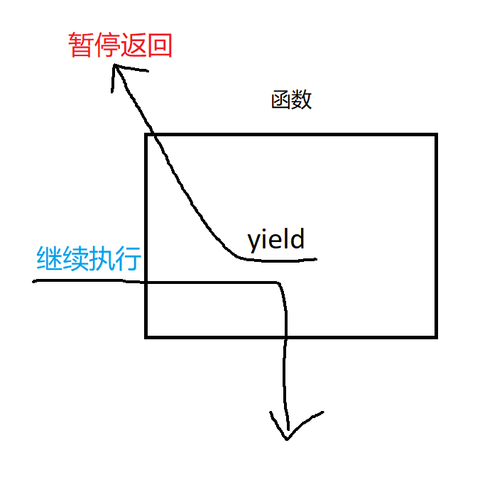
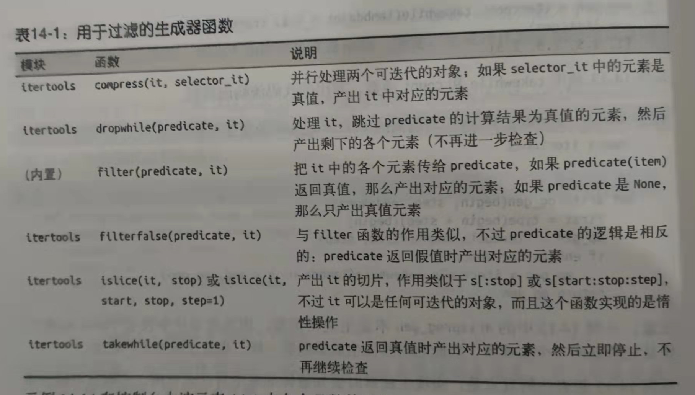
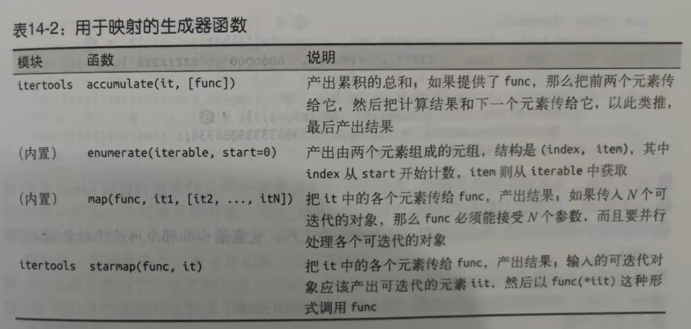
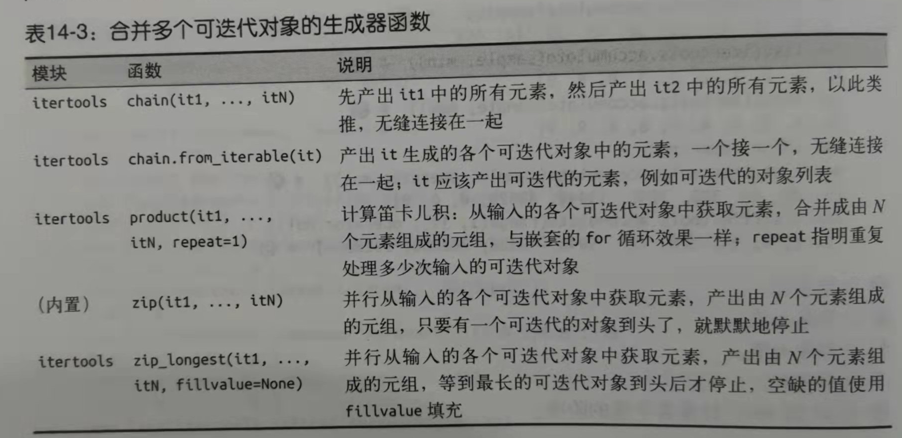
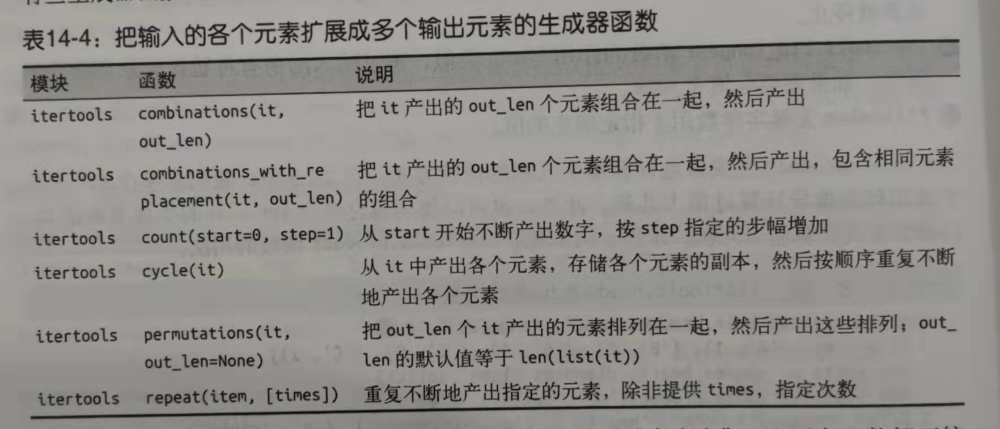

# 【Python】长篇大论Python生成器


## Python生成器是什么

一句话解释：**包含了yield关键字的函数就是生成器，它的返回值是一个生成器对象**。我简单画了个示意图：



- yield相当于return。
- 函数遇到yield就暂停，保存当前信息，返回yield的值。
- 在下次执行next()时，从当前位置继续执行。

> 比较有意思的事情是，曾经有人建议生成器函数不应该使用def，而应该发明一个新的关键字比如gen，但是Python之父Guido并没有同意这样做。

## 生成器函数的工作原理

先通过一个简单示例来说明生成器的行为：

```python
## 定义一个生成器
>>> def gen_123():
...     yield 1
...     yield 2
...     yield 3
...

## 生成器本身是个函数
>>> gen_123
<function gen_123 at 0x0000019F60710790>

## 返回值是生成器对象
>>> gen_123()
<generator object gen_123 at 0x0000019F606AC040>

## 生成器也是迭代器
>>> for i in gen_123():
...     print(i)
...     
1
2
3

## 验证生成器也是迭代器，定义迭代器g
>>> g = gen_123()

## 可以通过next()获取yield生成的下一个元素
>>> next(g)
1
>>> next(g)
2
>>> next(g)
3
>>> next(g)
Traceback (most recent call last):
  File "<input>", line 1, in <module>
StopIteration

```

生成器的原理就是：

1. 生成器函数会创建一个生成器对象。
2. 把生成器传给next()函数时，生成器函数会执行函数定义体中的下一个yield语句，返回产出的值，并在当前位置暂停。
3. 函数的定义体返回时，外层的生成器对象会抛出StopIteration异常

yield关键字一般是和for循环搭配使用的，在for循环中会隐式调用next()函数。

**生成器的作用其实是解决内存的问题，比如我们都知道Python的正则表达式有一个`re.findall()`函数，它会把所有匹配到的元素都一次性写入内存中，假如匹配到的数据很多，就会占用大量的内存。为了解决这个问题，Python3有一个`re.finditer()`函数，返回的就是一个生成器，取值时才生成数据放入内存中，能节省大量内存。**

## 标准库中的生成器函数

实现生成器时要知道标准库中有什么可用，否则很可能会重新发明轮子。有些是内置的，有些在itertools模块中，有些functools模块中。

**用于过滤的生成器函数**

从输入的可迭代对象中产出元素的子集，而且不修改元素本身。



**用于映射的生成器函数**

在输入的单个可迭代对象中的各个元素上做计算，然后返回结果。



**合并多个可迭代对象的生成器函数**

从输入的多个可迭代对象中产出元素。



**把输入的各个元素扩展成多个输出元素的生成器函数**

从一个元素中产出多个值，扩展输入的可迭代对象。



**用于重新排列元素的生成器函数**

产出输入的可迭代对象中的全部元素，不过会以某种方式重新排列。


## yield from

yield from是Python3.3新出现的句法，它的作用是把不同的生成器结合在一起使用。

比如生成器函数需要产出另一个生成器生成的值，传统的解决办法是使用for循环：

```python
def chain(*iterables):
    for it in iterables:
        for i in it:
            yield i

s = "ABC"
t = tuple(range(3))
print(list(chain(s, t)))  # ["A", "B", "C", 0, 1, 2]
```

改成yield from：

```python
def chain(*iterables):
    for it in iterables:
        yield from i
```

完全代替了内层的for循环。

> 参考资料：
>
> 《流畅的Python》第14章 可迭代的对象、迭代器和生成器
>
> https://www.runoob.com/python3/python3-iterator-generator.html

