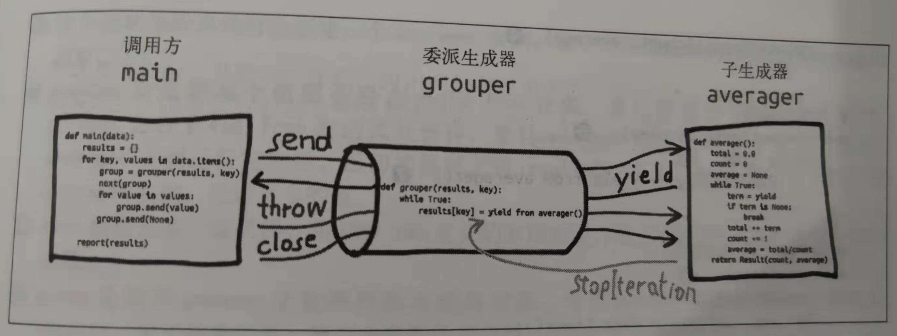

# 【Python】Python协程知多少


从概念上来说，我们都知道多进程和多线程，而协程其实是**在单线程中实现多并发**。从句法上看，协程与生成器类似，都是定义体中包含yield关键字的函数。区别在于协程的yield通常出现在表达式的右边：`datum = yield`。这一下就让初学者瞬间觉得yield关键字不香了，本来以为yield就是简简单单的暂停执行顺手返回个值，结果还能放右边？

## 从生成器到协程

先看一个可能是协程最简单的使用示例：

```python
>>> def simple_coroutine():
...     print("-> coroutine started")
...     x = yield
...     print("-> coroutine received:", x)
...     
>>> my_coro = simple_coroutine()
>>> my_coro
<generator object simple_coroutine at 0x0000019A681F27B0>
>>> next(my_coro)
-> coroutine started
>>> my_coro.send(42)
-> coroutine received: 42
Traceback (most recent call last):
  File "<input>", line 1, in <module>
StopIteration
```

之所以yield可以放右边，是因为协程可以接收调用方使用`.send()`推送的值。

yield放在右边以后，它的右边还能再放个表达式，请看下面这个例子：

```python
def simple_coro2(a):
    b = yield a
    c = yield a + b

my_coro2 = simple_coro2(14)
next(my_coro2)
my_coro2.send(28)
my_coro2.send(99)
```

执行过程是：

1. 调用next(my_coro2)，执行yield a，产出14。
2. 调用my_coro2.send(28)，把28赋值给b，然后执行yield a + b，产出42。
3. 调用my_coro2.send(99)，把99赋值给c，协程终止。

由此得出结论，**对于b = yield a这行代码来说，= 右边的代码在赋值之前执行**。

在示例中，需要先调用`next(my_coro)`启动生成器，让程序在yield语句处暂停，然后才可以发送数据。这是因为协程有四种状态：

- 'GEN_CREATED' 等待开始执行
- 'GEN_RUNNING' 解释器正在执行
- 'GEN_SUSPENDED' 在yield表达式处暂停
- 'GEN_CLOSED' 执行结束

只有在GEN_SUSPENDED状态才能发送数据，提前做的这一步叫做**预激**，既可以调用`next(my_coro)`预激，也可以调用`my_coro.send(None)`预激，效果一样。

## 预激协程

协程必须预激才能使用，也就是send前，先调用next，让协程处于GEN_SUSPENDED状态。但是这件事经常会忘记。为了避免忘记，可以定义一个预激装饰器，比如：

```python
from functools import wraps

def coroutine(func):
    @wraps(func)
    def primer(*args, **kwargs):
        gen = func(*args, **kwargs)
        next(gen)
        return gen
    return primer
```

但实际上Python给出了一个更优雅的方式，叫做yield from，它会自动预激协程。

> 自定义预激装饰器和yield from是不兼容的。

## yield from

yield from相当于其他语言中的await关键字，作用是：在生成器gen中使用yield from subgen()时，subgen会获得控制权，把产出的值传给gen的调用方，即调用方可以直接控制subgen。与此同时，gen会阻塞，等待subgen终止。

yield from可以用来简化for循环中的yield：

```python
for c in "AB":
    yield c
```

```python
yield from "AB"
```

yield from x表达式对x做的第一件事就是，调用iter(x)，从中获取迭代器。

但yield from的作用远不止于此，它更重要的作用是**打开双向通道**。如下图所示：



这个图信息量很大，很难理解。

首先要理解这**3个概念**：调用方、委派生成器、子生成器。

- 调用方

  说白了就是main函数，也就是众所周知的程序入口**main函数**。

  ```python
  # the client code, a.k.a. the caller
  def main(data):  # <8>
      results = {}
      for key, values in data.items():
          group = grouper(results, key)  # <9>
          next(group)  # <10>
          for value in values:
              group.send(value)  # <11>
          group.send(None)  # important! <12>
  
      # print(results)  # uncomment to debug
      report(results)
  ```

- 委派生成器

  就是包含了yield from语句的函数，也就是**协程**。

  ```python
  # the delegating generator
  def grouper(results, key):  # <5>
      while True:  # <6>
          results[key] = yield from averager()  # <7>
  ```

- 子生成器

  就是**yield from语句右边跟着的子协程**。

  ```python
  # the subgenerator
  def averager():  # <1>
      total = 0.0
      count = 0
      average = None
      while True:
          term = yield  # <2>
          if term is None:  # <3>
              break
          total += term
          count += 1
          average = total/count
      return Result(count, average)  # <4>
  ```

这比术语看着舒服多了。

然后是**5条线**：send、yield、throw、StopIteration、close。

- send

  **协程**在yield from表达式处暂停时，**main函数**可以通过yield from表达式把数据发给**yield from语句右边跟着的子协程**。

- yield

  **yield from语句右边跟着的子协程**再把产出的值通过yield from表达式发给**main函数**。

- throw

  main函数通过`group.send(None)`，传入一个None值，让**yield from语句右边跟着的子协程**的while循环终止，这样控制权才会交回**协程**，才能继续执行，否则会一直暂在yield from语句暂停。

- StopIteration

  **yield from语句右边跟着的生成器函数**返回之后，解释器会抛出StopIteration异常。并把返回值附加到异常对象上，此时**协程**会恢复。

- close

  **main函数**执行完以后，会调用close()方法退出协程。

大体流程搞清楚了，更多的技术细节就不继续研究了，有时间的话，在以后的Python原理系列中再学习吧。

yield from经常与Python3.4标准库里的`@asyncio.coroutine`装饰器结合使用。

## 协程用作累加器

这是协程的常见用途，代码如下：

```python
def averager():
    total = 0.0
    count = 0
    average = None
    while True:  # <1>
        term = yield average  # <2>
        total += term
        count += 1
        average = total/count
```

## 协程实现并发

这里例子有点复杂，源码地址是：

https://github.com/fluentpython/example-code/blob/master/16-coroutine/taxi_sim.py

核心代码片段是：

```python
## BEGIN TAXI_PROCESS
def taxi_process(ident, trips, start_time=0):  # <1>
    """Yield to simulator issuing event at each state change"""
    time = yield Event(start_time, ident, 'leave garage')  # <2>
    for i in range(trips):  # <3>
        time = yield Event(time, ident, 'pick up passenger')  # <4>
        time = yield Event(time, ident, 'drop off passenger')  # <5>

    yield Event(time, ident, 'going home')  # <6>
    # end of taxi process # <7>
## END TAXI_PROCESS
```

```python
def main(end_time=DEFAULT_END_TIME, num_taxis=DEFAULT_NUMBER_OF_TAXIS,
         seed=None):
    """Initialize random generator, build procs and run simulation"""
    if seed is not None:
        random.seed(seed)  # get reproducible results

    taxis = {i: taxi_process(i, (i+1)*2, i*DEPARTURE_INTERVAL)
             for i in range(num_taxis)}
    sim = Simulator(taxis)
    sim.run(end_time)
```

这个示例说明了如何在一个主循环中处理事件，以及如何通过发送数据驱动协程。这是asyncio包底层的基本思想。使用协程代替线程和回调，实现并发。

> 参考资料：
>
> 《流畅的Python》第16章 协程
>
> https://zhuanlan.zhihu.com/p/104918655