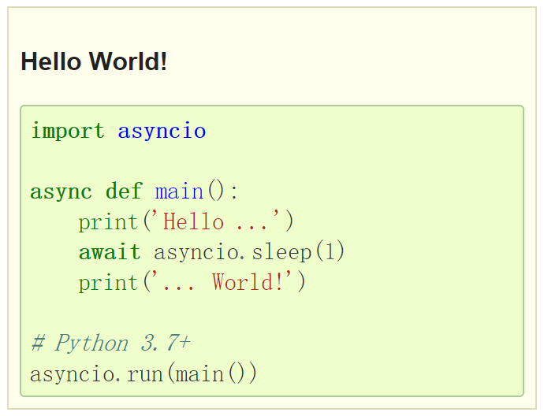

# 【Python】Python并发编程从入门到进阶


本文是Python进阶系列专题的最后一篇文章了，学习一下Python并发编程。懂得并发编程，就算是真正进阶了。

## Python多线程

Python有真正的多线程吗？我本来以为是没有的。因为CPython解释器本身就不是线程安全的，因此有全局解释器锁（GIL），一次只允许使用一个线程执行Python字节码。换句话说，Python即便是有多线程，也会受GIL限制，按顺序执行。所以我就以为Python是没有多线程的，也就是一个Python进程不能同时使用多个CPU核心。然而，**Python标准库中所有执行阻塞型I/O操作的函数，在等待操作系统返回结果时，都会释放GIL，允许其他线程运行**。这就意味着Python线程在I/O密集型应用中还是可以发挥作用的，比如一个Python线程等待网络响应时，阻塞型I/O函数会释放GIL，再运行一个线程。再比如time.sleep()函数也会释放GIL。

## Python多进程

但是对于CPU密集型应用来说，要想利用所有可用的CPU核心，就得使用多进程，规避GIL。

## 多线程与多进程对比

什么时候用多线程？什么时候用多进程？

I/O密集型应用使用多线程，CPU密集型应用使用多进程。

什么是I/O密集型应用？什么是CPU密集型应用？

简单来说，I/O密集一般涉及到网络、磁盘IO。而CPU密集指的是计算比较多。

创建多线程可以使用concurrent.futures，创建多进程可以使用multiprocessing。

## 多线程与协程对比

多线程存在着切换开销，同时为了避免写变量冲突，在控制共享资源时需要加锁，因此编写程序会比较复杂比较困难。而协程是通过单线程实现的并发，既能自由切换，也不需要锁机制，执行效率要高很多。

多线程和协程有个共同点是只对I/O密集型应用有效，因为GIL限制。如果想处理CPU密集型应用，那么可以结合多进程一起使用，以提高CPU使用率。

## asyncio包

asyncio包比较多用来实现Python协程并发，原书在这一章节引用了很多示例，穿插了很多代码，导致我看起来有点乱，不是很清楚到底该怎么使用这个包。所以我看了一下官方文档：

https://docs.python.org/3/library/asyncio.html



从Python3.5开始引入了**async和await**，替代了@asyncio.coroutine和yield from语法，语义更简洁更明确了。并且从Python3.7开始引入了**asyncio.run()**，替代了这一串代码：

```python
loop = asyncio.get_event_loop()
try:
    loop.run_until_complete(main())
finally:
    loop.close()
```

创建task的语法也发生了变化，可以用**asyncio.create_task**：

```python
async def coro():
    ...

## In Python 3.7+
task = asyncio.create_task(coro())
...

## This works in all Python versions but is less readable
task = asyncio.ensure_future(coro())
...
```

对于多个并行task可以用**asyncio.gather**，替代asyncio.wait：

```python
task_list = []
    for i in range(5):
        task = asyncio.create_task(async_func(i))
        task_list.append(task)

done, pending = await asyncio.wait(task_list, timeout=None)
for done_task in done:
        print((f"[{current_time()}] 得到执行结果 {done_task.result()}"))
```

```python
task_list = []
    for i in range(5):
        task = asyncio.create_task(func(i))
        task_list.append(task)
results = await asyncio.gather(*task_list)
for result in results:
        print((f"[{current_time()}] 得到执行结果 {result}"))
```

所以对于第三方包的学习，最好是看看最新的官方文档，说不定已经进行了很多优化。

最后，完结，撒花。

**我会把《流畅的Python》这本书送给大家，感谢一直以来的关注。**

> 参考资料：
>
> 《流畅的Python》 第17章使用future处理并发 第18章使用asyncio包处理并发
>
> https://blog.csdn.net/youanyyou/article/details/78990156
>
> https://zhuanlan.zhihu.com/p/104918655
>
> https://www.cnblogs.com/liugp/p/11072823.html
>
> https://www.jianshu.com/p/6872bf356af7

