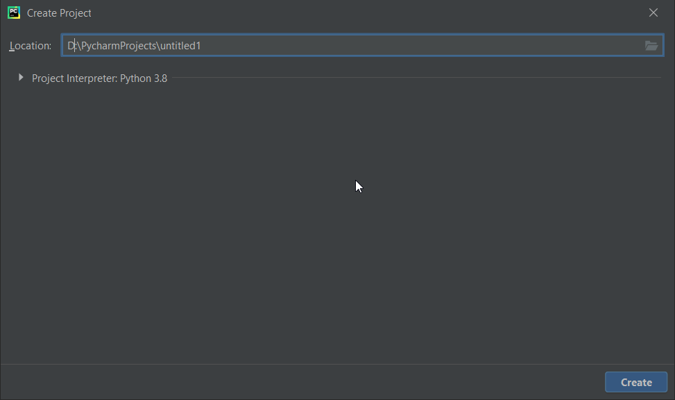
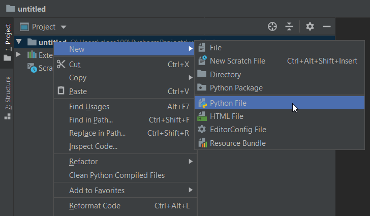
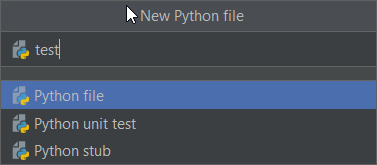
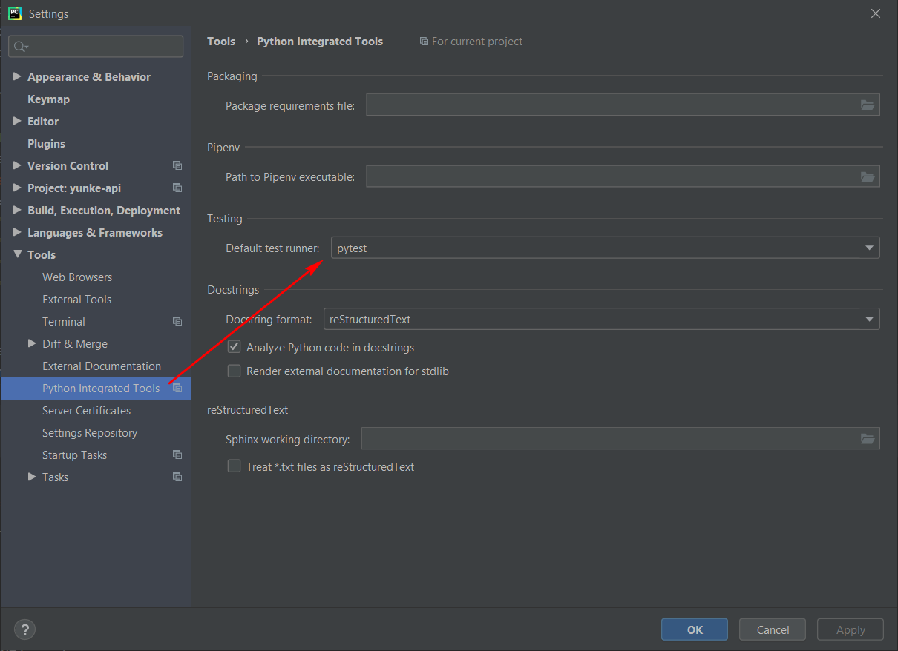
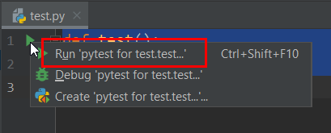

# 【pytest】pytest快速入门


### 安装Python和编辑器PyCharm

Python安装包下载地址是：
[https://www.python.org/downloads/](https://www.python.org/downloads/) 
PyCharm安装包下载地址是：
[https://www.jetbrains.com/pycharm/download/](https://www.jetbrains.com/pycharm/download/)
下载后按常规软件安装。

### pytest

pytest是Python内置包，无需单独安装，但是**需要设置**。

创建1个Project和1个test.py来试试，左上角点击 File | New Project | create，创建项目。在项目中右键选择 New | File 创建test.py







接着设置PyCharm，默认PyCharm自带的测试框架是Unittests，在 File | Settings | Tools | Python Integrated Tools | Testing | Default test runner，修改为pytest



在test.py文件中添加代码

```python
def test():
    pass

```

这个时候def的左边会出现一个绿色的箭头，点击之后就可以使用pytest运行，注意一定要是 **pytest for...** 才可以，如果只是 Run test.py，是不走pytest执行的（右上角Edit Configurations删掉来解决）



执行之后控制台输出信息就可以了

```shell
Testing started at 11:10 AM ...
"D:\Program Files (x86)\Python38-32\python.exe" "D:\Program Files\JetBrains\PyCharm Community Edition 2020.1.2\plugins\python-ce\helpers\pycharm\_jb_pytest_runner.py" --target test.py::test
Launching pytest with arguments test.py::test in D:\PycharmProjects\untitled

============================= test session starts =============================
platform win32 -- Python 3.8.3, pytest-5.4.3, py-1.9.0, pluggy-0.13.1 -- D:\Program Files (x86)\Python38-32\python.exe
cachedir: .pytest_cache
rootdir: D:\PycharmProjects\untitled
collecting ... collected 1 item

test.py::test PASSED                                                     [100%]

============================== 1 passed in 0.14s ==============================

Process finished with exit code 0

```

至此，pytest的环境就准备好了。
