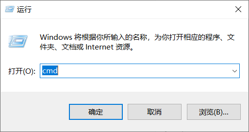
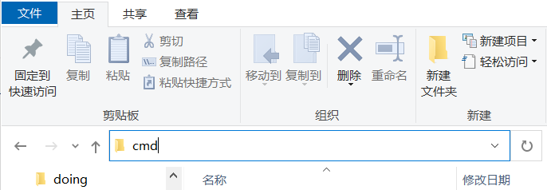
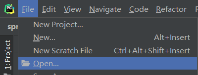
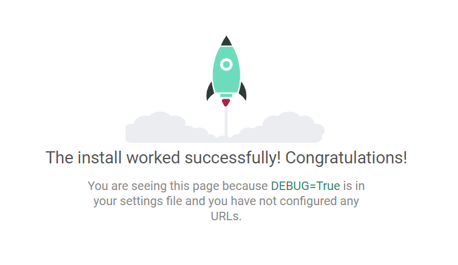

# 【Django】Django搭建示例项目实战与避坑细节


Django 开发项目是很快的，有多快？看完本篇文章，你就知道了。

## 安装 Django

前提条件：已安装 Python。

Django 使用 pip 命令直接就可以安装：

```shell
pip install django
```

如果安装失败，很可能是因为网络连接超时了，试试国内镜像：

```shell
pip install --default-timeout=6000 -i https://pypi.tuna.tsinghua.edu.cn/simple django
```

这条命令同时延长了超时时间，提高成功率。

安装完成后，通过 ` django-admin --version` 这条命令验证。

## 创建 project

按住 Windows 键 + R，输入 cmd 回车，接着 cd 到任意目录：



或者先打开目录窗口，在地址栏输入 cmd 回车，不需要 cd（推荐）：



在命令行窗口输入命令创建 project：

```shell
django-admin startproject mysite
```

目录结构如下（注意有 2 个 mysite 哦）：

```
mysite/
    manage.py
    mysite/
        __init__.py
        settings.py
        urls.py
        asgi.py
        wsgi.py
```

## 创建 app

Django 项目由 1 个 project 和多个 app 组成。project 存放项目配置，app 是网站各个功能的具体实现。

app 的放置目录没有限制，这里先放在和 mysite 的同级目录中，先进入外层的 mysite 文件夹：

```
cd mysite
```

输入命令创建：

```shell
django-admin startapp polls
```

目录结构如下：

```
mysite/
	polls/
        __init__.py
        admin.py
        apps.py
        migrations/
            __init__.py
        models.py
        tests.py
        views.py
    mysite/
    manage.py
```

使用 cmd 创建完 project 和 app 以后，就可以打开 PyCharm，再 Open mysite 项目了：



为了让 app 和 project 关联起来，需要在 mysite/settings.py 文件中添加配置：

```python
INSTALLED_APPS = [
    'django.contrib.admin',
    'django.contrib.auth',
    'django.contrib.contenttypes',
    'django.contrib.sessions',
    'django.contrib.messages',
    'django.contrib.staticfiles',
    'polls.apps.PollsConfig',  # 添加
]
```

在 polls/models.py 文件中添加数据模型：

```python
from django.db import models


class Question(models.Model):
    question_text = models.CharField(max_length=200)
    pub_date = models.DateTimeField('date published')


class Choice(models.Model):
    question = models.ForeignKey(Question, on_delete=models.CASCADE)
    choice_text = models.CharField(max_length=200)
    votes = models.IntegerField(default=0)
```

## 连接 MySQL

前提条件：已安装 MySQL，创建好数据库。

Django 默认使用轻量级数据库 SQLite，我们切换为常用的 MySQL。

修改 mysite/settings.py 中的数据库配置：

```python
DATABASES = {
    'default': {
        'ENGINE': 'django.db.backends.mysql',
        'HOST': '主机',
        'PORT': 端口,
        'NAME': '数据库名',
        'USER': '用户名',
        'PASSWORD': '密码'
    }
}
```

Django 默认通过底层调用 mysqlclient 这个库和 MySQL 交互。但是 mysqlclient 非常不好安装！我们改用 pymysql。

先安装：

```shell
pip install pymysql
```

然后在与 mysite/settings.py 文件同级的 `__init__` 文件中添加：

```python
import pymysql

pymysql.version_info = (1, 4, 0, "final", 0)
pymysql.install_as_MySQLdb()
```

## 数据迁移

数据迁移，指的是把代码中的数据模型，迁移到数据库中，创建相应的表结构。

第一步，告诉 Django 数据模型有更新：

```shell
python manage.py makemigrations polls
```

执行后输出：

```
Migrations for 'polls':
  polls/migrations/0001_initial.py
    - Create model Question
    - Create model Choice
```

第二步，执行数据迁移同步：

```
python manage.py migrate
```

执行后输出：

```
Operations to perform:
  Apply all migrations: admin, auth, contenttypes, polls, sessions
Running migrations:
  Rendering model states... DONE
  Applying polls.0001_initial... OK
```

数据库表就创建好了：


## 启动项目

万事俱备，只差 1 条启动命令，在根目录执行：

```
python manage.py runserver
```

访问 http://127.0.0.1:8000/，就可以看到来自 Django 老铁的这发火箭了：



## 小结

本文是对《匆匆一眼》文章的补充。介绍了如何安装 Django，创建 Django 的 project 和 app，连接 MySQL，执行数据迁移，最后启动项目的实际操作步骤。思路很清晰。整体流程清楚了，可这些文件都是干嘛的呢？

参考资料：

https://docs.djangoproject.com/en/3.1/intro/tutorial01/