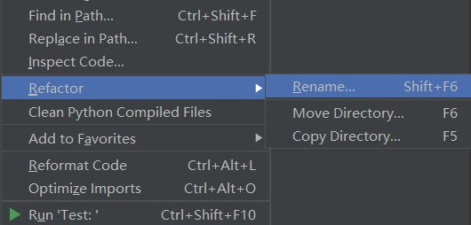
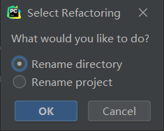
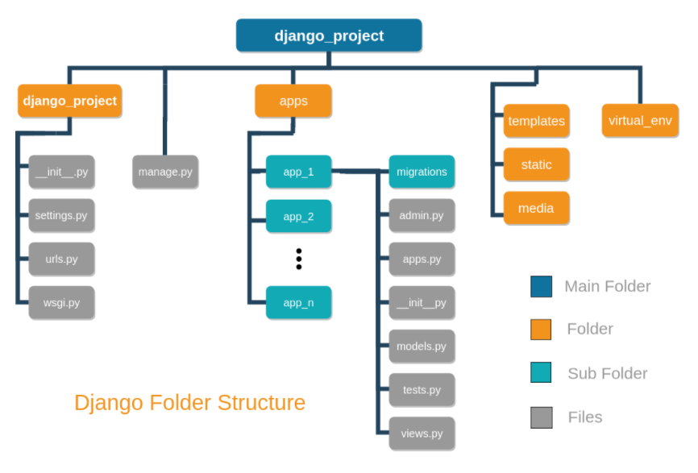

# 【Django】Django官方为什么没有标准项目结构


Django官方并没有提供标准的项目结构，于是网上众说纷纭，百花齐放，一千个读者有一千个哈姆雷特。那我们该怎么设计项目结构呢？在回答这个问题之前，先了解一下Django原生的目录和文件都是干嘛的。

## project

在使用`django-admin startproject`命令后就会创建这样的目录文件，如下：

```
mysite/
    manage.py
    mysite/
        __init__.py
        settings.py
        urls.py
        asgi.py
        wsgi.py
```

### 根目录mysite/

根目录的mysite/，仅仅是个目录而已，Django不会拿它做什么，它的名字可以随意修改。

**带短横线的根目录**

分享一个踩坑经验，有时候我们想把项目名命名为带短横线的，如 hello-world，通过命令直接创建会报错：

```shell
...\> django-admin startproject hello-world
CommandError: 'hello-world' is not a valid project name. Please make sure the name is a valid identifier.
```

`startproject`不支持直接创建带短横线的项目名。

**方法1 加参数**

其实！它是支持的，只是我们漏了一个参数。`startproject`的完整格式为`django-admin startproject name [directory]`，可以在后面追加一个目录参数：

```shell
...\> django-admin startproject helloworld hello-world
```

就可以了。根目录是`hello-world`，里面的project是`helloworld`。

**方法2 改名字**

先用helloworld创建，然后再修改，可以①在资源管理器中直接修改文件夹，②也可以在 PyCharm 中修改：



选择Rename directory：



注意去掉勾选Search，不修改其他位置：


只修改这个根目录的名字即可。

### manage.py

Django的命令行工具，使用频繁，格式为：

```shell
python manage.py <command> [options]
```

### 内部mysite.py/

Django项目实际使用到的Python包，存放项目配置、URL路由等。

### mysite/\_\_init\_\_.py

表明这个目录是Python包。

### mysite/settings.py

Django项目配置。

### mysite/urls.py

URL路由。

### mysite/asgi.py

兼容ASGI Web服务器的入口。

### mysite/wsgi.py

兼容WSGI Web服务器的入口。

> ASGI和WSGI，都是一种Python的Web服务网关接口协议，是在CGI通用网关接口，Common Gateway Interface）的标准上构建的。

## app

app是Django项目的应用，一个project可以包含多个app。在使用`django-admin startapp`命令后就会创建这样的目录文件，如下：

```
polls/
    __init__.py
    admin.py
    apps.py
    migrations/
        __init__.py
    models.py
    tests.py
    views.py
```

### polls/

app的Python包，可以放在任意路径。修改存放路径，相关配置中的路径也需要修改。

### admin.py

存放Django自带后台管理的models。

### apps.py

app配置信息，例如：

```python
from django.apps import AppConfig


class PollsConfig(AppConfig):
    name = 'polls'

```

存放路径不同，name的值也不同。

### migrations/

Django数据迁移生成的迁移记录文件。

### models.py

存放app的models。

### tests.py

单元测试。

### views.py

视图函数（类）。

### urls.py

app的路由配置，需要手动添加，可通过`include()`函数导入到`mysite/urls.py`中，例如：

```python
from django.contrib import admin
from django.urls import include, path

urlpatterns = [
    path('admin/', admin.site.urls),
    path('polls/', include('polls.urls')),
]
```

polls/urls.py：

```python
from django.urls import path

from . import views

urlpatterns = [
    path('', views.index),
]
```

访问`xxx/polls/`就会路由到`views.index`。

## 工程化项目参考

虽说是百家争鸣，但也有公认的工程化实践。我找了GitHub上star最多的叫做Django Edge的project skeleton，它的设计如下：

```
Top-directory
├── docs
├── logs
├── README.md
├── requirements
│   ├── base.txt
│   ├── development.txt
│   └── production.txt
├── requirements.txt
└── src
    ├── Your project name
    │   ├── __init__.py
    │   ├── logger.py
    │   ├── settings
    │   │   ├── base.py
    │   │   ├── development.py
    │   │   ├── local.sample.env
    │   │   └── production.py
    │   ├── urls.py
    │   ├── views.py
    │   └── wsgi.py
    ├── accounts
    │   ├── admin.py
    │   ├── forms.py
    │   ├── migrations
    │   ├── models.py
    │   ├── templates
    │   ├── tests.py
    │   ├── urls.py
    │   └── views.py
    ├── manage.py
    ├── media
    ├── profiles
    │   ├── admin.py
    │   ├── apps.py
    │   ├── forms.py
    │   ├── migrations
    │   ├── models.py
    │   ├── signals.py
    │   ├── templates
    │   ├── tests.py
    │   ├── urls.py
    │   └── views.py
    ├── static
    │   ├── bootstrap
    │   │   ├── css
    │   │   ├── fonts
    │   │   └── js
    │   └── site
    │       ├── css
    │       ├── ico
    │       ├── img
    │       └── js
    └── templates
```

非常的像那么回事。我又搜了其他实践的文章，找到了这张图：



国内的文章也有提到类似这2种项目结构的设计，特点是①app放置在单独目录统一管理，②requirements和settings按环境做拆分，等等等。我说说我的观点，一开始没有必要就按照这种标准的工程化实践来写项目，我更倾向于先凭自己的能力写一版，再不断重构和优化的方式。业务不同，能力不同，经验不同，写出来的代码自然也不同。不过在碰到问题时，可以参考借鉴，很可能别人已经提供了解决方案。

> 我看了一些Django开源项目代码，很少见到真像这么设计项目结构的，所以不必过分在意。

## 小结

本文介绍了Django startproject和startapp命令产生的目录文件的结构和作用。然后给出了工程化项目参考。项目结构没有标准，只有适用于当前的最佳实践，可能这就是官方没有给出标准项目结构的原因吧。

> 参考资料：
>
> https://docs.djangoproject.com/en/3.1/intro/tutorial01/
>
> https://django-edge.readthedocs.io/en/latest/Architecture/
>
> https://studygyaan.com/django/best-practice-to-structure-django-project-directories-and-files