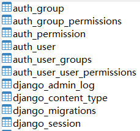
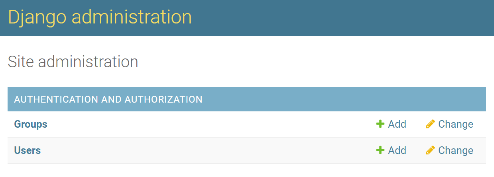
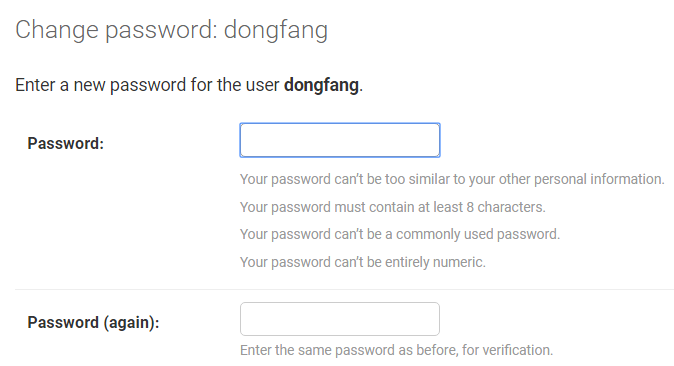
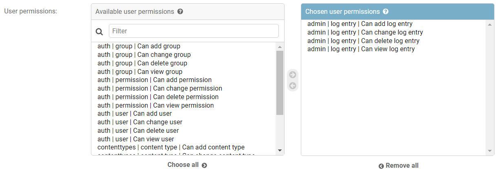
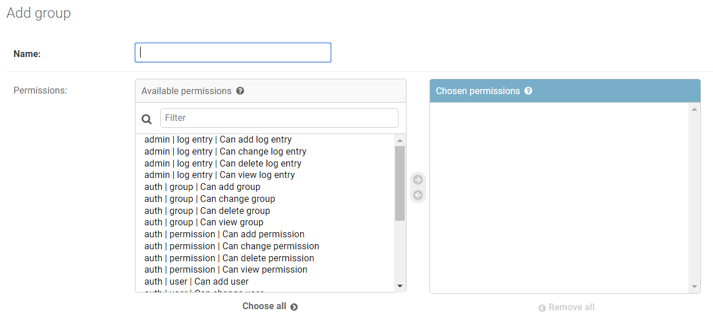
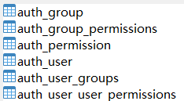
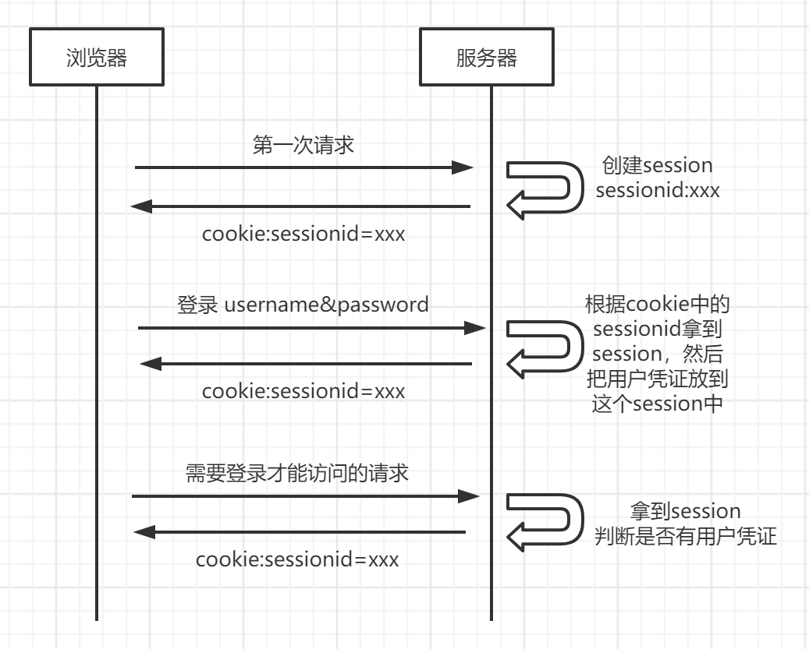

# 【Django】Django认证系统并不鸡肋反而很重要


在使用`django-admin startproject`创建项目后，Django就默认安装了一个采用session实现的认证系统。这是Django相比于其他框架的一大特点：自带认证系统，开箱即用。有人说它方便，有人说它鸡肋，但它作为Django的重要组成部分，学习它有助于我们理解Django框架的核心技术。

## 安装

Django默认已安装，可以在`settings.py`中的`INSTALLED_APPS`看到：

- django.contrib.auth：认证系统内核，以及默认models等。
- django.contrib.contenttypes：用于关联权限和models，从而赋予models的添加/删除等权限。

> contrib翻译为普通发布版。

在`MIDDLEWARE`可以看到：

- `SessionMiddleware`：session中间件。
- `AuthenticationMiddleware`：认证中间件。

使用`python manage.py migrate`后，数据库会新增认证系统的这些表：



## 认证与授权

认证的英文是authentication，授权的英文是authorization。单词不一样，咋看有点像。认证是指验证用户是谁。授权是指授予已认证用户权限。由于认证授权在某种程序上是耦合的，所以Django把它们统称为“认证”。

## 认证系统概览

认证系统的组成部分如下：

- 用户
- 权限
- 组
- 密码管理
- 登录相关表单（前后端分离不需要）和视图（接受Web请求并且返回Web响应）

> Django框架是MTV模式，类似于MVC模式。Django的View对应MVC的Controller。

- 可配置的backend

以上是Django自带内容，如果需要更多功能，可以安装第三方包：

- 密码增强校验
- 登录限流
- OAuth
- 对象级权限（django-guardian）

> 以Article举例，Django是模型级权限，用户只能具有全部文章的权限。django-guardian提供了对象级权限，可以对单篇文章进行授权。

## models.User

User模型是Django认证系统的核心，它的主要属性包括：

- id
- username
- email
- password
- is_active
- is_superuser
- last_login
- date_joined

> django.contrib.auth.models，在django.db.models之上封装了AbstractBaseUser、AbstractUser、User等模型。

### 创建超级管理员

cmd中使用`createsuperuser`命令：

```shell
$ python manage.py createsuperuser
```

根据提示输入username、email、password后，就会在数据库中创建1条超管用户。

### 创建用户

**方法1 代码创建**

在代码中使用`create_user()`函数来创建用户：

```shell
>>> from django.contrib.auth.models import User
# 创建用户并保存到数据库
>>> user = User.objects.create_user('john', 'lennon@thebeatles.com', 'johnpassword')


# 修改其他字段值
>>> user.last_name = 'Lennon'
>>> user.save()
```

**方法2 管理后台创建**

访问`http://127.0.0.1:8000/admin/`，用超管登录后，在界面上创建：



### 修改密码

**方法1 命令行修改**

```
python manage.py changepassword username
```

根据提示输入旧密码、新密码、确认密码即可。

**方法2 代码中修改** 

```shell
>>> from django.contrib.auth.models import User
>>> u = User.objects.get(username='john')
>>> u.set_password('new password')
>>> u.save()
```

**方法3 管理后台修改**


<br/>



### 用户认证

框架底层使用`authenticate()`函数对用户进行认证：

```python
authenticate(request=None, **credentials)
```

credentials是用户凭证，如用户名、密码。

示例：

```python
from django.contrib.auth import authenticate
user = authenticate(username='john', password='secret')
if user is not None:
    # A backend authenticated the credentials
else:
    # No backend authenticated the credentials
```

如果认证成功，`authenticate()`会返回User。如果用户凭证无效或者权限不足，认证后端抛出了PermissionDenied，`authenticate()`会返回None。

### 认证后端

认证后端（authentication backends）是Django做用户验证的后端模块，默认为`['django.contrib.auth.backends.ModelBackend']`，只会简单比较请求的用户名密码和数据库中的用户名密码是否匹配。可以切换成其他认证后端，也可以重写`authenticate()`进行自定义。我点开了源码，发现除了Django的认证后端，DRF已经封装了Session、Token、JWT的认证：


## 权限管理

权限一般分为add、change、delete、view，也就是增删改查。

### 默认权限

Django会在`python manage.py migrate`的时候，为每个model创建4种权限：add、change、delete、view。

比如有个app叫做foo，它有个model叫做Bar，可以使用`has_perm()`函数来检查权限：

- add：user.has_perm('foo.add_bar')
- change：user.has_perm('foo.change_bar')
- delete：user.has_perm('foo.delete_bar')
- view：user.has_perm('foo.view_bar')

### 创建新权限

除了增删改查权限，有时我们需要更多的权限，例如，为myapp中的BlogPost创建一个can_publish权限：

**方法1 meta中配置**

```python
class BlogPost(models.Model):
    ...
    class Meta:
        permissions = (
            ("can_publish", "Can Publish Posts"),
        )
```

**方法2 使用`create()`函数**

```python
from myapp.models import BlogPost
from django.contrib.auth.models import Permission
from django.contrib.contenttypes.models import ContentType

content_type = ContentType.objects.get_for_model(BlogPost)
permission = Permission.objects.create(
    codename='can_publish',
    name='Can Publish Posts',
    content_type=content_type,
)
```

在使用`python manage.py migrate`命令后，就会创建这个新权限，接着就可以在view中编写代码判断用户是否有这个权限来决定能否发表文章。

### 授权

可以在管理后台对用户授权：



或者把用户分组后，按组来进行授权：



从数据库这6张表就能看出来，有用户表、分组表、权限表，以及它们的关联关系表：



其代码实现是把permission赋值给User.user_permissions或者Group.permissions属性。

### 代理模型权限

> 代理模型是从某个模型继承来的，不影响表结构，用于扩展行为实现代码解耦。
>

代理模型不会继承父类的权限，例如：

```python
class Person(models.Model):
    class Meta:
        permissions = [('can_eat_pizzas', 'Can eat pizzas')]

# 代理模型
class Student(Person):
    class Meta:
        proxy = True
        permissions = [('can_deliver_pizzas', 'Can deliver pizzas')]

>>> # 注意代理模型取ContentType需要加for_concrete_model=False
>>> content_type = ContentType.objects.get_for_model(Student, for_concrete_model=False)
>>> student_permissions = Permission.objects.filter(content_type=content_type)
>>> [p.codename for p in student_permissions]
['add_student', 'change_student', 'delete_student', 'view_student',
'can_deliver_pizzas']  # 没有父类的can_eat_pizzas权限
```

## Session认证

Django认证系统是基于Session的。Django把Web请求封装成了request（HttpRequest类），然后通过中间件设置了session相关的属性：request.session、request.site、request.user。其中request.user就代表当前用户，如果未登陆它的值是AnonymousUser（匿名用户）的实例，如果已登陆它的值是User的实例。可以通过is_authenticated来判断是否已认证：

```python
if request.user.is_authenticated:
    # Do something for authenticated users.
    ...
else:
    # Do something for anonymous users.
    ...
```

### 用户登录

我们先简单回顾一下基于session的登录过程：




Django提供了`login()`函数来登录，把用户凭证保存到session中。它的函数签名如下：

`login(request, user, backend=None)`

示例：

```python
import json

from django.contrib.auth import authenticate, login
from django.http import HttpResponse


# Create your views here.


def my_view(request):
    request_body = json.loads(request.body)
    username = request_body["username"]
    password = request_body["password"]
    user = authenticate(request, username=username, password=password)
    if user is not None:
        login(request, user)
        return HttpResponse("logged in")
    else:
        return HttpResponse("invalid login")

```

除了保存用户凭证，Django还会把认证后端也保存到session中，便于相同的认证后端下次可以直接获取到用户信息。至于保存哪个认证后端，Django按以下顺序选取：

1. 使用`login()`函数的backend参数值，如果赋值了的话。
2. 使用user.backend的值，如果有的话。
3. 使用settings中`AUTHENTICATION_BACKENDS`的值，默认 `['django.contrib.auth.backends.ModelBackend']`。
4. 否则抛出异常。

### 用户登出

Django提供了`logout()`函数来登出。它的函数签名如下：

`logout(request)`

示例：

```python
from django.contrib.auth import logout

def logout_view(request):
    logout(request)
    # Redirect to a success page.
```

登出后session会被销毁，所有数据都会被清除，以防止其他人使用相同的浏览器再次登录后获取到之前用户的session数据。

### login_required

对于未登陆的用户，需要进行限制，必须先登陆才能进行访问。

**传统方法**

使用request.user.is_authenticated判断，然后重定向到登录页面：

```python
from django.conf import settings
from django.shortcuts import redirect

def my_view(request):
    if not request.user.is_authenticated:
        return redirect('%s?next=%s' % (settings.LOGIN_URL, request.path))
    # ...
```

或者错误页面：

```python
from django.shortcuts import render

def my_view(request):
    if not request.user.is_authenticated:
        return render(request, 'myapp/login_error.html')
    # ...
```

**login_required装饰器** 

`login_required(redirect_field_name='next', login_url=None)`

示例：

```python
from django.contrib.auth.decorators import login_required

@login_required
def my_view(request):
    ...
```

它的处理是这样的：

- 如果用户没有登录，就重定向到settings.LOGIN_URL（默认值`/accounts/login/`），同时把当前的绝对路径添加到查询字符串中，如：`/accounts/login/?next=/polls/3/`。

- 如果用户已经登录了，正常执行view代码。

`login_required`的`redirect_field_name`参数是指登陆认证成功后重定向的页面，默认保存在叫做`next`的查询字符串参数中（如/accounts/login/?next=/polls/3/）。可以修改为自定义：

```python
from django.contrib.auth.decorators import login_required

@login_required(redirect_field_name='my_redirect_field')
def my_view(request):
    ...
```

不过修改后还需要同时修改login模板等。

`login_required`的`login_url`参数是指登录页面的url，可以自定义，默认是`/accounts/login/`，需要在URLconf中关联登陆视图：

```python
from django.contrib.auth import views as auth_views

path('accounts/login/', auth_views.LoginView.as_view()),
```

### **function views和class-based views**

function views（函数视图），视图是个函数：

```python
from django.http import HttpResponse

def my_view(request):
    if request.method == 'GET':
        # <view logic>
        return HttpResponse('result')
```

class-based views（基于类的视图），视图是个类：

```python
from django.views import View

class MyView(View):
    def get(self, request):
        # <view logic>
        return HttpResponse('result')
```

为什么需要cbv？因为类可以继承，提高代码复用。由于Django的URLconf只能接受函数，所以cbv有个as_view()方法用来返回一个函数：

```python
# urls.py
from django.urls import path
from myapp.views import MyView

urlpatterns = [
    path('about/', MyView.as_view()),
]
```

### LoginRequiredMixin 

Mixin是为了代码复用，从多个父类继承而来的类。如果使用的是class-based views，那么可以使用LoginRequiredMixin，来实现login_required的效果，例如：

```python
from django.contrib.auth.mixins import LoginRequiredMixin

class MyView(LoginRequiredMixin, View):
    login_url = '/login/'
    redirect_field_name = 'redirect_to'
```

### permission_required

除了需要登录，有些视图还需要权限。Django提供了`permission_required`装饰器，它的函数签名如下：

`permission_required(perm, login_url=None, raise_exception=False)`

示例：

```python
from django.contrib.auth.decorators import permission_required

@permission_required('polls.add_choice')
def my_view(request):
    ...
```

`permission_required`的`perm`参数，指的是权限，可以是单个权限，也可以是权限列表。

`permission_required`的`login_url`参数和`login_required`的`login_url`作用一样。

`permission_required`的`raise_exception`参数，可以用来抛出异常，赋值为True后会跳转到403（HTTP Forbidden）页面而非登录页面。

如果既想抛出异常 ，又想跳转到登录页面，那么可以同时添加这2个装饰器：

```python
from django.contrib.auth.decorators import login_required, permission_required

@login_required
@permission_required('polls.add_choice', raise_exception=True)
def my_view(request):
    ...
```

### PermissionRequiredMixin

如果使用的是class-based views，那么可以使用PermissionRequiredMixin，来实现permission_required的效果，例如：

```python
from django.contrib.auth.mixins import PermissionRequiredMixin

class MyView(PermissionRequiredMixin, View):
    permission_required = 'polls.add_choice'
    # Or multiple of permissions:
    permission_required = ('polls.view_choice', 'polls.change_choice')
```

### 修改密码导致session失效

登录成功后，Django会把加密后的密码hash值存入session中，每次请求时，会校验session中的密码和数据库中的密码是否匹配。如果修改了密码，数据库中的密码改变了，而session中的密码没有更新，那么密码就会匹配不上，导致session失效。django.contrib.auth的PasswordChangeView和user_change_password视图会在修改密码时更新session中的密码hash，来避免session失效。如果对修改密码的视图进行了自定义，那么可以使用`update_session_auth_hash(request, user)`来更新session中的密码，防止修改密码导致session失效。

### 认证视图

Django提供了登录、登出、密码管理等视图。最简单的使用方式是在URLconf中配置：

```python
urlpatterns = [
    path('accounts/', include('django.contrib.auth.urls')),
]
```

它会包含这些URL patterns：

```python
accounts/login/ [name='login']
accounts/logout/ [name='logout']
accounts/password_change/ [name='password_change']
accounts/password_change/done/ [name='password_change_done']
accounts/password_reset/ [name='password_reset']
accounts/password_reset/done/ [name='password_reset_done']
accounts/reset/<uidb64>/<token>/ [name='password_reset_confirm']
accounts/reset/done/ [name='password_reset_complete']
```

> name是别名，可以使用reverse()函数来获取，如`reverse('login')`。
>

但有时我们需要自定义url，在URLconf中添加自定义url后，再加上相应视图即可，例如：

```python
from django.contrib.auth import views as auth_views

urlpatterns = [
    path('change-password/', auth_views.PasswordChangeView.as_view()),
]
```

> 所有的这些视图都是class-based views，便于继承后重写进行自定义。

Django提供的相关视图有LoginView、LogoutView、PasswordChangeView、PasswordChangeDoneView、PasswordResetView、PasswordResetDoneView、PasswordResetConfirmView、PasswordResetCompleteView。

## 快速上手体验

如果想快速上手体验，可以按如下步骤进行操作：

1. `pip install django`，安装Django。

2. `django-admin startproject project_name`，创建Django项目。

3. `python manage.py migrate`，数据迁移，使用自带SQLite数据库即可。

4. `python manage.py createsuperuser`，创建超级管理员。

5. `python manage.py runserver`，启动项目。

6. 访问`http://127.0.0.1:8000/admin/`，用超管登录管理后台。

就可以使用Django自带认证系统了。

## 小结

本文介绍了Django自带的基于session的认证系统，阐述了用户、组、认证与授权的相关概念，以及session认证的技术细节，最后讲解了如何快速上手体验的操作步骤。虽然如今基于session认证用的很少了，但它却是理解Token、JWT认证的基础，仍然值得我们学习。

> 参考资料：
>
> https://docs.djangoproject.com/en/3.1/topics/auth/
>
> https://docs.djangoproject.com/en/3.1/topics/auth/default/
>