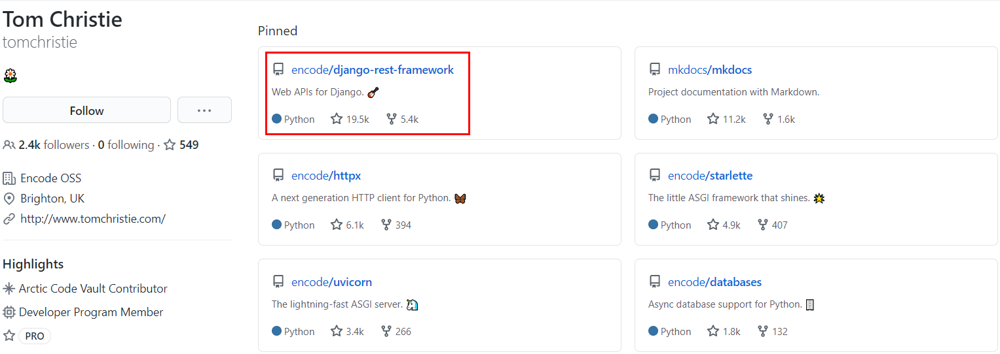

# 【Django】快用DjangoRESTframework写写API吧


Django默认是前后端绑定的，提供了Template和Form，现在流行前后端分离项目，Python大佬坐不住了，于是便有了Django REST framework：https://github.com/tomchristie



官网：https://www.django-rest-framework.org/


Django REST framework（简称DRF）是个Python技术栈的后端框架，用来构建RESTful API。

## RESTful API

REST，是指REpresentational State Transfer，有个精辟的解释什么是RESTful：

- 看URL就知道要什么
- 看Method就知道干什么
- 看Status Code就知道结果如何

良好的RESTful API设计的基本原则是：

- 返回JSON
- 严禁乱用状态码
- 处理好分页
- 返回具体的实体数据而不是返回通用的JSON数据
- 请求对象有默认值

## 创建项目

接下来我们使用DRF创建一个简单的API，允许管理员查看和编辑用户和组。

先创建名为`tutorial`的project和名为`quickstart`的app：

```shell
# 创建项目目录
mkdir tutorial
cd tutorial

# 创建Python虚拟环境
python -m venv env
# 激活虚拟环境
env\Scripts\activate.bat  
# Mac中使用`source env/bin/activate`

# 在虚拟环境中安装Django和Django REST framework
pip install django
pip install djangorestframework

# 创建project，注意最后有个“.”，表示在当前目录创建
django-admin startproject tutorial .
cd tutorial
# 创建app
django-admin startapp quickstart
cd ..
```

创建好的目录结构如下：

```shell
$ pwd
<some path>/tutorial
$ find .
.
./manage.py
./tutorial
./tutorial/__init__.py
./tutorial/quickstart
./tutorial/quickstart/__init__.py
./tutorial/quickstart/admin.py
./tutorial/quickstart/apps.py
./tutorial/quickstart/migrations
./tutorial/quickstart/migrations/__init__.py
./tutorial/quickstart/models.py
./tutorial/quickstart/tests.py
./tutorial/quickstart/views.py
./tutorial/settings.py
./tutorial/urls.py
./tutorial/wsgi.py
```

> 一般不会把app放到project里面，这里是为了避免命名冲突。

接着同步数据库：

```shell
python manage.py migrate
```

然后创建一个超级管理员，密码`password123`：

```shell
python manage.py createsuperuser --email admin@example.com --username admin
```

## Serializers

序列化是指把数据库模型转换为JSON。新建模块`tutorial/quickstart/serializers.py`：

```python
from django.contrib.auth.models import User, Group
from rest_framework import serializers


class UserSerializer(serializers.HyperlinkedModelSerializer):
    class Meta:
        model = User
        fields = ['url', 'username', 'email', 'groups']


class GroupSerializer(serializers.HyperlinkedModelSerializer):
    class Meta:
        model = Group
        fields = ['url', 'name']
```

## Views

视图用来接受Web请求并且返回Web响应。打开`tutorial/quickstart/views.py`，添加代码：

```python
from django.contrib.auth.models import User, Group
from rest_framework import viewsets
from rest_framework import permissions
from tutorial.quickstart.serializers import UserSerializer, GroupSerializer


class UserViewSet(viewsets.ModelViewSet):
    """
    API endpoint that allows users to be viewed or edited.
    """
    queryset = User.objects.all().order_by('-date_joined')
    serializer_class = UserSerializer
    permission_classes = [permissions.IsAuthenticated]


class GroupViewSet(viewsets.ModelViewSet):
    """
    API endpoint that allows groups to be viewed or edited.
    """
    queryset = Group.objects.all()
    serializer_class = GroupSerializer
    permission_classes = [permissions.IsAuthenticated]
```

## URLs

配置路由，打开`tutorial/urls.py`，添加代码：

```python
from django.urls import include, path
from rest_framework import routers
from tutorial.quickstart import views

router = routers.DefaultRouter()
router.register(r'users', views.UserViewSet)
router.register(r'groups', views.GroupViewSet)

# Wire up our API using automatic URL routing.
# Additionally, we include login URLs for the browsable API.
urlpatterns = [
    path('', include(router.urls)),
    path('api-auth/', include('rest_framework.urls', namespace='rest_framework'))
]
```

因为这里用的不是view而是viewsets，所以可以自动生成API的URLconf，只需要注册class即可。

> 也可以不用viewsets，用view，再自定义API URL。

## Pagination

分页用来控制每页返回多少数据，在`tutorial/settings.py`中添加：

```python
REST_FRAMEWORK = {
    'DEFAULT_PAGINATION_CLASS': 'rest_framework.pagination.PageNumberPagination',
    'PAGE_SIZE': 10
}
```

## Settings

在`tutorial/settings.py`中，把`'rest_framework'`添加到`INSTALLED_APPS`：

```python
INSTALLED_APPS = [
    ...
    'rest_framework',
]
```

## 测试API

启动项目：

```shell
python manage.py runserver
```

访问`http://127.0.0.1:8000/users/`，点击右上角用超管登录，即可看到：


## 小结

本文是Django REST framework系列的开篇，内容参考的是官网的Tutorial。学了Django再看DRF，思路清晰多了，虽然我代码能力不强，但总是在追求规范和标准，难道是因为做测试的职业病么？

> 参考资料：
>
> https://www.django-rest-framework.org/tutorial/quickstart/
>
> http://www.ruanyifeng.com/blog/2014/05/restful_api.html

