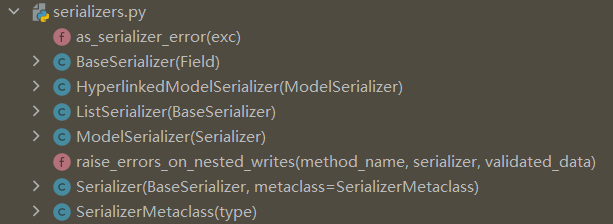

# 【Django】揭开DRF序列化技术的神秘面纱


在RESTful API中，接口返回的是JSON，JSON的内容对应的是数据库中的数据，DRF是通过序列化（Serialization）的技术，把数据模型转换为JSON的，反之，叫做反序列化（deserialization）。本文就来揭开2揭开DRF序列化技术的神秘面纱技术的神秘面纱。

## 创建虚拟环境

虚拟环境是独立的Python环境，可以和系统环境分离，只安装需要的包即可，使用以下命令创建并激活：

```shell
# 创建Python虚拟环境
python -m venv env
# 激活虚拟环境
env\Scripts\activate.bat  
# Mac中使用`source env/bin/activate`
```

> 退出虚拟环境用deactivate。

接着在虚拟环境中安装本文用到的包：

```python
pip install django
pip install djangorestframework
pip install pygments  # 代码高亮
```

## 创建项目

创建project：

```shell
django-admin startproject tutorial
```

创建app：

```shell
cd tutorial
python manage.py startapp snippets
```

在`tutorial/settings.py`中的`INSTALLED_APPS`添加`snippets`和`rest_framework`：

```python
INSTALLED_APPS = [
    ...
    'rest_framework',
    'snippets.apps.SnippetsConfig',
]
```

> 只有添加后，app才会生效哦。

## 创建model

编辑`snippets/models.py`，创建Snippet模型：

```python
from django.db import models
from pygments.lexers import get_all_lexers
from pygments.styles import get_all_styles

LEXERS = [item for item in get_all_lexers() if item[1]]
LANGUAGE_CHOICES = sorted([(item[1][0], item[0]) for item in LEXERS])
STYLE_CHOICES = sorted([(item, item) for item in get_all_styles()])


class Snippet(models.Model):
    created = models.DateTimeField(auto_now_add=True)
    title = models.CharField(max_length=100, blank=True, default='')
    code = models.TextField()
    linenos = models.BooleanField(default=False)
    language = models.CharField(choices=LANGUAGE_CHOICES, default='python', max_length=100)
    style = models.CharField(choices=STYLE_CHOICES, default='friendly', max_length=100)

    class Meta:
        ordering = ['created']
```

Snippet有6个字段，created、title、code、linenos、language、style。

接着同步数据库：

```python
python manage.py makemigrations snippets
python manage.py migrate
```

## 创建Serializer

rest_framework.serializers的结构如下：



> 查看Python模块中的成员，需要勾选：
>
> 

之前我们用过HyperlinkedModelSerializer，是封装后的符合RESTful良好设计的序列化器，这里直接使用更底层的Serializer。在`snippets`目录下创建`serializers.py`，添加以下代码：

```python
from rest_framework import serializers
from snippets.models import Snippet, LANGUAGE_CHOICES, STYLE_CHOICES


class SnippetSerializer(serializers.Serializer):
    id = serializers.IntegerField(read_only=True)
    title = serializers.CharField(required=False, allow_blank=True, max_length=100)
    code = serializers.CharField(style={'base_template': 'textarea.html'})
    linenos = serializers.BooleanField(required=False)
    language = serializers.ChoiceField(choices=LANGUAGE_CHOICES, default='python')
    style = serializers.ChoiceField(choices=STYLE_CHOICES, default='friendly')

    def create(self, validated_data):
        """
        Create and return a new `Snippet` instance, given the validated data.
        """
        return Snippet.objects.create(**validated_data)

    def update(self, instance, validated_data):
        """
        Update and return an existing `Snippet` instance, given the validated data.
        """
        instance.title = validated_data.get('title', instance.title)
        instance.code = validated_data.get('code', instance.code)
        instance.linenos = validated_data.get('linenos', instance.linenos)
        instance.language = validated_data.get('language', instance.language)
        instance.style = validated_data.get('style', instance.style)
        instance.save()
        return instance
```

代码第一部分定义了序列化/反序列化的字段，字段定义方式类似于Form。第二部分的`create()`和`update()`方法定义了调用`serializer.save()`时，创建和更新实例的处理方式。

## 玩玩Serializer

既然已经创建好了Serializer，何不玩玩它？只有玩了才知道序列化的技术细节。这里用到了Django shell，可以在命令行实时看到输出结果：

```shell
python manage.py shell
```

首先通过模型新增2条测试数据：

```python
from snippets.models import Snippet
from snippets.serializers import SnippetSerializer
from rest_framework.renderers import JSONRenderer
from rest_framework.parsers import JSONParser

snippet = Snippet(code='foo = "bar"\n')
snippet.save()

snippet = Snippet(code='print("hello, world")\n')
snippet.save()
```


接着把它序列化看看：

```python
serializer = SnippetSerializer(snippet)
serializer.data
# {'id': 2, 'title': '', 'code': 'print("hello, world")\n', 'linenos': False, 'language': 'python', 'style': 'friendly'}
```

> 因为`snippet`变量最后引用的是第2个数据模型的实例，所以这里只显示第2条数据。

serializer.data返回的是个字典，最后把字典转换为JSON：

```python
content = JSONRenderer().render(serializer.data)
content
# b'{"id": 2, "title": "", "code": "print(\\"hello, world\\")\\n", "linenos": false, "language": "python", "style": "friendly"}'
```

这就是序列化的过程，模型实例→Python字典→JSON。

反序列化的过程是类似的，先把JSON转换为Python字典：

```python
import io

stream = io.BytesIO(content)
data = JSONParser().parse(stream)
```

再把字典转换为模型实例：

```python
serializer = SnippetSerializer(data=data)
serializer.is_valid()
# True
serializer.validated_data
# OrderedDict([('title', ''), ('code', 'print("hello, world")\n'), ('linenos', False), ('language', 'python'), ('style', 'friendly')])
serializer.save()
# <Snippet: Snippet object>
```

> 因为SnippetSerializer的create()方法代码是`return Snippet.objects.create(**validated_data)`，所以`serializer.save()`会在数据库中新增1条数据，并返回Snippet模型实例。
>

另外，序列化对象不只有模型实例，也可以是数据集：

```python
serializer = SnippetSerializer(Snippet.objects.all(), many=True)
serializer.data
# [OrderedDict([('id', 1), ('title', ''), ('code', 'foo = "bar"\n'), ('linenos', False), ('language', 'python'), ('style', 'friendly')]), OrderedDict([('id', 2), ('title', ''), ('code', 'print("hello, world")\n'), ('linenos', False), ('language', 'python'), ('style', 'friendly')]), OrderedDict([('id', 3), ('title', ''), ('code', 'print("hello, world")'), ('linenos', False), ('language', 'python'), ('style', 'friendly')])]
```

## 使用ModelSerializers

rest_framework.serializers.Serializers比较底层，需要重复定义model中的字段，DRF的作者当然也想到了这个问题，并且给出了解决办法：把Serializers封装成ModelSerializers。在`snippets/serializers.py`中替换`SnippetSerializer`为：

```python
class SnippetSerializer(serializers.ModelSerializer):
    class Meta:
        model = Snippet
        fields = ['id', 'title', 'code', 'linenos', 'language', 'style']
```

写法果然简洁了很多。使用Django shell打印出来看看：

```python
from snippets.serializers import SnippetSerializer
serializer = SnippetSerializer()
print(repr(serializer))
# SnippetSerializer():
#    id = IntegerField(label='ID', read_only=True)
#    title = CharField(allow_blank=True, max_length=100, required=False)
#    code = CharField(style={'base_template': 'textarea.html'})
#    linenos = BooleanField(required=False)
#    language = ChoiceField(choices=[('Clipper', 'FoxPro'), ('Cucumber', 'Gherkin'), ('RobotFramework', 'RobotFramework'), ('abap', 'ABAP'), ('ada', 'Ada')...
#    style = ChoiceField(choices=[('autumn', 'autumn'), ('borland', 'borland'), ('bw', 'bw'), ('colorful', 'colorful')...
```

和手动定义的字段一模一样。其实ModelSerializer并没有做额外的处理，我们可以从它的部分代码片段看到:

```python
  serializer_field_mapping = {
        models.AutoField: IntegerField,
        models.BigIntegerField: IntegerField,
        models.BooleanField: BooleanField,
  
  
  # Default `create` and `update` behavior...
  def create(self, validated_data):
  
  
  def update(self, instance, validated_data):
      raise_errors_on_nested_writes('update', self, validated_data)
```

建立字段映射，定义`create()`和`update()`等方法，只做了最简单的封装。

## 编写views

我们之前用的是已经封装好的rest_framework.viewsets，这里直接用Django原生的view。在`snippets/views.py`中添加代码：

```python
from django.http import HttpResponse, JsonResponse
from django.views.decorators.csrf import csrf_exempt
from rest_framework.parsers import JSONParser
from snippets.models import Snippet
from snippets.serializers import SnippetSerializer
```

先创建snippet_list视图，返回snippets列表或者新建1个snippet：

```python
@csrf_exempt
def snippet_list(request):
    """
    List all code snippets, or create a new snippet.
    """
    if request.method == 'GET':
        snippets = Snippet.objects.all()
        serializer = SnippetSerializer(snippets, many=True)
        return JsonResponse(serializer.data, safe=False)

    elif request.method == 'POST':
        data = JSONParser().parse(request)
        serializer = SnippetSerializer(data=data)
        if serializer.is_valid():
            serializer.save()
            return JsonResponse(serializer.data, status=201)
        return JsonResponse(serializer.errors, status=400)
```

本文示例中，客户端发起POST请求是不带CSRF token的，所以需要添加csrf_exempt（exempt翻译为免除）装饰器，允许跨域访问。这里只是演示，实际会使用`django-cors-headers`来解决跨域问题，而不是给每个view都加上`@csrf_exempt`。

> CSRF是指跨站请求伪造，攻击者盗用你的身份，以你的名义发送恶意请求。CSRF token是指服务器通过token来认证，如果请求中没有token或者token不匹配，那么就认为可能是CSRF而拒绝该请求。

接着添加一个view，对单个snippet进行删（delete）、改（update）、查（retrieve）：

```python
@csrf_exempt
def snippet_detail(request, pk):
    """
    Retrieve, update or delete a code snippet.
    """
    try:
        snippet = Snippet.objects.get(pk=pk)
    except Snippet.DoesNotExist:
        return HttpResponse(status=404)

    if request.method == 'GET':
        serializer = SnippetSerializer(snippet)
        return JsonResponse(serializer.data)

    elif request.method == 'PUT':
        data = JSONParser().parse(request)
        serializer = SnippetSerializer(snippet, data=data)
        if serializer.is_valid():
            serializer.save()
            return JsonResponse(serializer.data)
        return JsonResponse(serializer.errors, status=400)

    elif request.method == 'DELETE':
        snippet.delete()
        return HttpResponse(status=204)
```

> 注意，前面create返回的status为201，这里retrieve返回的默认的200，附上几个常见状态码：
>
> - 200 OK - GET/PUT/PATCH：服务器成功返回用户请求的数据，该操作是幂等的（Idempotent）
> - 201 CREATED - POST：用户新建数据成功
> - 204 NO content - DELETE：用户删除数据成功
> - 400 Invalid request - POST/PUT/PATCH：用户发出的请求有错误，服务器没有进行新建或修改数据的操作，该操作是幂等的
> - 401 Unauthorized - *：表示用户没有权限（令牌、用户名、密码错误）
> - 403 Forbidden - *：表示用户得到授权（与401错误相对），但是访问是被禁止的

最后，添加路由，新建文件`snippets/urls.py`：

```python
from django.urls import path
from snippets import views

urlpatterns = [
    path('snippets/', views.snippet_list),
    path('snippets/<int:pk>/', views.snippet_detail),
]
```

再配置到`tutorial/urls.py`：

```python
from django.urls import path, include

urlpatterns = [
    path('', include('snippets.urls')),
]
```

## 测试API

启动项目：

```shell
python manage.py runserver
```

新开一个Terminal，安装HTTP命令行工具：

```shell
pip install httpie
```

请求snippets列表：

```shell
http http://127.0.0.1:8000/snippets/

HTTP/1.1 200 OK
...
[
  {
    "id": 1,
    "title": "",
    "code": "foo = \"bar\"\n",
    "linenos": false,
    "language": "python",
    "style": "friendly"
  },
  {
    "id": 2,
    "title": "",
    "code": "print(\"hello, world\")\n",
    "linenos": false,
    "language": "python",
    "style": "friendly"
  }
]
```

请求id为2的snippet：

```shell
http http://127.0.0.1:8000/snippets/2/

HTTP/1.1 200 OK
...
{
  "id": 2,
  "title": "",
  "code": "print(\"hello, world\")\n",
  "linenos": false,
  "language": "python",
  "style": "friendly"
}
```

## 小结

不得不说DRF的Tutorial实践性很强，基本上照着做都能敲出来，体验比较好。序列化的过程，就是模型实例→Python字典→JSON的过程。通过本文也理解了在app中`models.py`→`serializers.py`→`views.py`→`urls.py`的代码编写顺序。

> 参考资料：
>
> https://www.django-rest-framework.org/tutorial/1-serialization/
>
> https://blog.csdn.net/yexudengzhidao/article/details/93527586