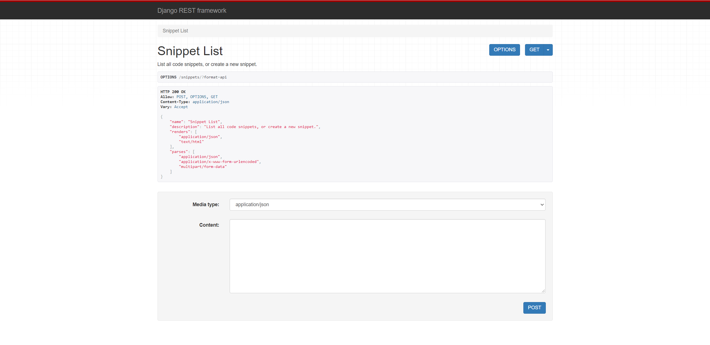

# 【Django】DRF对Django请求响应做了技术升级


Django视图是用来处理请求和响应的，Django默认是按Form和Template来设计的，如果要处理以JSON格式为主的RESTful API，那么就需要对Django请求和响应的处理代码进行优化改造，本文就来介绍DRF在这一部分的技术升级。

## Request

DRF把Django的`HttpRequest`扩展成了`Request`：


其中最核心的属性是`request.data`，它和`request.POST`的区别如下：

```python
request.POST  # 只处理表单（Form）数据，只支持POST方法
request.data  # 处理任何数据，支持POST、PUT、PATCH方法
```

## Response

DRF的`Response`继承自Django的`django.template.response.SimpleTemplateResponse`：


`Response`可以根据客户端的请求render合适的content type：

```python
return Response(data)
```

我摘取了`rendered_content()`函数的代码：

```python
@property
def rendered_content(self):
    renderer = getattr(self, 'accepted_renderer', None)
    accepted_media_type = getattr(self, 'accepted_media_type', None)
    context = getattr(self, 'renderer_context', None)

    assert renderer, ".accepted_renderer not set on Response"
    assert accepted_media_type, ".accepted_media_type not set on Response"
    assert context is not None, ".renderer_context not set on Response"
    context['response'] = self

    media_type = renderer.media_type
    charset = renderer.charset
    content_type = self.content_type

    if content_type is None and charset is not None:
        content_type = "{}; charset={}".format(media_type, charset)
    elif content_type is None:
        content_type = media_type
    self['Content-Type'] = content_type

    ret = renderer.render(self.data, accepted_media_type, context)
    if isinstance(ret, str):
        assert charset, (
            'renderer returned unicode, and did not specify '
            'a charset value.'
        )
        return ret.encode(charset)

    if not ret:
        del self['Content-Type']

    return ret
```

## Status codes

如果在代码中直接写数字形式的状态码如`400`，是不容易阅读的，于是DRF提供了标识符如`HTTP_400_BAD_REQUEST`来替代。我列一些常见的状态码标识符：

```python
HTTP_200_OK = 200
HTTP_201_CREATED = 201
HTTP_204_NO_CONTENT = 204
HTTP_400_BAD_REQUEST = 400
HTTP_401_UNAUTHORIZED = 401
HTTP_403_FORBIDDEN = 403
HTTP_404_NOT_FOUND = 404
HTTP_405_METHOD_NOT_ALLOWED = 405
HTTP_500_INTERNAL_SERVER_ERROR = 500
HTTP_502_BAD_GATEWAY = 502
HTTP_503_SERVICE_UNAVAILABLE = 503
HTTP_504_GATEWAY_TIMEOUT = 504
```

全部的状态码标识符可以在`rest_framework.status`模块中看到。

## @api_view和APIView

DRF对API视图做了2个封装：

1. `@api_view`用于函数视图。
2. `APIView`用于类视图。

它们提供了一些新功能，比如：

- 检查请求是`Request`对象
- 添加上下文到`Response`对象
- 返回请求错误如`405 Method Not Allowed`
- 当`request.data`格式有误时，抛出`ParseError`异常

## 改造views.py

接着就用上面这几个新实现对我们之前写的`snippets/views.py`进行改造：

```python
from rest_framework import status
from rest_framework.decorators import api_view
from rest_framework.response import Response
from snippets.models import Snippet
from snippets.serializers import SnippetSerializer


@api_view(['GET', 'POST'])
def snippet_list(request):
    """
    List all code snippets, or create a new snippet.
    """
    if request.method == 'GET':
        snippets = Snippet.objects.all()
        serializer = SnippetSerializer(snippets, many=True)
        return Response(serializer.data)

    elif request.method == 'POST':
        serializer = SnippetSerializer(data=request.data)
        if serializer.is_valid():
            serializer.save()
            return Response(serializer.data, status=status.HTTP_201_CREATED)
        return Response(serializer.errors, status=status.HTTP_400_BAD_REQUEST)

    
@api_view(['GET', 'PUT', 'DELETE'])
def snippet_detail(request, pk):
    """
    Retrieve, update or delete a code snippet.
    """
    try:
        snippet = Snippet.objects.get(pk=pk)
    except Snippet.DoesNotExist:
        return Response(status=status.HTTP_404_NOT_FOUND)

    if request.method == 'GET':
        serializer = SnippetSerializer(snippet)
        return Response(serializer.data)

    elif request.method == 'PUT':
        serializer = SnippetSerializer(snippet, data=request.data)
        if serializer.is_valid():
            serializer.save()
            return Response(serializer.data)
        return Response(serializer.errors, status=status.HTTP_400_BAD_REQUEST)

    elif request.method == 'DELETE':
        snippet.delete()
        return Response(status=status.HTTP_204_NO_CONTENT)
```

改动点有这些，添加了`@api_view`，如：

```python
@api_view(['GET', 'POST'])
```

使用了状态码标识符，如：

```python
status.HTTP_404_NOT_FOUND
```

使用`request.data`替代了` data = JSONParser().parse(request)`，如：

```python
 serializer = SnippetSerializer(data=request.data)
```

使用`Response()`替代了`JsonResponse()`，如：

```python
return Response(serializer.data, status=status.HTTP_201_CREATED)
```

> `request.data`和`Response()`能根据请求的JSON自动处理content type。

## 添加后缀格式（可选）

既然DRF能自动处理content type，那么也可以给URL指定具体的后缀格式，比如`http://example.com/api/items/4.json`。具体添加步骤是，先给view增加1个可选参数`format`：

```python
def snippet_list(request, format=None):
```

```python
def snippet_detail(request, pk, format=None):
```

再更新`snippets/urls.py`，添加`format_suffix_patterns`：

```python
from django.urls import path
from rest_framework.urlpatterns import format_suffix_patterns
from snippets import views

urlpatterns = [
    path('snippets/', views.snippet_list),
    path('snippets/<int:pk>', views.snippet_detail),
]

urlpatterns = format_suffix_patterns(urlpatterns)
```

> 这并不是必须的，实际上也无需这么做。
>

## 测试API

```python
http http://127.0.0.1:8000/snippets/

HTTP/1.1 200 OK
...
[
  {
    "id": 1,
    "title": "",
    "code": "foo = \"bar\"\n",
    "linenos": false,
    "language": "python",
    "style": "friendly"
  },
  {
    "id": 2,
    "title": "",
    "code": "print(\"hello, world\")\n",
    "linenos": false,
    "language": "python",
    "style": "friendly"
  }
]
```

跟之前的结果一样。再分别用form和json试试：

```python
## POST using form data
http --form POST http://127.0.0.1:8000/snippets/ code="print(123)"

{
  "id": 3,
  "title": "",
  "code": "print(123)",
  "linenos": false,
  "language": "python",
  "style": "friendly"
}

## POST using JSON
http --json POST http://127.0.0.1:8000/snippets/ code="print(456)"

{
    "id": 4,
    "title": "",
    "code": "print(456)",
    "linenos": false,
    "language": "python",
    "style": "friendly"
}
```

## API文档

DRF提供了可视化的API HTML文档，把API URL在浏览器中打开即可看到：



## 小结

技术要依托于业务，让技术落地，在业务中发挥技术的价值，产生从业务到技术，从技术到业务的良好循环。当然，会技术是个大前提，对技术的学习不能停，比如Django REST framework。

> 参考资料：
>
> https://www.django-rest-framework.org/tutorial/2-requests-and-responses/

