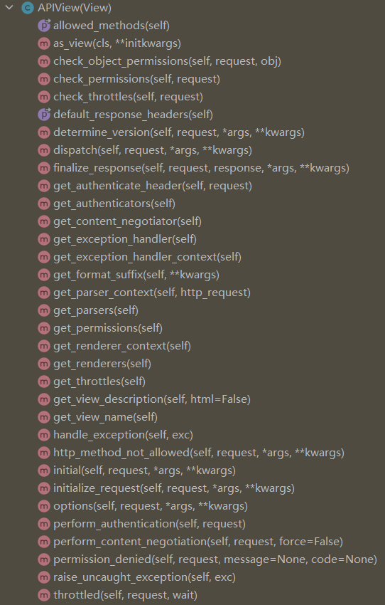
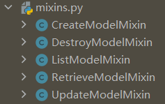
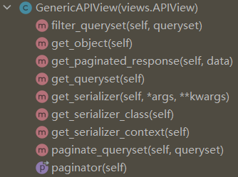

# 【Django】DRF类视图让你的代码DRY起来


刚开始写`views.py`模块的代码，一般都是用`def`定义的函数视图，不过DRF更推荐使用`class`定义的类视图，这能让我们的代码更符合DRY（Don't Repeat Yourself）设计原则：


## 使用APIView

`rest_framework.views.APIView`是DRF封装的API视图，继承了`django.views.generic.base.View`：



我们用它把函数视图改写成类视图，编辑`snippets/views.py`：

```python
from snippets.models import Snippet
from snippets.serializers import SnippetSerializer
from django.http import Http404
from rest_framework.views import APIView
from rest_framework.response import Response
from rest_framework import status


class SnippetList(APIView):
    """
    List all snippets, or create a new snippet.
    """
    def get(self, request, format=None):
        snippets = Snippet.objects.all()
        serializer = SnippetSerializer(snippets, many=True)
        return Response(serializer.data)

    def post(self, request, format=None):
        serializer = SnippetSerializer(data=request.data)
        if serializer.is_valid():
            serializer.save()
            return Response(serializer.data, status=status.HTTP_201_CREATED)
        return Response(serializer.errors, status=status.HTTP_400_BAD_REQUEST)
    
    
class SnippetDetail(APIView):
    """
    Retrieve, update or delete a snippet instance.
    """
    def get_object(self, pk):
        try:
            return Snippet.objects.get(pk=pk)
        except Snippet.DoesNotExist:
            raise Http404

    def get(self, request, pk, format=None):
        snippet = self.get_object(pk)
        serializer = SnippetSerializer(snippet)
        return Response(serializer.data)

    def put(self, request, pk, format=None):
        snippet = self.get_object(pk)
        serializer = SnippetSerializer(snippet, data=request.data)
        if serializer.is_valid():
            serializer.save()
            return Response(serializer.data)
        return Response(serializer.errors, status=status.HTTP_400_BAD_REQUEST)

    def delete(self, request, pk, format=None):
        snippet = self.get_object(pk)
        snippet.delete()
        return Response(status=status.HTTP_204_NO_CONTENT)
```

类视图的代码跟函数视图是非常类似的，区别在于`GET`、`POST`等方法是用的函数而不是`if`语句，可以更好的解耦代码。

改了`views.py`代码后，需要同时修改`snippets/urls.py`：

```python
from django.urls import path
from rest_framework.urlpatterns import format_suffix_patterns
from snippets import views

urlpatterns = [
    path('snippets/', views.SnippetList.as_view()),
    path('snippets/<int:pk>/', views.SnippetDetail.as_view()),
]

urlpatterns = format_suffix_patterns(urlpatterns)
```

**为什么要加个`as_view()`方法？**

因为`path()`的参数必须是可调用的，在源码中能看到`elif callable(view)`：

```python
def _path(route, view, kwargs=None, name=None, Pattern=None):
    if isinstance(view, (list, tuple)):
        # For include(...) processing.
        pattern = Pattern(route, is_endpoint=False)
        urlconf_module, app_name, namespace = view
        return URLResolver(
            pattern,
            urlconf_module,
            kwargs,
            app_name=app_name,
            namespace=namespace,
        )
    # callable判断
    elif callable(view):
        pattern = Pattern(route, name=name, is_endpoint=True)
        return URLPattern(pattern, view, kwargs, name)
    else:
        raise TypeError('view must be a callable or a list/tuple in the case of include().')
```

`as_view()`方法返回了一个内部定义的可调用函数：

```python
@classonlymethod
def as_view(cls, **initkwargs):
    """Main entry point for a request-response process."""
    for key in initkwargs:
        if key in cls.http_method_names:
            raise TypeError(
                'The method name %s is not accepted as a keyword argument '
                'to %s().' % (key, cls.__name__)
            )
        if not hasattr(cls, key):
            raise TypeError("%s() received an invalid keyword %r. as_view "
                            "only accepts arguments that are already "
                            "attributes of the class." % (cls.__name__, key))

    # 内部定义了可调用函数
    def view(request, *args, **kwargs):
        self = cls(**initkwargs)
        self.setup(request, *args, **kwargs)
        if not hasattr(self, 'request'):
            raise AttributeError(
                "%s instance has no 'request' attribute. Did you override "
                "setup() and forget to call super()?" % cls.__name__
            )
        return self.dispatch(request, *args, **kwargs)
    view.view_class = cls
    view.view_initkwargs = initkwargs

    # take name and docstring from class
    update_wrapper(view, cls, updated=())

    # and possible attributes set by decorators
    # like csrf_exempt from dispatch
    update_wrapper(view, cls.dispatch, assigned=())
    return view
```

## 使用mixins

DRF提供了`rest_framework.mixins`模块，封装了类视图常用的增删改查方法：



比如新增`CreateModelMixin`：

```python
class CreateModelMixin:
    """
    Create a model instance.
    """
    def create(self, request, *args, **kwargs):
        serializer = self.get_serializer(data=request.data)
        serializer.is_valid(raise_exception=True)
        self.perform_create(serializer)
        headers = self.get_success_headers(serializer.data)
        return Response(serializer.data, status=status.HTTP_201_CREATED, headers=headers)

    def perform_create(self, serializer):
        serializer.save()

    def get_success_headers(self, data):
        try:
            return {'Location': str(data[api_settings.URL_FIELD_NAME])}
        except (TypeError, KeyError):
            return {}
```

类视图继承了Mixin后，可以直接使用它的`.create()`方法，类似的还有`.list()`、`.retrieve()`、`.update()`和`.destroy()`。我们按照这个思路来简化`snippets/views.py`代码：

```python
from snippets.models import Snippet
from snippets.serializers import SnippetSerializer
from rest_framework import mixins
from rest_framework import generics

class SnippetList(mixins.ListModelMixin,
                  mixins.CreateModelMixin,
                  generics.GenericAPIView):
    queryset = Snippet.objects.all()
    serializer_class = SnippetSerializer

    def get(self, request, *args, **kwargs):
        return self.list(request, *args, **kwargs)

    def post(self, request, *args, **kwargs):
        return self.create(request, *args, **kwargs)


class SnippetDetail(mixins.RetrieveModelMixin,
                    mixins.UpdateModelMixin,
                    mixins.DestroyModelMixin,
                    generics.GenericAPIView):
    queryset = Snippet.objects.all()
    serializer_class = SnippetSerializer

    def get(self, request, *args, **kwargs):
        return self.retrieve(request, *args, **kwargs)

    def put(self, request, *args, **kwargs):
        return self.update(request, *args, **kwargs)

    def delete(self, request, *args, **kwargs):
        return self.destroy(request, *args, **kwargs)
```

瞬间少了好多代码，真够DRY的。

**什么是mixin？**

维基百科的解释：

```
In object-oriented programming languages, a mixin (or mix-in) is a class that contains methods for use by other classes without having to be the parent class of those other classes.
```

> 不太好理解。

换句话说，mixin类提供了一些方法，我们不会直接用这些方法，而是把它添加到其他类来使用。

> 还是有点抽象。

再简单点说，mixin只不过是实现多重继承的一个技巧而已。

> 这下应该清楚了。

## 使用generics

如果仔细看`snippets/views.py`的代码，就会发现我们用到了`from rest_framework import generics`：


和`generics.GenericAPIView`：



这是DRF提供的通用API类视图，`mixins`只提供了处理方法，`views.py`中的类要成为视图，还需要继承`GenericAPIView`，`GenericAPIView`继承了本文第一小节提到的`rest_framework.views.APIView`。除了`GenericAPIView`，我们还可以用其他的类视图进一步简化代码：

```python
from snippets.models import Snippet
from snippets.serializers import SnippetSerializer
from rest_framework import generics


class SnippetList(generics.ListCreateAPIView):
    queryset = Snippet.objects.all()
    serializer_class = SnippetSerializer


class SnippetDetail(generics.RetrieveUpdateDestroyAPIView):
    queryset = Snippet.objects.all()
    serializer_class = SnippetSerializer
```

看看`ListCreateAPIView`的源码：

```python
class ListCreateAPIView(mixins.ListModelMixin,
                        mixins.CreateModelMixin,
                        GenericAPIView):
    """
    Concrete view for listing a queryset or creating a model instance.
    """
    def get(self, request, *args, **kwargs):
        return self.list(request, *args, **kwargs)

    def post(self, request, *args, **kwargs):
        return self.create(request, *args, **kwargs)
```

真DRY！

## 小结

学到这里，已经开始感受到了Django REST framework的强大之处了，我觉得学一个框架，不仅要看如何使用，还需要了解它的设计思路和底层实现，这样才能更好的总结为自己的编程思想，写出更漂亮的代码。

> 参考资料：
>
> https://www.django-rest-framework.org/tutorial/3-class-based-views/#tutorial-3-class-based-views
>
> https://stackoverflow.com/questions/533631/what-is-a-mixin-and-why-are-they-useful
>
> https://www.zhihu.com/question/20778853