# 【Django】DRF比Django的认证和权限高在哪里


Django可以用`LoginRequiredMixin`和`PermissionRequiredMixin`给类视图添加认证和权限，DRF做了高级封装，提供了更简洁的实现方式。我们通过继续学习官网教程来进行了解。

## 更新model

首先修改`Snippet`模型，添加2个字段：`owner`，存储snippet创建者，`highlighted`，存储高亮HTML。同时重写`save`方法，在同步数据库的时候，使用`pygments`包把`code`格式化后存到`highlighted`字段。修改后的`snippets/models.py`完整代码如下：

```python
from django.db import models
from pygments.lexers import get_all_lexers
from pygments.styles import get_all_styles
from pygments.lexers import get_lexer_by_name
from pygments.formatters.html import HtmlFormatter
from pygments import highlight

LEXERS = [item for item in get_all_lexers() if item[1]]
LANGUAGE_CHOICES = sorted([(item[1][0], item[0]) for item in LEXERS])
STYLE_CHOICES = sorted([(item, item) for item in get_all_styles()])


class Snippet(models.Model):
    created = models.DateTimeField(auto_now_add=True)
    title = models.CharField(max_length=100, blank=True, default='')
    code = models.TextField()
    linenos = models.BooleanField(default=False)
    language = models.CharField(choices=LANGUAGE_CHOICES, default='python', max_length=100)
    style = models.CharField(choices=STYLE_CHOICES, default='friendly', max_length=100)
    owner = models.ForeignKey('auth.User', related_name='snippets', on_delete=models.CASCADE)
    highlighted = models.TextField()

    class Meta:
        ordering = ['created']

    def save(self, *args, **kwargs):
        """
        Use the `pygments` library to create a highlighted HTML
        representation of the code snippet.
        """
        lexer = get_lexer_by_name(self.language)
        linenos = 'table' if self.linenos else False
        options = {'title': self.title} if self.title else {}
        formatter = HtmlFormatter(style=self.style, linenos=linenos,
                                  full=True, **options)
        self.highlighted = highlight(self.code, lexer, formatter)
        super(Snippet, self).save(*args, **kwargs)

```

接着删除数据库和`migrations`，重新迁移数据库：

```shell
rm -f db.sqlite3
rm -r snippets/migrations
python manage.py makemigrations snippets
python manage.py migrate
```

并创建超级管理员：

```shell
python manage.py createsuperuser
```

## User添加Endpoint

Endpoint，表示API的具体网址。我们按照`models.py`→`serializers.py`→`views.py`→`urls.py`的代码编写顺序，给User模型添加Endpoint。

**models.py**

直接使用Django默认User模型，不需要修改代码。

**serializers.py**

添加`UserSerializer`，由于User没有`snippets`字段，所以需要显式添加：

```python
from django.contrib.auth.models import User

class UserSerializer(serializers.ModelSerializer):
    snippets = serializers.PrimaryKeyRelatedField(many=True, queryset=Snippet.objects.all())

    class Meta:
        model = User
        fields = ['id', 'username', 'snippets']
```

**views.py**

添加只读的列表视图`UserList`和详情视图`UserDetail`，分别用到了`ListAPIView`和`RetrieveAPIView`：

```python
from django.contrib.auth.models import User
from snippets.serializers import UserSerializer


class UserList(generics.ListAPIView):
    queryset = User.objects.all()
    serializer_class = UserSerializer


class UserDetail(generics.RetrieveAPIView):
    queryset = User.objects.all()
    serializer_class = UserSerializer
```

**urls.py**

添加访问路径：

```python
path('users/', views.UserList.as_view()),
path('users/<int:pk>/', views.UserDetail.as_view()),
```

## 关联User和Snippet

如果使用POST方法请求`http://127.0.0.1:8000/snippets/`，尝试添加1条数据：

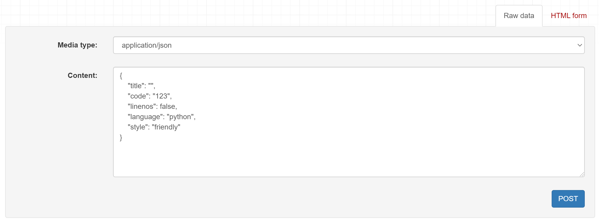

会发现接口报错了：

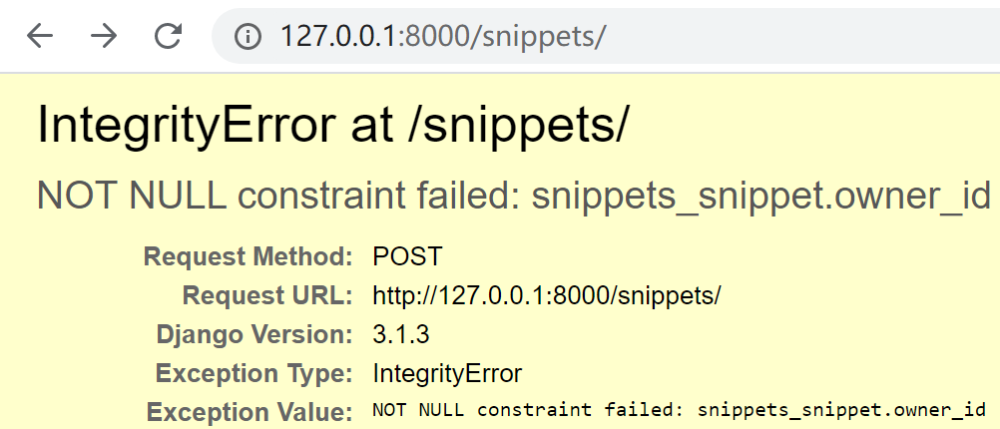

owner_id不能为空？因为前面只给`Snippet`添加了`owner`字段，还没有写反序列化更新模型的代码，所以通过请求访问视图，再尝试反序列化的时候，报错了。我们先修改视图`SnippetList`来修复这个问题：

```python
def perform_create(self, serializer):
    serializer.save(owner=self.request.user)
```

在`SnippetList`视图中重写`perform_create()`方法，意思是在保存时，把`request.user`值赋给`owner`字段。`perform_create()`方法的源码是：

```python
class CreateModelMixin:
    """
    Create a model instance.
    """
    def create(self, request, *args, **kwargs):
        serializer = self.get_serializer(data=request.data)
        serializer.is_valid(raise_exception=True)
        self.perform_create(serializer)
        headers = self.get_success_headers(serializer.data)
        return Response(serializer.data, status=status.HTTP_201_CREATED, headers=headers)

    def perform_create(self, serializer):
        serializer.save()
```

再修改`snippets/serializers.py`，添加`owner`字段，支持序列化：

```python
class SnippetSerializer(serializers.ModelSerializer):
    # ReadOnlyField表示只能序列化为JSON，不能反序列化更新模型
    # 也可以改成CharField(read_only=True)
    owner = serializers.ReadOnlyField(source='owner.username')

    class Meta:
        model = Snippet
        fields = ['id', 'title', 'code', 'linenos', 'language', 'style', 'owner']

```

> 注意Meta.fields也要加上`owner`哦。

再请求一次：

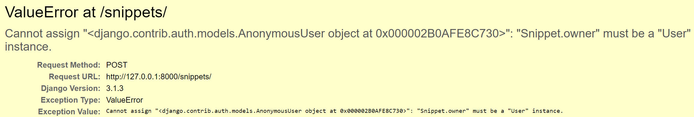

刚才的错误没有了，但是报了个新的错误：`Snippet.owner`必须是`User`实例，给它赋值的是`AnonymousUser`（匿名用户），导致ValueError了。这个报错是发生这条代码：

```python
serializer.save(owner=self.request.user)
```

也就是说请求访问视图后，进行反序列化了，但是反序列化失败了。非常奇怪！我们的请求中并没有用户信息，正常来说在访问视图的时候就该被拦截了。

## 给视图添加认证

我们需要让API更符合常规，让未认证的用户不能执行视图中的代码。DRF提供了`rest_framework .permissions`来给视图添加认证：

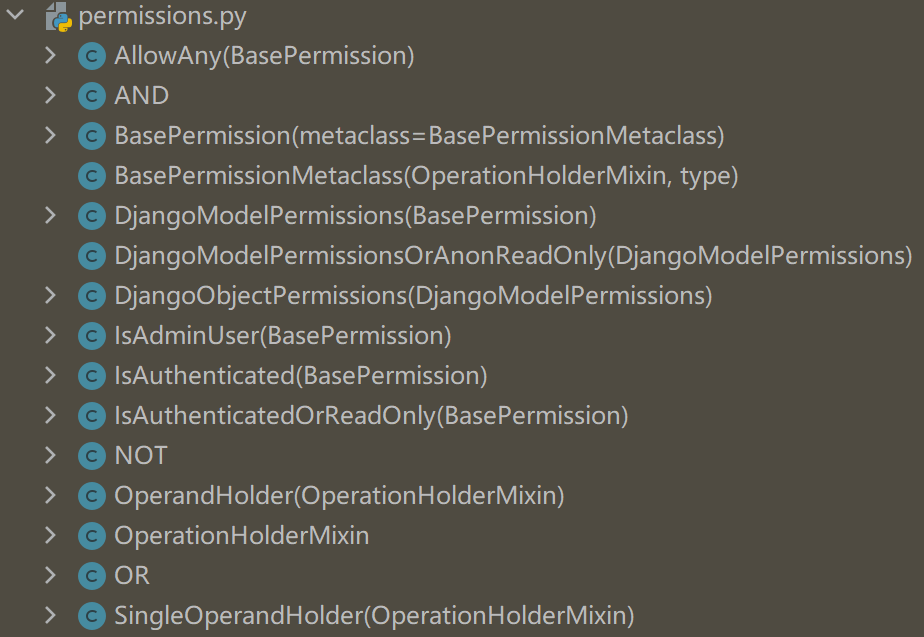

其中`IsAuthenticatedOrReadOnly`表示只有认证了才能读写，否则只能读。把它添加到`SnippetList`和`SnippetDetail`视图中：

```python
from rest_framework import permissions

permission_classes = [permissions.IsAuthenticatedOrReadOnly]
```

再请求试试，刚才的错误没有了，API返回的是需要提供用户凭证：

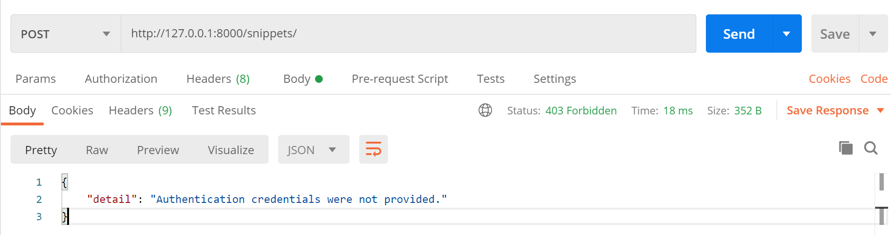

## 登录视图

如果用浏览器打开`http://127.0.0.1:8000/snippets/`，会发现只有GET方法没有POST，这是因为需要添加DRF登录视图，在`tutorial/urls.py`中添加`rest_framework.urls`：

```python
urlpatterns += [
    path('api-auth/', include('rest_framework.urls')),
]
```

> api-auth/可以自定义。

刷新页面右上角就会出现`Log in`按钮，登录后就能POST了。

## 对象级权限

为了更细粒度的控制权限，让用户只能编辑自己创建的`snippet`，新建`snippets/permissions.py`：

```python
from rest_framework import permissions


class IsOwnerOrReadOnly(permissions.BasePermission):
    """
    Custom permission to only allow owners of an object to edit it.
    """

    def has_object_permission(self, request, view, obj):
        # Read permissions are allowed to any request,
        # so we'll always allow GET, HEAD or OPTIONS requests.
        if request.method in permissions.SAFE_METHODS:
            return True

        # Write permissions are only allowed to the owner of the snippet.
        return obj.owner == request.user
```

新增`IsOwnerOrReadOnly`权限，继承了`permissions.BasePermission`，重写了`has_object_permission()`方法。接着在`snippets/views.py`中给`SnippetDetail`加上：

```python
from snippets.permissions import IsOwnerOrReadOnly


permission_classes = [permissions.IsAuthenticatedOrReadOnly,
                      IsOwnerOrReadOnly]
```

试下访问其他用户创建的`snippet`，发现只能查看：

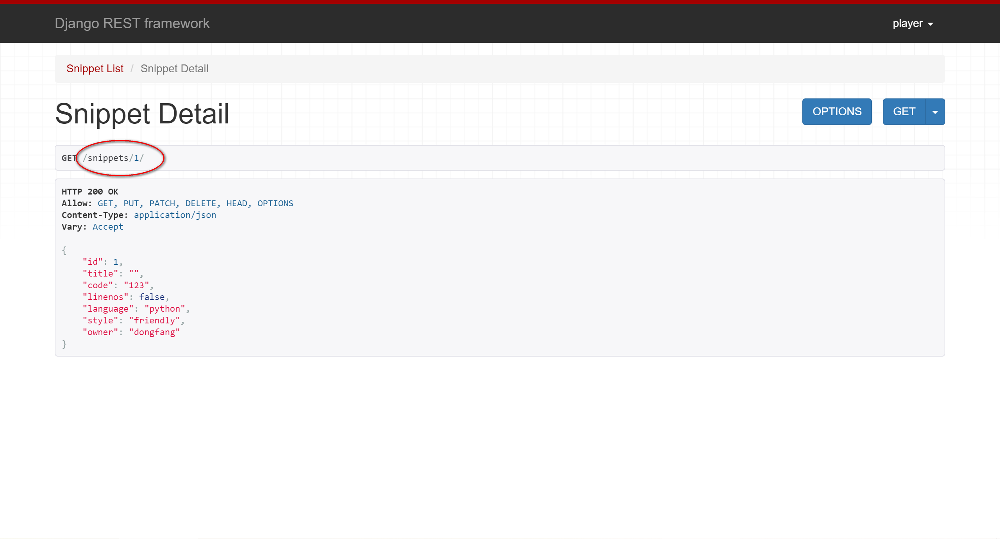

访问自己创建的`snippet`，可以修改和删除：

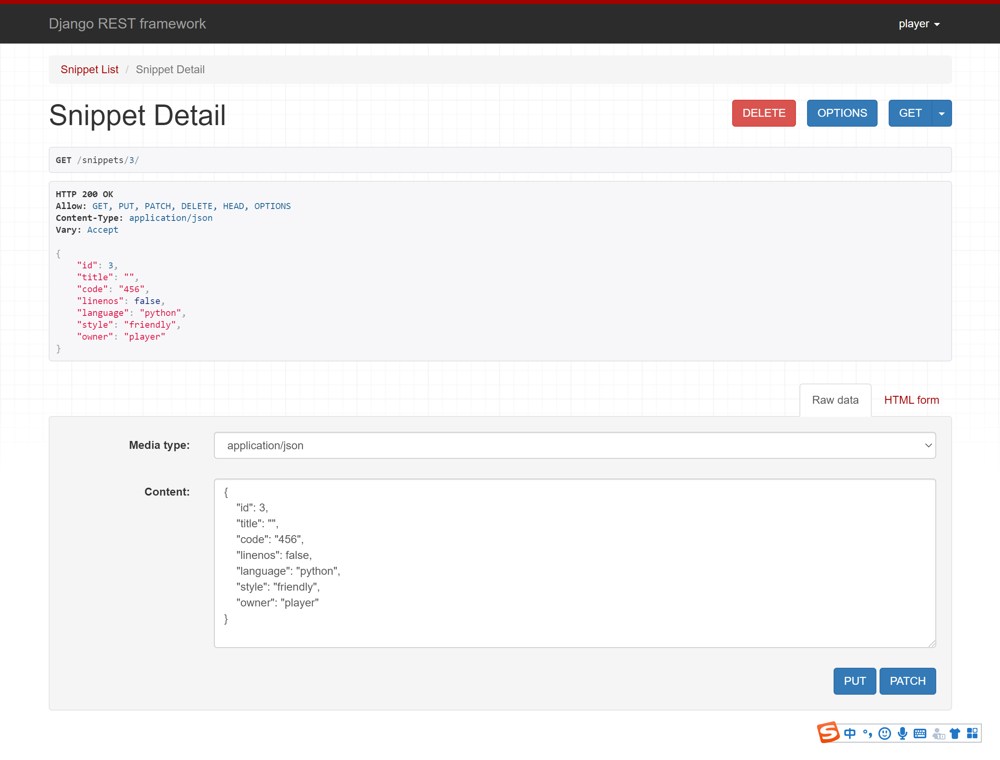

## 自定义权限

以上是官网的示例，我在Postman测试了下，发现超管dongfanger可以创建`snippet`：

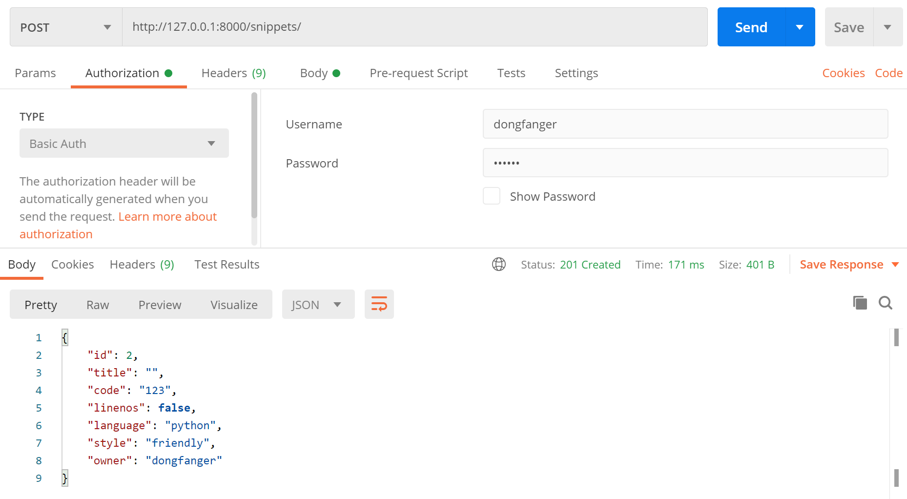

普通用户player也可以创建`snippet`：

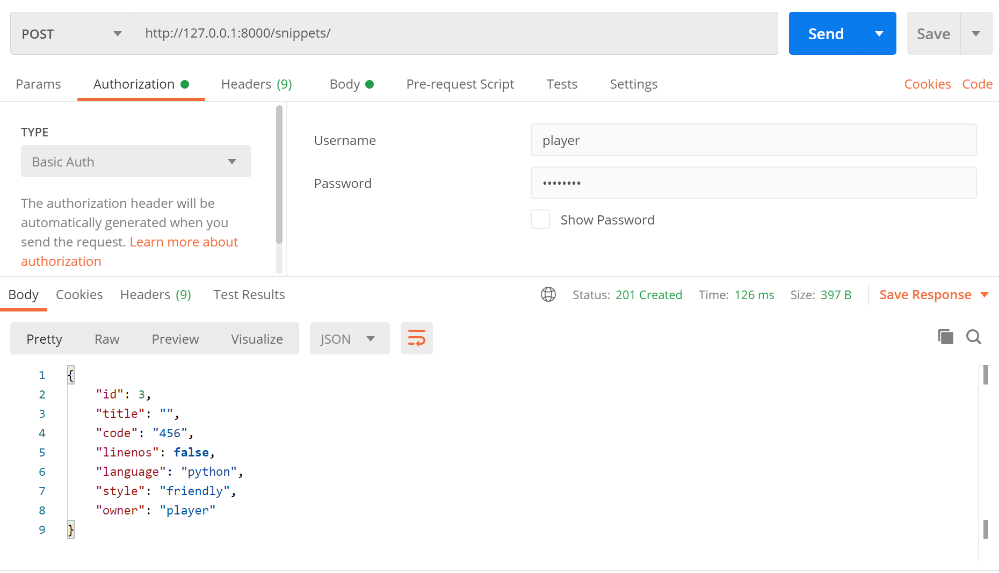

我想让普通用户不能创建，只能超管创建。仿照官网示例，在`snippets/permissions.py`中添加`IsAdminOrReadOnly`：

```python
class IsAdminOrReadOnly(permissions.BasePermission):
    def has_permission(self, request, view):
        return request.user.is_superuser
```

接着给`SnippetList`加上：

```python
permission_classes = [permissions.IsAuthenticatedOrReadOnly,
                      IsAdminOrReadOnly]
```

用普通用户尝试创建，提示没有权限：

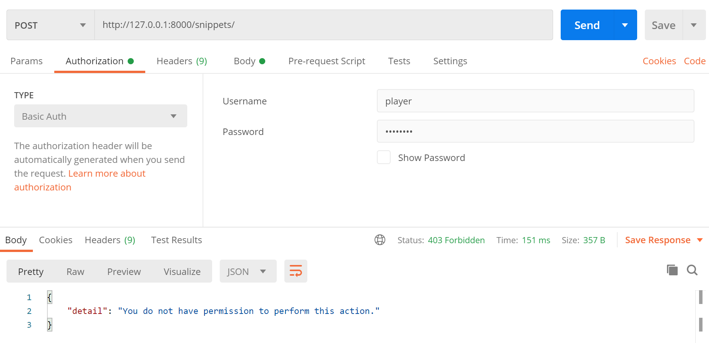

用超级管理员尝试创建，成功：

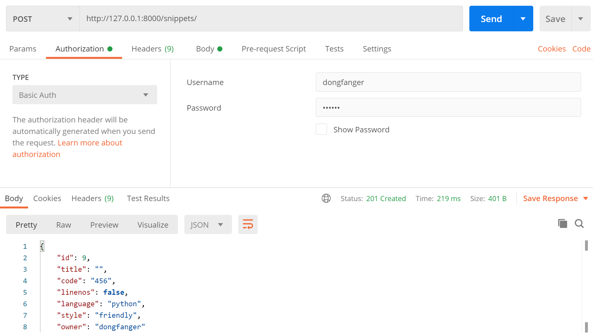

## 其他认证方式

本文使用的认证方式是默认的`SessionAuthentication`和`BasicAuthentication`，只要数据库的用户名、密码和请求中的用户凭证（用户名、密码）匹配上了，就认为认证成功。如果要实现token或jwt认证，需要使用到`rest_framework.authentication`：

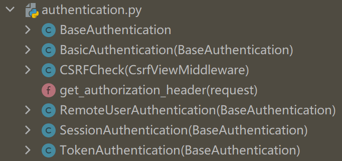

或`rest_framework_jwt.authentication`：

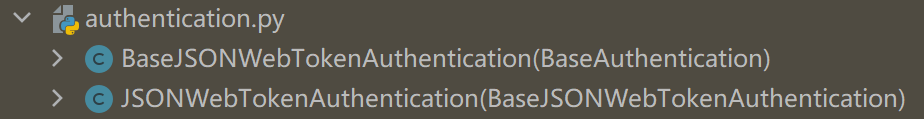

> pip install djangorestframework-jwt

这一部分内容官网教程中并没有提及，等我们把教程学完了，以后再找时间来介绍。

## 小结

DRF实现认证和权限的关键在于新增`permissions.py`模块，编写class，继承`permissions.BasePermission`，重写`has_permission()`或`has_object_permission()`方法，再添加class到类视图的`permission_classes`中。这块的内容比Django的认证系统那套简洁，但是有点混淆，另外我之前参照网上实现了一版JWT，也有点不一样。看来还得写篇对比的文章才行。

> 参考资料：
>
> https://www.django-rest-framework.org/tutorial/4-authentication-and-permissions/

