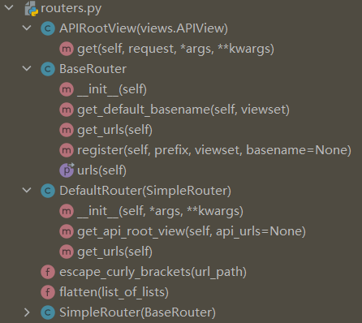
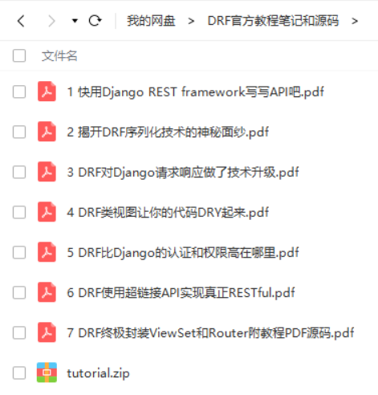

# 【Django】DRF终极封装ViewSet和Router附教程PDF源码


在DRF官方教程的学习过程中，一个很明显的感受是框架在不断地进行封装，我们自己写框架/工具/脚本/平台也可以模仿模仿，先完成底层代码，再做多层封装，让使用者很容易就上手操作。本文是教程的最后一篇，介绍ViewSets和Routers。

## ViewSets

先看看之前在给User模型创建Endpoint时，我们新增的2个视图：

```python
class UserList(generics.ListAPIView):
    queryset = User.objects.all()
    serializer_class = UserSerializer


class UserDetail(generics.RetrieveAPIView):
    queryset = User.objects.all()
    serializer_class = UserSerializer
```

DRF提供了`rest_framework.viewsets`：


可以把它们合成一个视图。

> set是集合的意思，ViewSets就是视图集合。

## ReadOnlyModelViewSet

我们先使用`ReadOnlyModelViewSet`把`UserList`和`UserDetail`视图合并成一个`UserViewSet`：

```python
from rest_framework import viewsets

class UserViewSet(viewsets.ReadOnlyModelViewSet):
    """
    This viewset automatically provides `list` and `retrieve` actions.
    """
    queryset = User.objects.all()
    serializer_class = UserSerializer
```

`viewsets.ReadOnlyModelViewSet`是只读视图集合，源码如下：

```python
class ReadOnlyModelViewSet(mixins.RetrieveModelMixin,
                           mixins.ListModelMixin,
                           GenericViewSet):
    """
    A viewset that provides default `list()` and `retrieve()` actions.
    """
    pass
```

它继承了`mixins.RetrieveModelMixin`、`mixins.ListModelMixin`和`GenericViewSet`：

`mixins.RetrieveModelMixin`

```python
class RetrieveModelMixin:
    """
    Retrieve a model instance.
    """
    def retrieve(self, request, *args, **kwargs):
        instance = self.get_object()
        serializer = self.get_serializer(instance)
        return Response(serializer.data)
```

`mixins.ListModelMixin`

```python
class ListModelMixin:
    """
    List a queryset.
    """
    def list(self, request, *args, **kwargs):
        queryset = self.filter_queryset(self.get_queryset())

        page = self.paginate_queryset(queryset)
        if page is not None:
            serializer = self.get_serializer(page, many=True)
            return self.get_paginated_response(serializer.data)

        serializer = self.get_serializer(queryset, many=True)
        return Response(serializer.data)
```

`viewsets.GenericViewSet`

```python
class GenericViewSet(ViewSetMixin, generics.GenericAPIView):
    """
    The GenericViewSet class does not provide any actions by default,
    but does include the base set of generic view behavior, such as
    the `get_object` and `get_queryset` methods.
    """
    pass
```

从源码可以看出，它提供了`list()`和`retrieve()`2个方法，正好对应`UserList`和`UserDetail`。

## ModelViewSet

再使用`ModelViewSet`把`SnippetList`、`SnippetDetail`和`SnippetHighlight`视图合并成一个`SnippetViewSet`：

```python
from rest_framework.decorators import action
from rest_framework.response import Response
from rest_framework import permissions

class SnippetViewSet(viewsets.ModelViewSet):
    """
    This viewset automatically provides `list`, `create`, `retrieve`,
    `update` and `destroy` actions.

    Additionally we also provide an extra `highlight` action.
    """
    queryset = Snippet.objects.all()
    serializer_class = SnippetSerializer
    permission_classes = [permissions.IsAuthenticatedOrReadOnly,
                          IsOwnerOrReadOnly]

    @action(detail=True, renderer_classes=[renderers.StaticHTMLRenderer])
    def highlight(self, request, *args, **kwargs):
        snippet = self.get_object()
        return Response(snippet.highlighted)

    def perform_create(self, serializer):
        serializer.save(owner=self.request.user)
```

`@action`装饰器用来创建除了`create`/`update`/`delete`以外的action，默认为`GET`请求，如果想改为`POST`请求，可以添加参数`methods`，它的源码如下：

```python
def action(methods=None, detail=None, url_path=None, url_name=None, **kwargs):
    """
    Mark a ViewSet method as a routable action.

    `@action`-decorated functions will be endowed with a `mapping` property,
    a `MethodMapper` that can be used to add additional method-based behaviors
    on the routed action.

    :param methods: A list of HTTP method names this action responds to.
                    Defaults to GET only.
    :param detail: Required. Determines whether this action applies to
                   instance/detail requests or collection/list requests.
    :param url_path: Define the URL segment for this action. Defaults to the
                     name of the method decorated.
    :param url_name: Define the internal (`reverse`) URL name for this action.
                     Defaults to the name of the method decorated with underscores
                     replaced with dashes.
    :param kwargs: Additional properties to set on the view.  This can be used
                   to override viewset-level *_classes settings, equivalent to
                   how the `@renderer_classes` etc. decorators work for function-
                   based API views.
    """
    methods = ['get'] if (methods is None) else methods
    methods = [method.lower() for method in methods]

    assert detail is not None, (
        "@action() missing required argument: 'detail'"
    )

    # name and suffix are mutually exclusive
    if 'name' in kwargs and 'suffix' in kwargs:
        raise TypeError("`name` and `suffix` are mutually exclusive arguments.")

    def decorator(func):
        func.mapping = MethodMapper(func, methods)

        func.detail = detail
        func.url_path = url_path if url_path else func.__name__
        func.url_name = url_name if url_name else func.__name__.replace('_', '-')

        # These kwargs will end up being passed to `ViewSet.as_view()` within
        # the router, which eventually delegates to Django's CBV `View`,
        # which assigns them as instance attributes for each request.
        func.kwargs = kwargs

        # Set descriptive arguments for viewsets
        if 'name' not in kwargs and 'suffix' not in kwargs:
            func.kwargs['name'] = pretty_name(func.__name__)
        func.kwargs['description'] = func.__doc__ or None

        return func
    return decorator
```

`viewsets.ModelViewSet`包含了增删改查视图集合，源码如下：

```python
class ModelViewSet(mixins.CreateModelMixin,
                   mixins.RetrieveModelMixin,
                   mixins.UpdateModelMixin,
                   mixins.DestroyModelMixin,
                   mixins.ListModelMixin,
                   GenericViewSet):
    """
    A viewset that provides default `create()`, `retrieve()`, `update()`,
    `partial_update()`, `destroy()` and `list()` actions.
    """
    pass
```

它继承了`mixins.CreateModelMixin`、`mixins.RetrieveModelMixin`、`mixins.UpdateModelMixin`、`mixins.DestroyModelMixin`、`mixins.ListModelMixin`、`GenericViewSet`：

> 其中`mixins.RetrieveModelMixin`、`mixins.ListModelMixin`和`GenericViewSet`在前面已经介绍过了

`mixins.CreateModelMixin`

```python
class CreateModelMixin:
    """
    Create a model instance.
    """
    def create(self, request, *args, **kwargs):
        serializer = self.get_serializer(data=request.data)
        serializer.is_valid(raise_exception=True)
        self.perform_create(serializer)
        headers = self.get_success_headers(serializer.data)
        return Response(serializer.data, status=status.HTTP_201_CREATED, headers=headers)

    def perform_create(self, serializer):
        serializer.save()

    def get_success_headers(self, data):
        try:
            return {'Location': str(data[api_settings.URL_FIELD_NAME])}
        except (TypeError, KeyError):
            return {}
```

`mixins.UpdateModelMixin`

```python
class UpdateModelMixin:
    """
    Update a model instance.
    """
    def update(self, request, *args, **kwargs):
        partial = kwargs.pop('partial', False)
        instance = self.get_object()
        serializer = self.get_serializer(instance, data=request.data, partial=partial)
        serializer.is_valid(raise_exception=True)
        self.perform_update(serializer)

        if getattr(instance, '_prefetched_objects_cache', None):
            # If 'prefetch_related' has been applied to a queryset, we need to
            # forcibly invalidate the prefetch cache on the instance.
            instance._prefetched_objects_cache = {}

        return Response(serializer.data)

    def perform_update(self, serializer):
        serializer.save()

    def partial_update(self, request, *args, **kwargs):
        kwargs['partial'] = True
        return self.update(request, *args, **kwargs)
```

`mixins.DestroyModelMixin`

```python
class DestroyModelMixin:
    """
    Destroy a model instance.
    """
    def destroy(self, request, *args, **kwargs):
        instance = self.get_object()
        self.perform_destroy(instance)
        return Response(status=status.HTTP_204_NO_CONTENT)

    def perform_destroy(self, instance):
        instance.delete()
```

## 修改URLConf

视图改为`ViewSet`后，需要同时修改URLConf，编辑`snippets/urls.py`：

```python
from snippets.views import SnippetViewSet, UserViewSet, api_root
from rest_framework import renderers

snippet_list = SnippetViewSet.as_view({
    'get': 'list',
    'post': 'create'
})
snippet_detail = SnippetViewSet.as_view({
    'get': 'retrieve',
    'put': 'update',
    'patch': 'partial_update',
    'delete': 'destroy'
})
snippet_highlight = SnippetViewSet.as_view({
    'get': 'highlight'
}, renderer_classes=[renderers.StaticHTMLRenderer])
user_list = UserViewSet.as_view({
    'get': 'list'
})
user_detail = UserViewSet.as_view({
    'get': 'retrieve'
})


urlpatterns = format_suffix_patterns([
    path('', api_root),
    path('snippets/', snippet_list, name='snippet-list'),
    path('snippets/<int:pk>/', snippet_detail, name='snippet-detail'),
    path('snippets/<int:pk>/highlight/', snippet_highlight, name='snippet-highlight'),
    path('users/', user_list, name='user-list'),
    path('users/<int:pk>/', user_detail, name='user-detail')
])
```

注意，`ViewSet`需要绑定http methods和action，以指定请求方法对应的处理动作。

## Routers

使用`ViewSet`的一大好处是可以自动配置路由，DRF提供了`rest_framework.routers`：



我们重新编写`snippets/urls.py`看看是什么效果：

```python
from django.urls import path, include
from rest_framework.routers import DefaultRouter
from snippets import views

## Create a router and register our viewsets with it.
router = DefaultRouter()
router.register(r'snippets', views.SnippetViewSet)
router.register(r'users', views.UserViewSet)

## The API URLs are now determined automatically by the router.
urlpatterns = [
    path('', include(router.urls)),
]
```

真是厉害！这封装简直高级！而且`DefaultRouter`提供了API根目录的Endpoint，我们甚至可以把`views.py`中的`api_root`也删了。

## 小结

本文是官方教程学习笔记的最后一篇了。可以从教程中了解到从函数视图到类视图，从View到ViewSet是如何封装起来的，实际运用中并不一定全部都得用类视图和ViewSet，还是需要平衡选择。后续还会有DRF系列的文章输出，不过作为阶段性成果，我把这7篇文章导成了PDF，和最后一版的源码，打包一起上传了，需要的话，可以在公众号后台回复【drf】获取：



> 参考资料：
>
> https://www.django-rest-framework.org/tutorial/6-viewsets-and-routers/