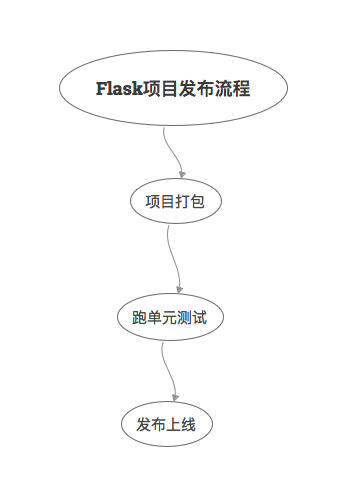

# 【Flask】Flask项目发布流程


本文继续对Flask官方教程进行学习，我就直接跳过Templates、Static Files、Blog Blueprint三小节了，因为基本不会在实际项目中用到这些技术，有时间多学习下前端才是。这篇文章把Make the Project Installable、Test Coverage、Deploy to Production这三小节汇总来学习。我觉得这是官方给出的一个Flask项目发布流程，如下图所示：



这跟我在大型项目中接触到的发布流程大同小异。尤其是对于我们测试来说，**跑单元测试**这个环节还是有必要好好了解一下的，幸运的是，得益于Python的简单，理解起来会更容易些。所谓一通百通，Flask的单测懂了，其他语言的单测也通了。

## 项目打包

创建setup.py文件：

```python
from setuptools import find_packages, setup

setup(
    name='flaskr',
    version='1.0.0',
    packages=find_packages(),
    include_package_data=True,
    zip_safe=False,
    install_requires=[
        'flask',
    ],
)
```

- packages指定Python包，`find_packages()`函数会自动查找。
- include_package_data表示包括其他文件比如静态（static）文件和模板（templates）文件。

如果还需要包括其他数据，那么就创建MANIFEST.in文件：

```
include flaskr/schema.sql
graft flaskr/static
graft flaskr/templates
global-exclude *.pyc
```

其中global-exclude排除了`*.pyc`文件。

接着就可以使用pip命令安装了：

```shell
$ pip install -e .
```

安装以后就能用`pip list`命令查看：

```shell
$ pip list

Package        Version   Location
-------------- --------- ----------------------------------
click          6.7
Flask          1.0
flaskr         1.0.0     /home/user/Projects/flask-tutorial
itsdangerous   0.24
Jinja2         2.10
MarkupSafe     1.0
pip            9.0.3
setuptools     39.0.1
Werkzeug       0.14.1
wheel          0.30.0
```

这个过程是这样的：pip在当前目录找到`setup.py`文件，然后根据文件描述把项目文件打包后安装到本地。安装以后就能在任何位置使用`flask run`来启动应用了，而不仅仅是在`flask-turorial`目录下。

## 跑单元测试

单元测试不能保证程序没有Bug，但却是在开发阶段保障代码质量的有效手段。拿我们公司举例来说，开发提测和上线，都会把单元测试作为卡点，单测覆盖率没有达到45%是不能提测和上线的。

Flask项目的单元测试要用到两个工具，一个是我们非常熟悉的pytest，还有一个是coverage，先安装它们：

```shell
$ pip install pytest coverage
```

新建tests/data.sql文件，插入一些测试数据：

```sql
INSERT INTO user (username, password)
VALUES
  ('test', 'pbkdf2:sha256:50000$TCI4GzcX$0de171a4f4dac32e3364c7ddc7c14f3e2fa61f2d17574483f7ffbb431b4acb2f'),
  ('other', 'pbkdf2:sha256:50000$kJPKsz6N$d2d4784f1b030a9761f5ccaeeaca413f27f2ecb76d6168407af962ddce849f79');

INSERT INTO post (title, body, author_id, created)
VALUES
  ('test title', 'test' || x'0a' || 'body', 1, '2018-01-01 00:00:00');
```

pytest的fixture相当于setup，可以做一些测试前的初始化工作，新建tests/conftest.py，编写fixture：

```python
import os
import tempfile

import pytest
from flaskr import create_app
from flaskr.db import get_db, init_db

with open(os.path.join(os.path.dirname(__file__), 'data.sql'), 'rb') as f:
    _data_sql = f.read().decode('utf8')


@pytest.fixture
def app():
    db_fd, db_path = tempfile.mkstemp()

    app = create_app({
        'TESTING': True,
        'DATABASE': db_path,
    })

    with app.app_context():
        init_db()
        get_db().executescript(_data_sql)

    yield app

    os.close(db_fd)
    os.unlink(db_path)


@pytest.fixture
def client(app):
    return app.test_client()


@pytest.fixture
def runner(app):
    return app.test_cli_runner()
```

**app**

创建应用，初始化数据库，使用的是测试配置和测试数据。

1. `tempfile.mkstemp()`创建了一个临时文件，返回文件描述符和文件路径。并且把临时文件路径传入了`DATABASE`，接着插入测试数据。测试结束后关闭和移除临时文件。

   > fixture的yield前面的代码相当于setup，yield后面的代码相当于teardown。

2. `TESTING: True`将Flask置为测试模式，Flask内部会进行一些调整以便于进行测试。

**client**

调用`app.test_client`返回一个测试客户端，可以用这个客户端给应用发送请求。

**runner**

调用`app.test_cli_runner()`返回一个可以执行应用已注册命令的runner。

测试一下Factory：

```python
# tests/test_factory.py
from flaskr import create_app


def test_config():
    assert not create_app().testing
    assert create_app({'TESTING': True}).testing


def test_hello(client):
    response = client.get('/hello')
    assert response.data == b'Hello, World!'
```

测试一下Database：

```python
# tests/test_db.py
import sqlite3

import pytest
from flaskr.db import get_db


def test_get_close_db(app):
    with app.app_context():
        db = get_db()
        assert db is get_db()

    with pytest.raises(sqlite3.ProgrammingError) as e:
        db.execute('SELECT 1')

    assert 'closed' in str(e.value)
    

def test_init_db_command(runner, monkeypatch):
    class Recorder(object):
        called = False

    def fake_init_db():
        Recorder.called = True

    # monkeypatch是pytest内置的一个fixture，也就是猴子补丁。
    monkeypatch.setattr('flaskr.db.init_db', fake_init_db)
    result = runner.invoke(args=['init-db'])
    assert 'Initialized' in result.output
    assert Recorder.called
```

测试一下Authentication：

```python
# tests/conftest.py
class AuthActions(object):
    def __init__(self, client):
        self._client = client

    def login(self, username='test', password='test'):
        return self._client.post(
            '/auth/login',
            data={'username': username, 'password': password}
        )

    def logout(self):
        return self._client.get('/auth/logout')


# 这样就可以使用auth.login()进行用户登录
@pytest.fixture
def auth(client):
    return AuthActions(client)
```

```python
# tests/test_auth.py
import pytest
from flask import g, session
from flaskr.db import get_db


def test_register(client, app):
    assert client.get('/auth/register').status_code == 200
    response = client.post(
        '/auth/register', data={'username': 'a', 'password': 'a'}
    )
    assert 'http://localhost/auth/login' == response.headers['Location']

    with app.app_context():
        assert get_db().execute(
            "SELECT * FROM user WHERE username = 'a'",
        ).fetchone() is not None


@pytest.mark.parametrize(('username', 'password', 'message'), (
    ('', '', b'Username is required.'),
    ('a', '', b'Password is required.'),
    ('test', 'test', b'already registered'),
))
def test_register_validate_input(client, username, password, message):
    response = client.post(
        '/auth/register',
        data={'username': username, 'password': password}
    )
    assert message in response.data
    

def test_login(client, auth):
    assert client.get('/auth/login').status_code == 200
    response = auth.login()
    assert response.headers['Location'] == 'http://localhost/'

    # 使用with后就能在上下文中访问session
    with client:
        client.get('/')
        assert session['user_id'] == 1
        assert g.user['username'] == 'test'


@pytest.mark.parametrize(('username', 'password', 'message'), (
    ('a', 'test', b'Incorrect username.'),
    ('test', 'a', b'Incorrect password.'),
))
def test_login_validate_input(auth, username, password, message):
    response = auth.login(username, password)
    assert message in response.data
    
    
def test_logout(client, auth):
    auth.login()

    # 使用with后就能在上下文中访问session
    with client:
        auth.logout()
        assert 'user_id' not in session
```

更多关于Blog的测试用例就不在此赘述了，感兴趣的同学可以点击文章尾部链接到官网查看。

最后用例写完了，就该运行了。在setup.cfg文件中添加一些配置，可以适当减少单测冗余：

```
[tool:pytest]
testpaths = tests

[coverage:run]
branch = True
source =
    flaskr
```

然后就可以执行pytest了：

```
$ pytest

========================= test session starts ==========================
platform linux -- Python 3.6.4, pytest-3.5.0, py-1.5.3, pluggy-0.6.0
rootdir: /home/user/Projects/flask-tutorial, inifile: setup.cfg
collected 23 items

tests/test_auth.py ........                                      [ 34%]
tests/test_blog.py ............                                  [ 86%]
tests/test_db.py ..                                              [ 95%]
tests/test_factory.py ..                                         [100%]

====================== 24 passed in 0.64 seconds =======================
```

> `pytest -v`可以显示每个测试函数。

单测覆盖率才是灵魂，所以建议这样来跑单测：

```
$ coverage run -m pytest
```

然后查看报告：

```
$ coverage report

Name                 Stmts   Miss Branch BrPart  Cover
------------------------------------------------------
flaskr/__init__.py      21      0      2      0   100%
flaskr/auth.py          54      0     22      0   100%
flaskr/blog.py          54      0     16      0   100%
flaskr/db.py            24      0      4      0   100%
------------------------------------------------------
TOTAL                  153      0     44      0   100%
```

也可以生成html报告：

```
$ coverage html
```

## 发布上线

先安装wheel库：

```shell
$ pip install wheel
```

然后创建`.whl`文件：

```shell
$ python setup.py bdist_wheel
```

命令执行后会生成一个`dist/flaskr-1.0.0-py3-none-any.whl`文件，文件格式是`{project name}-{version}-{python tag} -{abi tag}-{platform tag}`。

在服务器上就可以安装了：

```shell
$ pip install flaskr-1.0.0-py3-none-any.whl
```

因为是新机器，所以需要初始化数据库：

```shell
$ export FLASK_APP=flaskr
$ flask init-db
```

如果是Python虚拟环境，那么可以在`venv/var/flaskr-instance`找到Flask实例。

最后设置下SECRET_KEY，Flask官网给出一种生成随机SECRET_KEY的方法：

```shell
$ python -c 'import secrets; print(secrets.token_hex())'

'192b9bdd22ab9ed4d12e236c78afcb9a393ec15f71bbf5dc987d54727823bcbf'
```

生成后新建venv/var/flaskr-instance/config.py文件粘贴即可：

```
SECRET_KEY = '192b9bdd22ab9ed4d12e236c78afcb9a393ec15f71bbf5dc987d54727823bcbf'
```

至于生产服务器的选取，建议不要使用`flask run`，因为这是Werkzeug提供的开发服务器，既不稳定，也不安全。

可以使用WSGI服务器，比如Waitress：

```
$ pip install waitress
```

```
$ waitress-serve --call 'flaskr:create_app'

Serving on http://0.0.0.0:8080
```

标准的WSGI服务器如下：

- Gunicorn

- uWSGI

- Gevent，我们组就用的这个：

  ```python
  from gevent.pywsgi import WSGIServer
  from yourapplication import app
  
  http_server = WSGIServer(('', 5000), app)
  http_server.serve_forever()
  ```

- Twisted Web

- Proxy Setups

> 参考资料：
>
> https://flask.palletsprojects.com/en/2.0.x/tutorial/install/
>
> https://flask.palletsprojects.com/en/2.0.x/tutorial/tests/
>
> https://flask.palletsprojects.com/en/2.0.x/tutorial/deploy/