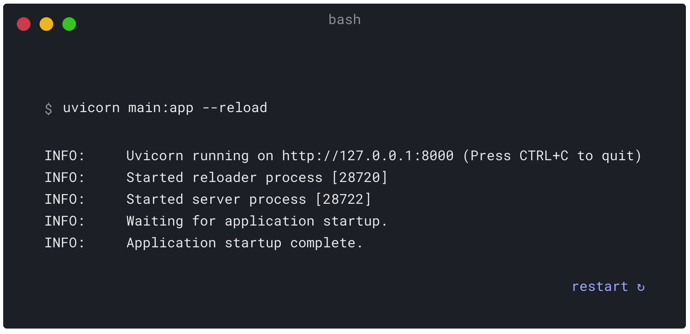
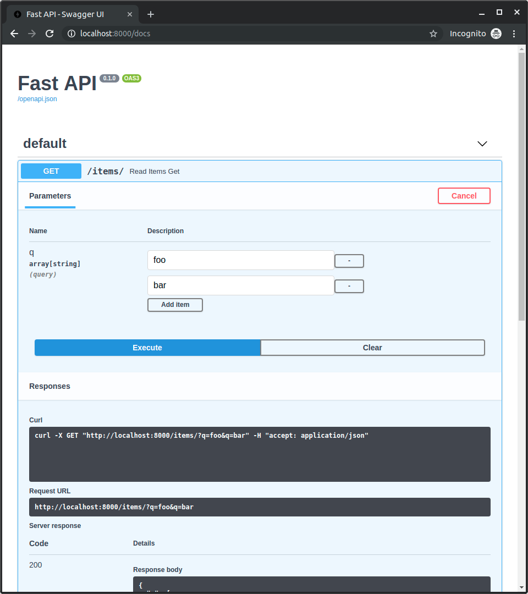

# 【FastAPI】FastAPI官方教程太棒了（上）


## Python第三流行的Web框架

在2020年的Python开发者调查结果中，有这样一段话：“FastAPI在此次调查迭代中首次被引为选项，表现为Python第三流行的Web框架。”


FastAPI创立于2018年12月，不到2年就成为仅次于Flask和Django的第三流行的Web框架。而又经过了一年发展来到2022年，虽然2021年Python开发者调查结果还没有出来，但是从GitHub的star来看，Flask 58.7k，Django 63.6k，FastAPI 44.2k，这个差距缩得越来越小。

## FastAPI特性

这里就不做机器翻译了，大家看下原文：


我说下我选择FastAPI的理由：首先就是HttpRunner集成了FastAPI，有大佬背书，相信这个框架足以优秀。其次是注解，用多了SpringBoot以后，越来越喜欢注解，层次清晰。对于前后端分离项目来说，Flask虽然非常精简却又自带了Jinja模板引擎，Django虽然是百宝箱却又显得太重，而FastAPI介于两者之间，就是一个纯粹的后端应用。并且FastAPI是基于Starlette框架的，集成了实用功能比如类型检查、OpenAPI（Swagger）等等，这跟我基于pytest框架做tep测试工具的理念很相似。

## 安装

对Python版本要求是3.6+。

先安装FastAPI：

```shell
pip install fastapi
```


再安装ASGI服务器，比如Uvicorn：

```shell
pip install "uvicorn[standard]"
```


也可以同时安装fastapi和uvicorn：

```shell
pip install "fastapi[all]"
```

## 运行

写个`main.py`文件：

```python
from typing import Optional

from fastapi import FastAPI

app = FastAPI()


@app.get("/")
def read_root():
    return {"Hello": "World"}


@app.get("/items/{item_id}")
def read_item(item_id: int, q: Optional[str] = None):
    return {"item_id": item_id, "q": q}
```

在命令行输入启动应用：

```shell
uvicorn main:app --reload
```

`main`是Python模块名。

`app`是`app = FastAPI()`。

`--reload`在代码变化时自动重启服务器。



打开浏览器访问：

http://127.0.0.1:8000/items/5?q=somequery

就能看到JSON响应：

```json
{"item_id": 5, "q": "somequery"}
```

访问：

http://127.0.0.1:8000/docs

就能看到Swagger接口文档：


## pydantic

pydantic是一个数据验证的库，FastAPI使用它来做模型校验。比如：

```python
from typing import Optional

from fastapi import FastAPI
from pydantic import BaseModel

app = FastAPI()


class Item(BaseModel):
    name: str
    price: float
    is_offer: Optional[bool] = None


@app.get("/")
def read_root():
    return {"Hello": "World"}


@app.get("/items/{item_id}")
def read_item(item_id: int, q: Optional[str] = None):
    return {"item_id": item_id, "q": q}


@app.put("/items/{item_id}")
def update_item(item_id: int, item: Item):
    return {"item_name": item.name, "item_id": item_id}
```

`Item`是个入参模型，它的name必须str类型，price必须float类型，is_offer是可选的，可以为bool类型或不传。

```
PUT http://127.0.0.1:8000/items/6
{
    "name": "dongfanger",
    "price": 2.3,
    "is_offer":  true
}


{
    "item_name": "dongfanger",
    "item_id": 6
}
```

## 路径参数

把路径参数传递给函数：

```python
from fastapi import FastAPI

app = FastAPI()


@app.get("/items/{item_id}")
async def read_item(item_id):
    return {"item_id": item_id}
```

也可以指定Python类型：

```python
from fastapi import FastAPI

app = FastAPI()


@app.get("/items/{item_id}")
async def read_item(item_id: int):
    return {"item_id": item_id}
```

效果是访问 http://127.0.0.1:8000/items/foo 会返回`{"item_id":"foo"}`。

指定了Python类型后，FastAPI会强制检查，比如传str会报错：

 http://127.0.0.1:8000/items/foo

```json
{
    "detail": [
        {
            "loc": [
                "path",
                "item_id"
            ],
            "msg": "value is not a valid integer",
            "type": "type_error.integer"
        }
    ]
}
```

传float也会报错：

http://127.0.0.1:8000/items/4.2

**匹配先后顺序**

代码定义的先后顺序会决定匹配结果，比如正常来说，下面的`/users/me`会返回`{"user_id": "the current user"}`：

```python
from fastapi import FastAPI

app = FastAPI()


@app.get("/users/me")
async def read_user_me():
    return {"user_id": "the current user"}


@app.get("/users/{user_id}")
async def read_user(user_id: str):
    return {"user_id": user_id}
```

假如这2个path定义顺序反过来，那么`/users/me`就会匹配到`/users/{user_id}`而返回`{"user_id": me}`了。

**枚举路径**

借助于Enun类，可以实现枚举路径：

```python
from enum import Enum

from fastapi import FastAPI


class ModelName(str, Enum):
    alexnet = "alexnet"
    resnet = "resnet"
    lenet = "lenet"


app = FastAPI()


@app.get("/models/{model_name}")
async def get_model(model_name: ModelName):
    if model_name == ModelName.alexnet:
        return {"model_name": model_name, "message": "Deep Learning FTW!"}

    if model_name.value == "lenet":
        return {"model_name": model_name, "message": "LeCNN all the images"}

    return {"model_name": model_name, "message": "Have some residuals"}
```

效果：


**path匹配**

FastAPI提供了一个path类型，可以用来对文件路径进行格式匹配：

```python
from fastapi import FastAPI

app = FastAPI()


@app.get("/files/{file_path:path}")
async def read_file(file_path: str):
    return {"file_path": file_path}
```

## 查询参数

查询参数是跟在路径参数后面，用`?`分隔用`&`连接的参数，比如`http://127.0.0.1:8000/items/?skip=0&limit=10`。

实现：

```python
from fastapi import FastAPI

app = FastAPI()

fake_items_db = [{"item_name": "Foo"}, {"item_name": "Bar"}, {"item_name": "Baz"}]


@app.get("/items/")
async def read_item(skip: int = 0, limit: int = 10):
    return fake_items_db[skip : skip + limit]
```

参数是可选的并且设置了默认值：`limit: int = 10`

参数是可选的，无默认值：`limit: Optional[int] = None`

> 注意：是否可选是由None来决定的，而Optional只是为编译器提供支持，跟FastAPI没有关系。

参数是必填的：`limit: int`

## 请求体

FastAPI的请求体借助于pydantic来实现：

```python
from typing import Optional

from fastapi import FastAPI
from pydantic import BaseModel


class Item(BaseModel):
    name: str
    description: Optional[str] = None
    price: float
    tax: Optional[float] = None


app = FastAPI()


@app.post("/items/")
async def create_item(item: Item):
    return item
```

继承于BaseModel来自定义Model，FastAPI会自动转换为JSON。

> Pydantic PyCharm Plugin插件提高编码体验：
>
> - auto-completion
> - type checks
> - refactoring
> - searching
> - inspections

**路径参数+查询参数+请求体**

总结一下，在函数参数中，url path中定义的叫做路径参数，没有定义的叫做查询参数，类型是pydantic model的叫做请求体，FastAPI会根据这套规则来自动识别：

```python
from typing import Optional

from fastapi import FastAPI
from pydantic import BaseModel


class Item(BaseModel):
    name: str
    description: Optional[str] = None
    price: float
    tax: Optional[float] = None


app = FastAPI()


@app.put("/items/{item_id}")
async def create_item(item_id: int, item: Item, q: Optional[str] = None):
    result = {"item_id": item_id, **item.dict()}
    if q:
        result.update({"q": q})
    return result
```

## 查询参数字符串校验

FastAPI提供了Query来支持对入参的字符串校验，比如最小长度和最大长度：

```python
from typing import Optional

from fastapi import FastAPI, Query

app = FastAPI()


@app.get("/items/")
async def read_items(
    q: Optional[str] = Query(None, min_length=3, max_length=50, regex="^fixedquery$")
):
    results = {"items": [{"item_id": "Foo"}, {"item_id": "Bar"}]}
    if q:
        results.update({"q": q})
    return results
```

甚至其中也能包含正则表达式：`regex="^fixedquery$"`。

用Query时指定默认值：

```python
from fastapi import FastAPI, Query

app = FastAPI()


@app.get("/items/")
async def read_items(q: str = Query("fixedquery", min_length=3)):
    results = {"items": [{"item_id": "Foo"}, {"item_id": "Bar"}]}
    if q:
        results.update({"q": q})
    return results
```

用Query时必填：

```python
from fastapi import FastAPI, Query

app = FastAPI()


@app.get("/items/")
async def read_items(q: str = Query(..., min_length=3)):
    results = {"items": [{"item_id": "Foo"}, {"item_id": "Bar"}]}
    if q:
        results.update({"q": q})
    return results
```

**查询参数传list**

```python
from typing import List, Optional

from fastapi import FastAPI, Query

app = FastAPI()


@app.get("/items/")
async def read_items(q: Optional[List[str]] = Query(None)):
    query_items = {"q": q}
    return query_items
```

指定默认值：

```python
from typing import List

from fastapi import FastAPI, Query

app = FastAPI()


@app.get("/items/")
async def read_items(q: List[str] = Query(["foo", "bar"])):
    query_items = {"q": q}
    return query_items
```

url就像这样：`http://localhost:8000/items/?q=foo&q=bar`



指定别名，比如`http://127.0.0.1:8000/items/?item-query=foobaritems`中的`item-query`不是Python变量命名，那么可以设置别名：

```python
from typing import Optional

from fastapi import FastAPI, Query

app = FastAPI()


@app.get("/items/")
async def read_items(q: Optional[str] = Query(None, alias="item-query")):
    results = {"items": [{"item_id": "Foo"}, {"item_id": "Bar"}]}
    if q:
        results.update({"q": q})
    return results
```

## 路径参数数字校验

查询参数用`Query`做字符串（String）校验，路径参数用`Path`做数字（Numeric）校验：

```python
from fastapi import FastAPI, Path

app = FastAPI()


@app.get("/items/{item_id}")
async def read_items(
    *,
    item_id: int = Path(..., title="The ID of the item to get", gt=0, le=1000),
    q: str,
):
    results = {"item_id": item_id}
    if q:
        results.update({"q": q})
    return results
```

路径参数永远都是必填的，因为它是url一部分。`...`表示必填，就算设置为None也没有用，仍然是必填。

`ge`表示大于等于，greater equal。

`le`表示小于等于，less equal。

`gt`表示大于，greater than。

 `lt`表示小于，less than。

## 请求体-多参数

一、如果请求体嵌套了多个JSON：

```json
{
    "item": {
        "name": "Foo",
        "description": "The pretender",
        "price": 42.0,
        "tax": 3.2
    },
    "user": {
        "username": "dave",
        "full_name": "Dave Grohl"
    }
}
```

那么就需要在FastAPI中定义多参数：

```python
from typing import Optional

from fastapi import FastAPI
from pydantic import BaseModel

app = FastAPI()


class Item(BaseModel):
    name: str
    description: Optional[str] = None
    price: float
    tax: Optional[float] = None


class User(BaseModel):
    username: str
    full_name: Optional[str] = None


@app.put("/items/{item_id}")
async def update_item(item_id: int, item: Item, user: User):
    results = {"item_id": item_id, "item": item, "user": user}
    return results
```

这里定义了2个Model：Item和User。

二、而如果多个参数中有个参数只是单个值，比如这里的`importance`：

```json
{
    "item": {
        "name": "Foo",
        "description": "The pretender",
        "price": 42.0,
        "tax": 3.2
    },
    "user": {
        "username": "dave",
        "full_name": "Dave Grohl"
    },
    "importance": 5
}
```

那么定义成变量并赋值`= Body()`即可：

```python
@app.put("/items/{item_id}")
async def update_item(item_id: int, item: Item, user: User, importance: int = Body()):
    results = {"item_id": item_id, "item": item, "user": user, "importance": importance}
    return results
```

三、在只有一个Item的时候，FastAPI默认会接收这样的body：

```json
{
    "name": "Foo",
    "description": "The pretender",
    "price": 42.0,
    "tax": 3.2
}
```

假如想把item也放到JSON中：

```json
{
    "item": {
        "name": "Foo",
        "description": "The pretender",
        "price": 42.0,
        "tax": 3.2
    }
}
```

那么可以使用`Body(embed=True))`：

```python
from typing import Union

from fastapi import Body, FastAPI
from pydantic import BaseModel

app = FastAPI()


class Item(BaseModel):
    name: str
    description: Union[str, None] = None
    price: float
    tax: Union[float, None] = None


@app.put("/items/{item_id}")
async def update_item(item_id: int, item: Item = Body(embed=True)):
    results = {"item_id": item_id, "item": item}
    return results
```

## 请求体-字段

Pydantic提供了`Field`来给body中的字段添加额外校验：

```python
from typing import Union

from fastapi import Body, FastAPI
from pydantic import BaseModel, Field

app = FastAPI()


class Item(BaseModel):
    name: str
    description: Union[str, None] = Field(
        default=None, title="The description of the item", max_length=300
    )
    price: float = Field(gt=0, description="The price must be greater than zero")
    tax: Union[float, None] = None


@app.put("/items/{item_id}")
async def update_item(item_id: int, item: Item = Body(embed=True)):
    results = {"item_id": item_id, "item": item}
    return results
```

跟FastAPI提供的`Query`、`Path`、`Body`作用类似。

## 请求体-嵌套模型

传List：

```python
from typing import List, Union

from fastapi import FastAPI
from pydantic import BaseModel

app = FastAPI()


class Item(BaseModel):
    name: str
    description: Union[str, None] = None
    price: float
    tax: Union[float, None] = None
    tags: List[str] = []


@app.put("/items/{item_id}")
async def update_item(item_id: int, item: Item):
    results = {"item_id": item_id, "item": item}
    return results
```

传Set，自动去重：

```python
from typing import Set, Union

from fastapi import FastAPI
from pydantic import BaseModel

app = FastAPI()


class Item(BaseModel):
    name: str
    description: Union[str, None] = None
    price: float
    tax: Union[float, None] = None
    tags: Set[str] = set()


@app.put("/items/{item_id}")
async def update_item(item_id: int, item: Item):
    results = {"item_id": item_id, "item": item}
    return results
```

传Model：

```python
from typing import Set, Union

from fastapi import FastAPI
from pydantic import BaseModel

app = FastAPI()


class Image(BaseModel):
    url: str
    name: str


class Item(BaseModel):
    name: str
    description: Union[str, None] = None
    price: float
    tax: Union[float, None] = None
    tags: Set[str] = set()
    image: Union[Image, None] = None


@app.put("/items/{item_id}")
async def update_item(item_id: int, item: Item):
    results = {"item_id": item_id, "item": item}
    return results
```

入参会像这样：

```json
{
    "name": "Foo",
    "description": "The pretender",
    "price": 42.0,
    "tax": 3.2,
    "tags": ["rock", "metal", "bar"],
    "image": {
        "url": "http://example.com/baz.jpg",
        "name": "The Foo live"
    }
}
```

> 对于url，pydantic提供了HttpUrl来做校验：
>
> ```python
> class Image(BaseModel):
>     url: HttpUrl
>     name: str
> ```

传Model的List：

```python
from typing import List, Set, Union

from fastapi import FastAPI
from pydantic import BaseModel, HttpUrl

app = FastAPI()


class Image(BaseModel):
    url: HttpUrl
    name: str


class Item(BaseModel):
    name: str
    description: Union[str, None] = None
    price: float
    tax: Union[float, None] = None
    tags: Set[str] = set()
    images: Union[List[Image], None] = None


@app.put("/items/{item_id}")
async def update_item(item_id: int, item: Item):
    results = {"item_id": item_id, "item": item}
    return results
```

入参像这样：

```json
{
    "name": "Foo",
    "description": "The pretender",
    "price": 42.0,
    "tax": 3.2,
    "tags": [
        "rock",
        "metal",
        "bar"
    ],
    "images": [
        {
            "url": "http://example.com/baz.jpg",
            "name": "The Foo live"
        },
        {
            "url": "http://example.com/dave.jpg",
            "name": "The Baz"
        }
    ]
}
```

## 添加示例请求

通过`Config`和`schema_extra`添加示例请求：

```python
from typing import Union

from fastapi import FastAPI
from pydantic import BaseModel

app = FastAPI()


class Item(BaseModel):
    name: str
    description: Union[str, None] = None
    price: float
    tax: Union[float, None] = None

    class Config:
        schema_extra = {
            "example": {
                "name": "Foo",
                "description": "A very nice Item",
                "price": 35.4,
                "tax": 3.2,
            }
        }


@app.put("/items/{item_id}")
async def update_item(item_id: int, item: Item):
    results = {"item_id": item_id, "item": item}
    return results
```

在使用以下任一时，都可以添加example：

- `Path()`
- `Query()`
- `Header()`
- `Cookie()`
- `Body()`
- `Form()`
- `File()`

比如：

```python
from typing import Union

from fastapi import FastAPI
from pydantic import BaseModel, Field

app = FastAPI()


class Item(BaseModel):
    name: str = Field(example="Foo")
    description: Union[str, None] = Field(default=None, example="A very nice Item")
    price: float = Field(example=35.4)
    tax: Union[float, None] = Field(default=None, example=3.2)


@app.put("/items/{item_id}")
async def update_item(item_id: int, item: Item):
    results = {"item_id": item_id, "item": item}
    return results
```

```python
from typing import Union

from fastapi import Body, FastAPI
from pydantic import BaseModel

app = FastAPI()


class Item(BaseModel):
    name: str
    description: Union[str, None] = None
    price: float
    tax: Union[float, None] = None


@app.put("/items/{item_id}")
async def update_item(
    item_id: int,
    item: Item = Body(
        example={
            "name": "Foo",
            "description": "A very nice Item",
            "price": 35.4,
            "tax": 3.2,
        },
    ),
):
    results = {"item_id": item_id, "item": item}
    return results
```

```python
from typing import Union

from fastapi import Body, FastAPI
from pydantic import BaseModel

app = FastAPI()


class Item(BaseModel):
    name: str
    description: Union[str, None] = None
    price: float
    tax: Union[float, None] = None


@app.put("/items/{item_id}")
async def update_item(
    *,
    item_id: int,
    item: Item = Body(
        examples={
            "normal": {
                "summary": "A normal example",
                "description": "A **normal** item works correctly.",
                "value": {
                    "name": "Foo",
                    "description": "A very nice Item",
                    "price": 35.4,
                    "tax": 3.2,
                },
            },
            "converted": {
                "summary": "An example with converted data",
                "description": "FastAPI can convert price `strings` to actual `numbers` automatically",
                "value": {
                    "name": "Bar",
                    "price": "35.4",
                },
            },
            "invalid": {
                "summary": "Invalid data is rejected with an error",
                "value": {
                    "name": "Baz",
                    "price": "thirty five point four",
                },
            },
        },
    ),
):
    results = {"item_id": item_id, "item": item}
    return results
```

## 额外数据类型

FastAPI除了支持常见的数据类型：

- `int`
- `float`
- `str`
- `bool`

还支持额外的数据类型：

- `UUID`
- `datetime.datetime`
- `datetime.date`
- `datetime.time`
- `datetime.timedelta`
- `frozenset`
- `bytes`
- `Decimal`

示例：

```python
from datetime import datetime, time, timedelta
from typing import Union
from uuid import UUID

from fastapi import Body, FastAPI

app = FastAPI()


@app.put("/items/{item_id}")
async def read_items(
    item_id: UUID,
    start_datetime: Union[datetime, None] = Body(default=None),
    end_datetime: Union[datetime, None] = Body(default=None),
    repeat_at: Union[time, None] = Body(default=None),
    process_after: Union[timedelta, None] = Body(default=None),
):
    start_process = start_datetime + process_after
    duration = end_datetime - start_process
    return {
        "item_id": item_id,
        "start_datetime": start_datetime,
        "end_datetime": end_datetime,
        "repeat_at": repeat_at,
        "process_after": process_after,
        "start_process": start_process,
        "duration": duration,
    }
```

## Cookie

```python
from typing import Union

from fastapi import Cookie, FastAPI

app = FastAPI()


@app.get("/items/")
async def read_items(ads_id: Union[str, None] = Cookie(default=None)):
    return {"ads_id": ads_id}
```

跟`Query`和 `Path`用法类似。

## Header

```python
from typing import Union

from fastapi import FastAPI, Header

app = FastAPI()


@app.get("/items/")
async def read_items(user_agent: Union[str, None] = Header(default=None)):
    return {"User-Agent": user_agent}
```

多重header用List，比如：

```python
from typing import Union

from fastapi import FastAPI, Header

app = FastAPI()


@app.get("/items/")
async def read_items(user_agent: Union[str, None] = Header(default=None)):
    return {"User-Agent": user_agent}
```

```
X-Token: foo
X-Token: bar
```

```python
{
    "X-Token values": [
        "bar",
        "foo"
    ]
}
```

## 响应模型

通过`response_model`定义返回模型：

```python
from typing import List, Union

from fastapi import FastAPI
from pydantic import BaseModel

app = FastAPI()


class Item(BaseModel):
    name: str
    description: Union[str, None] = None
    price: float
    tax: Union[float, None] = None
    tags: List[str] = []


@app.post("/items/", response_model=Item)
async def create_item(item: Item):
    return item
```

response_model的作用是对函数返回值进行过滤，比如：

```python
from typing import Union

from fastapi import FastAPI
from pydantic import BaseModel, EmailStr

app = FastAPI()


class UserIn(BaseModel):
    username: str
    password: str
    email: EmailStr
    full_name: Union[str, None] = None


class UserOut(BaseModel):
    username: str
    email: EmailStr
    full_name: Union[str, None] = None


@app.post("/user/", response_model=UserOut)
async def create_user(user: UserIn):
    return user
```

函数返回值是UserIn模型的对象user，而response_model的值为UserOut（UserOut相比于UserIn来说，没有password），那么FastAPI的响应，就是用UserOut对UserIn进行了过滤，返回的是没有password的UserOut。

响应模型可以返回默认值：

```python
from typing import List, Union

from fastapi import FastAPI
from pydantic import BaseModel

app = FastAPI()


class Item(BaseModel):
    name: str
    description: Union[str, None] = None
    price: float
    tax: float = 10.5
    tags: List[str] = []


items = {
    "foo": {"name": "Foo", "price": 50.2},
    "bar": {"name": "Bar", "description": "The bartenders", "price": 62, "tax": 20.2},
    "baz": {"name": "Baz", "description": None, "price": 50.2, "tax": 10.5, "tags": []},
}


@app.get("/items/{item_id}", response_model=Item, response_model_exclude_unset=True)
async def read_item(item_id: str):
    return items[item_id]
```

`response_model_exclude_unset=True`不返回未显式设置的字段，`response_model_exclude_defaults`不返回带默认值的字段，`response_model_exclude_none`不返回None的字段。

## 附加模型

在上面的示例中，UserIn是入参，UserOut是出参，不包含password，但是在实际情况中，还需要第三个模型UserInDB，在存入数据库时，把password进行加密。

代码实现如下：

```python
from typing import Union

from fastapi import FastAPI
from pydantic import BaseModel, EmailStr

app = FastAPI()


class UserIn(BaseModel):
    username: str
    password: str
    email: EmailStr
    full_name: Union[str, None] = None


class UserOut(BaseModel):
    username: str
    email: EmailStr
    full_name: Union[str, None] = None


class UserInDB(BaseModel):
    username: str
    hashed_password: str
    email: EmailStr
    full_name: Union[str, None] = None


def fake_password_hasher(raw_password: str):
    return "supersecret" + raw_password


def fake_save_user(user_in: UserIn):
    hashed_password = fake_password_hasher(user_in.password)
    user_in_db = UserInDB(**user_in.dict(), hashed_password=hashed_password)
    print("User saved! ..not really")
    return user_in_db


@app.post("/user/", response_model=UserOut)
async def create_user(user_in: UserIn):
    user_saved = fake_save_user(user_in)
    return user_saved
```

重点是`user_in_db = UserInDB(**user_in.dict(), hashed_password=hashed_password)`里面的`**user_in.dict()`。

user_in是UserIn类的Pydantic模型，它有个`dict()`方法能返回字典。`**`是拆包，把字典拆成key value的形式，上面这行代码等价于：

```python
UserInDB(
    username="john",
    password="secret",
    email="john.doe@example.com",
    full_name=None,
    hashed_password=hashed_password
)
```

也相当于：

```python
UserInDB(
    username = user_dict["username"],
    password = user_dict["password"],
    email = user_dict["email"],
    full_name = user_dict["full_name"],
    hashed_password = hashed_password,
)
```

FastAPI的一大设计原则是尽量减少重复代码，所以对于UserIn、UserOut、UserInDB可以把里面的相同字段抽象为一个UserBase，其他Model继承即可：

```python
from typing import Union

from fastapi import FastAPI
from pydantic import BaseModel, EmailStr

app = FastAPI()


class UserBase(BaseModel):
    username: str
    email: EmailStr
    full_name: Union[str, None] = None


class UserIn(UserBase):
    password: str


class UserOut(UserBase):
    pass


class UserInDB(UserBase):
    hashed_password: str


def fake_password_hasher(raw_password: str):
    return "supersecret" + raw_password


def fake_save_user(user_in: UserIn):
    hashed_password = fake_password_hasher(user_in.password)
    user_in_db = UserInDB(**user_in.dict(), hashed_password=hashed_password)
    print("User saved! ..not really")
    return user_in_db


@app.post("/user/", response_model=UserOut)
async def create_user(user_in: UserIn):
    user_saved = fake_save_user(user_in)
    return user_saved
```

`response_model`除了定义一个Model以外，也能定义多个附加模型。

比如Union：

```python
from typing import Union

from fastapi import FastAPI
from pydantic import BaseModel

app = FastAPI()


class BaseItem(BaseModel):
    description: str
    type: str


class CarItem(BaseItem):
    type = "car"


class PlaneItem(BaseItem):
    type = "plane"
    size: int


items = {
    "item1": {"description": "All my friends drive a low rider", "type": "car"},
    "item2": {
        "description": "Music is my aeroplane, it's my aeroplane",
        "type": "plane",
        "size": 5,
    },
}


@app.get("/items/{item_id}", response_model=Union[PlaneItem, CarItem])
async def read_item(item_id: str):
    return items[item_id]
```

比如List：

```python
from typing import List

from fastapi import FastAPI
from pydantic import BaseModel

app = FastAPI()


class Item(BaseModel):
    name: str
    description: str


items = [
    {"name": "Foo", "description": "There comes my hero"},
    {"name": "Red", "description": "It's my aeroplane"},
]


@app.get("/items/", response_model=List[Item])
async def read_items():
    return items
```

比如Dict：

```python
from typing import Dict

from fastapi import FastAPI

app = FastAPI()


@app.get("/keyword-weights/", response_model=Dict[str, float])
async def read_keyword_weights():
    return {"foo": 2.3, "bar": 3.4}
```

> 参考资料：
>
> https://fastapi.tiangolo.com/