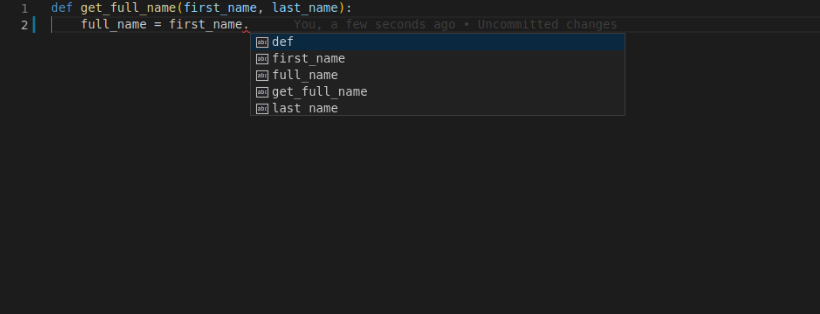
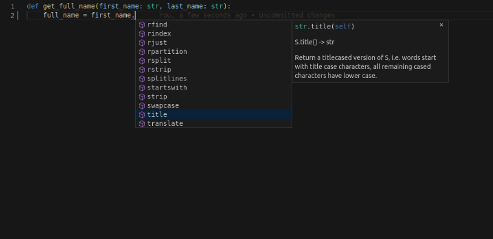
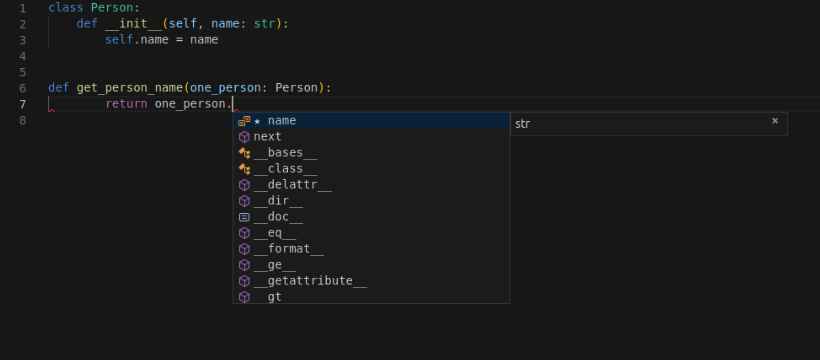

# 【FastAPI】FastAPI使用typing类型提示


typing是Python标准库，用来做类型提示。FastAPI使用typing做了：

- 编辑器支持；

- 类型检查；

- 定义类型，request path parameters, query parameters, headers, bodies, dependencies等等；

- 类型转换；

- 数据验证，并且在验证失败时自动生成错误；

- OpenAPI文档，自动生成接口参数；

## 编辑器支持typing

先看个简单的例子：

```python
def get_full_name(first_name, last_name):
    full_name = first_name.title() + " " + last_name.title()
    return full_name


print(get_full_name("john", "doe"))
```

输出：

```
John Doe
```

也就是把首字母转换成大写后，用空格拼接起来。

假如在写程序时，你并不知道这个转换大写的函数名是`title`，那么你会输入`.`之后查看：



结果根据没有提示。

添加typing类型提示：

```python
def get_full_name(first_name: str, last_name: str):
    full_name = first_name.title() + " " + last_name.title()
    return full_name


print(get_full_name("john", "doe"))
```

再试一把：



有了。

再比如：

```python
def get_name_with_age(name: str, age: int):
    name_with_age = name + " is this old: " + age
    return name_with_age
```


因为明确了类型，编辑器会做类型检查。

## 声明类型

简单类型：

- `int`
- `float`
- `bool`
- `bytes`

```python
def get_items(item_a: str, item_b: int, item_c: float, item_d: bool, item_e: bytes):
    return item_a, item_b, item_c, item_d, item_d, item_e
```

**List**

Python不同版本对typing的支持是不一样的，3.6以上版本：

```python
from typing import List


def process_items(items: List[str]):
    for item in items:
        print(item)
```

而3.9以上版本：

```python
def process_items(items: list[str]):
    for item in items:
        print(item)
```

不需要import typing，小写的list就行，跟常规用法一致。

这样编辑器就能提供支持：


**Tuple和Set**

3.9以上版本：

```python
def process_items(items_t: tuple[int, int, str], items_s: set[bytes]):
    return items_t, items_s
```

**Dict**

3.9以上版本：

```python
def process_items(prices: dict[str, float]):
    for item_name, item_price in prices.items():
        print(item_name)
        print(item_price)
```

**Union**

多种类型，比如int或str。

3.6以上版本：

```python
from typing import Union


def process_item(item: Union[int, str]):
    print(item)
```

3.10以上版本：

```python
def process_item(item: int | str):
    print(item)
```

不需要import，使用`|`就可以了。

**None**

可能为None。

3.6以上版本：

```python
from typing import Optional


def say_hi(name: Optional[str] = None):
    if name is not None:
        print(f"Hey {name}!")
    else:
        print("Hello World")
```

```python
from typing import Union


def say_hi(name: Union[str, None] = None):
    if name is not None:
        print(f"Hey {name}!")
    else:
        print("Hello World")
 
```

3.10以上版本：

```python
def say_hi(name: str | None = None):
    if name is not None:
        print(f"Hey {name}!")
    else:
        print("Hello World")
```

**Classes**

把某个类作为类型提示：

```python
class Person:
    def __init__(self, name: str):
        self.name = name


def get_person_name(one_person: Person):
    return one_person.name
```

也能得到编辑器支持：



## Pydantic模型

**Pydantic模型有点类似于Java的POJO，就是定义一个类，里面有一堆属性，这些属性都有类型**。在实例化的时候，会做类型检查或类型转换。

```python
from datetime import datetime

from pydantic import BaseModel


class User(BaseModel):
    id: int
    name = "John Doe"
    signup_ts: datetime | None = None
    friends: list[int] = []


external_data = {
    "id": "123",
    "signup_ts": "2017-06-01 12:22",
    "friends": [1, "2", b"3"],
}
user = User(**external_data)
print(user)
## > User id=123 name='John Doe' signup_ts=datetime.datetime(2017, 6, 1, 12, 22) friends=[1, 2, 3]
print(user.id)
## > 123
```

注意，类型提示使用的是`:`，初始化赋值使用的是`=`。

Pydantic对于可选类型有个特殊语法`...`，表示可以为None，但是必填：

```py
from pydantic import BaseModel, Field, ValidationError


class Model(BaseModel):
    a: int | None
    b: int | None = ...
    c: int | None = Field(...)


print(Model(b=1, c=2))
#> a=None b=1 c=2
try:
    Model(a=1, b=2)
except ValidationError as e:
    print(e)
    """
    1 validation error for Model
    c
      field required (type=value_error.missing)
    """
```

- a、b、c都能接受None，比如`Model(a=None, b=None, c=None)`；

- a可选，比如`Model(b=1, c=2)`是ok的；

- b和c都是必填，比如`Model(a=1, b=2)`会报错；

## Python版本

从示例代码来看，Python3.10版本提供了更简洁的语法，能让代码看起来更优雅。而且Python3.10版本也引入了switch语句，如果没有什么历史原因，推荐大家使用Python3.10版本。

> 参考资料：
> 
> Python Types Intro - FastAPI https://fastapi.tiangolo.com/python-types/
