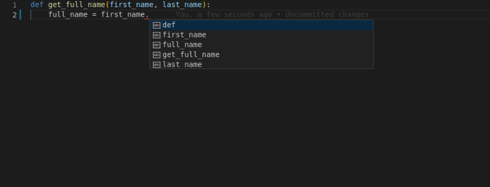

【FastAPI】FastAPI使用typing类型提示
====================================

|image1|

typing是Python标准库，用来做类型提示。FastAPI使用typing做了：

-  编辑器支持；

-  类型检查；

-  定义类型，request path parameters, query parameters, headers, bodies,
   dependencies等等；

-  类型转换；

-  数据验证，并且在验证失败时自动生成错误；

-  OpenAPI文档，自动生成接口参数；

编辑器支持typing
----------------

先看个简单的例子：

.. code:: python

   def get_full_name(first_name, last_name):
       full_name = first_name.title() + " " + last_name.title()
       return full_name

   print(get_full_name("john", "doe"))

输出：

::

   John Doe

也就是把首字母转换成大写后，用空格拼接起来。

假如在写程序时，你并不知道这个转换大写的函数名是\ ``title``\ ，那么你会输入\ ``.``\ 之后查看：

|image2|

结果根据没有提示。

添加typing类型提示：

.. code:: python

   def get_full_name(first_name: str, last_name: str):
       full_name = first_name.title() + " " + last_name.title()
       return full_name

   print(get_full_name("john", "doe"))

再试一把：

|image3|

有了。

再比如：

.. code:: python

   def get_name_with_age(name: str, age: int):
       name_with_age = name + " is this old: " + age
       return name_with_age

|image4|

因为明确了类型，编辑器会做类型检查。

声明类型
--------

简单类型：

-  ``int``
-  ``float``
-  ``bool``
-  ``bytes``

.. code:: python

   def get_items(item_a: str, item_b: int, item_c: float, item_d: bool, item_e: bytes):
       return item_a, item_b, item_c, item_d, item_d, item_e

**List**

Python不同版本对typing的支持是不一样的，3.6以上版本：

.. code:: python

   from typing import List

   def process_items(items: List[str]):
       for item in items:
           print(item)

而3.9以上版本：

.. code:: python

   def process_items(items: list[str]):
       for item in items:
           print(item)

不需要import typing，小写的list就行，跟常规用法一致。

这样编辑器就能提供支持：

|image5|

**Tuple和Set**

3.9以上版本：

.. code:: python

   def process_items(items_t: tuple[int, int, str], items_s: set[bytes]):
       return items_t, items_s

**Dict**

3.9以上版本：

.. code:: python

   def process_items(prices: dict[str, float]):
       for item_name, item_price in prices.items():
           print(item_name)
           print(item_price)

**Union**

多种类型，比如int或str。

3.6以上版本：

.. code:: python

   from typing import Union

   def process_item(item: Union[int, str]):
       print(item)

3.10以上版本：

.. code:: python

   def process_item(item: int | str):
       print(item)

不需要import，使用\ ``|``\ 就可以了。

**None**

可能为None。

3.6以上版本：

.. code:: python

   from typing import Optional

   def say_hi(name: Optional[str] = None):
       if name is not None:
           print(f"Hey {name}!")
       else:
           print("Hello World")

.. code:: python

   from typing import Union

   def say_hi(name: Union[str, None] = None):
       if name is not None:
           print(f"Hey {name}!")
       else:
           print("Hello World")
    

3.10以上版本：

.. code:: python

   def say_hi(name: str | None = None):
       if name is not None:
           print(f"Hey {name}!")
       else:
           print("Hello World")

**Classes**

把某个类作为类型提示：

.. code:: python

   class Person:
       def __init__(self, name: str):
           self.name = name

   def get_person_name(one_person: Person):
       return one_person.name

也能得到编辑器支持：

|image6|

Pydantic模型
------------

**Pydantic模型有点类似于Java的POJO，就是定义一个类，里面有一堆属性，这些属性都有类型**\ 。在实例化的时候，会做类型检查或类型转换。

.. code:: python

   from datetime import datetime

   from pydantic import BaseModel

   class User(BaseModel):
       id: int
       name = "John Doe"
       signup_ts: datetime | None = None
       friends: list[int] = []

   external_data = {
       "id": "123",
       "signup_ts": "2017-06-01 12:22",
       "friends": [1, "2", b"3"],
   }
   user = User(**external_data)
   print(user)
   ## > User id=123 name='John Doe' signup_ts=datetime.datetime(2017, 6, 1, 12, 22) friends=[1, 2, 3]
   print(user.id)
   ## > 123

注意，类型提示使用的是\ ``:``\ ，初始化赋值使用的是\ ``=``\ 。

Pydantic对于可选类型有个特殊语法\ ``...``\ ，表示可以为None，但是必填：

.. code:: py

   from pydantic import BaseModel, Field, ValidationError

   class Model(BaseModel):
       a: int | None
       b: int | None = ...
       c: int | None = Field(...)

   print(Model(b=1, c=2))
   #> a=None b=1 c=2
   try:
       Model(a=1, b=2)
   except ValidationError as e:
       print(e)
       """
       1 validation error for Model
       c
         field required (type=value_error.missing)
       """

-  a、b、c都能接受None，比如\ ``Model(a=None, b=None, c=None)``\ ；

-  a可选，比如\ ``Model(b=1, c=2)``\ 是ok的；

-  b和c都是必填，比如\ ``Model(a=1, b=2)``\ 会报错；

Python版本
----------

从示例代码来看，Python3.10版本提供了更简洁的语法，能让代码看起来更优雅。而且Python3.10版本也引入了switch语句，如果没有什么历史原因，推荐大家使用Python3.10版本。

   参考资料：

   Python Types Intro - FastAPI
   https://fastapi.tiangolo.com/python-types/

.. |image1| image:: ../wanggang.png

.. |image3| image:: 006004-【FastAPI】FastAPI使用typing类型提示/2022-11-14-21-11-12-image.png
.. |image4| image:: 006004-【FastAPI】FastAPI使用typing类型提示/2022-11-14-21-20-16-image.png
.. |image5| image:: 006004-【FastAPI】FastAPI使用typing类型提示/2022-11-14-21-31-23-image.png
.. |image6| image:: 006004-【FastAPI】FastAPI使用typing类型提示/2022-11-15-09-13-05-image.png
