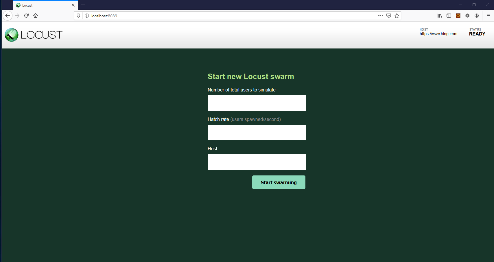
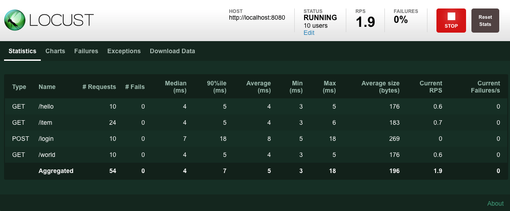
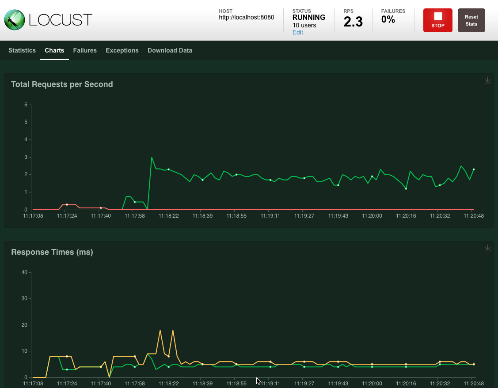

# 【Locust】Python技术栈性能测试工具Locust入门


Locust是一款Python技术栈的开源的性能测试工具。Locust直译为蝗虫，寓意着它能产生蝗虫般成千上万的并发用户：


Locust并不小众，从它Github的Star数量就可见一斑：


截止文章写作时，一共**15951**Star。

Locust生态良好，它已在多家外企（包括**世界500强**）投入使用：


如此看来，Locust是非常值得学习和掌握的一款工具。

Python的魔力在于化繁为简，**基于Python的Locust也能给仍然困惑于性能测试的我们带来启发。**

## Locust特点

- 以纯Python方式编写用户脚本，提供极大自由度。
- 用户脚本可以串行方式编写，Locust会通过轻量级进程/协程产生并发，无需自己做并发编程。
- 并发量大，借助于gevent库，Locust能产生成千上万并发请求。
- 开销小，Locust用户运行时开销很小。
- 良好的Web UI对性能结果实时监测。
- 能测任何系统任何协议，只需要写个client即可。
- 开放REST API，尽情发挥。

## 安装Locust

需要Python版本**3.6**及以上。

执行pip命令：

```shell
$ pip install locust
```

验证安装成功：

```shell
$ locust -V
```

> 安装时会一并安装依赖库：
>
> Installing collected packages: Werkzeug, pywin32, zope.event, greenlet, gevent, geventhttpclient, itsdangerous, **flask, Flask-BasicAuth,** ConfigArgParse, pyzmq, psutil, locust
>
> 能看出来flask为Locust提供了Web功能。

## 快速上手

使用Locust一般按照以下步骤进行：

1. 编写Python用户脚本。
2. 使用`locust`命令执行性能测试。
3. （可选）通过Web界面监测结果。

示例代码如下，新建locustfile.py文件：

```python
import time
from locust import HttpUser, task, between

class QuickstartUser(HttpUser):
    wait_time = between(1, 2.5)

    @task
    def hello_world(self):
        self.client.get("/hello")
        self.client.get("/world")

    @task(3)
    def view_items(self):
        for item_id in range(10):
            self.client.get(f"/item?id={item_id}", name="/item")
            time.sleep(1)

    def on_start(self):
        self.client.post("/login", json={"username":"foo", "password":"bar"})
```

路径切换到locustfile.py文件所在目录，执行命令：

```shell
$ locust
```

> 也可以通过`-f`指定某个目录文件：
>
> ```shell
> $ locust -f locust_files/my_locust_file.py
> ```

运行后，打开[http://127.0.0.1:8089](http://127.0.0.1:8089/)看到Web界面：



填写信息后，就能开始压测了。Web界面提供了结果统计数据：



和性能指标走势图：



## 脚本解析

示例脚本解析如下：

```python
## Locust用户脚本就是Python模块
import time
from locust import HttpUser, task, between

## 类继承自HttpUser
class QuickstartUser(HttpUser):
    # 每个模拟用户等待1~2.5秒
    wait_time = between(1, 2.5)

    # 被@task装饰的才会并发执行
    @task
    def hello_world(self):
        # client属性是HttpSession实例，用来发送HTTP请求
        self.client.get("/hello")
        self.client.get("/world")

    # 每个类只会有一个task被选中执行
    # 3代表weight权重
    # 权重越大越容易被选中执行
    # view_items比hello_wolrd多3倍概率被选中执行
    @task(3)
    def view_items(self):
        for item_id in range(10):
            # name参数作用是把统计结果按同一名称进行分组
            # 这里防止URL参数不同会产生10个不同记录不便于观察
            # 把10个汇总成1个"/item"记录
            self.client.get(f"/item?id={item_id}", name="/item")
            time.sleep(1)

    # 每个模拟用户开始运行时都会执行
    def on_start(self):
        self.client.post("/login", json={"username":"foo", "password":"bar"})
```

## 小结

本文先了解了Locust的背景和生态，它是值得学习的，对于Python技术栈来说更加如此。接着介绍了使用pip命令安装Locust，其中发现顺带安装了flask，**Locust的Web功能是flask提供的**。然后给出了一段示例代码，按照步骤上手Locust。最后对示例代码进行了解析，浅尝辄止。locustfile实际上该怎么写呢？

> 参考资料：
>
> https://locust.io/
>
> https://docs.locust.io/en/stable/