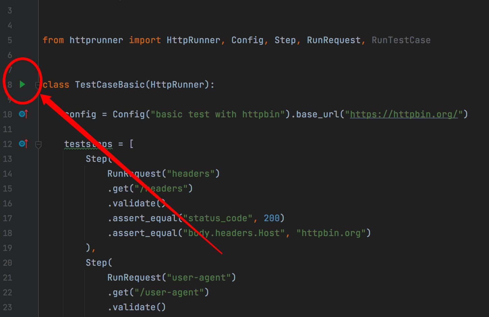
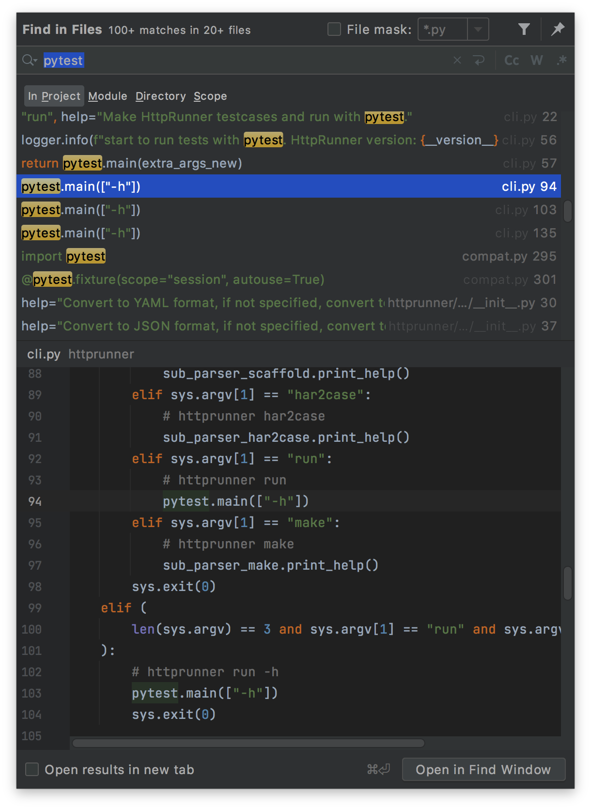
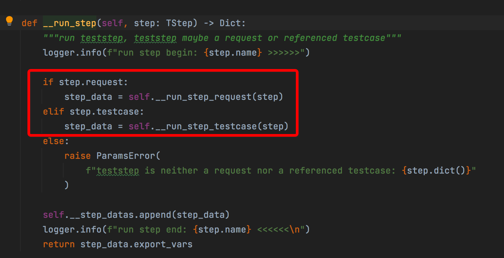
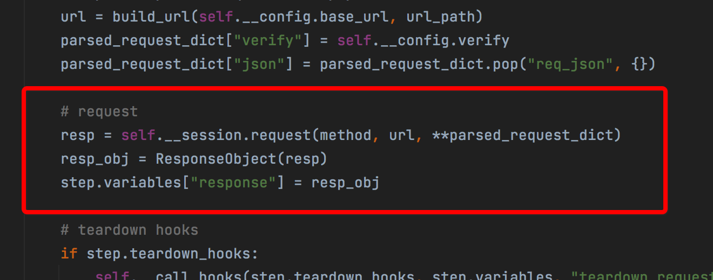
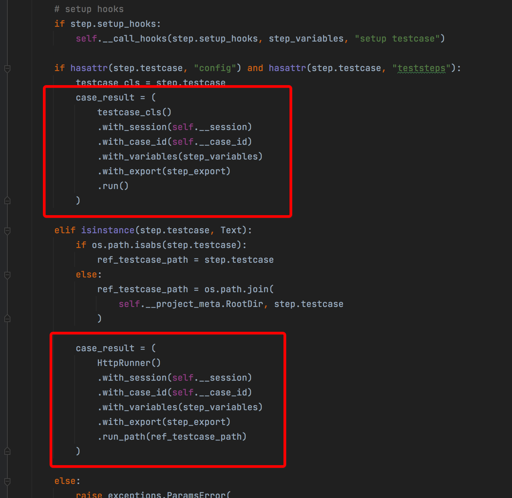
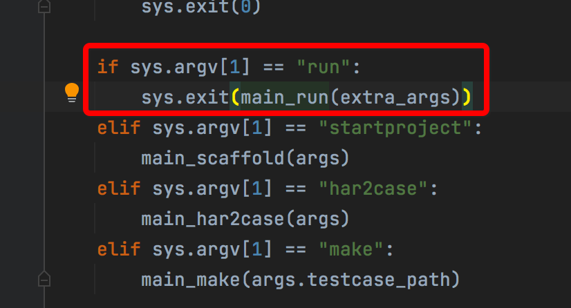
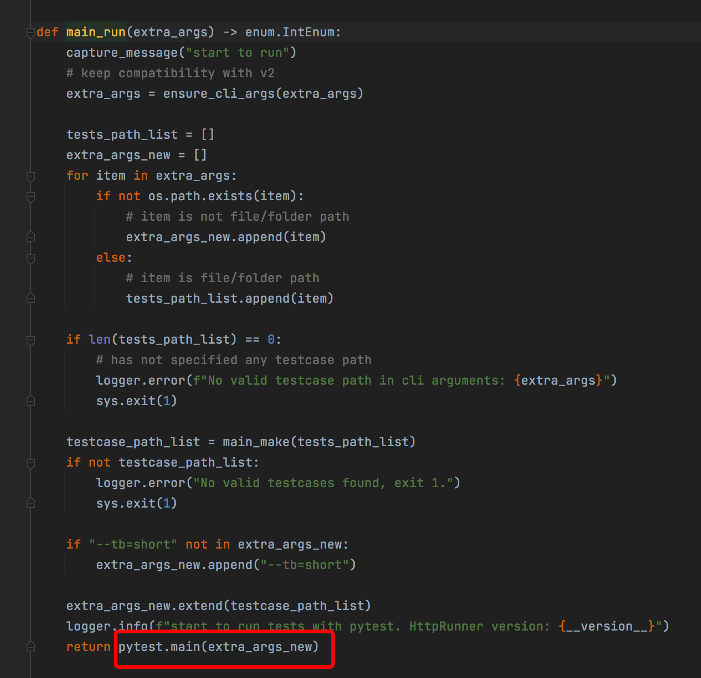

# 【HttpRunner】HttpRunner3的用例是怎么运行起来的


在PyCharm中打开`examples/httpbin/basic_test.py`：



首先映入眼帘的是左上角那个绿色小箭头，点了一下，可以直接运行，意味着HttpRunner是能够直接被pytest驱动运行的，这可就有点意思了，难道HttpRunner的底层是pytest？带着这个疑问我全局搜索了一下pytest：



在cli.py文件中，如果参数是run，那么会执行`pytest.main(["h"])`，难道真是我猜测的这样？在`basic_test.py`最后有两行代码：

```python
if __name__ == "__main__":
    TestCaseBasic().test_start()
```

试着从这里追踪，应该就能对调用链路拿捏个十拿九稳了。test_start()的源码如下：

```python
def test_start(self, param: Dict = None) -> "HttpRunner":
    """main entrance, discovered by pytest"""
    self.__init_tests__()
    self.__project_meta = self.__project_meta or load_project_meta(
        self.__config.path
    )
    self.__case_id = self.__case_id or str(uuid.uuid4())
    self.__log_path = self.__log_path or os.path.join(
        self.__project_meta.RootDir, "logs", f"{self.__case_id}.run.log"
    )
    log_handler = logger.add(self.__log_path, level="DEBUG")

    # parse config name
    config_variables = self.__config.variables
    if param:
        config_variables.update(param)
    config_variables.update(self.__session_variables)
    self.__config.name = parse_data(
        self.__config.name, config_variables, self.__project_meta.functions
    )

    if USE_ALLURE:
        # update allure report meta
        allure.dynamic.title(self.__config.name)
        allure.dynamic.description(f"TestCase ID: {self.__case_id}")

    logger.info(
        f"Start to run testcase: {self.__config.name}, TestCase ID: {self.__case_id}"
    )

    try:
        return self.run_testcase(
            TestCase(config=self.__config, teststeps=self.__teststeps)
        )
    finally:
        logger.remove(log_handler)
        logger.info(f"generate testcase log: {self.__log_path}")

```

第一行注释就是证明了我的猜想是对的：main entrance, discovered by pytest，主程序入口，会被pytest发现。本文不去探究每行代码是什么意思，重点关注跟pytest相关的运行流程。跟着这段代码：

```python
return self.run_testcase(
    TestCase(config=self.__config, teststeps=self.__teststeps)
)
```

继续往下走，调用了self.run_testcase，它的源码如下：

```python
def run_testcase(self, testcase: TestCase) -> "HttpRunner":
    """run specified testcase

    Examples:
        >>> testcase_obj = TestCase(config=TConfig(...), teststeps=[TStep(...)])
        >>> HttpRunner().with_project_meta(project_meta).run_testcase(testcase_obj)

    """
    self.__config = testcase.config
    self.__teststeps = testcase.teststeps

    # prepare
    self.__project_meta = self.__project_meta or load_project_meta(
        self.__config.path
    )
    self.__parse_config(self.__config)
    self.__start_at = time.time()
    self.__step_datas: List[StepData] = []
    self.__session = self.__session or HttpSession()
    # save extracted variables of teststeps
    extracted_variables: VariablesMapping = {}

    # run teststeps
    for step in self.__teststeps:
        # override variables
        # step variables > extracted variables from previous steps
        step.variables = merge_variables(step.variables, extracted_variables)
        # step variables > testcase config variables
        step.variables = merge_variables(step.variables, self.__config.variables)

        # parse variables
        step.variables = parse_variables_mapping(
            step.variables, self.__project_meta.functions
        )

        # run step
        if USE_ALLURE:
            with allure.step(f"step: {step.name}"):
                extract_mapping = self.__run_step(step)
        else:
            extract_mapping = self.__run_step(step)

        # save extracted variables to session variables
        extracted_variables.update(extract_mapping)

    self.__session_variables.update(extracted_variables)
    self.__duration = time.time() - self.__start_at
    return self
```

跟着这段代码：

```python
## run step
if USE_ALLURE:
    with allure.step(f"step: {step.name}"):
        extract_mapping = self.__run_step(step)
else:
    extract_mapping = self.__run_step(step)
```

继续往下走，self.__run_step的源码如下：

```python
def __run_step(self, step: TStep) -> Dict:
    """run teststep, teststep maybe a request or referenced testcase"""
    logger.info(f"run step begin: {step.name} >>>>>>")

    if step.request:
        step_data = self.__run_step_request(step)
    elif step.testcase:
        step_data = self.__run_step_testcase(step)
    else:
        raise ParamsError(
            f"teststep is neither a request nor a referenced testcase: {step.dict()}"
        )

    self.__step_datas.append(step_data)
    logger.info(f"run step end: {step.name} <<<<<<\n")
    return step_data.export_vars
```

有两个分支：

```python
if step.request:
    step_data = self.__run_step_request(step)
elif step.testcase:
    step_data = self.__run_step_testcase(step)
```

`self.__run_step_request(step)`直接调用的request：

```python
resp = self.__session.request(method, url, **parsed_request_dict)
```

`self.__run_step_testcase(step)`直接调用的HttpRunner()：

```python
case_result = (
    testcase_cls()
    .with_session(self.__session)
    .with_case_id(self.__case_id)
    .with_variables(step_variables)
    .with_export(step_export)
    .run()
)
```

**真相只有一个，一定在HttpRunner里面。**HttpRunner是run.py模块里面的一个类：


刚才看到所有代码，其实都是在runner.py模块的HttpRunner类里面。看看run函数的代码：

```python
def run(self) -> "HttpRunner":
    """ run current testcase

    Examples:
        >>> TestCaseRequestWithFunctions().run()

    """
    self.__init_tests__()
    testcase_obj = TestCase(config=self.__config, teststeps=self.__teststeps)
    return self.run_testcase(testcase_obj)
```

又调用了self.run_testcase，循环回去了。

貌似陷入了死循环，实际上答案已经有了，这不就是**递归**么？再回头来看刚才这两个分支：



如果是request，那么就调用`self.__session.request(method, url, **parsed_request_dict)`，这是递归的终止条件：



如果是testcase，那么表示这是子用例，那么就递归下去，这是递归的子表达式：



原来，通过`TestCaseBasic().test_start()`来执行测试，**并没有调pytest，而是直接通过requests发送HTTP请求的，控制台和文件日志也是使用loguru库来自定义输出的**。不得不对源码佩服得五体投地。

回到开头那个问题，为什么还有pytest的相关代码呢，实际上如果是通过命令行的run来执行用例，那么就是用直接用的pytest了：





**一句话总结：如果是用命令行的run命令，那么就是通过pytest来调用的；如果是用代码里的test_start()方法，那么就是调requests作者自创的。**

最后一个问题是，为什么在PyCharm中点那个绿色的小箭头，也能运行代码呢，答案很简单，**这个类TestCaseBasic是`Test`开头的，这个方法test_start是`test_`开头的，这不就是pytest的规则么**。

