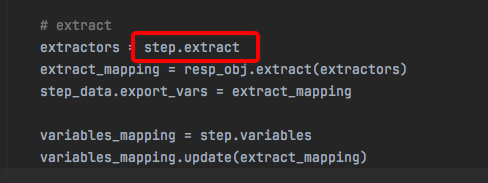
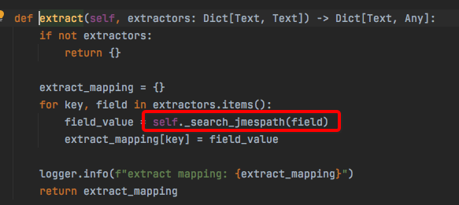
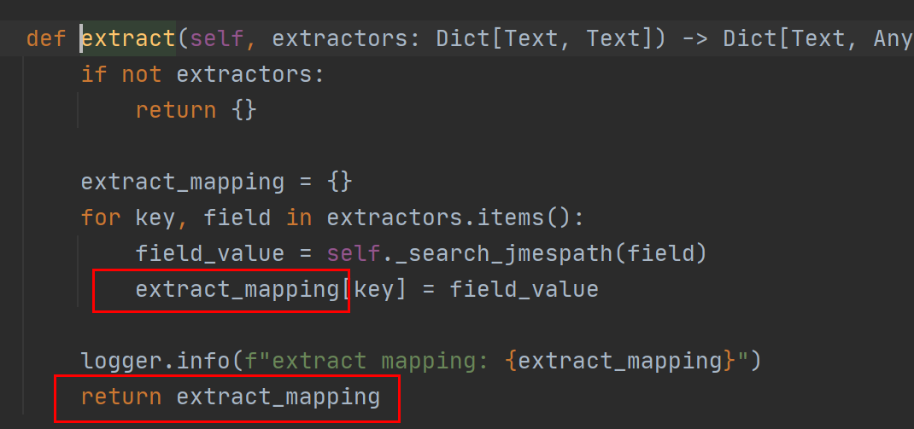
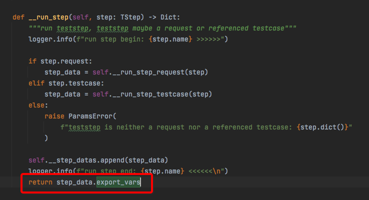
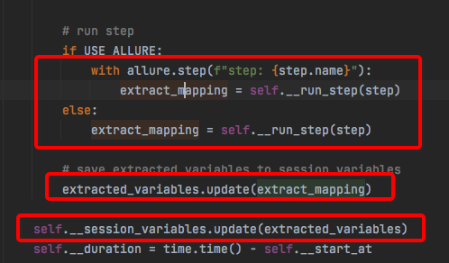

# 【HttpRunner】HttpRunner3的变量是如何传递的


HttpRunner3的变量可以在测试类的用例配置中通过`variables`添加，也可以在测试步骤中使用`extract()`、`with_jmespath()`提取出来放到变量`x`，再用`$x`传递给下一个接口使用，比如登录到下单流程的部分测试脚本如下：

```python
from httprunner import HttpRunner, Config, Step, RunRequest


class TestLoginPay(HttpRunner):
    config = (
        Config("登录到下单流程")
            .variables(
            **{
                "skuNum": "3"
            }
        )
            .base_url("http://127.0.0.1:5000")
    )

    teststeps = [
        Step(
            RunRequest("登录")
                .post("/login")
                .with_headers(**{"Content-Type": "application/json"})
                .with_json({"username": "dongfanger", "password": "123456"})
                .extract()
                .with_jmespath("body.token", "token")
                .validate()
                .assert_equal("status_code", 200)
        ),
        Step(
            RunRequest("搜索商品")
                .get("searchSku?skuName=电子书")
                .with_headers(**{"token": "$token"})
                .extract()
                .with_jmespath("body.skuId", "skuId")
                .with_jmespath("body.price", "skuPrice")
                .validate()
                .assert_equal("status_code", 200)
        ),
    ]
```

首先来看用例配置的这段代码：

```python
config = (
    Config("登录到下单流程")
        .variables(
        **{
            "skuNum": "3"
        }
    )
        .base_url("http://127.0.0.1:5000")
)
```

是怎么实现的。Config的定义如下：

```python
class Config(object):
    def __init__(self, name: Text):
        self.__name = name
        self.__variables = {}
        self.__base_url = ""
        self.__verify = False
        self.__export = []
        self.__weight = 1

        caller_frame = inspect.stack()[1]
        self.__path = caller_frame.filename

    @property
    def name(self) -> Text:
        return self.__name

    @property
    def path(self) -> Text:
        return self.__path

    @property
    def weight(self) -> int:
        return self.__weight

    def variables(self, **variables) -> "Config":
        self.__variables.update(variables)
        return self

    def base_url(self, base_url: Text) -> "Config":
        self.__base_url = base_url
        return self

    def verify(self, verify: bool) -> "Config":
        self.__verify = verify
        return self

    def export(self, *export_var_name: Text) -> "Config":
        self.__export.extend(export_var_name)
        return self

    def locust_weight(self, weight: int) -> "Config":
        self.__weight = weight
        return self

    def perform(self) -> TConfig:
        return TConfig(
            name=self.__name,
            base_url=self.__base_url,
            verify=self.__verify,
            variables=self.__variables,
            export=list(set(self.__export)),
            path=self.__path,
            weight=self.__weight,
        )
```

其中variables的定义是：

```python
def variables(self, **variables) -> "Config":
    self.__variables.update(variables)
    return self
```

`self.__variables = {}`是个字典。为什么要加个前缀`**`呢？这个`**`换个模样估计就看懂了：

```python
def foo(**kwargs):
    print(kwargs)

>>> foo(x=1, y=2)
{'x': 1, 'y': 2}

>>> foo(**{'x': 1, 'y': 2})
{'x': 1, 'y': 2}
```

`self.__variables.update(variables)`里面的upate方法是字典添加到字典里，比如：

```python
tinydict = {'Name': 'Zara', 'Age': 7}
tinydict2 = {'Sex': 'female' }

tinydict.update(tinydict2)  # {'Age': 7, 'Name': 'Zara', 'Sex': 'female'}
```

**整个方法的意思就是从`variables`中取出`variables`字典，然后添加到`self.__variables`字典里。**

这个Config会在runner.py里面的HttpRunner类初始化时加载到`self.__config`：

```python
def __init_tests__(self) -> NoReturn:
    self.__config = self.config.perform()
    self.__teststeps = []
    for step in self.teststeps:
        self.__teststeps.append(step.perform())
```

然后`self.__config`会在各个地方调用。比如在`__run_step_request`中把base_url拼装起来。：

```python
## prepare arguments
method = parsed_request_dict.pop("method")
url_path = parsed_request_dict.pop("url")
url = build_url(self.__config.base_url, url_path)
parsed_request_dict["verify"] = self.__config.verify
parsed_request_dict["json"] = parsed_request_dict.pop("req_json", {})
```

而接下来的代码是真把我看晕了。

**第一个问题：config里面的变量是怎么用到测试步骤里面的？**

答案就是：

```python
step.variables = merge_variables(step.variables, self.__config.variables)
```

通过merge_variables函数合并到了step.variables，step是下面这个类的实例：

```python
class TStep(BaseModel):
    name: Name
    request: Union[TRequest, None] = None
    testcase: Union[Text, Callable, None] = None
    variables: VariablesMapping = {}
    setup_hooks: Hooks = []
    teardown_hooks: Hooks = []
    # used to extract request's response field
    extract: VariablesMapping = {}
    # used to export session variables from referenced testcase
    export: Export = []
    validators: Validators = Field([], alias="validate")
    validate_script: List[Text] = []
```

step.variables在run_testcase里面赋值：


- 第一部分是把前面步骤提取的变量合并进来。
- 第二部分是把用例配置里面的变量合并进来，这就是第一个问题的答案。

**第二个问题：变量是怎么提取出来的？**

先看看RequestWithOptionalArgs类的extract方法：

```python
def extract(self) -> StepRequestExtraction:
    return StepRequestExtraction(self.__step_context)
```

```python
class StepRequestExtraction(object):
    def __init__(self, step_context: TStep):
        self.__step_context = step_context

    def with_jmespath(self, jmes_path: Text, var_name: Text) -> "StepRequestExtraction":
        self.__step_context.extract[var_name] = jmes_path
        return self

    # def with_regex(self):
    #     # TODO: extract response html with regex
    #     pass
    #
    # def with_jsonpath(self):
    #     # TODO: extract response json with jsonpath
    #     pass

    def validate(self) -> StepRequestValidation:
        return StepRequestValidation(self.__step_context)

    def perform(self) -> TStep:
        return self.__step_context
```

这就是在测试脚本中用到的extract()和with_jmespath()。

> 可以看到作者这里写了TODO支持正则表达式和JsonPath表达式。

然后把变量名和JmesPath表达式存入了`self.__step_context.extract`中，这会用在：



从而传入另外这个ResponseObject类的extract方法：



然后`self._search_jmespath`根据表达式把值找到：

```python
def _search_jmespath(self, expr: Text) -> Any:
    resp_obj_meta = {
        "status_code": self.status_code,
        "headers": self.headers,
        "cookies": self.cookies,
        "body": self.body,
    }
    if not expr.startswith(tuple(resp_obj_meta.keys())):
        return expr
    
    try:
        check_value = jmespath.search(expr, resp_obj_meta)
    except JMESPathError as ex:
        logger.error(
            f"failed to search with jmespath\n"
            f"expression: {expr}\n"
            f"data: {resp_obj_meta}\n"
            f"exception: {ex}"
        )
        raise

    return check_value
```

存入extract_mapping中：



再存入`step_data.export_vars`：


然后在`__run_step`中返回：



最后通过extracted_variables存入到`self.__session_variables`中：



`self.__session_variables`是runner.py模块中HttpRunne类的属性，可以理解为一个session级别的变量池。

**第三个问题：为什么用`$`就能直接使用变量？**

在run_testcase方法中有一段代码，解析变量：

```python
## parse variables
step.variables = parse_variables_mapping(
    step.variables, self.__project_meta.functions
)
```

parse_variables_mapping的定义如下：

```python
def parse_variables_mapping(
    variables_mapping: VariablesMapping, functions_mapping: FunctionsMapping = None
) -> VariablesMapping:

    parsed_variables: VariablesMapping = {}

    while len(parsed_variables) != len(variables_mapping):
        for var_name in variables_mapping:

            if var_name in parsed_variables:
                continue

            var_value = variables_mapping[var_name]
            variables = extract_variables(var_value)

            # check if reference variable itself
            if var_name in variables:
                # e.g.
                # variables_mapping = {"token": "abc$token"}
                # variables_mapping = {"key": ["$key", 2]}
                raise exceptions.VariableNotFound(var_name)

            # check if reference variable not in variables_mapping
            not_defined_variables = [
                v_name for v_name in variables if v_name not in variables_mapping
            ]
            if not_defined_variables:
                # e.g. {"varA": "123$varB", "varB": "456$varC"}
                # e.g. {"varC": "${sum_two($a, $b)}"}
                raise exceptions.VariableNotFound(not_defined_variables)

            try:
                parsed_value = parse_data(
                    var_value, parsed_variables, functions_mapping
                )
            except exceptions.VariableNotFound:
                continue

            parsed_variables[var_name] = parsed_value

    return parsed_variables
```

非常的复杂。其中有个函数extract_variables：

```python
def extract_variables(content: Any) -> Set:
    """ extract all variables in content recursively.
    """
    if isinstance(content, (list, set, tuple)):
        variables = set()
        for item in content:
            variables = variables | extract_variables(item)
        return variables

    elif isinstance(content, dict):
        variables = set()
        for key, value in content.items():
            variables = variables | extract_variables(value)
        return variables

    elif isinstance(content, str):
        return set(regex_findall_variables(content))

    return set()
```

里面有个regex_findall_variables函数：

```python
def regex_findall_variables(raw_string: Text) -> List[Text]:
    try:
        match_start_position = raw_string.index("$", 0)
    except ValueError:
        return []

    vars_list = []
    while match_start_position < len(raw_string):

        # Notice: notation priority
        # $$ > $var

        # search $$
        dollar_match = dolloar_regex_compile.match(raw_string, match_start_position)
        if dollar_match:
            match_start_position = dollar_match.end()
            continue

        # search variable like ${var} or $var
        var_match = variable_regex_compile.match(raw_string, match_start_position)
        if var_match:
            var_name = var_match.group(1) or var_match.group(2)
            vars_list.append(var_name)
            match_start_position = var_match.end()
            continue

        curr_position = match_start_position
        try:
            # find next $ location
            match_start_position = raw_string.index("$", curr_position + 1)
        except ValueError:
            # break while loop
            break

    return vars_list
```

在这个函数中看到了`$`符号的身影，就是在这里解析的了。而整个解析过程那是相当的复杂，没有用现成的包，而是作者自己实现的。并且还有个长达548行的parser_test.py测试代码，要说清楚，估计得另外再写一篇专项文章了。