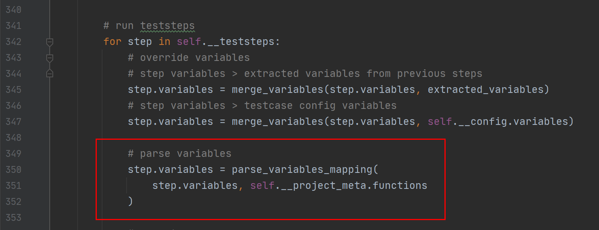
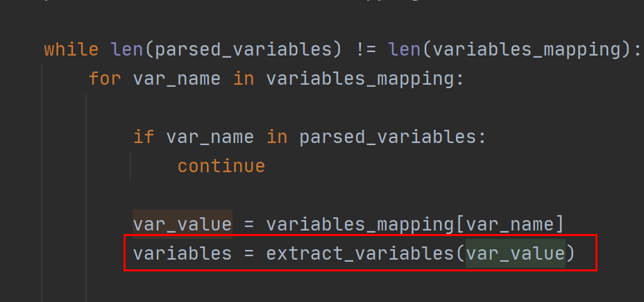
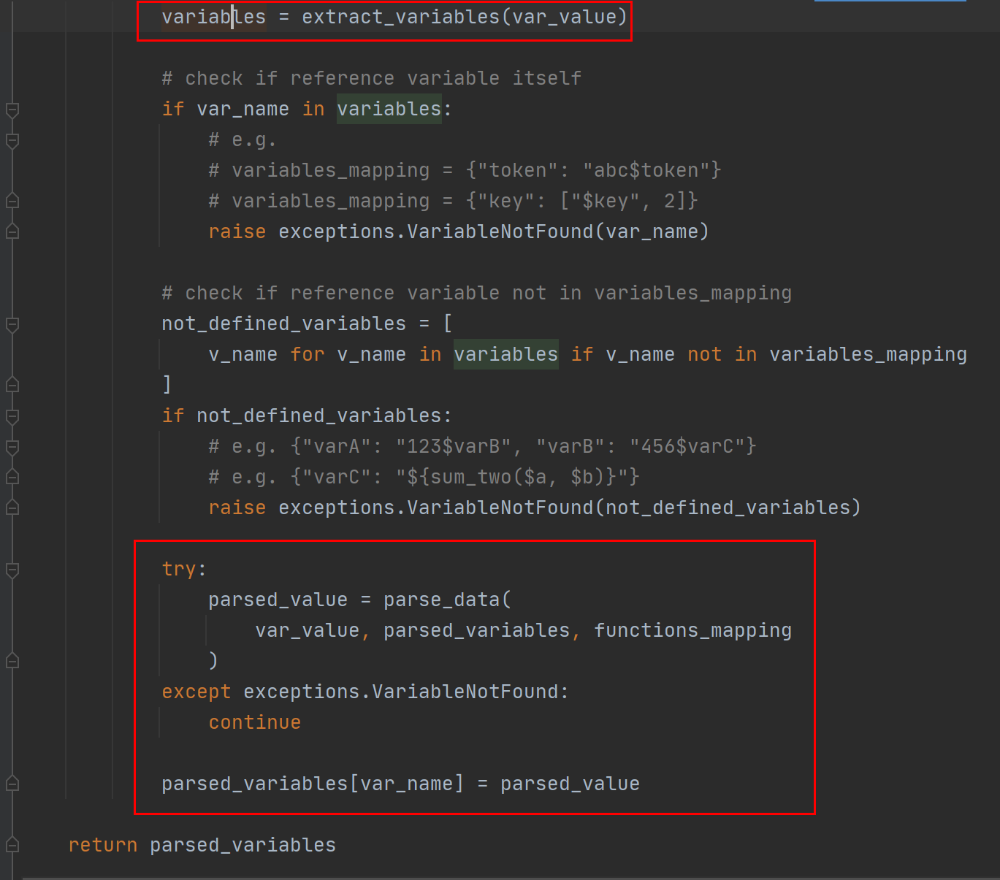

# 【HttpRunner】HttpRunner3的$符号是如何解析的


## 变量解析

`$`符号在很多测试框架中都会拿来用做变量解析，大名鼎鼎的JMeter就有这个用法。HttpRunner3也支持`$`符号，比如：

```python
Step(
    RunRequest("登录")
        .post("/login")
        .with_headers(**{"Content-Type": "application/json"})
        .with_json({"username": "dongfanger", "password": "123456"})
        .extract()
        .with_jmespath("body.token", "token")
        .validate()
        .assert_equal("status_code", 200)
),
Step(
    RunRequest("搜索商品")
        .get("searchSku?skuName=电子书")
        .with_headers(**{"token": "$token"})
        .extract()
        .with_jmespath("body.skuId", "skuId")
        .with_jmespath("body.price", "skuPrice")
        .validate()
        .assert_equal("status_code", 200)
),
```

从`登录`提取的变量`token`，在`搜索商品`中使用`$token`来引用。

## parser.py

HttpRunner对`$`符号的解析是在parser.py文件中实现的：


这些方法可以分为四类：

- url

  `build_url()`

- 变量

  `extract_variables()`  `get_mapping_variable()`  `parse_variables_mapping()`  `regex_findall_variables()`  `parse_data()`  `parse_string()`

- 函数

  `get_mapping_function()`  `parse_function_params()`  `regex_findall_functions()`  `parse_string_value()`  `parse_data()`  `parse_string()`

- 参数化（`"${parameterize(account.csv)}"`）

  `parse_parameters()`

本文专门针对**变量**这一块源码来进行剖析。

## 全局变量池

HttpRunner3在运行时的所有变量都是存储在`__session_variables`这个字典中的：


在脚本开始时会把config的预设变量加载进来，然后会在执行Step测试步骤时，把各个步骤的变量也放到全局变量池里面。

## 解析过程

在runner.py的第350行代码能看到解析变量的调用：



然后parse_variables_mapping()函数需要仔细看：

```python
def parse_variables_mapping(
    variables_mapping: VariablesMapping, functions_mapping: FunctionsMapping = None
) -> VariablesMapping:

    parsed_variables: VariablesMapping = {}

    while len(parsed_variables) != len(variables_mapping):
        for var_name in variables_mapping:

            if var_name in parsed_variables:
                continue

            var_value = variables_mapping[var_name]
            variables = extract_variables(var_value)

            # check if reference variable itself
            if var_name in variables:
                # e.g.
                # variables_mapping = {"token": "abc$token"}
                # variables_mapping = {"key": ["$key", 2]}
                raise exceptions.VariableNotFound(var_name)

            # check if reference variable not in variables_mapping
            not_defined_variables = [
                v_name for v_name in variables if v_name not in variables_mapping
            ]
            if not_defined_variables:
                # e.g. {"varA": "123$varB", "varB": "456$varC"}
                # e.g. {"varC": "${sum_two($a, $b)}"}
                raise exceptions.VariableNotFound(not_defined_variables)

            try:
                parsed_value = parse_data(
                    var_value, parsed_variables, functions_mapping
                )
            except exceptions.VariableNotFound:
                continue

            parsed_variables[var_name] = parsed_value

    return parsed_variables
```

`tests/parser_test.py`有一段测试代码：


**建议打个断点，调试一把，就知道代码是怎么个原理了。**

大概思路是：最外层的while循环会比较已解析和未解析的存储字典长度，只有当所有的变量都解析到值以后，才会正常退出。拿示例代码来说，第一次循环只会解析出`varC`、`a`、`b`，第二次循环才会解析出`varB`，第三次循环解析出`varA`。

循环内部，先是调用extract_variables()方法解析出变量集合：



```python
def extract_variables(content: Any) -> Set:
    """ extract all variables in content recursively.
    """
    if isinstance(content, (list, set, tuple)):
        variables = set()
        for item in content:
            variables = variables | extract_variables(item)
        return variables

    elif isinstance(content, dict):
        variables = set()
        for key, value in content.items():
            variables = variables | extract_variables(value)
        return variables

    elif isinstance(content, str):
        return set(regex_findall_variables(content))

    return set()
```

regex_findall_variables()函数就是用来解析字符串的，采用的是正则匹配：

```python
def regex_findall_variables(raw_string: Text) -> List[Text]:
    """ extract all variable names from content, which is in format $variable

    Args:
        raw_string (str): string content

    Returns:
        list: variables list extracted from string content

    Examples:
        >>> regex_findall_variables("$variable")
        ["variable"]

        >>> regex_findall_variables("/blog/$postid")
        ["postid"]

        >>> regex_findall_variables("/$var1/$var2")
        ["var1", "var2"]

        >>> regex_findall_variables("abc")
        []

    """
    try:
        match_start_position = raw_string.index("$", 0)
    except ValueError:
        return []

    vars_list = []
    while match_start_position < len(raw_string):

        # Notice: notation priority
        # $$ > $var

        # search $$
        dollar_match = dolloar_regex_compile.match(raw_string, match_start_position)
        if dollar_match:
            match_start_position = dollar_match.end()
            continue

        # search variable like ${var} or $var
        var_match = variable_regex_compile.match(raw_string, match_start_position)
        if var_match:
            var_name = var_match.group(1) or var_match.group(2)
            vars_list.append(var_name)
            match_start_position = var_match.end()
            continue

        curr_position = match_start_position
        try:
            # find next $ location
            match_start_position = raw_string.index("$", curr_position + 1)
        except ValueError:
            # break while loop
            break

    return vars_list
```

调用extract_variables()方法解析出变量集合以后，就会进行异常校验：变量是否引用自己和变量未定义：



如果校验通过就会调用parse_data()解析出变量值，存入已解析的字典parsed_variables中。

parse_data()和parse_string()两个函数和主要流程无关了，它们的作用就是解析出变量值，感兴趣的读者朋友可以自行研究一下：

```python
def parse_data(
    raw_data: Any,
    variables_mapping: VariablesMapping = None,
    functions_mapping: FunctionsMapping = None,
) -> Any:
    """ parse raw data with evaluated variables mapping.
        Notice: variables_mapping should not contain any variable or function.
    """
    if isinstance(raw_data, str):
        # content in string format may contains variables and functions
        variables_mapping = variables_mapping or {}
        functions_mapping = functions_mapping or {}
        # only strip whitespaces and tabs, \n\r is left because they maybe used in changeset
        raw_data = raw_data.strip(" \t")
        return parse_string(raw_data, variables_mapping, functions_mapping)

    elif isinstance(raw_data, (list, set, tuple)):
        return [
            parse_data(item, variables_mapping, functions_mapping) for item in raw_data
        ]

    elif isinstance(raw_data, dict):
        parsed_data = {}
        for key, value in raw_data.items():
            parsed_key = parse_data(key, variables_mapping, functions_mapping)
            parsed_value = parse_data(value, variables_mapping, functions_mapping)
            parsed_data[parsed_key] = parsed_value

        return parsed_data

    else:
        # other types, e.g. None, int, float, bool
        return raw_data
```

```python
def parse_string(
    raw_string: Text,
    variables_mapping: VariablesMapping,
    functions_mapping: FunctionsMapping,
) -> Any:
    """ parse string content with variables and functions mapping.

    Args:
        raw_string: raw string content to be parsed.
        variables_mapping: variables mapping.
        functions_mapping: functions mapping.

    Returns:
        str: parsed string content.

    Examples:
        >>> raw_string = "abc${add_one($num)}def"
        >>> variables_mapping = {"num": 3}
        >>> functions_mapping = {"add_one": lambda x: x + 1}
        >>> parse_string(raw_string, variables_mapping, functions_mapping)
            "abc4def"

    """
    try:
        match_start_position = raw_string.index("$", 0)
        parsed_string = raw_string[0:match_start_position]
    except ValueError:
        parsed_string = raw_string
        return parsed_string

    while match_start_position < len(raw_string):

        # Notice: notation priority
        # $$ > ${func($a, $b)} > $var

        # search $$
        dollar_match = dolloar_regex_compile.match(raw_string, match_start_position)
        if dollar_match:
            match_start_position = dollar_match.end()
            parsed_string += "$"
            continue

        # search function like ${func($a, $b)}
        func_match = function_regex_compile.match(raw_string, match_start_position)
        if func_match:
            func_name = func_match.group(1)
            func = get_mapping_function(func_name, functions_mapping)

            func_params_str = func_match.group(2)
            function_meta = parse_function_params(func_params_str)
            args = function_meta["args"]
            kwargs = function_meta["kwargs"]
            parsed_args = parse_data(args, variables_mapping, functions_mapping)
            parsed_kwargs = parse_data(kwargs, variables_mapping, functions_mapping)

            try:
                func_eval_value = func(*parsed_args, **parsed_kwargs)
            except Exception as ex:
                logger.error(
                    f"call function error:\n"
                    f"func_name: {func_name}\n"
                    f"args: {parsed_args}\n"
                    f"kwargs: {parsed_kwargs}\n"
                    f"{type(ex).__name__}: {ex}"
                )
                raise

            func_raw_str = "${" + func_name + f"({func_params_str})" + "}"
            if func_raw_str == raw_string:
                # raw_string is a function, e.g. "${add_one(3)}", return its eval value directly
                return func_eval_value

            # raw_string contains one or many functions, e.g. "abc${add_one(3)}def"
            parsed_string += str(func_eval_value)
            match_start_position = func_match.end()
            continue

        # search variable like ${var} or $var
        var_match = variable_regex_compile.match(raw_string, match_start_position)
        if var_match:
            var_name = var_match.group(1) or var_match.group(2)
            var_value = get_mapping_variable(var_name, variables_mapping)

            if f"${var_name}" == raw_string or "${" + var_name + "}" == raw_string:
                # raw_string is a variable, $var or ${var}, return its value directly
                return var_value

            # raw_string contains one or many variables, e.g. "abc${var}def"
            parsed_string += str(var_value)
            match_start_position = var_match.end()
            continue

        curr_position = match_start_position
        try:
            # find next $ location
            match_start_position = raw_string.index("$", curr_position + 1)
            remain_string = raw_string[curr_position:match_start_position]
        except ValueError:
            remain_string = raw_string[curr_position:]
            # break while loop
            match_start_position = len(raw_string)

        parsed_string += remain_string

    return parsed_string
```

## 技术都是相通的

通过阅读源码可以发现，技术都是相通的。对于HttpRunner来说，它之所以要费这么大周章设计`$`符号，就是因为它的定位是要让不怎么会写代码的同学，也能使用yaml轻松写自动化。但是V3版本出来以后，**官方强烈建议采用直接编写Python代码**，但仍然遵循yaml这种约定，是不是反而成为了一种约束呢？跳出这个框架，直接编写pytest，岂不是效率会更高一些？这些问题的答案需要我们根据自身特点和业务场景去把握了。就我个人而言，仍然且始终坚持，纯Python代码写自动化的方式。