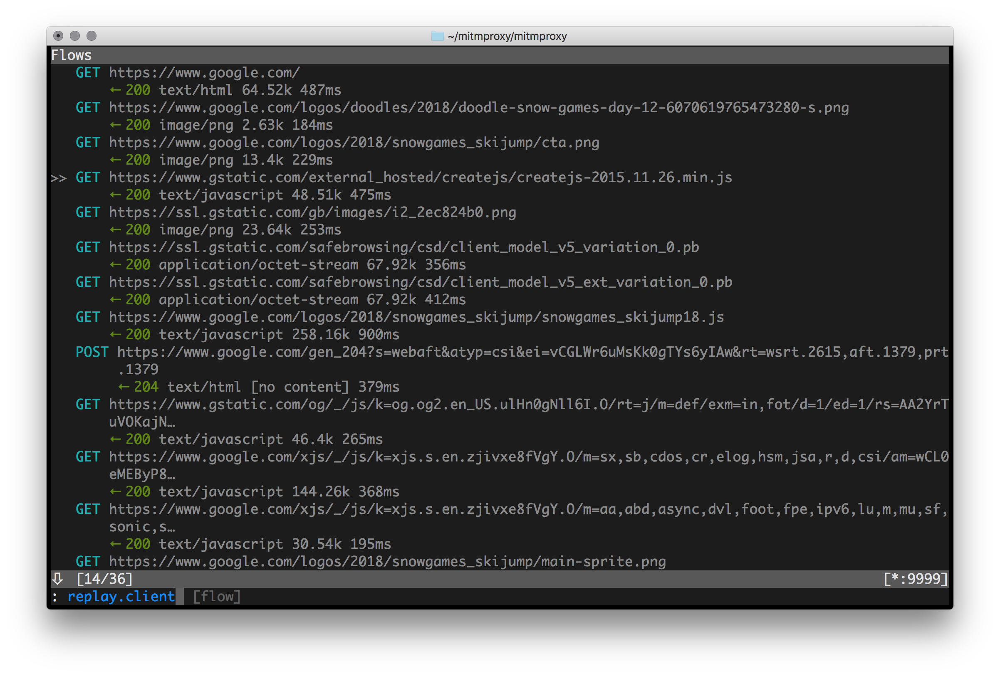
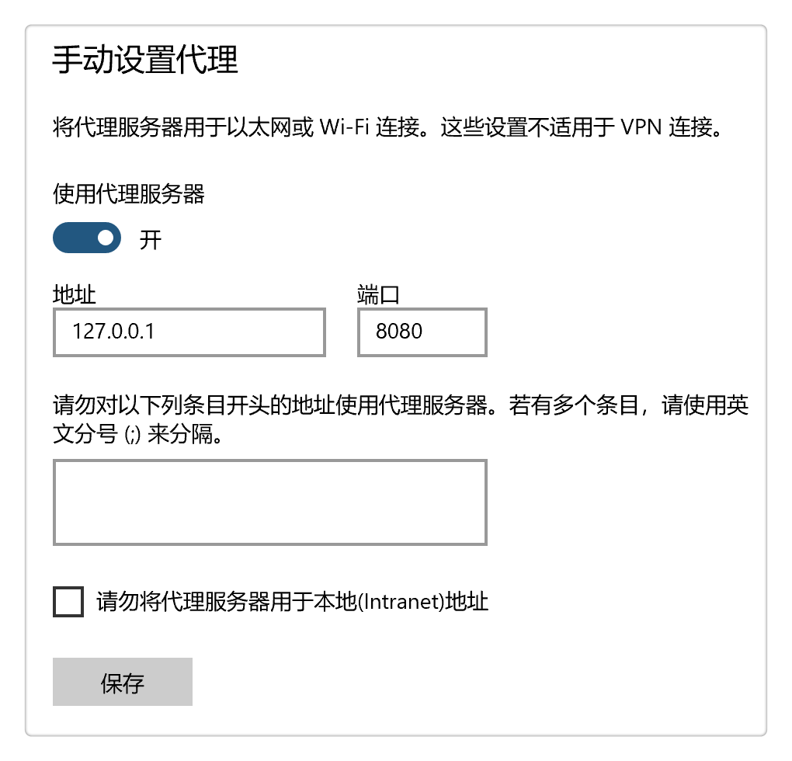
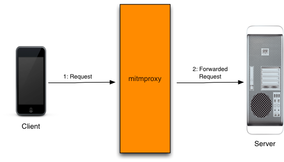
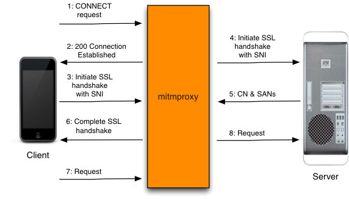
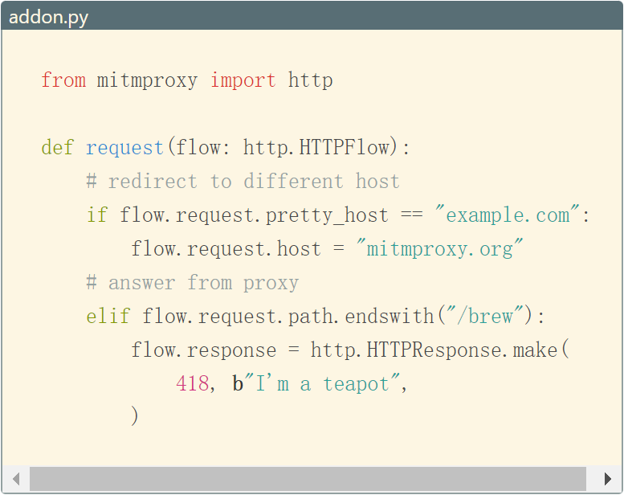

# 【录制回放】从零开始学mitmproxy抓包工具


## 从零开始学mitmproxy抓包工具


### Man In The Middle

mitm是Man In The Middle的首字母缩写，意思是位于中间的人，表明mitmproxy是一个代理，可以拦截请求，实现网络抓包。知名的网络抓包工具有Fiddler、Charles、HttpWatch、WireShark、BurpSuite和Postman等，mitmproxy相对来说，没有这么高的知名度，它相比于以上工具的独特优势是，它提供了Python API，可以编写Python代码对网络请求进行流量录制，从而收集接口信息以及转化为接口自动化用例等。mitmproxy官方文档不但有mitmproxy工具使用介绍，还有代理实现原理，对我们学习掌握网络知识有很大帮助。

### 安装与使用

#### pip安装

```shell
pip install mitmproxy
```

mitmproxy是Python开发的，用pip就能安装成功。官方给出了二进制安装包等方法，我觉得作为一款用Python开发的工具，用pip直接安装是更Pythonic的。

#### 命令启动

可以通过3种命令启动mitmproxy：

- **mitmproxy 控制台**

  

- **mitmweb 网页**

  

- **mitmdump 命令行**

它们的内容都是一样的，只是UI不一样而已。

#### 手动设置代理

打开以后mitmproxy默认会监听http://localhost:8080，需要设置下代理，把代理服务器设置为这个地址。

Windows可以这样设置：



> **设置后一定要记得点击保存按钮，否则代理不会生效。**

实际上，Charles等网络抓包工具会自动配置代理，而mitmproxy需要手动设置代理，开发团队的解释是因为浏览器版本和配置经常会变化，所以他们建议在网上根据环境搜索方法手动设置。

#### 下载证书

访问http://mitm.it/，如果代理配置没有生效，打开后会是这个界面：


正常的话，会出现证书下载页面：


根据平台选择相应证书安装就OK了。

#### 使用

mitmproxy更其他抓包工具用法类似。

官方用视频演示了mitmproxy如何使用：

https://docs.mitmproxy.org/stable/mitmproxytutorial-userinterface/

并且介绍了5种运行模式：

https://docs.mitmproxy.org/stable/concepts-modes/

读者可以自行阅读下。

### mitmproxy工作原理



1. 客户端（本机）连接代理服务器（http://127.0.0.1:8080），代理服务器连接服务器。
2. 客户端给代理服务器发请求，代理服务器把请求发送到服务器。

所有请求经过mitmproxy，就可以实现请求拦截。

**对于HTTP来说，直接借助mitmproxy传递请求就可以。而对于HTTPS来说，有个SSL/TLS安全认证，必须安装证书，服务器才会认为mitmproxy的请求是可信任的，请求才会成功传递。**



HTTPS的代理过程就要复杂很多，客户端先跟mitmproxy建立连接（1~2步），然后进行安全认证（3~6步），最后传递请求（7~8步）。

### 反向代理

假设在本机使用FastAPI启动了个Mock服务，地址为http://127.0.0.1:5000，通过Postman调接口，怎么使用mitmproxy来拦截请求呢？这就需要用到反向代理。

首先以反向代理模式运行mitmproxy，服务器端口为5000，监听端口为8000：

```
mitmproxy --mode reverse:http://127.0.0.1:5000 --listen-host 127.0.0.1 --listen-port 8000
```

然后把请求http://127.0.0.1:5000/login里面的5000端口改成8000，访问：

http://127.0.0.1:8000/login

就能在mitmproxy看到抓到请求了：


这样就能在本地使用Mock服务来调试拦截请求的Python代码了。

> 反向代理，不需要在本机手动设置代理。

### Python API

Python API是mitmproxy的特色功能：



能够在Python代码中对拦截的请求进行处理。

addons提供了很多hook函数，比如request：

```python
"""
Basic skeleton of a mitmproxy addon.

Run as follows: mitmproxy -s anatomy.py
"""
from mitmproxy import ctx


class Counter:
    def __init__(self):
        self.num = 0

    def request(self, flow):
        self.num = self.num + 1
        ctx.log.info("We've seen %d flows" % self.num)


addons = [
    Counter()
]
```

response：

```python
"""Add an HTTP header to each response."""


class AddHeader:
    def __init__(self):
        self.num = 0

    def response(self, flow):
        self.num = self.num + 1
        flow.response.headers["count"] = str(self.num)


addons = [
    AddHeader()
]
```

启动时加上`-s`参数指定脚本：

```
mitmdump -s ./anatomy.py
```

代码就会在请求拦截时生效了。

更多hook函数请参考官方说明：

https://docs.mitmproxy.org/stable/api/events.html

这里就不再详细说明了。

**而关于如何使用mitmproxy录制流量自动生成自动化用例的部分，我会开发完成后集成到tep新版本中，届时再做介绍，敬请期待。**

> 参考资料：
>
> mitmproxy官方文档 https://docs.mitmproxy.org/stable/