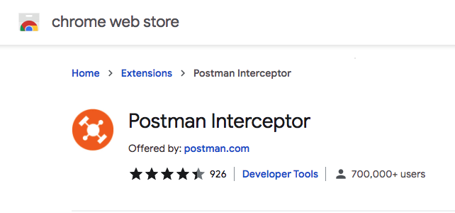
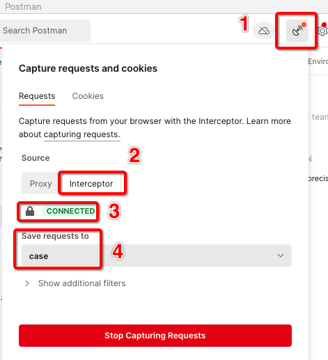
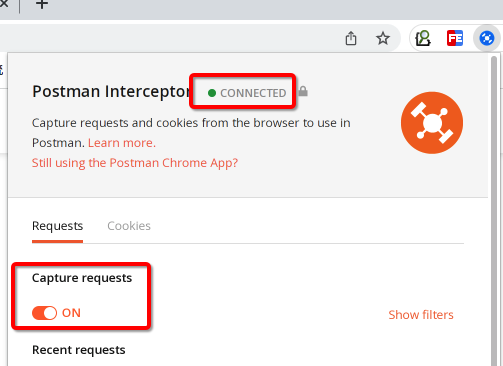
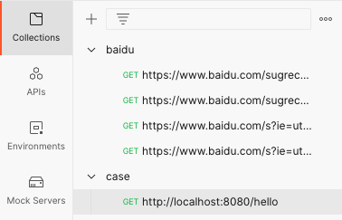
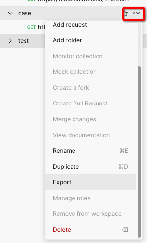

# 【录制回放】Postman竟然还能录制流量


## Postman竟然还能录制流量


大家好，我是刚哥。

Postman我们都会用，调接口无比强大，最近我们部门有同学分享了一个《如何快速自动化》专题，我一听这名字，呵呵，估计又是讲些空洞的理论。然而，当我敲打着键盘，耳边传来，Postman，录制流量，这几个字的时候，发现事情并没有这么简单。

Postman确实是可以录制流量的。前提是使用**Chrome**并安装**Postman Interceptor**插件：



安装好插件以后，就可以在Postman客户端中进行连接了：



1. 点击右上角那个雷达图标
2. 选择Interceptor
3. CONNECTED表示已经连上了
4. 选择Collections，最好先创建再选择

然后在浏览器插件中开启录制：



准备工作就绪。接着就开始尽情点点点，所有的接口流量都会保存到Postman的Collections里面：



流量就录制好了。可以在Postman使用这些录制好的接口。也可以导出成JSON文件：



文件内容如下：

```json
{
	"info": {
		"_postman_id": "2335bec9-31ed-4eb5-bcd5-e7a145a7c5e8",
		"name": "case",
		"schema": "https://schema.getpostman.com/json/collection/v2.1.0/collection.json"
	},
	"item": [
		{
			"name": "http://localhost:8080/hello",
			"request": {
				"method": "GET",
				"header": [
					{
						"key": "User-Agent",
						"value": "Mozilla/5.0 (Macintosh; Intel Mac OS X 10_13_6) AppleWebKit/537.36 (KHTML, like Gecko) Chrome/96.0.4664.55 Safari/537.36"
					},
					{
						"key": "Accept",
						"value": "text/html,application/xhtml+xml,application/xml;q=0.9,image/avif,image/webp,image/apng,*/*;q=0.8,application/signed-exchange;v=b3;q=0.9"
					}
				],
				"url": {
					"raw": "http://localhost:8080/hello",
					"protocol": "http",
					"host": [
						"localhost"
					],
					"port": "8080",
					"path": [
						"hello"
					]
				}
			},
			"response": []
		}
	]
}
```

里面url、method、header、body等应有尽有。

> 我给的示例只包括部分，大家可以自己亲自试试，说不定会有惊喜发现。

有了这个JSON文件，用处就大了，可以：

- 写个Python脚本自动生成用例
- 把JSON文件导入到接口测试平台的（像我司的接口测试平台就支持这种导入方式）。

未来tep和teprunner会支持这个功能。

