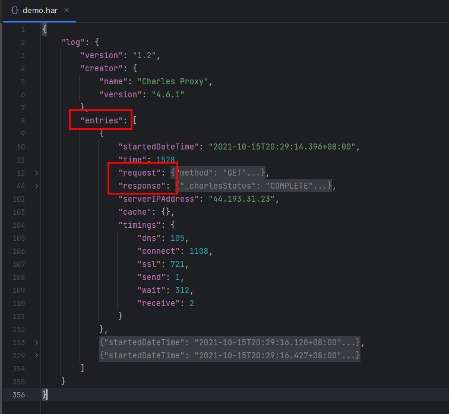
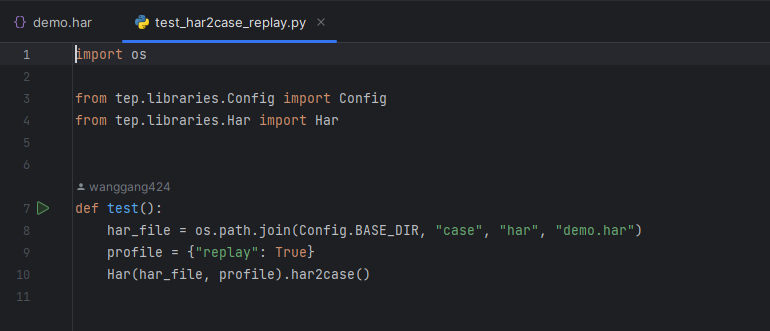
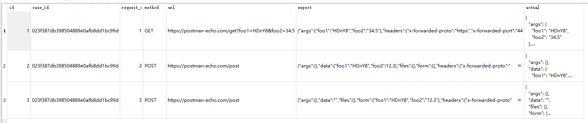
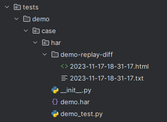
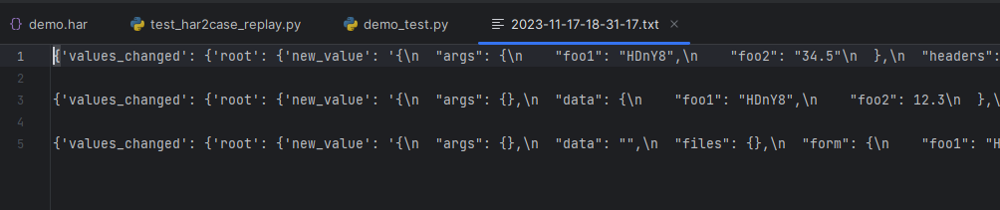
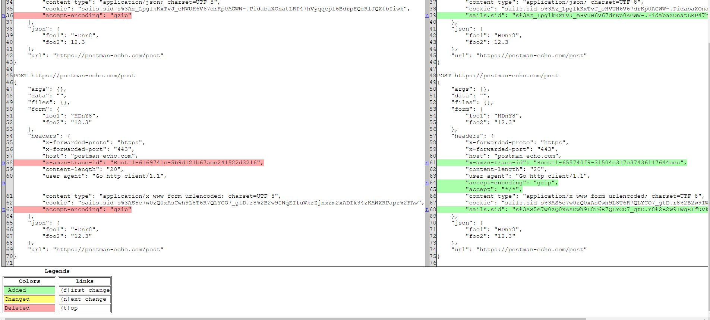
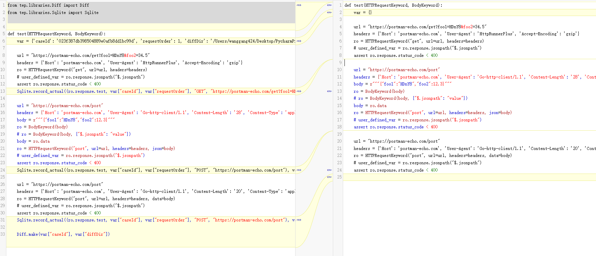

# 【录制回放】基于HAR包的流量录制回放


## 基于HAR包的流量录制回放


### 什么是HAR包？

`HAR（HTTP Archive format）`，是一种`JSON`格式的存档格式文件，通用扩展名为 `.har`。



HAR包是JSON格式的，打开后，重点关注`entries`里面的`request`和`response`，包含了请求和响应信息。

### 流量录制

怎么获取HAR包呢？可以网上搜索方法，浏览器F12、抓包工具（Charles、Proxyman等）都可以将HTTP请求导出为HAR包。

生产级别的流量录制很复杂，想要了解的话可以参考阿里开源项目：https://github.com/alibaba/jvm-sandbox-repeater

### 回放对比

本文重点介绍在导出HAR包后，怎么通过Python来实现回放对比。

#### 使用介绍

一、将HAR包转换为pytest用例



har_file为har包路径，profile配置开启回放，调用Har.har2case()方法将HAR包转换为pytest用例。

转换后会生成：

- demo_test.py 与HAR同名的pytest用例文件
- demo-replay-diff 对比结果目录，暂时为空
- sqlite.db 存储HAR包响应数据，标记为expect

二、执行pytest用例

```python
from tep.libraries.Diff import Diff
from tep.libraries.Sqlite import Sqlite


def test(HTTPRequestKeyword, BodyKeyword):
    var = {'caseId': '023f387db398504889e0afb8dd1bc99d', 'requestOrder': 1, 'diffDir': '/Users/wanggang424/Desktop/PycharmProjects/tep/tests/demo/case/har/demo-replay-diff'}
    
    url = "https://postman-echo.com/get?foo1=HDnY8&foo2=34.5"
    headers = {'Host': 'postman-echo.com', 'User-Agent': 'HttpRunnerPlus', 'Accept-Encoding': 'gzip'}
    ro = HTTPRequestKeyword("get", url=url, headers=headers)
    # user_defined_var = ro.response.jsonpath("$.jsonpath")
    assert ro.response.status_code < 400
    Sqlite.record_actual((ro.response.text, var["caseId"], var["requestOrder"], "GET", "https://postman-echo.com/get?foo1=HDnY8&foo2=34.5"), var)
    
    url = "https://postman-echo.com/post"
    headers = {'Host': 'postman-echo.com', 'User-Agent': 'Go-http-client/1.1', 'Content-Length': '28', 'Content-Type': 'application/json; charset=UTF-8', 'Cookie': 'sails.sid=s%3Az_LpglkKxTvJ_eHVUH6V67drKp0AGWW-.PidabaXOnatLRP47hVyqqepl6BdrpEQzRlJQXtbIiwk', 'Accept-Encoding': 'gzip', 'sails.sid': 's%3Az_LpglkKxTvJ_eHVUH6V67drKp0AGWW-.PidabaXOnatLRP47hVyqqepl6BdrpEQzRlJQXtbIiwk'}
    body = r"""{"foo1":"HDnY8","foo2":12.3}"""
    ro = BodyKeyword(body)
    # ro = BodyKeyword(body, {"$.jsonpath": "value"})
    body = ro.data
    ro = HTTPRequestKeyword("post", url=url, headers=headers, json=body)
    # user_defined_var = ro.response.jsonpath("$.jsonpath")
    assert ro.response.status_code < 400
    Sqlite.record_actual((ro.response.text, var["caseId"], var["requestOrder"], "POST", "https://postman-echo.com/post"), var)
    
    url = "https://postman-echo.com/post"
    headers = {'Host': 'postman-echo.com', 'User-Agent': 'Go-http-client/1.1', 'Content-Length': '20', 'Content-Type': 'application/x-www-form-urlencoded; charset=UTF-8', 'Cookie': 'sails.sid=s%3AS5e7w0zQ0xAsCwh9L8T6R7QLYCO7_gtD.r8%2B2w9IWqEIfuVkrZjnxzm2xADIk34zKAWXRPapr%2FAw', 'Accept-Encoding': 'gzip', 'sails.sid': 's%3AS5e7w0zQ0xAsCwh9L8T6R7QLYCO7_gtD.r8%2B2w9IWqEIfuVkrZjnxzm2xADIk34zKAWXRPapr%2FAw'}
    ro = HTTPRequestKeyword("post", url=url, headers=headers, data=body)
    # user_defined_var = ro.response.jsonpath("$.jsonpath")
    assert ro.response.status_code < 400
    Sqlite.record_actual((ro.response.text, var["caseId"], var["requestOrder"], "POST", "https://postman-echo.com/post"), var)

    Diff.make(var["caseId"], var["diffDir"])
```

执行时会记录实际请求响应，存入sqlite数据库，标记为actual。



同时进行JSON字段对比和文本对比，分别生成`字段对比.txt`和`文本对比.html`。







#### 原理解析

源码：https://github.com/dongfanger/tep.git

一、转换

通过haralyzer库解析HAR包，获取到request和response，再拼装成pytest用例。

实现文件：tep/libraries/Har.py

```python
def _make_case(self):
    var = self._prepare_var()
    steps = self._prepare_steps()

    content = Har.TEMPLATE.format(var=var, steps=steps)

    if self.replay:
        content = Har.TEMPLATE_IMPORT_REPLAY + content
        if not os.path.exists(self.replay_dff_dir):
            os.makedirs(self.replay_dff_dir)
        content += Har.TEMPLATE_DIFF

    with open(self.case_file, "w") as f:
        f.write(content)
```

```python
def _prepare_step(self, entry) -> list:
    logger.info("{} {} Convert step", entry.request.method, entry.request.url)
    step = Step()
    self._make_request_method(step, entry)
    self._make_request_url(step, entry)
    self._make_request_headers(step, entry)
    self._make_request_body(step, entry)
    self._make_before_param(step, entry)
    self._make_after_extract(step, entry)
    self._make_after_assert(step, entry)

    if self.replay:
        self._make_after_replay(step, entry)
        self._save_replay(step, entry)  # Save replay data to sqlite

    return self._make_statement(step, entry)
```

```python
def _request_param(self, step, entry) -> str:
    param = ""
    mime_type = entry.request.mimeType
    b = 'data=body' if mime_type and mime_type.startswith("application/x-www-form-urlencoded") else 'json=body'
    if step.request.method == "GET":
        param = '"get", url=url, headers=headers, params=body' if step.request.body else '"get", url=url, headers=headers'
    if step.request.method == "POST":
        param = '"post", url=url, headers=headers, '
        param += b
    if step.request.method == "PUT":
        param = '"put", url=url, headers=headers, '
        param += b
    if step.request.method == "DELETE":
        param = '"delete", url=url, headers=headers'
    if self.profile.get("http2", False):
        param += ', http2=True'
    return param
```

转换过程中，将响应text存入sqlite数据库中：

```python
def _save_replay(self, step, entry):
    Sqlite.create_table_replay()
    data = (
        self.case_id,
        self.request_order,
        step.request.method,
        step.request.url,
        self._decode_text(entry)
    )
    Sqlite.insert_into_replay_expect(data)
    self.request_order += 1
```

二、存储

通过sqlite数据库存储。

实现文件：tep/libraries/Sqlite.py

```python
class Sqlite:
    DB_FILE = "sqlite3.db"

    @staticmethod
    def execute(sql: str, data: tuple = None):
        os.chdir(Config.BASE_DIR)
        conn = sqlite3.connect(Sqlite.DB_FILE)
        if data:
            conn.execute(sql, data)
        else:
            conn.execute(sql)
        conn.commit()
        conn.close()

    @staticmethod
    def create_table_replay():
        Sqlite.execute("""CREATE TABLE IF NOT EXISTS replay
                  (id INTEGER PRIMARY KEY AUTOINCREMENT,
                   case_id TEXT NOT NULL,
                   request_order INTEGER NOT NULL,
                   method TEXT NOT NULL,
                   url TEXT NOT NULL,
                   expect TEXT NOT NULL,
                   actual TEXT)""")

    @staticmethod
    def insert_into_replay_expect(data: tuple):
        if not Sqlite.is_replay_existed(data):
            Sqlite.execute("INSERT INTO replay(case_id, request_order, method, url, expect) VALUES (?, ?, ?, ?, ?)", data)
```

三、记录

通过profile开关控制是否开启回放，对比开启前后用例差异：



开启回放，是在每个步骤后置中，添加了Sqlite记录响应text，并在最后执行Diff。

记录实现文件：tep/libraries/Sqlite.py

```python
@staticmethod
def update_replay_actual(data: tuple):
    Sqlite.execute("UPDATE replay SET actual = ? WHERE case_id = ? AND request_order = ? AND method = ? AND url = ?", data)

@staticmethod
def record_actual(data: tuple, var: dict):
    Sqlite.update_replay_actual(data)
    var["requestOrder"] += 1
```

四、对比

做了2个对比，一是通过deepdiff库进行JSON字段对比，二是通过difflib库进行文本对比。

实现文件：tep/libraries/Diff.py

1、JSON字段对比，每个请求对比结果放入列表中，输出到TXT文本

2、文本对比，从数据库取出expect和actual并格式化，所有响应text拼接到一个字符串进行对比，输出到HTML文件

```python
@staticmethod
def make(case_id: str, diff_dir: str):
    results = Sqlite.get_expect_actual(case_id)
    diffs = []
    expect_text = ""
    actual_text = ""
    for row in results:
        expect, actual, method, url = row
        diff = Diff.make_deepdiff(expect, actual)
        diffs.append(diff)
        expect_text += Diff._format_json_str(expect, method, url)
        actual_text += Diff._format_json_str(actual, method, url)
    diff_html = Diff.make_difflib(expect_text, actual_text)
    Diff._output_file(diffs, diff_html, diff_dir)

@staticmethod
def make_deepdiff(expect: str, actual: str) -> str:
    diff = DeepDiff(expect, actual)
    return str(diff)

@staticmethod
def make_difflib(lines1: str, lines2: str) -> str:
    diff = difflib.HtmlDiff().make_file(lines1.splitlines(), lines2.splitlines())
    return diff

@staticmethod
def _format_json_str(text: str, method: str, url: str) -> str:
    s = json.dumps(json.loads(text), indent=4, ensure_ascii=False)
    s = "{} {}\n{}\n\n".format(method, url, s)
    return s

@staticmethod
def _output_file(diffs: list, diff_html: str, diff_dir: str):
    with open(os.path.join(diff_dir, Diff.DIFF_TXT_FILE), "w") as f:
        f.write("\n\n".join(diffs))

    styled_html = f"<style>td {{width: 50%;}}</style>\n{diff_html}"
    with open(os.path.join(diff_dir, Diff.DIFF_HTML_FILE), "w") as f:
        f.write(styled_html)
```

流量录制回放已经成为一种重要的测试手段，既可以快速生成自动化用例，也可以回放对比开发和线上差异，学习起来吧。