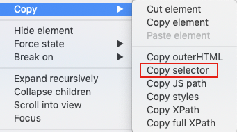

# 【UI自动化】send_keys报错element_not_interactable


这两天要在阿里云日志中操作UI，以输入关键字搜索日志。

在send_keys时报错element not interactable。

## iframe

第一个问题是iframe，通过切换iframe解决：

```python
driver.switch_to.frame(0)  # 索引从0开始
```

## span

第二个问题是span。

F12查看html长这样：


①find_element(pre).click 有效，说明iframe切换成功了

②find_element(span2).send_keys报错

```
element not interactable
```

span不支持send_keys。

第一个方法，通过调js来解决，设置span的innerText

```python
search_text = 'error'
log_search_span = driver.find_element_by_xpath(
        '//*[@id="queryEl"]/div[2]/div/div[6]/div[1]/div/div/div/div[5]/div/pre')
js = 'arguments[0].innerText=arguments[1];'
driver.execute_script(js, log_search_span, search_text)
```

第二个方法，添加属性contenteditable

```python
search_text = 'error'
log_search_span = driver.find_element_by_xpath(
        '//*[@id="queryEl"]/div[2]/div/div[6]/div[1]/div/div/div/div[5]/div/pre')
js = 'arguments[0].setAttribute("contenteditable", "true");'
driver.execute_script(js, log_search_span)
log_search_span.send_keys(search_text)  # 可编辑后send_keys成功
```

## 不简单

虽然值设置成功了，但是不能用，在查询时，还是用空值在查询。

经过分析，得出以下线索：

1. 设置的元素值是已经生成后的dom
2. 程序真正的dom隐藏在js/后端中
3. span是由js或后端动态生成的
4. 要想模拟出来，需要分析js实现代码
5. 控制台的js代码是加密混淆过的
6. selenium的send_keys已经是模拟键盘输入了，不知道为啥没有触发相关代码，存值到dom

**网上很多的方案是\<input\>标签，比较好解决，阿里的这个span还真有点不简单。**

## chrome console调试js

最后分享一下chrome console调试js的方法。

F12后，在元素上右键，选择Copy selector，复制selector



切换到console，输入即可定位到该元素：

```javascript
document.querySelector('#queryEl > div.react-codemirror2 > div > div.CodeMirror-scroll > div.CodeMirror-sizer > div > div > div > div.CodeMirror-code > div > pre > span > span').innerText;
```


