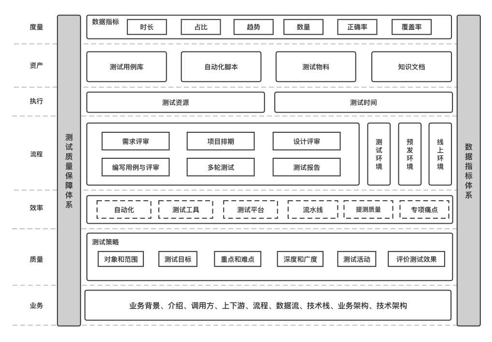
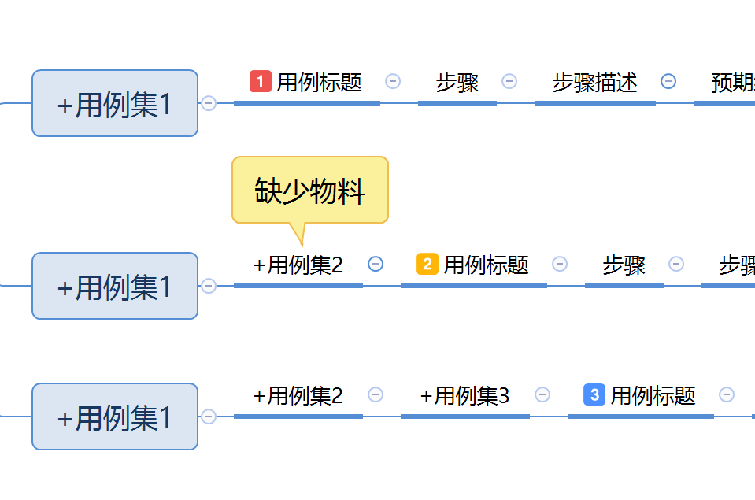
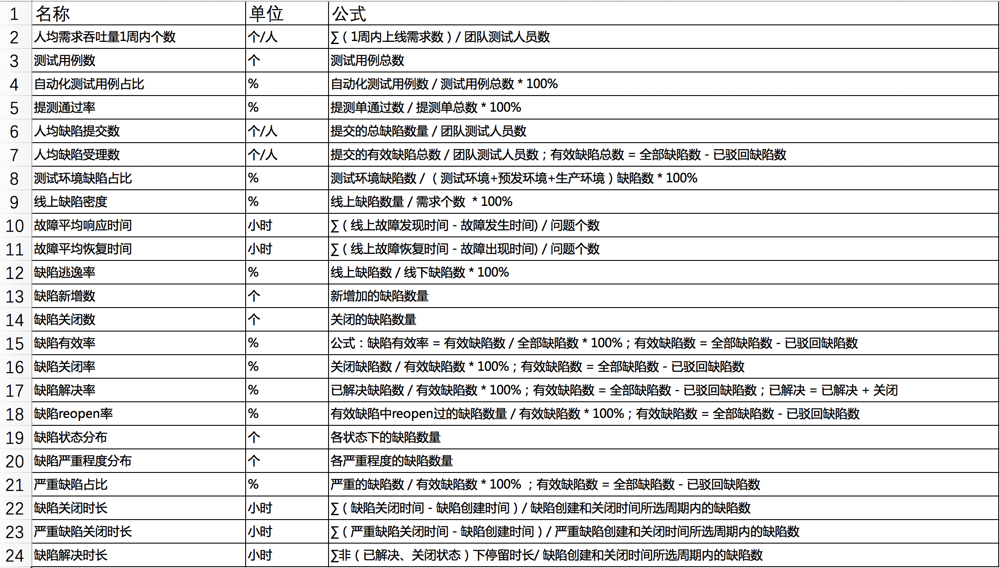

# 质量保障体系

## 体系建设

保障测试质量的总体思路是建设一套**测试质量保障体系**和一套**数据指标体系**。测试质量保障体系是从业务、质量、效率、流程、执行、资产层面来建立一套适配于公司业务的体系，贯穿于测试工作的思想和行为的方方面面。数据指标体系是一种度量方式，通过数据来量化工作成果，制定KPI，也是驱动目标达成的一种有效手段。

## 需求阶段

产品：组织产、研、测进行需求评审（评审不通过要进行二次评审）。

研发：组织产、研、测进行设计评审；输出研发排期；组织研、测进行代码评审。

测试：根据研发排期和测试工作量，输出测试排期；组织产、研、测进行用例评审；输出测试阶段所需物料（项目找项目经理协调，需求找产品协调）；输出联调测试计划；输出研发自测用例。

交付物：prd、排期、设计文档、测试用例、自测用例、所需物料、联调测试计划。

注意，是否需要压测应由产、研、测来共同决策。

> 需求评审时测试只考虑需求有什么问题，衡量指标：发现多少个需求问题，需求是否评审通过。

## 提测阶段

研发：说明提测内容及改动点；提测前需部署环境自测验证及上下游调通。

测试：完成用例设计，组织用例评审；收到提测后，部署环境进行冒烟测试，不通过驳回研发提测，通过进入测试阶段。

交付物：评审邮件；提测单。

提测若发生延期，非紧急需求进行测试相应延期，紧急需求或涉及到测试资源冲突等问题，测试重新评估排期。

## 测试阶段

研发：收到bug后72小时内解决，紧急需求24小时内日清；主动推动阻塞性问题解决，及时同步进度。

测试：提交bug（问题描述、复现步骤、实际结果、预期结果），可截图或录屏补充说明；及时同步测试过程中发现风险点；紧急需求日报反馈测试进度；已解决bug24小时内完成验证。

交付物：bug。

注意，上线后发生需求变更，重新评审，重新排期，重新提测。

## 上线阶段

研发：上线方案评审；上线checklist；对影响系统进行上线周知。

测试：上线前输出测试报告；确认研发上线checklist；

交付物：上线方案；测试报告；上线checklist。

## 上线后

产品：周知业务方验收。

研发：线上观察，若有问题及时处理。

测试：上线验证；跟进线上问题。

## 用例规范

### 用例内容

用例集：按照系统模块或逻辑分组。

用例标题：对测试内容的精准简洁描述，尽可能用少的字符数描述清楚用例覆盖点及结果，**一定要有结果**。

步骤描述：对测试内容的详细步骤描述，包括但不限于：1、数据初始化；2、功能步骤。

预期结果：执行步骤对应的无bug时的结果。

前置条件、用例类型、优先级按需添加。

XMind推荐用以下格式编写：

用例集可以多层菜单；

用例集下只有一层用例标题，用例标题打上优先级的标记；

> 用例标题建议一句话：验证+动作+结果，比如：
>
> - 验证输入正确信息登录成功。
> - 验证输入错误用户名提示用户不存在。
> - 验证输入错误密码提示用户密码不匹配。

步骤拆成多个，步骤描述和预期结果一一对应；

用XMind的概要补充前提条件；

注意，让每条用例都是完整的，能让别人执行的。

### 用例级别

关键用例：最核心的用例，线上自动化巡检用例，数量占20%及以下。

基本功能用例：常见的业务回归用例，需要自动化，数量占60%及以上。

一般功能用例：基线用例，非必须自动化。

一次性用例：非基线用例。

### 用例管理

一个产品/系统/项目只维护一份用例。迭代用例采用分支模型来管理，参照开发分支模型，在上线完成后，分支用例合入主干用例，合入时根据用例级别全部或部分合入。

### 用例执行

**按照从上往下顺序一条一条执行**，对于未执行的用例/步骤，打上【标注】：

跟踪起来特别清晰：当前用例以上部分，除了打了标注的，都是已经执行过的；有bug的用例都记录了bug，所以不用标注；当前用例以下部分，都是没有执行的。

## 缺陷规范

### 缺陷内容

缺陷描述：具体而详细的描述。

重现步骤：重现的操作步骤或者接口出入参等。

期望结果：无bug情况下的预期结果。

实际结果：实际的结果，接口出参或者报错信息等。

原因定位：非必填，定位到原因可以描述下。

修复建议：非必填，有建议可以描述下。

### 优先级

P0：阻塞性问题，必须马上解决，否则测试会停滞。

P1：急需解决，需要尽快解决，否则会影响测试进度。

P2：正常处理，计划解决即可。

P3：低优先级，暂时不用解决。

### 严重程度

致命 Blocker：系统无法执行、崩溃或严重资源不足、应用模块无法启动或异常退出、无法测试、造成系统不稳定。

严重 Critical：影响系统功能或操作，主要功能存在严重缺陷，但不会影响到系统稳定性。

一般 Major：界面、性能缺陷、兼容性。

轻微 Trivial：易用性及建议性问题。

### 状态流转

新建、待处理、已解决、驳回、已关闭、重新开启。

## 指标库

> 参考资料：
>
> 全面认识数据指标体系 https://www.cnblogs.com/yexiaochai/p/16041013.html
>
> 测试在项目流程中的那些事儿 https://testerhome.com/topics/32723
>
> 我在 Z 厂的半年工作总结 https://testerhome.com/topics/32883
>
> 《测试架构师修炼之道》
>

