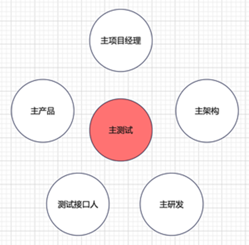
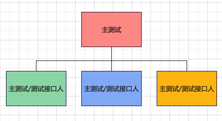
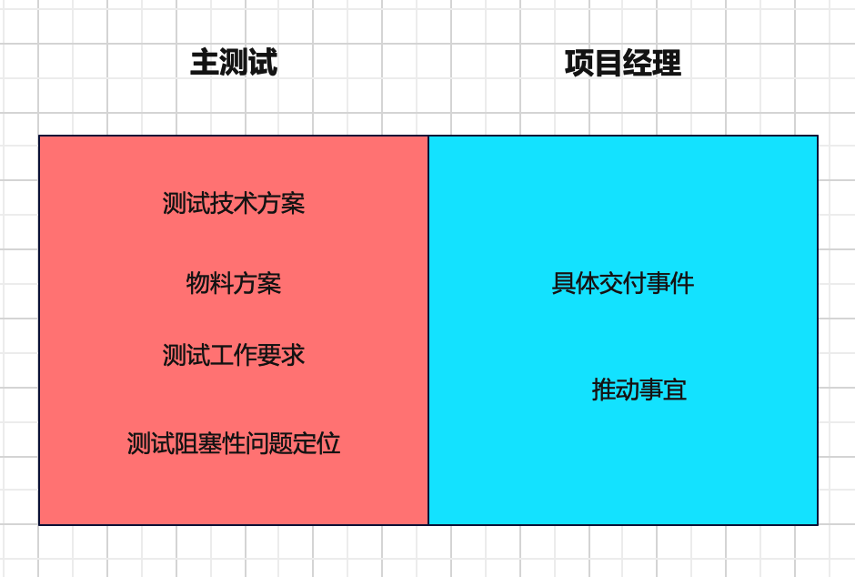
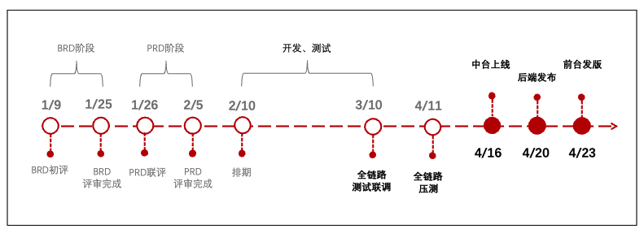
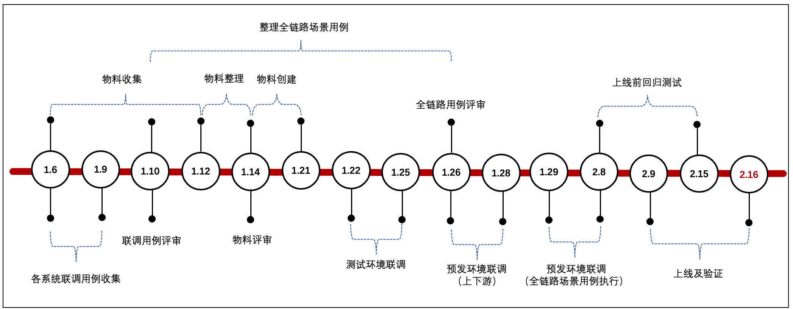
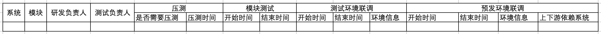

# 100个测试参与的项目如何高质量完成

**产品需求文档90份，产研测378人，测试100人，如何才能推动如此大型的项目高质量完成？**

## 主测试

主测试，又叫做质量架构师，在大型项目中负责把控整体测试计划、方案设计、用例评审，预判风险，制定问题处理方案，协调跨团队沟通，推动项目高质量完成。

主测试的沟通对象如下图所示：

大型项目可能会按团队划分，出多个主测试或者测试接口人：

主测试跟项目经理有点像，但还是有工作边界：

## 测试准备阶段

1、了解项目

项目背景：为什么要做这个项目，项目上线后能带来什么价值；商业需求文档(BRD)。

项目里程碑：

项目被测系统：被测试的系统及模块、配合联调的系统、依赖上下游系统。

项目人员：产品、架构、研发、测试。

2、了解上下游系统间交互

参加PRD评审和设计评审。注意设计、接口、MQ、库表、其他等。

3、制定测试里程碑

4、设定测试关键路径

大模块维度的数据流，设定后需要和主产品、主架构、主研发共同确认。

正向：大模块A → 大模块B → 大模块C → 大模块D → 大模块E → 大模块F

逆向：大模块A → 大模块B → 大模块C → 大模块D → 大模块E → 大模块F

其他：大模块A → 大模块B → 大模块C → 大模块D → 大模块E → 大模块F

5、制定测试计划

6、建立测试群

测试负责人群：沟通每日工作进展，跟进问题，传达事项。

测试联调群：沟通联调工作。

群公告内容：项目信息汇总链接，重点事项。

## 测试阶段

1、联调用例评审

联调用例建议采用Excel来编写，一条一条的看着比较清楚，便于上下游核对。

主测试组织会议评审，评审结束后，发会议纪要，并@跟踪处理人。

2、物料

物料建议采用Excel来提前收集各模块物料诉求，在测试过程中及时记录创建的物料。

主测试需要评估物料完备性，明确物料提供方，并组织会议评审，可以跟联调用例评审一起进行。

PS：最好能提前清楚物料创建流程，有无需要外部配合；对于缺失物料，评估缺失风险。

3、跟进事项

跟进测试进度；风险事项；推动跨部门问题解决；跟进bug解决进度。

4、工作机制

例会机制：每日例会，对齐进度、风险、待确认项，并做好记录。紧急风险及时同步项目进行决策。

问题解决机制：系统内部问题闭环解决；跨部门问题先自行沟通，若推动困难可找主测试。

跨系统问题沟通机制：找自己的上游，上游继续找上游，以此类推。发现bug后先提给自己研发，确认是上游问题后，由自己研发将bug转给对方研发。

bug日清机制：研发bug需在24小时内解决，主测试当天跟踪进度。

物料准备原则：从前端创建物料，不要直接调后端接口创建。

测试交付机制：各系统测试各自保证质量，上线前邮件发送测试报告。

## 上线阶段

上线前确认：测试报告完备性；风险问题核对；上线节奏，切量方案，上线验证；

## 测试日报

测试日报内容包括：测试风险及待确认问题，项目背景，测试里程碑，测试日报明细（部门、系统、模块、测试接口人、测试对接人、测试进度、bug概况、预计上线时间、整体情况说明）。

