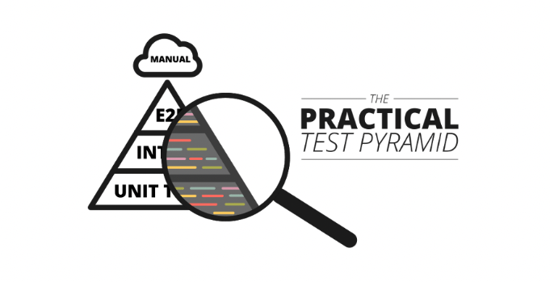
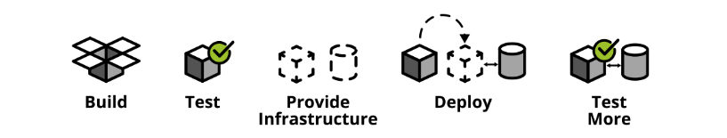
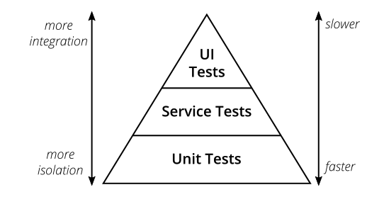
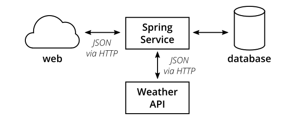
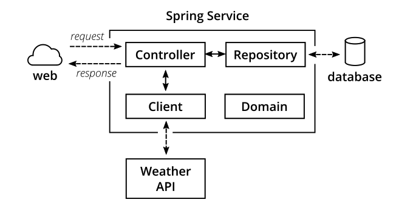
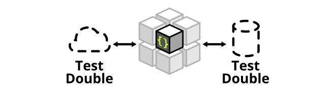
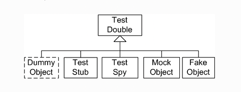
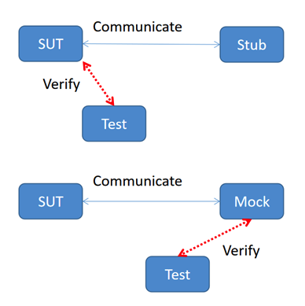
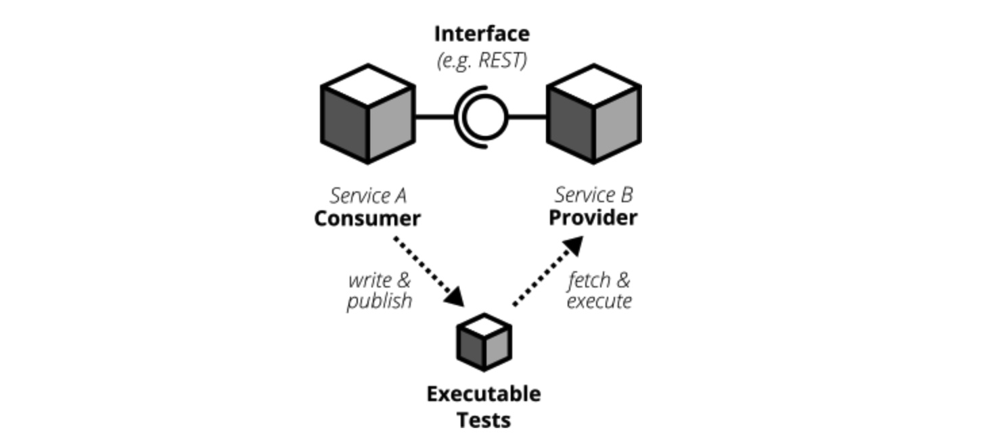
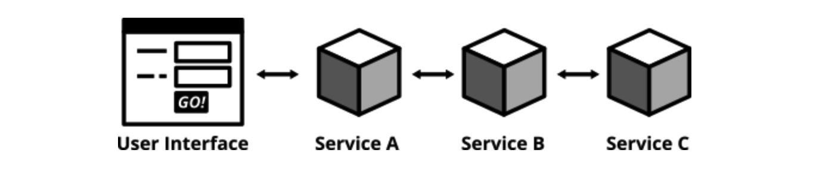

# 软件开发工程师谈测试金字塔实践


测试金字塔是对测试的分层描述，在不同层次做不同类型的测试。测试金字塔如何运用到工程实践，是一件困难的事情。**原文作者是一位德国Thoughtworks的软件开发工程师**，本文将回顾传统的测试金字塔，并结合实例，进行一次有深度的探秘实践。



## 自动化测试的重要性

软件上线前都是要经过测试的，随着测试技术发展，相比于传统的手工测试，如今的自动化测试越来越重要，它能够将成天上周的测试工作缩减到分钟秒级，提高测试效率，更快发现缺陷。尤其是在敏捷开发、持续交付、DevOps文化中，自动化已经成为了对测试的基本要求。比如持续交付，使用build pipeline自动测试和部署，随时能发包到测试环境和生产环境。



## 测试金字塔

测试金字塔是Mike Cohn在他的书籍《*Succeeding with Agile*》中提出的概念：



测试金字塔描绘了不同层次的测试，以及应该在各个层次投入多少测试。由底向上包括3层：

1. Unit Tests

2. Service Tests

3. User Interface Tests

这是最原始的测试金字塔，从现代视角来看，这个金字塔显得过于简单了，并且可能造成误导。比如service test不太能定义清楚。比如在react, angular, ember.js等单页应用中，UI测试并不一定在最顶层，而是可以写单元测试来测试UI。

但它有2点启示：

1. 编写不同粒度的测试

2. 层次越高，测试投入越少

## 实践使用的工具和库

- JUnit：单元测试

- Mockito：mock依赖

- Wiremock：stub外部服务

- Pact：编写CDC测试

- Selenium：编写UI自动化

- REST-assured：编写REST接口自动化

## 一个简单的应用

作者在GitHub上传了开源项目(795star)：

https://github.com/hamvocke/spring-testing

包含了遵循测试金字塔的分层测试的SpringBoot微服务应用。

### 功能

它提供了3个接口：

`GET /hello` 返回”Hello World“

`GET /hello/{lastname}` 返回"Hello {Firstname} {Lastname}"

`GET /weather` 返回德国柏林的天气（作者住在这）

### 整体结构



Spring Service从数据库取数据，对外提供API返回JSON数据，非常标准的简单应用。

### 内部结构



- Controller提供REST接口，并处理HTTP请求和响应；

- Repository跟数据库交互，负责持久化存储的数据读写；

- Client访问外部API，比如这里访问了darksky.net的Weather API获取天气；

- Domain定义领域模型，比如请求响应的结构体，也叫做POJO；

该应用支持CRUD，使用Spring Data访问数据库，数据库用的也是内存数据库，并且设计上省略掉了Service层，一切都为了简单，方便测试。

## 单元测试



### 什么是单元？

不同人对单元有不同理解，所谓单元，通常指某个函数，单元测试就是使用不同参数来调用函数，验证是否满足预期结果。在面向对象语言中，单元，可以是单个方法，也可以是整个类。

### Mock和Stub

Test Double是“测试复制品“的意思，用来统称模拟真实对象的假对象：



Mock和Stub都是用来模拟的，它们的区别在于：



Stub只负责模拟，Mock还包括了验证。

以上是晦涩难懂且无关紧要的理论概念。实际点的，拿本文用到的Mockito和WireMock来说，Mockito用于单元测试mock依赖，WireMock用于集成测试stub外部服务，本质上都是**模拟**。

### 测什么

单元测试什么都能测，这就是单元测试的好处。

编写单元测试要遵循原则：一个production class对应一个test class。public要尽可能覆盖，private无法覆盖，protected或者package-private可覆盖可不覆盖，建议别覆盖。并且要保证分支覆盖，包括正常分支和边界场景。

但是并不是所有的public都需要编写单元测试，而是要**避免琐碎的测试**，比如getters或setters就不要测了，比如一些没有任何逻辑条件的也不需要测。

### 测试结构

1. 初始化测试数据；

2. 调用测试方法；

3. 断言预期结果；

这是所有测试的良好结构设计，不只是单元测试。这三步还有其他叫法："Arrange, Act, Assert"，或者"given", "when", "then"。

### 实现单元测试

对于以下ExampleController：

```java
@RestController
public class ExampleController {

    private final PersonRepository personRepo;

    @Autowired
    public ExampleController(final PersonRepository personRepo) {
        this.personRepo = personRepo;
    }

    @GetMapping("/hello/{lastName}")
    public String hello(@PathVariable final String lastName) {
        Optional<Person> foundPerson = personRepo.findByLastName(lastName);

        return foundPerson
                .map(person -> String.format("Hello %s %s!",
                        person.getFirstName(),
                        person.getLastName()))
                .orElse(String.format("Who is this '%s' you're talking about?",
                        lastName));
    }
}
```

编写单元测试：

```java
public class ExampleControllerTest {

    private ExampleController subject;

    @Mock
    private PersonRepository personRepo;

    @Before
    public void setUp() throws Exception {
        initMocks(this);
        subject = new ExampleController(personRepo);
    }

    @Test
    public void shouldReturnFullNameOfAPerson() throws Exception {
        Person peter = new Person("Peter", "Pan");
        // Mockito模拟输入输出
        given(personRepo.findByLastName("Pan"))
            .willReturn(Optional.of(peter));

        String greeting = subject.hello("Pan");

        assertThat(greeting, is("Hello Peter Pan!"));
    }

    @Test
    public void shouldTellIfPersonIsUnknown() throws Exception {
        // Mockito模拟输入输出
        given(personRepo.findByLastName(anyString()))
            .willReturn(Optional.empty());

        String greeting = subject.hello("Pan");

        assertThat(greeting, is("Who is this 'Pan' you're talking about?"));
    }
}
```

单元测试使用了JUnit，PersonRepository使用了Mockito模拟数据。第一个测试是验证入参存在的名字会返回Hello。第二个测试是验证入参不存在的名字会返回Who。

## 集成测试

单元测试是模块内测试，针对模块之间，就要做集成测试。还有其他部分，比如数据库、文件系统、远程调用其他应用等，这些在单元测试中会忽略或者mock掉，也都需要做集成测试。集成测试也有多种理解，可以理解为全部集成的测试。而作者的想法是单独集成，一次只集成一个，比如集成测试数据库，那么其他部分仍然使用mock：


1. 启动数据库；

2. 应用连接数据库；

3. 调用方法往数据库写数据；

4. 从数据库读数据，验证数据是刚才写入的；

比如集成测试其他服务：


1. 启动应用；

2. 启动其他服务的实例(或者模拟服务)；

3. 调用方法从其他服务的接口读数据；

4. 验证当前应用能正确解析响应结果；

### 实现数据库集成

PersonRepository：

```java
public interface PersonRepository extends CrudRepository<Person, String> {
    Optional<Person> findByLastName(String lastName);
}
```

PersonRepository继承了CrudRepository，借助于Spring Data自动实现了增删改查，比如`findOne`, `findAll`, `save`, `update`, `delete`等方法，对于findByLastName方法，Spring Data也会根据返回类型、方法名称自动判断进行适配处理。

示例，保存Person到数据库中，并根据lastName查询：

```java
@RunWith(SpringRunner.class)
@DataJpaTest
public class PersonRepositoryIntegrationTest {
    @Autowired
    private PersonRepository subject;

    @After
    public void tearDown() throws Exception {
        // 清理测试数据
        subject.deleteAll();
    }

    @Test
    public void shouldSaveAndFetchPerson() throws Exception {
        Person peter = new Person("Peter", "Pan");
        subject.save(peter);

        Optional<Person> maybePeter = subject.findByLastName("Pan");

        assertThat(maybePeter, is(Optional.of(peter)));
    }
}
```

### 实现独立服务集成

使用Wiremock模拟darksky.net服务：

```java
@RunWith(SpringRunner.class)
@SpringBootTest
public class WeatherClientIntegrationTest {

    @Autowired
    private WeatherClient subject;

    @Rule
    public WireMockRule wireMockRule = new WireMockRule(8089);

    @Test
    public void shouldCallWeatherService() throws Exception {
        wireMockRule.stubFor(get(urlPathEqualTo("/some-test-api-key/53.5511,9.9937"))
                .willReturn(aResponse()
                        .withBody(FileLoader.read("classpath:weatherApiResponse.json"))
                        .withHeader(CONTENT_TYPE, MediaType.APPLICATION_JSON_VALUE)
                        .withStatus(200)));

        Optional<WeatherResponse> weatherResponse = subject.fetchWeather();

        Optional<WeatherResponse> expectedResponse = Optional.of(new WeatherResponse("Rain"));
        assertThat(weatherResponse, is(expectedResponse));
    }
}
```

怎么才能访问mock的这个服务呢？答案是在application.properties文件中配置：

```properties
weather.url = http://localhost:8089
```

以及WeatherClient实现：

```java
@Autowired
public WeatherClient(final RestTemplate restTemplate,
                     @Value("${weather.url}") final String weatherServiceUrl,
                     @Value("${weather.api_key}") final String weatherServiceApiKey) {
    this.restTemplate = restTemplate;
    this.weatherServiceUrl = weatherServiceUrl;
    this.weatherServiceApiKey = weatherServiceApiKey;
}
```

在集成测试darksky.net服务时，采用的是Wiremock，mock了darksky.net服务，如何验证mock的服务和真实的服务之间有无差异呢，就要进行契约测试。

## 契约测试

在微服务架构体系中，应用被拆分成了多个独立的松耦合的服务，彼此之间通过接口通信：

- HTTPS

- RPC

- 消息队列

每个接口包含2部分：provider和consumer：


比如在HTTPS中，provider提供接口，consumer调用接口；比如在消息队列中，provider发布消息，consumer订阅消息。

所谓契约，就是接口之间相互约定好的定义。传统的契约过程是这样的：

1. 编写详尽的接口定义(契约)；

2. 根据契约实现provider；

3. 把契约同步给consumer；

4. consumer根据契约实现；

5. 运行起来手动验证契约是否达成一致；

6. 希望双方都不要随意变更契约；

而在CDC（Consumer-Driven Contract tests）中，第5、6步已经被自动化测试取代：



consumer编写并发布契约测试，provider获取并执行契约测试，当provider把所有契约测试都实现以后，自然就满足consumer了。provider会把契约测试放入持续集成中，确保所有契约测试都能始终保持通过，假如consumer发布了新的契约，契约测试就会失败，从而提醒provider更新实现。

### Consumer Test

使用Pact工具实现契约测试。

 `build.gradle`：

```
testCompile('au.com.dius:pact-jvm-consumer-junit_2.11:3.5.5')
```

WeatherClientConsumerTest：

```java
@RunWith(SpringRunner.class)
@SpringBootTest
public class WeatherClientConsumerTest {

    @Autowired
    private WeatherClient weatherClient;

    @Rule
    public PactProviderRuleMk2 weatherProvider =
            new PactProviderRuleMk2("weather_provider", "localhost", 8089, this);

    @Pact(consumer="test_consumer")
    public RequestResponsePact createPact(PactDslWithProvider builder) throws IOException {
        return builder
                .given("weather forecast data")
                .uponReceiving("a request for a weather request for Hamburg")
                    .path("/some-test-api-key/53.5511,9.9937")
                    .method("GET")
                .willRespondWith()
                    .status(200)
                    .body(FileLoader.read("classpath:weatherApiResponse.json"),
                            ContentType.APPLICATION_JSON)
                .toPact();
    }

    @Test
    @PactVerification("weather_provider")
    public void shouldFetchWeatherInformation() throws Exception {
        Optional<WeatherResponse> weatherResponse = weatherClient.fetchWeather();
        assertThat(weatherResponse.isPresent(), is(true));
        assertThat(weatherResponse.get().getSummary(), is("Rain"));
    }
}
```

每次运行都会生成一个pact文件，`target/pacts/&pact-name>.json`，这个文件就可以拿给provider实现契约，通常做法是让provider在仓库中取最新版本文件。

### Provider Test

provider加载pact文件并实现契约：

```java
@RunWith(RestPactRunner.class)
@Provider("weather_provider") // same as the "provider_name" in our clientConsumerTest
@PactFolder("target/pacts") // tells pact where to load the pact files from
public class WeatherProviderTest {
    @InjectMocks
    private ForecastController forecastController = new ForecastController();

    @Mock
    private ForecastService forecastService;

    @TestTarget
    public final MockMvcTarget target = new MockMvcTarget();

    @Before
    public void before() {
        initMocks(this);
        target.setControllers(forecastController);
    }

    @State("weather forecast data") // same as the "given()" in our clientConsumerTest
    public void weatherForecastData() {
        when(forecastService.fetchForecastFor(any(String.class), any(String.class)))
                .thenReturn(weatherForecast("Rain"));
    }
}
```

## UI测试

UI测试主要验证应用界面是否正确：


用户输入，触发程序，数据展示给用户，状态变更正确。

UI自动化主要基于Selenium来做，由于前端变化大、控件识别难等问题，导致UI自动化失败率比较高，可以考虑采用截图的方式，把前后截图进行对比，来做断言，当然Selenium已经支持截图对比了。

## 端到端测试

端到端测试，通常是指从用户界面进行测试：



如果没有用户界面，也可以指对接口进行测试。

### UI端到端测试

使用Selenium和WebDriver实现：

build.gradle

```
testCompile('org.seleniumhq.selenium:selenium-chrome-driver:2.53.1')
testCompile('io.github.bonigarcia:webdrivermanager:1.7.2')
```

HelloE2ESeleniumTest

```java
@RunWith(SpringRunner.class)
@SpringBootTest(webEnvironment = SpringBootTest.WebEnvironment.RANDOM_PORT)
public class HelloE2ESeleniumTest {

    private WebDriver driver;

    @LocalServerPort
    private int port;

    @BeforeClass
    public static void setUpClass() throws Exception {
        ChromeDriverManager.getInstance().setup();
    }

    @Before
    public void setUp() throws Exception {
        driver = new ChromeDriver();
    }

    @After
    public void tearDown() {
        driver.close();
    }

    @Test
    public void helloPageHasTextHelloWorld() {
        driver.get(String.format("http://127.0.0.1:%s/hello", port));

        assertThat(driver.findElement(By.tagName("body")).getText(), containsString("Hello World!"));
    }
}
```

### 接口端到端测试

使用REST-assured实现：

build.gradle

```
testCompile('io.rest-assured:rest-assured:3.0.3')
```

HelloE2ERestTest

```java
@RunWith(SpringRunner.class)
@SpringBootTest(webEnvironment = SpringBootTest.WebEnvironment.RANDOM_PORT)
public class HelloE2ERestTest {

    @Autowired
    private PersonRepository personRepository;

    @LocalServerPort
    private int port;

    @After
    public void tearDown() throws Exception {
        personRepository.deleteAll();
    }

    @Test
    public void shouldReturnGreeting() throws Exception {
        Person peter = new Person("Peter", "Pan");
        personRepository.save(peter);

        when()
                .get(String.format("http://localhost:%s/hello/Pan", port))
        .then()
                .statusCode(is(200))
                .body(containsString("Hello Peter Pan!"));
    }
}
```

## 验收测试

在测试金字塔的位置越高，就越会站在用户角度进行测试。验收测试就是完全从用户角度出发，看系统是否能满足用户需求。

简单示例：

```python
def test_add_to_basket():
    # given
    user = a_user_with_empty_basket()
    user.login()
    bicycle = article(name="bicycle", price=100)

    # when
    article_page.add_to_.basket(bicycle)

    # then
    assert user.basket.contains(bicycle)
```

## 探索测试

探索测试是一种手工测试方法，充分发挥了测试人员的自由和创造力。


探索测试发现缺陷以后，可以补充到自动化测试中，以避免将来出现这个问题。

## 不要执着于测试术语

单元测试、集成测试、端到端测试、验收测试，每个人都有自己的不同理解，现在的软件测试行业，也没有统一的测试术语，将这些测试类型的边界明确区分开来。只要我们在公司内部、团队内部，能对术语达成一致，顺畅沟通就可以了。

> 参考资料：
> 
> Thoughtworks研发博客 https://martinfowler.com/articles/practical-test-pyramid.html
> 
> Test Double http://xunitpatterns.com/Test%20Double.html
> 
> WireMock和Mockito区别 https://geek-docs.com/mockito/mockito-ask-answer/wiremock-vs-mockito.html
> 
> Pact官方文档 https://docs.pact.io/
