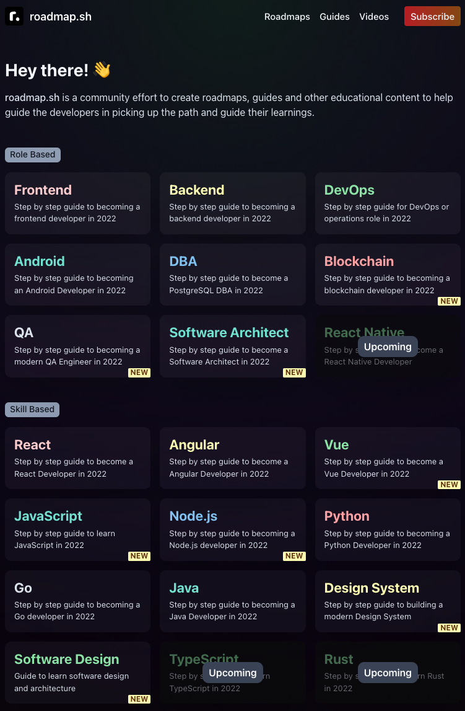
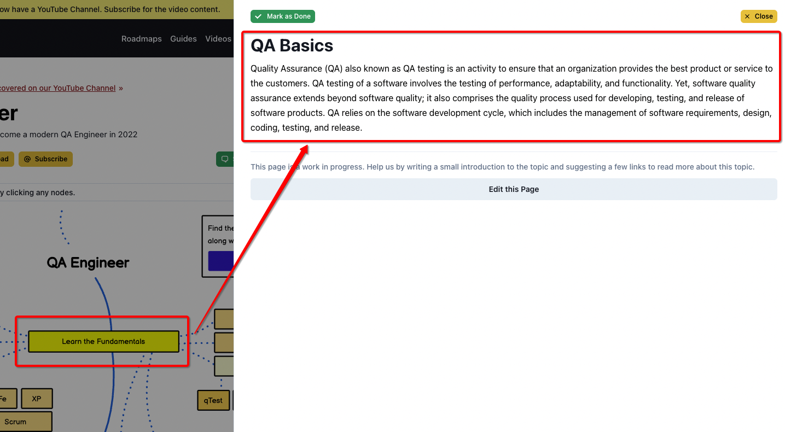
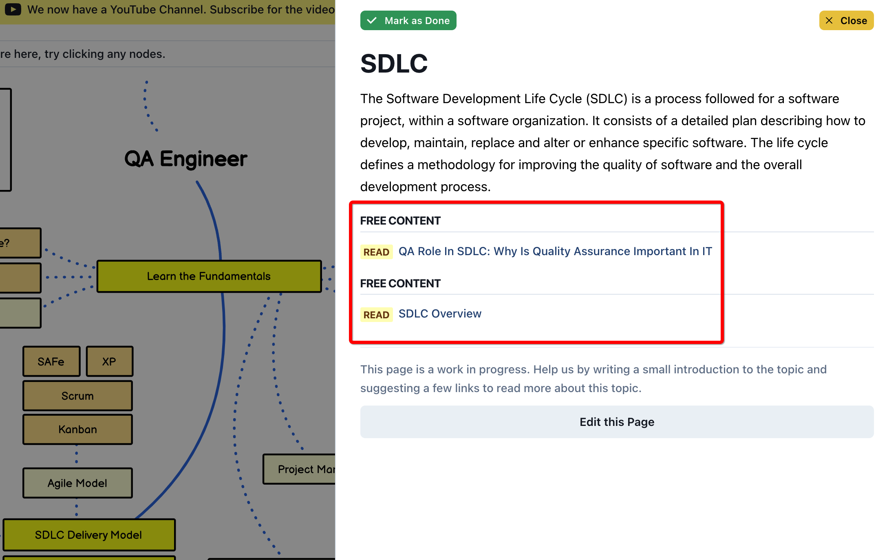
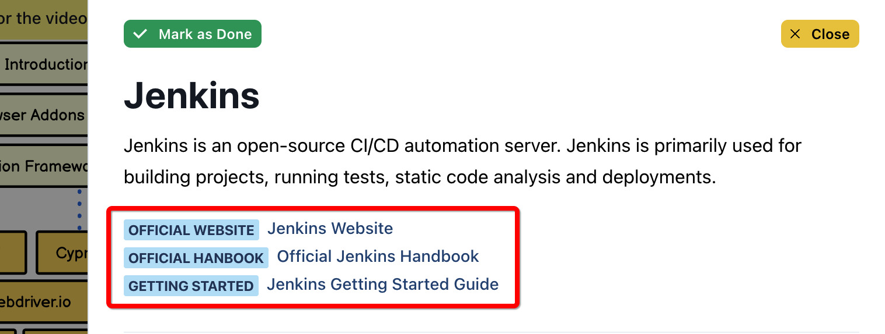
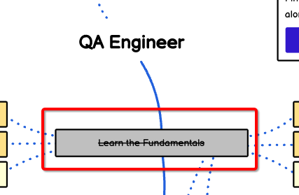
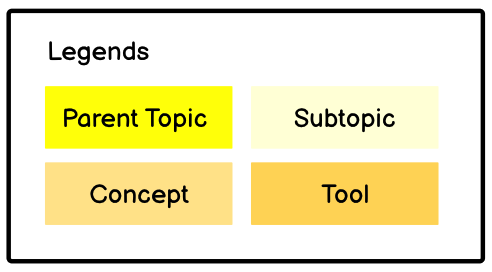

# 测试工程师学习路线图

## roadmap

今天给大家介绍一个网站“roadmap”，这里汇集了各个技术栈的学习路线图：

我关注了很久，终于在最近，**QA**板块上线了：

每个知识点有详细的介绍：

相关文章推荐：

以及工具官方网站：

你也可以Mark as Done，标记已经掌握的知识点：

## 路线图解读

有4种颜色标记：

分别是：父主题、子主题、概念、工具。

**父主题**是学习的主路线，包括以下主题：

- Learn the Fundamentals，学习基础理论；

- SDLC Delivery Model，The Software Development Life Cycle (SDLC)，软件开发生命周期交付模型；

- Manual Testing，手工测试；

- Automated Testing，自动化测试；

- Non-Functional Testing，非功能测试；

- Email Testing，电子邮件测试；

- Reporting，测试报告；

- Monitoring and Logs，监控和日志；

- Version Control System，版本控制系统；

- Repo Hosting Services，代码仓库托管服务；

- CI/CD，持续集成/持续交付；

- Headless Testing，无头浏览器测试；

接下来重点看下技术相关的两个主题：自动化测试、非功能测试。

**自动化测试**

后端自动化：Cypress、Soup UI、Karateframework、Postman / Newman、REST Assured；

前端自动化：基础知识（HTML, CSS, JavaScript, Browser / Dev Tools, Ajax, Caching, SWAs, PWAs, JAMStack, CSR vs SSR, Responsive vs Adaptive）、浏览器插件（Selenium IDE, Ghost Inspector, Bug Management, Check my Links）、自动化框架（QA Wolf, Cypress, Webdriver.io, Jasmine, Nightwatch, Robot, Selenium, Jest, Puppeteer, Playwright）；

移动端自动化：Espresso、Detox、Appium、XCUITest；

**非功能测试**

负载&性能测试：Lighthouse, Webpage Test, Gatling, K6, Artillery, Vegeta, JMeter, Locust；

可用性测试：Wave, Axe, Chrome DevTools；

安全测试：Secrets Management, OWASP 10, Attack Vectors, Vulnerability Scanning, Authentication / Authorization；

其他的内容请查看原网站。

> 参考资料：
> 
> QA Roadmap: Learn to become a modern QA engineer https://roadmap.sh/qa
