# Allure测试报告完整学习笔记


## 目录

- 简介
- 安装Allure
- Allure测试报告的结构
- Java TestNG集成Allure Report
- Python Pytest集成Allure Report

## 简介

假如你想让测试报告变得漂亮一点，那你一定会在搜索引擎中找到Allure测试报告的。Allure官方给出了个在线网站，访问以下链接就能一睹为快：

https://demo.qameta.io/allure/


可以在左下角切换为中文报告：

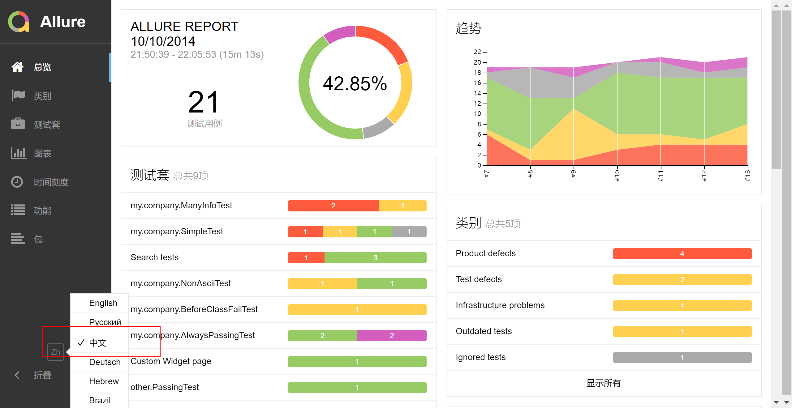

如此好看的测试报告，哪个老板不喜欢呢？

## 安装Allure

1.在GitHub releases：

https://github.com/allure-framework/allure2/releases


或者Maven Central：

https://repo.maven.apache.org/maven2/io/qameta/allure/allure-commandline/

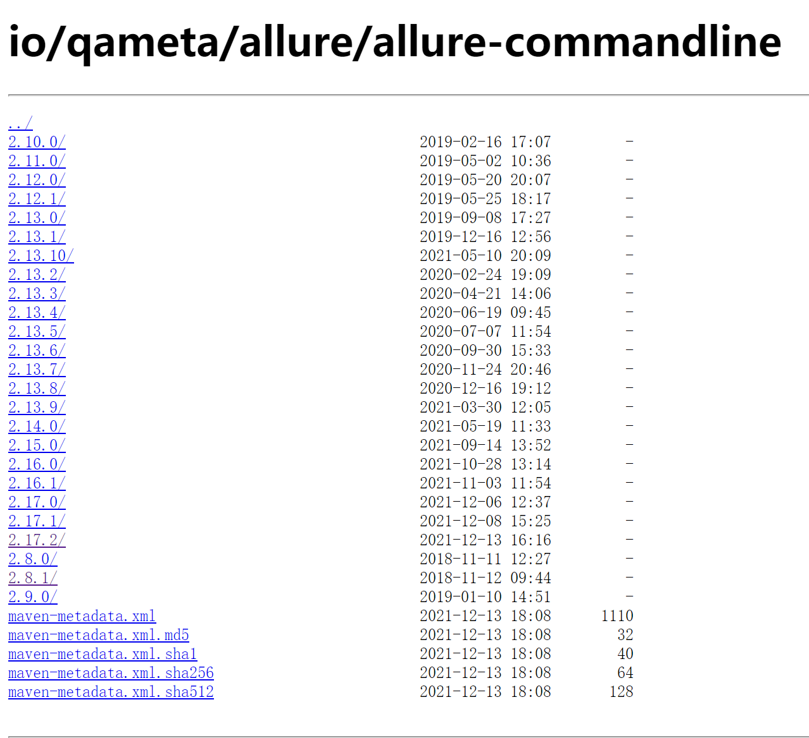

下载安装包并解压。

2.找到bin目录，Windows使用`allure.bat`，Unix使用`allure`：

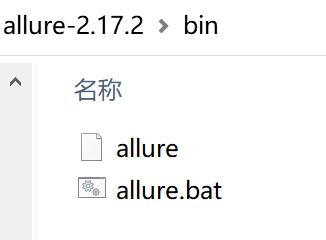

3.为了后续方便使用，可以把bin完整路径添加到**系统环境变量PATH**中，然后在命令行直接输入**allure**命令。

官方也给出了通过Linux的ppa、Mac的brew、Windows的scoop的安装方式，不过对于咱们老百姓来说，不如手动下载包来安装实在。

安装后就可以检查是否安装成功了：

```
$ allure --version
2.17.2
```

**因为Allure是用Java写的，所以如果无法运行，那么要检查下有没有安装Java。**

## Allure测试报告的结构

### Overview

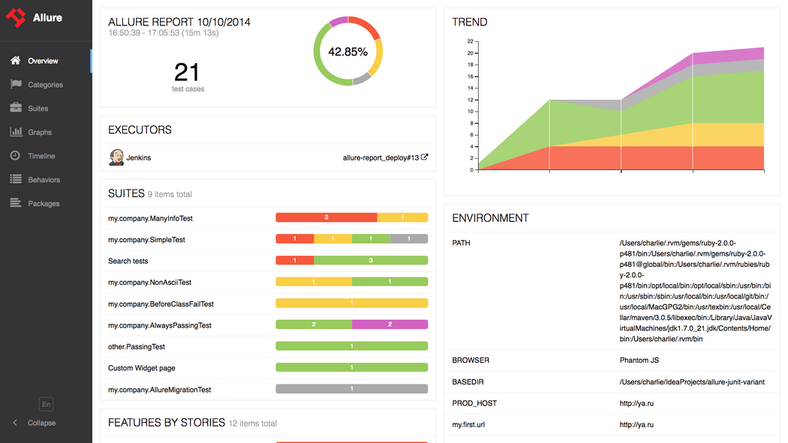

### Categories

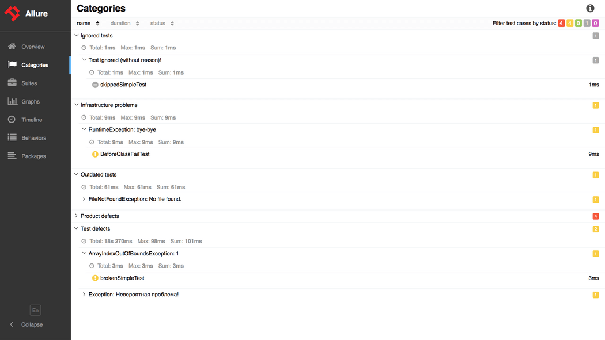

### Suites

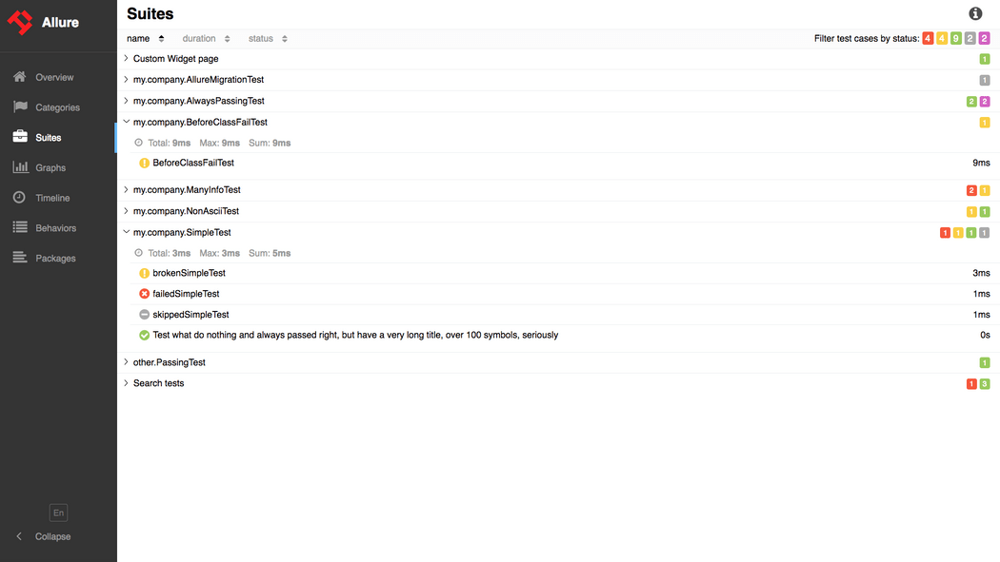

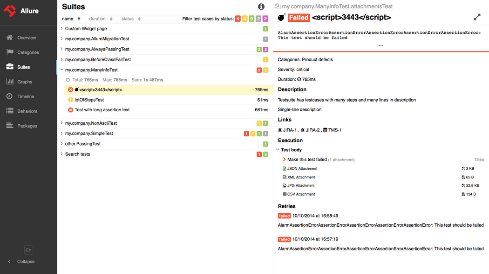

### Graphs


### Timeline

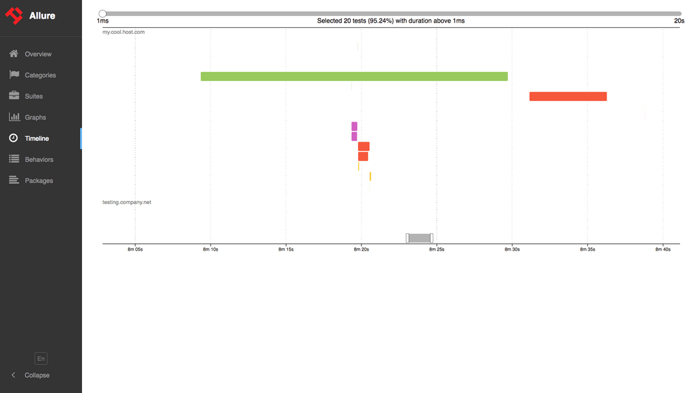

### Behaviors


### Packages

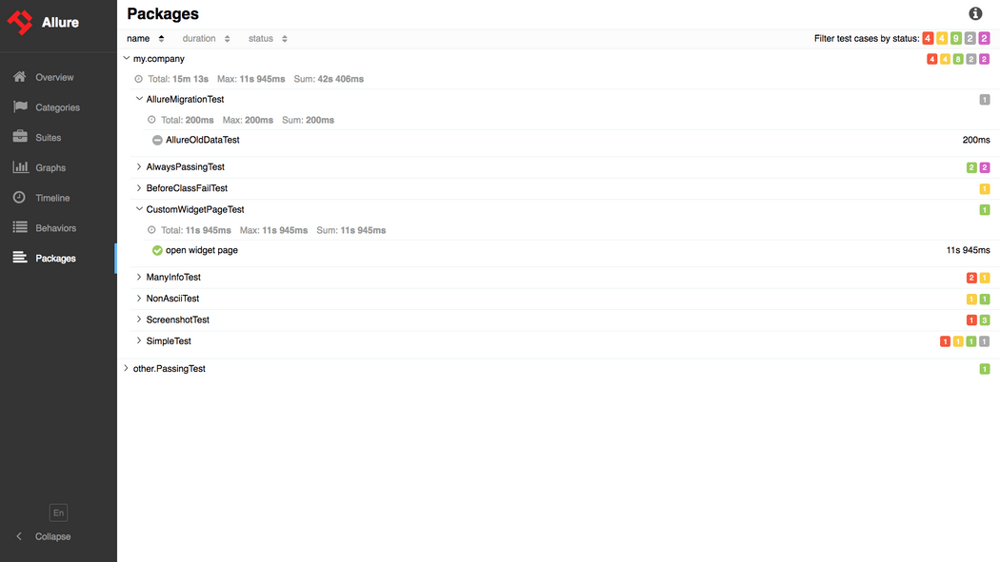

## Java TestNG集成Allure Report

### 集成

在Maven的pom.xml中添加：

```xml
<properties>
    <aspectj.version>1.8.10</aspectj.version>
</properties>
<dependencies>
    <dependency>
        <groupId>io.qameta.allure</groupId>
        <artifactId>allure-testng</artifactId>
        <version>LAST_VERSION</version>
        <scope>test</scope>
    </dependency>
</dependencies>
<build>
    <plugins>
        <plugin>
            <groupId>org.apache.maven.plugins</groupId>
            <artifactId>maven-surefire-plugin</artifactId>
            <version>2.20</version>
            <configuration>
                <argLine>
                    -javaagent:"${settings.localRepository}/org/aspectj/aspectjweaver/${aspectj.version}/aspectjweaver-${aspectj.version}.jar"
                </argLine>
            </configuration>
            <dependencies>
                <dependency>
                    <groupId>org.aspectj</groupId>
                    <artifactId>aspectjweaver</artifactId>
                    <version>${aspectj.version}</version>
                </dependency>
            </dependencies>
        </plugin>
    </plugins>
</build>
```

然后执行命令：

```shell
$ mvn clean test
```

在**target/allure-results**目录就会生成allure测试报告，再执行命令：

```shell
$ allure serve target/allure-results
```

Allure会创建一个Jetty服务器，拉起默认浏览器打开测试报告。

### @Description

添加测试描述：

```java
package my.company.tests;
import org.junit.Test;
import io.qameta.allure.Description;
@Test
public class MyTests {
    @Test
    @Description("Some detailed test description")
    public void testSomething() throws Exception {
        ...
    }
}
```

### @Step

添加测试步骤描述，除了文字，Allure2通过反射机制，能够在@Step中获取参数，比如：

```java
public class User {
     private String name;
     private String password;
     ...
}
```

```java
import io.qameta.allure.Step;
...
@Step("Type {user.name} / {user.password}.")
public void loginWith(User user) {
     ...
}
```

### @Attachment

添加测试报告的附件，可以是`String`或`byte[]`类型，不是显式的话Allure会调用`toString()`尝试隐式转换：

```java
import io.qameta.allure.Attachment;
...
@Attachment
public String performedActions(ActionSequence actionSequence) {
    return actionSequence.toString();
}
@Attachment(value = "Page screenshot", type = "image/png")
public byte[] saveScreenshot(byte[] screenShot) {
    return screenShot;
}
```

type用于指定MIME类型，不是必须的，Allure会根据内容自动适配。

除了注解，也可以在代码中添加：

```java
import io.qameta.allure.Allure;
...
Allure.addAttachment("My attachment", "My attachment content");
Path content = Paths.get("path-to-my-attachment-contnet");
try (InputStream is = Files.newInputStream(content)) {
    Allure.addAttachment("My attachment", is);
}
```

### Links

添加超链接，有3个注解@Link、@Issue、@TmsLink（test management system）：

```java
import io.qameta.allure.Link;
import io.qameta.allure.Issue;
import io.qameta.allure.TmsLink;
@Link("https://example.org")
@Link(name = "allure", type = "mylink")
public void testSomething() {
     ...
}
@Issue("123")
@Issue("432")
public void testSomething() {
     ...
}
@TmsLink("test-1")
@TmsLink("test-2")
public void testSomething() {
     ...
}
```

链接类型可以在properties中定义，Allure会用注解中的值替换`{}`：

```properties
allure.link.mylink.pattern=https://example.org/mylink/{}
allure.link.issue.pattern=https://example.org/issue/{}
allure.link.tms.pattern=https://example.org/tms/{}
```

### @Severity

添加严重程度标识：

```java
package org.example.tests;
import org.junit.Test;
import io.qameta.allure.Severity;
import io.qameta.allure.SeverityLevel;
public class MyTest {
    @Test
    @Severity(SeverityLevel.CRITICAL)
    public void testSomething() throws Exception {
        // ...
    }
}
```

### 敏捷标识

在敏捷开发中有Epic、Feature和Stories三个概念，用于对需求进行分层管理，同理可以运用到测试分层管理：

```java
package org.example.tests;
import org.junit.Test;
import io.qameta.allure.Epic;
import io.qameta.allure.Feature;
import io.qameta.allure.Story;
@Epic("Allure examples")
@Feature("Junit 4 support")
public class MyTest {
    @Test
    @Story("Base support for bdd annotations")
    @Story("Advanced support for bdd annotations")
    public void testSomething() throws Exception {
        // ...
    }
}
```

## Python Pytest集成Allure Report

### 集成

执行以下命令安装：

```shell
$ pip install allure-pytest
```

它会同时安装`allure-pytest`和`allure-python-commons`两个包。

然后指定Allure测试报告目录：

```shell
$ pytest --alluredir=/tmp/my_allure_results
```

最后执行命令打开报告：

```shell
$ allure serve /tmp/my_allure_results
```

Allure会创建一个Jetty服务器，拉起默认浏览器打开测试报告。

### pytest结果状态

Allure会根据pytest的结果状态进行标记：

```python
import pytest
def test_success():
    """this test succeeds"""
    assert True
def test_failure():
    """this test fails"""
    assert False
def test_skip():
    """this test is skipped"""
    pytest.skip('for a reason!')
def test_broken():
    raise Exception('oops')
```

### pytest特性

#### **xfail**

```python
@pytest.mark.xfail(condition=lambda: True, reason='this test is expecting failure')
def test_xfail_expected_failure():
    """this test is an xfail that will be marked as expected failure"""
    assert False
@pytest.mark.xfail(condition=lambda: True, reason='this test is expecting failure')
def test_xfail_unexpected_pass():
    """this test is an xfail that will be marked as unexpected success"""
    assert True
```

会在Allure报告中展示：

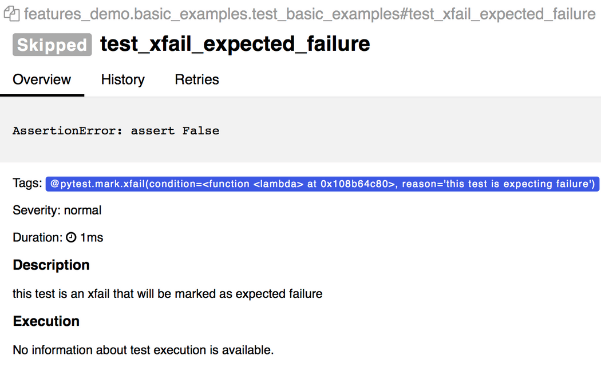

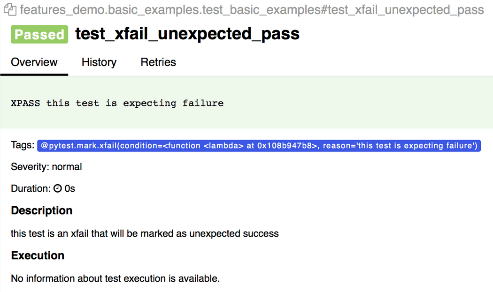

#### **skipif**

```python
@pytest.mark.skipif('2 + 2 != 5', reason='This test is skipped by a triggered condition in @pytest.mark.skipif')
def test_skip_by_triggered_condition():
    pass
```

会在Allure报告中展示：

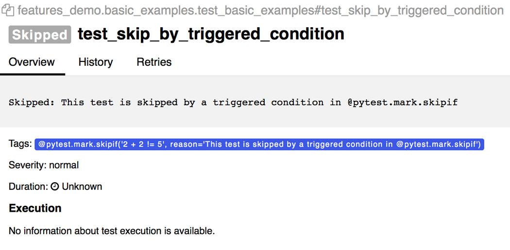

#### **fixtures**

```python
@pytest.fixture(params=[True, False], ids=['param_true', 'param_false'])
def function_scope_fixture_with_finalizer(request):
    if request.param:
        print('True')
    else:
        print('False')
    def function_scope_finalizer():
        function_scope_step()
    request.addfinalizer(function_scope_finalizer)
@pytest.fixture(scope='class')
def class_scope_fixture_with_finalizer(request):
    def class_finalizer_fixture():
        class_scope_step()
    request.addfinalizer(class_finalizer_fixture)
@pytest.fixture(scope='module')
def module_scope_fixture_with_finalizer(request):
    def module_finalizer_fixture():
        module_scope_step()
    request.addfinalizer(module_finalizer_fixture)
@pytest.fixture(scope='session')
def session_scope_fixture_with_finalizer(request):
    def session_finalizer_fixture():
        session_scope_step()
    request.addfinalizer(session_finalizer_fixture)
class TestClass(object):
    def test_with_scoped_finalizers(self,
                                    function_scope_fixture_with_finalizer,
                                    class_scope_fixture_with_finalizer,
                                    module_scope_fixture_with_finalizer,
                                    session_scope_fixture_with_finalizer):
        step_inside_test_body()
```

会在Allure报告中展示（**fixtures会展示在Set up和Tear down中**）：


而对于fixture中的结果状态，Allure也会进行标记：

```python
import pytest
@pytest.fixture
def skip_fixture():
    pytest.skip()
@pytest.fixture
def fail_fixture():
    assert False
@pytest.fixture
def broken_fixture():
    raise Exception("Sorry, it's broken.")
def test_with_pytest_skip_in_the_fixture(skip_fixture):
    pass
def test_with_failure_in_the_fixture(fail_fixture):
    pass
def test_with_broken_fixture(broken_fixture):
    pass
```


#### parametrize

```python
import allure
import pytest
@allure.step
def simple_step(step_param1, step_param2 = None):
    pass
@pytest.mark.parametrize('param1', [True, False], ids=['id explaining value 1', 'id explaining value 2'])
def test_parameterize_with_id(param1):
    simple_step(param1)
@pytest.mark.parametrize('param1', [True, False])
@pytest.mark.parametrize('param2', ['value 1', 'value 2'])
def test_parametrize_with_two_parameters(param1, param2):
    simple_step(param1, param2)
@pytest.mark.parametrize('param1', [True], ids=['boolean parameter id'])
@pytest.mark.parametrize('param2', ['value 1', 'value 2'])
@pytest.mark.parametrize('param3', [1])
def test_parameterize_with_uneven_value_sets(param1, param2, param3):
    simple_step(param1, param3)
    simple_step(param2)
```

Allure会展示每个test和id：

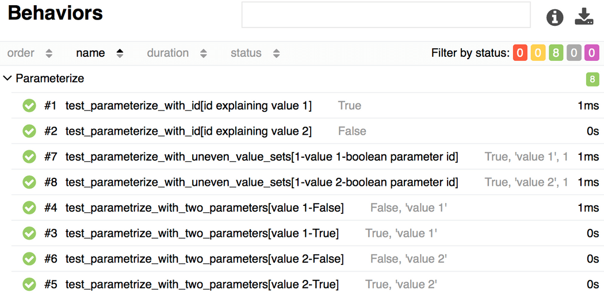

以及运行细节：

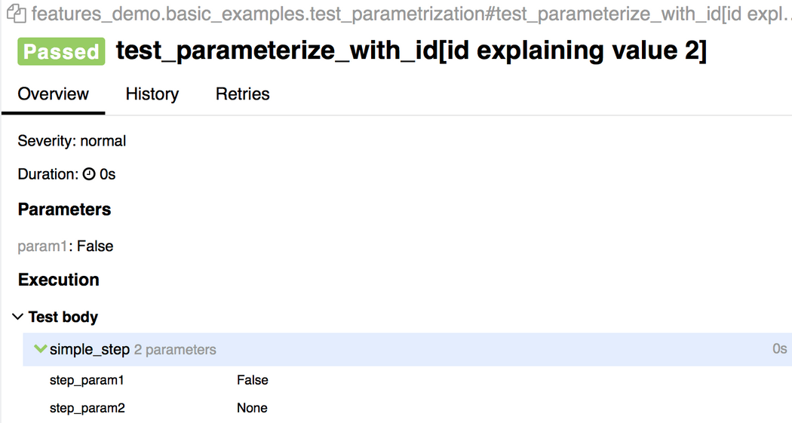

### Allure特性

#### @allure.step

```python
import allure
import pytest
from .steps import imported_step
@allure.step
def passing_step():
    pass
@allure.step
def step_with_nested_steps():
    nested_step()
@allure.step
def nested_step():
    nested_step_with_arguments(1, 'abc')
@allure.step
def nested_step_with_arguments(arg1, arg2):
    pass
def test_with_imported_step():
    passing_step()
    imported_step()
def test_with_nested_steps():
    passing_step()
    step_with_nested_steps()
```

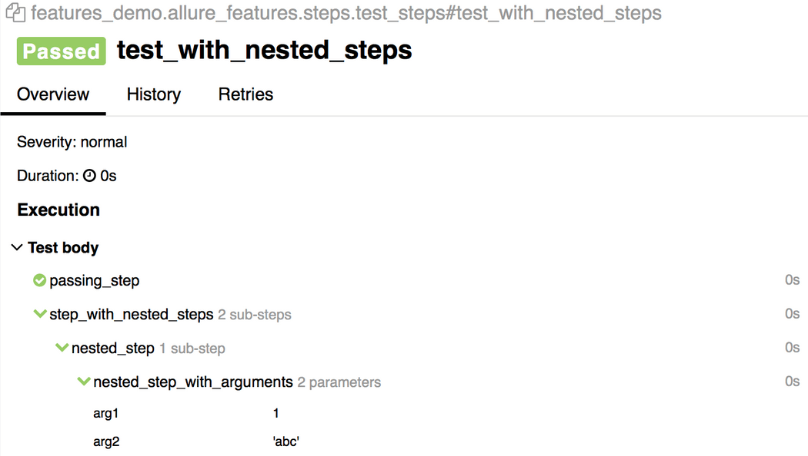

step能从入参中读取值：

```python
import allure
@allure.step('Step with placeholders in the title, positional: "{0}", keyword: "{key}"')
def step_with_title_placeholders(arg1, key=None):
    pass
def test_steps_with_placeholders():
    step_with_title_placeholders(1, key='something')
    step_with_title_placeholders(2)
    step_with_title_placeholders(3, 'anything')
```

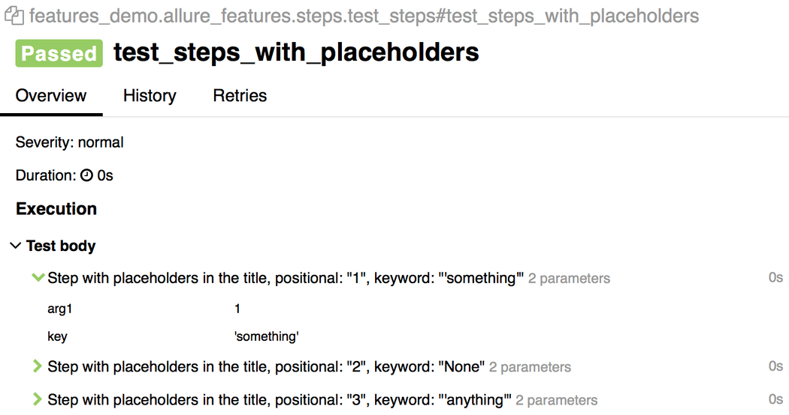

step也能在conftest.py中用到fixtures上：

```python
import allure
import pytest
@allure.step('step in conftest.py')
def conftest_step():
    pass
@pytest.fixture
def fixture_with_conftest_step():
    conftest_step()
import allure
from .steps import imported_step
@allure.step
def passing_step():
    pass
def test_with_step_in_fixture_from_conftest(fixture_with_conftest_step):
    passing_step()
```

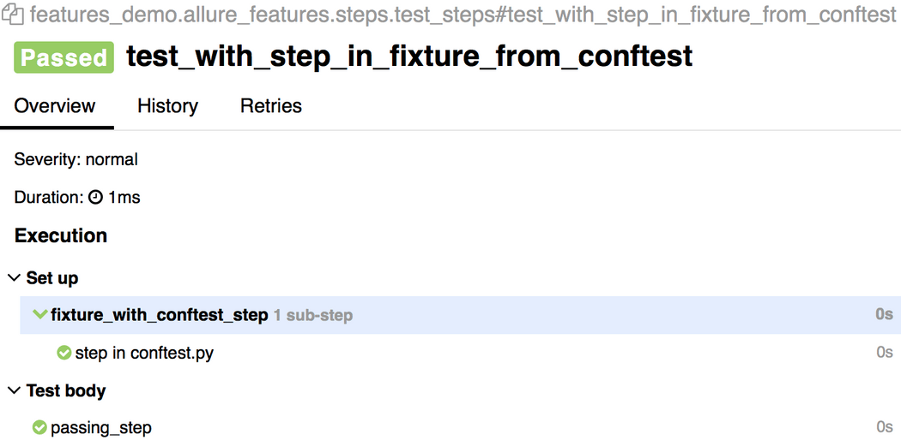

#### allure.attach

给Allure测试报告添加附件，`allure.attach(body, name, attachment_type, extension)`：

- body 文件内容（或者source指定文件路径）
- name 文件名称
- attachment_type 附件类型（`allure.attachment_type`中的某个值）
- extension 文件扩展

```python
import allure
import pytest
@pytest.fixture
def attach_file_in_module_scope_fixture_with_finalizer(request):
    allure.attach('A text attacment in module scope fixture', 'blah blah blah', allure.attachment_type.TEXT)
    def finalizer_module_scope_fixture():
        allure.attach('A text attacment in module scope finalizer', 'blah blah blah blah',
                      allure.attachment_type.TEXT)
    request.addfinalizer(finalizer_module_scope_fixture)
def test_with_attacments_in_fixture_and_finalizer(attach_file_in_module_scope_finalizer):
    pass
def test_multiple_attachments():
    allure.attach.file('./data/totally_open_source_kitten.png', attachment_type=allure.attachment_type.PNG)
    allure.attach('<head></head><body> a page </body>', 'Attach with HTML type', allure.attachment_type.HTML)
```


#### Descriptions

既可以使用装饰器`@allure.description`或`@allure.description_html`添加描述：

```python
import allure
@allure.description_html("""
<h1>Test with some complicated html description</h1>
<table style="width:100%">
  <tr>
    <th>Firstname</th>
    <th>Lastname</th>
    <th>Age</th>
  </tr>
  <tr align="center">
    <td>William</td>
    <td>Smith</td>
    <td>50</td>
  </tr>
  <tr align="center">
    <td>Vasya</td>
    <td>Jackson</td>
    <td>94</td>
  </tr>
</table>
""")
def test_html_description():
    assert True
@allure.description("""
Multiline test description.
That comes from the allure.description decorator.
Nothing special about it.
""")
def test_description_from_decorator():
    assert 42 == int(6 * 7)
def test_unicode_in_docstring_description():
    """Unicode in description.
    Этот тест проверяет юникод.
    你好伙计.
    """
    assert 42 == int(6 * 7)
```

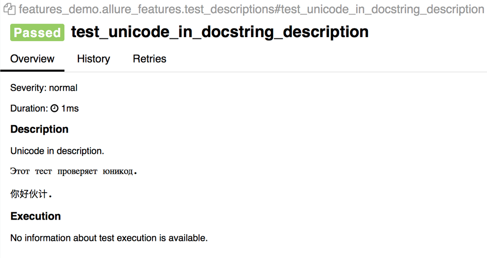

也可以在代码中使用`allure.dynamic.description`动态添加描述：

```python
import allure
@allure.description("""
This description will be replaced at the end of the test.
""")
def test_dynamic_description():
    assert 42 == int(6 * 7)
    allure.dynamic.description('A final description.')
```

#### Titles

既可以使用装饰器`@allure.title`添加标题：

```python
import allure
import pytest
@allure.title("This test has a custom title")
def test_with_a_title():
    assert 2 + 2 == 4
@allure.title("This test has a custom title with unicode: Привет!")
def test_with_unicode_title():
    assert 3 + 3 == 6
```

并且可以获取参数值：

```python
@allure.title("Parameterized test title: adding {param1} with {param2}")
@pytest.mark.parametrize('param1,param2,expected', [
    (2, 2, 4),
    (1, 2, 5)
])
def test_with_parameterized_title(param1, param2, expected):
    assert param1 + param2 == expected
```

也可以在代码中使用`allure.dynamic.title`动态添加：

```python
@allure.title("This title will be replaced in a test body")
def test_with_dynamic_title():
    assert 2 + 2 == 4
    allure.dynamic.title('After a successful test finish, the title was replaced with this line.')
```

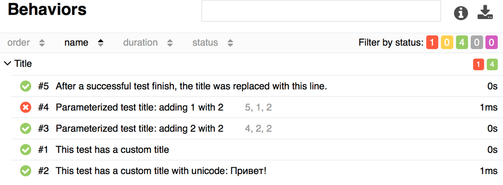

#### Links

`@allure.link`、 `@allure.issue` 和`@allure.testcase`：

```python
import allure
TEST_CASE_LINK = 'https://github.com/qameta/allure-integrations/issues/8#issuecomment-268313637'
@allure.link('https://www.youtube.com/watch?v=4YYzUTYZRMU')
def test_with_link():
    pass
@allure.link('https://www.youtube.com/watch?v=Su5p2TqZxKU', name='Click me')
def test_with_named_link():
    pass
@allure.issue('140', 'Pytest-flaky test retries shows like test steps')
def test_with_issue_link():
    pass
@allure.testcase(TEST_CASE_LINK, 'Test case title')
def test_with_testcase_link():
    pass
```

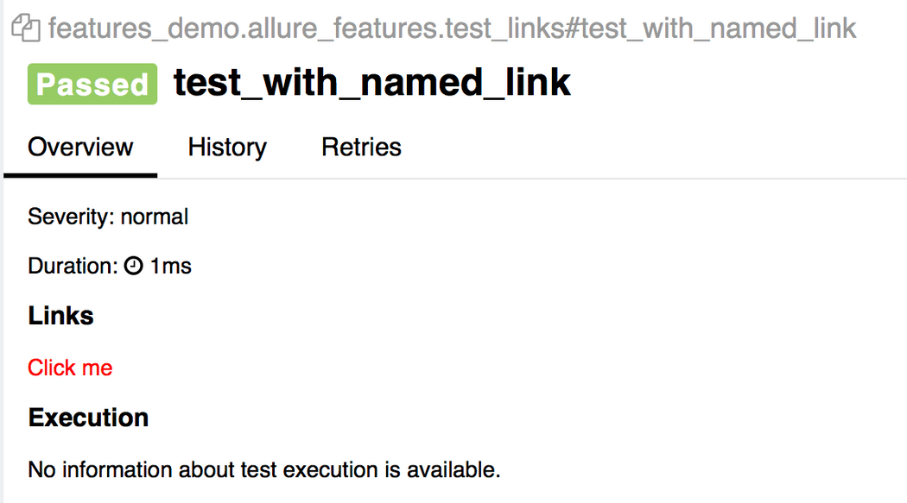

- `@allure.link`会提供可点击的超链接。

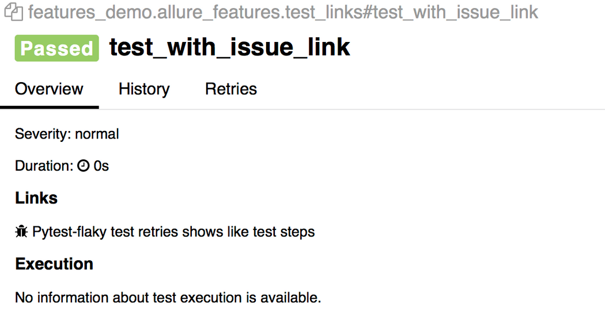

- `@allure.issue`会有个可供点击的图标。

- issure链接模板通过`--allure-link-pattern`定义：

  ```shell
  $ pytest directory_with_tests/ --alluredir=/tmp/my_allure_report \
   --allure-link-pattern=issue:http://www.mytesttracker.com/issue/{}
  ```

#### Retries

Allure有个Retries标签页用来展示重试的测试：

```python
import allure
import random
import time
@allure.step
def passing_step():
    pass
@allure.step
def flaky_broken_step():
    if random.randint(1, 5) != 1:
        raise Exception('Broken!')
def test_broken_with_randomized_time():
    passing_step()
    time.sleep(random.randint(1, 3))
    flaky_broken_step()
```

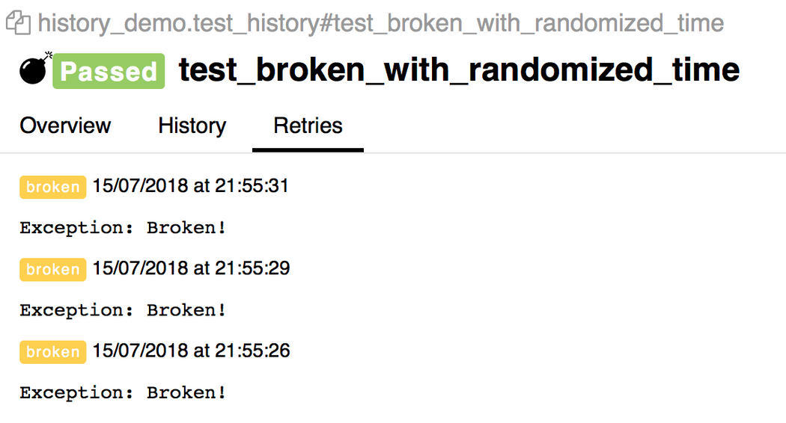

### 敏捷标识

在敏捷开发中有Epic、Feature和Stories三个概念，用于对需求进行分层管理，同理可以运用到测试分层管理：

```python
import allure
def test_without_any_annotations_that_wont_be_executed():
    pass
@allure.story('epic_1')
def test_with_epic_1():
    pass
@allure.story('story_1')
def test_with_story_1():
    pass
@allure.story('story_2')
def test_with_story_2():
    pass
@allure.feature('feature_2')
@allure.story('story_2')
def test_with_story_2_and_feature_2():
    pass
```

也可以使用`--allure-epics`、`--allure-features`、`--allure-stories`指定运行测试：

```shell
$ pytest tests.py --allure-stories story_1,story_2
collected 5 items
tests.py ...                                                                    [100%]
============================== 3 passed in 0.01 seconds ==============================
$ pytest tests.py --allure-features feature2 --allure-stories story2
collected 5 items
tests.py ...                                                                     [100%]
=============================== 2 passed in 0.01 seconds ==============================
```

### 严重程度

使用`@allure.severity`或`allure.severity_level`：

```python
import allure
def test_with_no_severity_label():
    pass
@allure.severity(allure.severity_level.TRIVIAL)
def test_with_trivial_severity():
    pass
@allure.severity(allure.severity_level.NORMAL)
def test_with_normal_severity():
    pass
@allure.severity(allure.severity_level.NORMAL)
class TestClassWithNormalSeverity(object):
    def test_inside_the_normal_severity_test_class(self):
        pass
    @allure.severity(allure.severity_level.CRITICAL)
    def test_inside_the_normal_severity_test_class_with_overriding_critical_severity(self):
        pass
```

`--allure-severities`用来指定运行哪些严重程度的测试：

```shell
$ pytest tests.py --allure-severities normal,critical
collected 5 items
bdd_annotations_demo/test_severity_labels.py ...                                [100%]
================================ 3 passed in 0.01 seconds ============================
```

> 参考资料：
>
> https://docs.qameta.io/allure-report/

